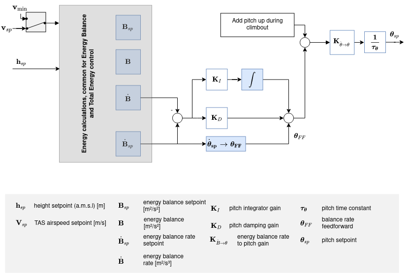

# Діаграми контролера

Цей розділ містить схеми основних контролерів PX4.

The diagrams use the standard [PX4 notation](../contribute/notation.md) (and each have an annotated legend).

<!--    The diagrams were created with LaTeX / TikZ.
        The code can be found in assets/diagrams/mc_control_arch_tikz.tex.
        The easiest way to generate the diagrams and edit them is to copy the code and paste it an Overleaf (www.overleaf.com/) document to see the output.
-->

## Мультикоптерна архітектура контролю

- Це - стандартна каскадно-контрольна архітектура.
- Контролери представлені комбінацією P та PID контролерів.
- Estimates come from [EKF2](../advanced_config/tuning_the_ecl_ekf.md).
- Залежно від режиму, зовнішня (позиційна) петля обходиться (показана як мультиплексор після зовнішньої петлі).
  Зовнішню петлю використовується лише при утриманні позиції або коли запитана швидкість по одній з осей є нульовою.

### Контролер кутової швидкості мультикоптера

- K-PID контролер. See [Rate Controller](../config_mc/pid_tuning_guide_multicopter.md#rate-controller) for more information.
- Інтегральні повноваження обмежені, щоб запобігти ліквідації.
- Виходи обмежені (у модулі розподілу керування), зазвичай в межах від -1 до 1.
- Фільтр низьких частот (LPF) використовується на шляху похідної для зменшення шуму (драйвер гіроскопа забезпечує відфільтровану похідну для контролера).

  ::: info
  The IMU pipeline is:
  gyro data > apply calibration parameters > remove estimated bias > notch filter (`IMU_GYRO_NF0_BW` and `IMU_GYRO_NF0_FRQ`) > low-pass filter (`IMU_GYRO_CUTOFF`) > vehicle_angular_velocity (_filtered angular rate used by the P and I controllers_) > derivative -> low-pass filter (`IMU_DGYRO_CUTOFF`) > vehicle_angular_acceleration (_filtered angular acceleration used by the D controller_)

  

:::

  <!-- source for image is https://github.com/PX4/PX4-Autopilot/blob/850d0bc588af79186286652af4c8293daafd2c4c/src/lib/mixer/MultirotorMixer/MultirotorMixer.cpp#L323-L326 -->

### Мультикоптер Attitude Controller

- The attitude controller makes use of [quaternions](https://en.wikipedia.org/wiki/Quaternion).
- The controller is implemented from this [article](https://www.research-collection.ethz.ch/bitstream/handle/20.500.11850/154099/eth-7387-01.pdf).
- При налаштуванні цього контролера єдиний параметр, що становить зацікавленість, - це коефіцієнт P.
- Команда швидкості насичена.

### Перетворення заданого значення прискорення мультикоптера в тягу та положення

- Встановлені значення прискорення, що генеруються контролером швидкості, будуть перетворені в установки тяги та кута нахилу.
- Перетворені встановлені точки прискорення будуть насичуватися та пріоритизуватися у вертикальній та горизонтальній тязі.
- Насичення тяги здійснюється після розрахунку відповідного тяга:
  1. Compute required vertical thrust (`thrust_z`)
  2. Saturate `thrust_z` with `MPC_THR_MAX`
  3. Saturate `thrust_xy` with `(MPC_THR_MAX^2 - thrust_z^2)^0.5`

Implementation details can be found in `PositionControl.cpp` and `ControlMath.cpp`.

### Контролер швидкості мультиоптера

- PID контролер стабілізує швидкість. Команди прискорення.
- Інтегратор включає анти-сбросову петлю (ARW) за допомогою методу обмеження.
- Командоване прискорення НЕ насичене - насичення буде застосовано до перетворених встановлених точок тяги в поєднанні з максимальним кутом нахилу.
- Horizontal gains set via parameter `MPC_XY_VEL_P_ACC`, `MPC_XY_VEL_I_ACC` and `MPC_XY_VEL_D_ACC`.
- Vertical gains set via parameter `MPC_Z_VEL_P_ACC`, `MPC_Z_VEL_I_ACC` and `MPC_Z_VEL_D_ACC`.

### Контролер положення мультикоптера

- Простий P контролер, який керує швидкістю.
- Задана швидкість насичується, щоб підтримувати швидкість у певних межах. See parameter `MPC_XY_VEL_MAX`. Цей параметр задає максимально можливу горизонтальну швидкість. This differs from the maximum **desired** speed `MPC_XY_CRUISE` (autonomous modes) and `MPC_VEL_MANUAL` (manual position control mode).
- Horizontal P gain set via parameter `MPC_XY_P`.
- Vertical P gain set via parameter `MPC_Z_P`.

#### Діаграма комбінованої позиції і швидкості контролера

- Залежні від режиму передачі вперед (ff) - наприклад, у режимі місії генератор траєкторій (траєкторія з обмеженням ривка) обчислює точки встановлення позиції, швидкості та прискорення.
- Точки встановлення прискорення (в інерціальній системі координат) будуть перетворені (з установкою курсу) на точки встановлення орієнтації (кватерніон) та точки встановлення загального тяги.

<!-- The drawing is on draw.io: https://drive.google.com/open?id=13Mzjks1KqBiZZQs15nDN0r0Y9gM_EjtX
Request access from dev team. -->

## Контролер положення фіксованого крила

### Система загального контролю електроенергії (ТЕКС)

Реалізація системи загального керування енергією PX4 (TECS) дозволяє одночасно контролювати справжню повітряну швидкість і висоту літака.
Код реалізований у вигляді бібліотеки, яка використовується в модулі керування положенням.

Як видно на діаграмі вище, TECS отримує в якості вхідних даних задані значення швидкості повітря та висоти, і виводить задані значення дроселя та кута тангажу.
Ці два вихідні дані надсилаються до контролера орієнтації фіксованого крила, який реалізує рішення з контролю орієнтації. Проте встановлення дроселя передається, якщо воно є скінченим і якщо не виявлено відмови двигуна.
Тому важливо зрозуміти, що продуктивність TECS безпосередньо впливає на продуктивність петлі керування кутом тангажу.
Погане відстеження швидкості повітря та висоти часто викликається поганим відстеженням кута тангажу повітряного судна.

:::info
Make sure to tune the attitude controller before attempting to tune TECS.
:::

Сеанс одночасного контролю швидкості та висоти не є тривіальним завданням.
Збільшення кута нахилу літака призведе до збільшення висоти, але також до зменшення швидкості.
Збільшення дросельної заслінки збільшить швидкість повітря, але також збільшиться висота через збільшення підйомної сили.
Таким чином, ми маємо два входи (кут нахилу та дросель), які обидва впливають на два виходи (швидкість повітря та висоту), що ускладнює проблему керування.

TECS пропонує рішення, представляючи проблему в термінах енергій, а не початкових заданих значень.
Повна енергія літака — це сума кінетичної та потенціальної енергії. Тяга (через керування дроселем) збільшує загальний стан енергії літака. Даний загальний енергетичний стан може бути досягнутий довільними комбінаціями потенціальної та кінетичної енергій.
Іншими словами, польот на великій висоті, але з низькою швидкістю, може бути еквівалентним польоту на низькій висоті, але з більшою швидкістю повітря з точки зору загальної енергії. Ми називаємо це балансом конкретної енергії і обчислюємо його за поточною висотою та встановленим значенням швидкості повітря.
Баланс конкретної енергії контролюється за допомогою кута тангажу літака.
Збільшення кута тангажу перетворює кінетичну енергію на потенційну енергію, а від'ємний кут тангажу - навпаки.
Таким чином, проблема управління була розкрита шляхом перетворення початкових встановлених значень в енергетичні величини, які можуть бути контрольовані незалежно.
Ми використовуємо тягу для регулювання конкретної загальної енергії транспортного засобу, а тангаж підтримує конкретний баланс між потенційною (висотою) та кінетичною (швидкістю) енергією.

#### Загальний цикл контролю балансу енергії

<!-- https://drive.google.com/file/d/1q12b6ASbQRkFWqLMXm92cryOI-cZnrKv/view?usp=sharing -->

#### Загальний цикл контролю балансу енергії

<!-- The drawing is on draw.io: https://drive.google.com/file/d/1bZtFULYmys-_EQNhC9MNcKLFauc7OYJZ/view -->

Загальна енергія літака - це сума кінетичної та потенціальної енергії:

$$E_T = \frac{1}{2} m V_T^2 + m g h$$

Проведення похідної відносно часу призводить до загальної швидкості енергії:

$$\dot{E_T} = m V_T \dot{V_T} + m g \dot{h}$$

З цього можна сформувати специфічну швидкість енергії:

$$\dot{E} = \frac{\dot{E_T}}{mgV_T}  = \frac{\dot{V_T}}{g} + \frac{\dot{h}}{V_T} = \frac{\dot{V_T}}{g} + sin(\gamma)$$

де $\gamma{}$ є кутом польоту.
Для невеликих $\gamma{}$ ми можемо наблизити це як:

$$\dot{E} \approx  \frac{\dot{V_T}}{g} + \gamma$$

З рівнянь динаміки літака ми отримуємо таке співвідношення:

$$T - D = mg(\frac{\dot{V_T}}{g} + sin(\gamma)) \approx mg(\frac{\dot{V_T}}{g} + \gamma)$$

де T і D - сили тяги і опору.
У горизонтальному польоті початкова тяга компенсується опором, а зміна тяги призводить до:

$$\Delta T = mg(\frac{\dot{V_T}}{g} + \gamma)$$

Як видно, $\Delta T{}$ пропорційно $\dot{E}{}$, і тому встановлення тяги слід використовувати для контролю загальної енергії.

З іншого боку, керування ліфтом є енергозберігаючим, і тому використовується для обміну потенційної енергії на кінетичну і навпаки. З цією метою питома норма енергетичного балансу визначається як:

$$\dot{B} = \gamma - \frac{\dot{V_T}}{g}$$

## Контролер положення фіксованого крила

<!-- The drawing is on draw.io: https://drive.google.com/file/d/1ibxekmtc6Ljq60DvNMplgnnU-JOvKYLQ/view?usp=sharing
Request access from dev team. -->

Контролер положення працює за допомогою методу каскадного циклу.
Зовнішній цикл обчислює помилку між встановленим величиною орієнтації та оціненим значенням орієнтації, яка, помножена на коефіцієнт (контролер P), генерує встановлення швидкості.
Внутрішній цикл обчислює помилку в швидкостях та використовує ПІ (пропорційний + інтегральний) контролер для генерації потрібного кутового прискорення.

The angular position of the control effectors (ailerons, elevators, rudders, ...) is then computed using this desired angular acceleration and a priori knowledge of the system through control allocation (also known as mixing).
Крім того, оскільки керуючі поверхні ефективніші при високій швидкості і менш ефективні при низькій швидкості, контролер, налаштований на крейсерську швидкість, масштабується за допомогою вимірів швидкості повітря (якщо використовується такий датчик).

:::info
If no airspeed sensor is used then gain scheduling for the FW attitude controller is  disabled (it's open loop); no correction is/can be made in TECS using airspeed feedback.
:::

The feedforward gain is used to compensate for aerodynamic damping.
По суті, два основні компоненти моментів на осях тіла літака створюються керуючими поверхнями (ельєронами, крейцерами, рулями - які створюють рух) та аеродинамічним згасанням (пропорційним до швидкостей тіла - протидіють рухові).
Щоб підтримувати постійну швидкість, це демпфування можна компенсувати за допомогою прямого зв’язку в циклі швидкості.

### Поворотна координація

Контролери крену та тангажу мають однакову структуру, і довжинна та поперечна динаміка вважаються достатньо роз'єднаними, щоб працювати незалежно один від одного.
Контролер курсу, однак, генерує встановлення швидкості курсу, використовуючи обмеження координації повороту для мінімізації бокового прискорення, що виникає, коли літак слідкує.  Алгоритм узгодження повороту базується виключно на узгодженому розрахунку геометрії повороту.

$$\dot{\Psi}_{sp} = \frac{g}{V_T} \tan{\phi_{sp}} \cos{\theta_{sp}}$$

The yaw rate controller also helps to counteract [adverse yaw effects](https://youtu.be/sNV_SDDxuWk) and to damp the [Dutch roll mode](https://en.wikipedia.org/wiki/Dutch_roll) by providing extra directional damping.

## Диспетчер польотів VTOL

<!-- The drawing is on draw.io: https://drive.google.com/file/d/1tVpmFhLosYjAtVI46lfZkxBz_vTNi8VH/view?usp=sharing
Request access from dev team. -->

Цей розділ розповідає про структуру управління вертикальним Зльотом і Посадкою літаків (VTOL).
Контролер польоту VTOL складається з контролера багтропільного вертольота та контролера фіксованого крила, які працюють окремо в відповідних режимах VTOL або разом під час переходів.
На діаграмі вище є спрощена діаграма управління.
Зверніть увагу на блок контролера орієнтації VTOL, який передусім забезпечує необхідну логіку перемикання та змішування для різних режимів VTOL, а також дії з контролю, характерні для типів VTOL під час переходів (наприклад, плавне збільшення потужності реактивного двигуна стандартного VTOL під час переходу вперед).
Входи до цього блоку називаються "віртуальними", оскільки, залежно від поточного режиму VTOL, деякі від них ігноруються контролером.

Для стандартного і кутового вертольота під час переходу контролер орієнтації фіксованого крила генерує встановлення швидкості, які потім подаються на окремі контролери швидкості, що призводить до команд моменту для приводів багтропільного вертольота та фіксованого крила.
Для tailsitters під час переходу запущений контролер положення мультикоптера.

The outputs of the VTOL attitude block are separate torque and force commands for the multicopter and fixed-wing actuators (two instances for `vehicle_torque_setpoint` and `vehicle_thrust_setpoint`).
Ці вихідні дані обробляються в класі розподілу керування, який специфікується для кожного типу повітряного судна.

For more information on the tuning of the transition logic inside the VTOL block, see [VTOL Configuration](../config_vtol/index.md).

### Масштабування швидкості повітря

Метою цього розділу є пояснення за допомогою рівнянь, чому і як вихід контролерів кутової швидкості PI та передачі подачі (FF) може бути масштабований за допомогою швидкості повітря для покращення роботи системи керування.
Спочатку ми представимо спрощене лінійне розмірне рівняння моменту по коченню, потім покажемо вплив швидкості повітря на пряме створення моменту, і, нарешті, вплив швидкості повітря під час постійного кочення.

Як показано в контролері орієнтації фіксованого крила вище, контролери швидкості створюють встановлення кутового прискорення для розподільника керування (тут названого "міксер").
Для створення цих бажаних кутових прискорень міксер виробляє моменти за допомогою наявних аеродинамічних поверхонь керування (наприклад, стандартний літак зазвичай має два ельєрона, два руля висоти та кормовий руль).
Моменти, що створюються цими поверхнями керування, сильно впливають на відносну швидкість повітря та щільність повітря, або, точніше, на динамічний тиск.
Якщо не виконується масштабування швидкості повітря, контролер, який тісно налаштований для певної крейсерської швидкості повітря, зробить літак коливатися при вищій швидкості повітря або буде погано відслідковувати рух при низькій швидкості повітря.

The reader should be aware of the difference between the [true airspeed (TAS)](https://en.wikipedia.org/wiki/True_airspeed) and the [indicated airspeed (IAS)](https://en.wikipedia.org/wiki/Indicated_airspeed) as their values are significantly different when not flying at sea level.

Визначення динамічного тиску таке

$$\bar{q} = \frac{1}{2} \rho V_T^2$$

де $\rho{}$ - щільність повітря, а $V_T{}$ - істинна швидкість повітря (TAS).

Беручи в якості прикладу вісь крену для решти цього розділу, розмірний момент крену можна записати

$$\ell = \frac{1}{2}\rho V_T^2 S b C_\ell = \bar{q} S b C_\ell$$

де $\ell{}$ момент крену, $b{}$ розмах крила і $S{}$ опорна поверхня.

Недименсійна похідна моменту кочення $C_\ell{}$ може бути моделювана за допомогою похідної ефективності ельєронів $C_{\ell_{\delta_a}}{}$, похідної згасання кочення $C_{\ell_p}{}$ та похідної дігонь-кутів $C_{\ell_\beta}{}$

$$C_\ell = C_{\ell_0} + C_{\ell_\beta}\:\beta + C_{\ell_p}\:\frac{b}{2V_T}\:p + C_{\ell_{\delta_a}} \:\delta_a$$

де $\beta{}$ - кут бокового зносу, $p{}$ - кутова швидкість кочення корпусу, а $\delta_a{}$ - відхилення ельєронів.

Припускаючи симетричний ($C_{\ell_0} = 0{}$) і координований ($\beta = 0{}$) літак, рівняння можна спростити, використовуючи лише згасання кутової швидкості по крену та момент кочення, створений ельєронами

$$\ell = \frac{1}{2}\rho V_T^2 S b \left [C_{\ell_{\delta_a}} \:\delta_a + C_{\ell_p}\:\frac{b}{2V_T} \: p \right ]$$

Це кінцеве рівняння потім використовується як базове для двох наступних підрозділів для визначення виразу масштабування швидкості повітря, необхідного для контролерів PI та FF.

#### Масштабування статичного моменту (PI)

При умові нульових швидкостей ($p = 0{}$), згасаючий член зникає, і стале - моментальне - крутне зусилля може бути згенеровано за допомогою:

$$\ell = \frac{1}{2}\rho V_T^2 S b \: C_{\ell_{\delta_a}} \:\delta_a = \bar{q} S b \: C_{\ell_{\delta_a}} \:\delta_a$$

Витяг $\delta_a{}$ дає

$$\delta_a = \frac{2bS}{C_{\ell_{\delta_a}}} \frac{1}{\rho V_T^2} \ell = \frac{bS}{C_{\ell_{\delta_a}}} \frac{1}{\bar{q}} \ell$$

де перший дріб є постійним, а другий залежить від щільності повітря та квадрата швидкості повітря (Tas).

Крім того, замість масштабування за щільністю повітря та швидкістю повітря (TAS), можна показати, що індикована швидкість повітря (IAS, $V_I{}$) вже коригується за щільність повітря, оскільки на низькій висоті і швидкості ІAS може бути переведена в TAS за допомогою простого фактора помилки щільності

$$V_T = V_I \sqrt{\frac{\rho_0}{\rho}}$$

де $\rho_o{}$ - щільність повітря на рівні моря при 15°C.

Піднесення до квадрату, перестановка та додавання множника 1/2 до обох сторін дозволяє виразити вираз для динамічного тиску $\bar{q}{}$

$$\bar{q} = \frac{1}{2} \rho V_T^2 = \frac{1}{2} V_I^2 \rho_0$$

Тепер ми можемо легко побачити, що динамічний тиск пропорційний квадрату IAS:

$$\bar{q} \propto V_I^2$$

Множник, який раніше містив TAS та густину повітря, нарешті може бути записаний лише з використанням IAS

$$\delta_a = \frac{2bS}{C_{\ell_{\delta_a}}\rho_0} \frac{1}{V_I^2} \ell$$

#### Оцінити (FF) масштабування

Головне використання впередньої подачі контролера кутової швидкості полягає у компенсації природного згасання кутової швидкості.
Почнемо з базового розмірного рівняння, але на цей раз під час кочення зі сталою швидкістю момент, створений ельєронами, повинен точно компенсувати згасання, наприклад,

$$- C_{\ell_{\delta_a}} \:\delta_a = C_{\ell_p} \frac{b}{2 V_T} \: p$$

Перегруповуючи для вилучення ідеального відхилення ельєронів, отримуємо

$$\delta_a = -\frac{b \: C_{\ell_p}}{2 \: C_{\ell_{\delta_a}}} \frac{1}{V_T} \: p$$

Зазначте, що від'ємний знак потім поглинається похідною згасання кочення, яка також є від'ємною.
Зауважте, що від'ємний знак потім поглинається похідною згасання кочення, яка також є від'ємною.

#### Висновок

Вихід контролера кутової швидкості PI має бути масштабований квадратом індикованої швидкості повітря (IAS), а вихід кутової швидкості feedforward (FF) має бути масштабований швидкістю повітря (TAS)

$$\delta_{a} = \frac{V_{I_0}^2}{V_I^2} \delta_{a_{PI}} + \frac{V_{T_0}}{V_T} \delta_{a_{FF}}$$

де $V_{I_0}{}$ і $V_{T_0}{}$ – IAS і TAS за умов регулювання.

Нарешті, оскільки виходи приводу нормалізовані, а міксер і блоки сервоприводу вважаються лінійними, ми можемо переписати останнє рівняння наступним чином:

$$\dot{\mathbf{\omega}}_{sp}^b = \frac{V_{I_0}^2}{V_I^2} \dot{\mathbf{\omega}}_{sp_{PI}}^b + \frac{V_{T_0}}{V_T} \dot{\mathbf{\omega}}_{sp_{FF}}^b$$

and implement it directly in the rollrate, pitchrate and yawrate controllers.

In the case of airframes with controls performance that is not dependent directly on airspeed e.g. a rotorcraft like [autogyro](../frames_autogyro/index.md). There is possibility to disable airspeed scaling feature by [FW_ARSP_SCALE_EN](../advanced_config/parameter_reference.md#FW_ARSP_SCALE_EN) parameter.

#### Tuning recommendations

The beauty of this airspeed scaling algorithm is that it does not require any specific tuning.
However, the quality of the airspeed measurements directly influences its performance.

Furthermore, to get the largest stable flight envelope, one should tune the attitude controllers at an airspeed value centered between the stall speed and the maximum airspeed of the vehicle (e.g.: an airplane that can fly between 15 and 25m/s should be tuned at 20m/s).
This "tuning" airspeed should be set in the [FW_AIRSPD_TRIM](../advanced_config/parameter_reference.md#FW_AIRSPD_TRIM) parameter.
