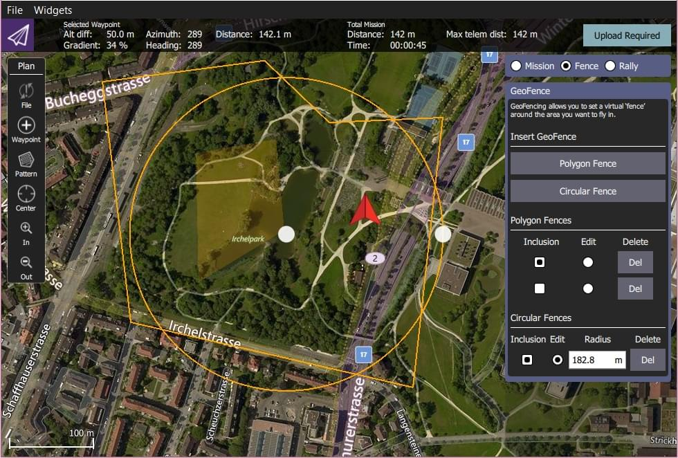
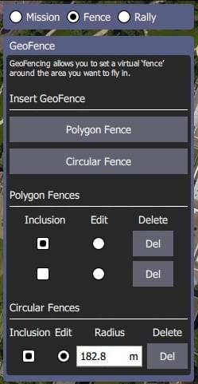

# Геозона

Геозона — це віртуальна межа, яка визначає, де може рухатися апарат.
Геозони можна використовувати, щоб запобігти польоту апарату за межі зони дії пульта дистанційного керування або в небезпечний чи обмежений повітряний простір.

PX4 надає два незалежні механізми для визначення геозони:

- Базова "безвідмовна" геозона, яка визначається простим циліндром.
- More complicated geometries can be defined using a Geofence Plan (_QGroundControl_).

:::info
GeoFences apply in all modes, including both missions and manual flight.
:::

## Безвідмовна геозона

The [Geofence Failsafe](../config/safety.md#geofence-failsafe) defines a cylinder centered on the home position, with a specified maximum radius and altitude.

Налаштування також включають "аварійну дію" у випадку порушення геозони.
This may simply be a warning notification, but more commonly a vehicle will immediately [Return](../flight_modes/return.md) to a safe location.

For more information see: [Safety > Geofence Failsafe](../config/safety.md#geofence-failsafe).

## План геозони

PX4 підтримує комплексні межі геозони, які складаються з кількох кругових та багатокутних областей, які можуть бути визначені як зони включення (літати всередині) або виключення (літати зовні).

The Geofence is planned in _QGroundControl_ alongside the mission and rally points.

Geofence planning is fully documented in [Plan View > GeoFence](https://docs.qgroundcontrol.com/master/en/qgc-user-guide/plan_view/plan_geofence.html) (QGroundControl User Guide).

Підсумовуючи:

1. Open _QGroundControl > Plan View_.
2. Select the _Plan Type_ radio button: **Fence**.
   This will display the _GeoFence Editor_.
   
3. Select the **Polygon Fence** or **Circular Fence** button to add a _basic_ fence of the desired type to the map.
   Це також додає запис про тип зони в редактор.
4. Використовуйте карту для налаштування форми та положення зони.
   - Маркер центру зони може бути використаний для переміщення зони у правильне положення.
   - Маркер на межі кругової зони може бути використаний для зміни радіуса.
   - Маркери на кутах (вершинах) можуть бути використані для зміни геометрії полігону.
      Додаткові вершини створюються шляхом натискання на середину ліній між наявними маркерами.
5. Use the _Geofence Editor_ to set a fence as an inclusion or exclusion, and to select a fence to edit (**Edit** radio button) or Delete (**Del** button).
6. Додайте стільки зон, скільки забажаєте.
7. Once finished, click on the **Upload** button (top right) to send the fence (along with rally points and mission) to the vehicle.
8. Set the breach action in the [Geofence Failsafe](../config/safety.md#geofence-failsafe).

:::info
Any geofence that does not include the Home position will be rejected by the flight controller and not uploaded.
Якщо апарат знаходиться в польоті, будь-яка геозона, яка одразу ж буде порушена після завантаження, також відхиляється.
:::

:::info
PX4 implements the MAVLink [Mission microservice](https://mavlink.io/en/services/mission.html), which includes support for GeoFences.
:::
