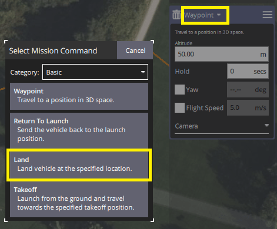
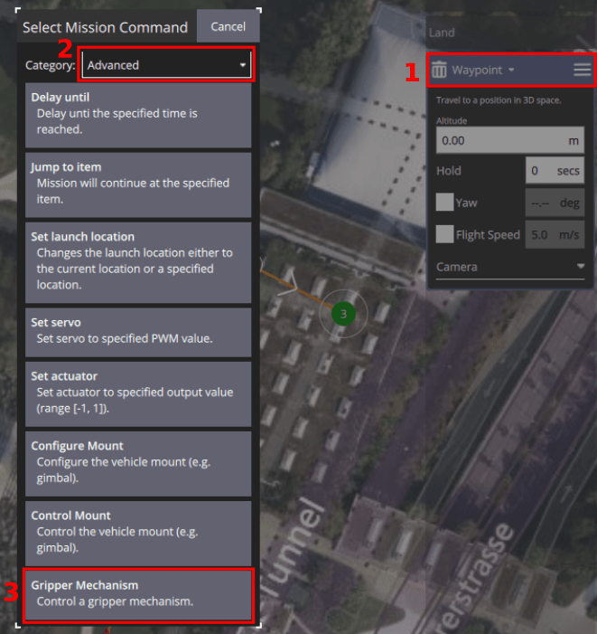
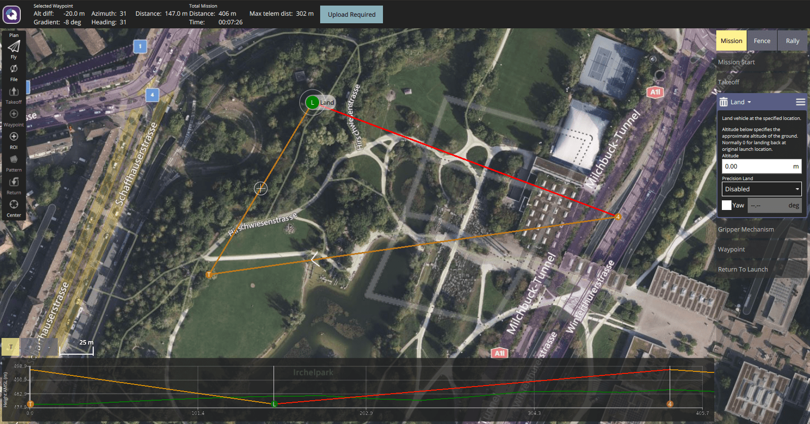

# Місії з доставки вантажу

A package delivery mission allows users to plan and execute cargo delivery using a [gripper](../peripherals/gripper.md).

:::info
This feature was added in PX4 v1.14 with support for Gripper (only).
Місії з доставки посилок будуть розширені для підтримки іншого обладнання для випуску вантажу в майбутньому, включаючи лебідки.
:::

## Конфігурація механізму доставки

Місії з доставки посилок вимагають певної конфігурації, яку необхідно виконати перед плануванням і виконанням місії.

Конфігурація значною мірою залежить від апаратного забезпечення, тому вона описана на сторінці налаштування для кожного типу обладнання доставки посилок:

- [Gripper > Package Delivery Configuration](../peripherals/gripper.md#package-delivery-configuration)

## Планування місії

A package delivery mission is planned in much the same as any other [waypoint mission](../flying/missions.md), with mission start, takeoff waypoint, various path waypoints, and possibly a return waypoint.
The only difference is that a package delivery mission must include a mission item that indicates whether the package should be released on the ground (`Land`) or in-air (`Waypoint`), followed by another mission item to deploy the package (`Gripper Mechanism`).

Whether or not you `Land` depends on whether the package can safely be deployed while flying, and if the vehicle is capable of landing at the deployment location.
Оскільки захват не може безпечно опускати посилки, мультикоптери та апарати VTOL часто приземляються, щоб розвантажити посилки, коли використовують захват.

After the deployment device [indicates completion](#package-release-feedback), the vehicle will proceed to the next waypoint.
Note that if landed, the next mission item after deployment should be another `Waypoint` or a `Takeoff` mission item ([it must not be a `RETURN`](#rtl-waypoint-for-package-delivery-with-landing).)

## Створення місії доставки посилок

Щоб створити місію доставки посилок (з використанням захвату):

1. Create a normal mission with a `Takeoff` mission item, and additional waypoints for your required flight path.

2. Додайте маршрутну точку на карті, де ви хочете випустити посилку.

   - Щоб скинути посилку під час польоту, установіть відповідну висоту для маршрутної точки (і переконайтеся, що маршрутна точка знаходиться в безпечному місці для скидання посилки).

   - If you'd like to land the vehicle to make the delivery you will need to change the `Waypoint` to a `Land` mission item.
      Do this by selecting the mission item heading, then selecting `Land` in the popup dialog.

      

3. Додайте маршрутну точку на карті (у будь-якому місці) для вивільнення захвату.
   To change this to a `Gripper Mechanism` select the "Waypoint" heading, and in the popup changing the group to "Advanced", then selecting `Gripper Mechanism`.

   

4. Налаштуйте дію для захоплювача в редакторі.

   

   - Щоб вивільнити посилку, встановіть значення "Release".
   - ID захоплювача наразі встановлювати не потрібно.

5. Додайте додаткові шляхові точки для решти шляху.
   If you landed, then remember that you must include a waypoint after the `Gripper Mechanism` before adding a `Return` mission item.

### Приклади планів

#### Місія скидання посилки

Тут показано план місії, де апарат скидає пакет під час польоту.
The initial mission item is a waypoint and the action is a `Gripper Release` (shown in mission item list)

Зверніть увагу, як графік висоти показує pre-waypoint як маршрутну точку в повітрі, також на правій панелі.

#### Місія приземлення та розвантаження

Тут показано план місії, де апарат приземляється, щоб доставити посилку.

Note how the altitude graph shows the `Land` item.

### Примітки

#### Точка маршруту RTL для доставки посилок з посадкою

Do not plan a mission with a delivery like this: `LAND` > `GRIPPER` > `RETURN TO LAUNCH`.

For safety reasons "Return To Launch" is disabled when vehicle is landed ([related issue](https://github.com/PX4/PX4-Autopilot/pull/20044)).
Отже, якщо ви приземлитесь, випустите вантаж, а потім встановите точку маршруту RTL, апарат буде простоювати на координатах посадки.

#### Ручне керування захватом в місіях

A gripper can be [manually controlled using a joystick button](../peripherals/gripper.md#qgc-joystick-configuration) (if configured) in any mode, including during a mission.

Проте зауважте, що якщо ви вручну командуєте закриття захвату, тоді як місія з доставки відкриває захват, захват не зможе завершити дію відкриття.
The mission will resume after the mission command timeout ([MIS_COMMAND_TOUT](../advanced_config/parameter_reference.md#MIS_COMMAND_TOUT)) expires, even if it has not released the package.

#### Автоматичне вимкнення відключено в місіях

Під час місії автоматичне вимкнення відключено за замовчуванням.
Це означає, що під час посадки для доставки посилок апарат усе ще буде увімкнений (і потенційно небезпечний!)

#### Зворотний зв'язок щодо випуску посилки

The mission will proceed after a "package release" mission item (e.g. `GRIPPER`) completes.

Захвати та інші пристрої доставки або використовують зворотний зв’язок датчика, або настроюваний тайм-аут, щоб вказати про завершення.
