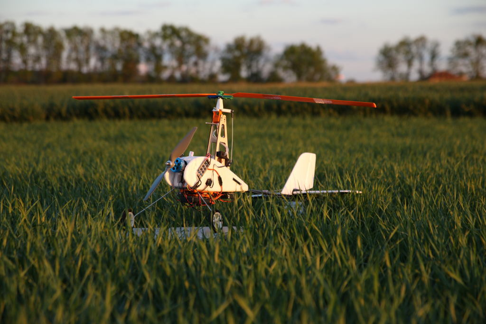
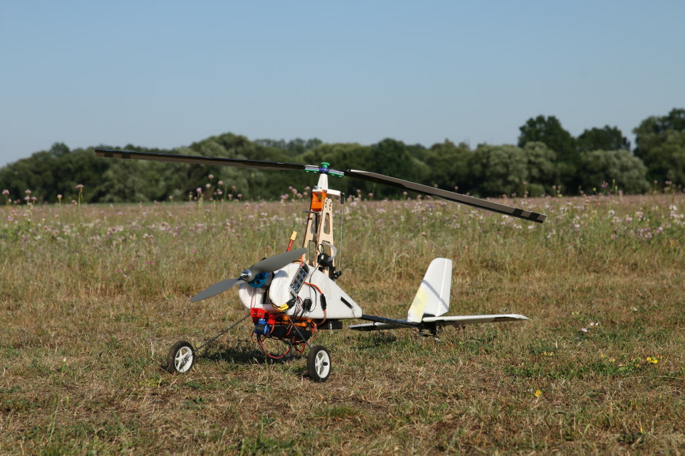

# ThunderFly Auto-G2 Autogyro

The _ThunderFly Auto-G2_ is an autopilot-controlled autogyro based on the&#x20;
Durafly™ Auto-G2 Gyrocopter RC model, with several parts of the original model substituted for 3D printable ones.

:::info
Auto-G2 autogyro’s airframe was originally developed by [ThunderFly](https://www.thunderfly.cz/) and has since evolved into the updated [TF-G2 platform](https://docs.thunderfly.cz/instruments/TF-G2).
Check out our site for more information on the current [TF-G2 commercial airframe](https://www.thunderfly.cz/tf-g2.html).
:::

All the added parts are available on [GitHub](https://github.com/ThunderFly-aerospace/Auto-G2) as an open-source project.
Printed parts are designed in [OpenSCAD](https://openscad.org/).

## Модифікації

Durafly Auto-G2, у своєму оригінальному дизайні, має трьохлопастний ротор з лопатями завдовжки 400 мм з профілем CLARK-Y.
Головка ротора дозволяє нахил у вісі ROLL лише.
Автогиро керується рулем та ліфтом.
Durafly Auto-G2 коробка автожира містить полістирольне тіло автожира, регулятор швидкості, двигун (мабуть 800 кВт), 4 сервопривода, хвостові аеродинамічні профілі, 3 лопаті з частинами центру ротора, дротову шасі та попередньовідкручувач.

Модифікація моделі Durafly виглядає наступним чином:

- Додавання автопілота
- Головка ротора з двома осями вільності (крен, кривошип)
- Two-blade rotor with safely breakable rotor plate
- Більші посадочні шасі

### Автопілот

Літак з усіма модифікаціями вже досить важкий.
Therefore a low-weight flight controller is recommended (e.g. [Holybro pix32](../flight_controller/holybro_pix32.md) or [CUAV nano](../flight_controller/cuav_v5_nano.md)).

The autopilot should be mounted on the bottom side of the autogyro on a 3D-printed damping pad.
We have used the damping platform found on [thingiverse](https://www.thingiverse.com/thing:160655)

### Голова ротора

The rotor head is (compared to the original autogyro) modified so that it allows a motion in both roll and pitch axes.
Завдяки цьому ротор може контролювати обертання, а також підйом автогира.
Directional control of an autogyro by the rotor is possible even in the case of low airspeed compared to the original rudder and elevator control.

Напечатана головка ротора складається з трьох частин.
Нижня частина закручується за допомогою винта М2,5 до оригінального пілона з фанери.
Гвинт M3x35, знайдений між першою та другою частиною, створює вільність по осі кроку, а з'єднання між другою та третьою частиною - вільність по осі кочення.
Останній вісь складається з гвинта M3x30 з самоблокуючою гайкою.
З боку ротора головка шурупа має велику площу шайби.

Вісь ротора, виготовлена з високої міцності гвинта M3x50, проходить через третю частину.
Використовуються підшипники 623 2Z C3 SKF.
В кінці цієї частини є кульові вали, прикріплені за допомогою гвинтів M2.5 до сервоприводів, розташованих у нижній частині пілона.
It is preferable to exchange these original servos for better quality ones as they are weak and in the original construction, they help each other.

### Двоклиновий ротор

The original Durafly Auto-G2 autogyro has a three-blade rotor, which has been modified in this build to use a two-blade rotor.
Причини - це зменшення вібрації та спрощення конструкції.
Надруковані центральні частини призначені для використання як з китайськими лопатями Durafly, так і з надрукованими на 3D принтері лопатями.

The rotor's central part consists of several components, which have the following roles:

- Вони дозволяють лопатці вільно коливатися.
- They have deformation zones that break upon impact with the ground.
  Завдяки цьому ротор зазвичай можна швидко відремонтувати, замінивши лише один компонент.
- Easy setup of blades' angle-of-attack.

#### Лопатки ротора HobbyKing

Можна використовувати надруковану центральну частину ротора з оригінальними лопатями.
The blades used were "Durafly™ Auto-G2 Gyrocopter 821mm - Replacement Main Blade" (Discontinued)
Hobbyking blades differ in the position of the center of gravity, and it is therefore necessary to balance them properly.

#### Роторні лопаті, надруковані у 3D

Також можливо надрукувати лопаті ротора.

The printed rotor blades are still under development, but preliminary tests show they are of better quality, mostly thanks to their precise shape and absence of longitudinal grooves.
Проте деякі з процесів виробництва все ще потребують налаштування.

#### Балансування

Proper blade balance is very important to minimize vibrations.
Леза повинні бути збалансовані таким чином, щоб центр ваги знаходився в середині осі ротора.

Printed blades are balanced in the production process, and there is no need to further balance them.

### Випуск пристрою

If you want to launch an autogyro using a winch or if you want to launch it by towing, you need to print a release device.
It is a small box equipped with a servo that pulls out the pin and releases the rope.

Вся частина склеєна за допомогою гарячого клейового розчину під двигуном на нижній частині корпусу автогиро.
Якщо автогир буксирується за допомогою каната, його двигун не повинен бути увімкнений.
Це може бути вирішено, наприклад, нулюючи вихід двигуна в передавачі, якщо вимикач пристрою вивільнення закритий.

## Список деталей

### Електроніка

- Autopilot ([Holybro pix32](../flight_controller/holybro_pix32.md), [CUAV nano](../flight_controller/cuav_v5_nano.md))
- GPS (Модуль GPS NEO-6M, з патч-антеною)
- Airspeed sensor ([SDP3x series](https://sensirion.com/products/catalog?categories=differential-pressure&series=SDP3x&page=1&page_size=12))
- Stronger servos as a substitution for the original ones (optional), ([BlueBird BMS-125WV](https://www.blue-bird-model.com/products_detail/411.htm))
- Додатковий сервопривід для пристрою відпускання (необов'язково)

### Механічні деталі

- Підшипник роторної головки (623 2Z C3)
- Propeller ([APC 10x7](https://www.apcprop.com/product/10x7e/))
- [Prop adapter](https://mpjet.com/shop/gb/prop-adapters/184-collet-prop-adapter-19-mm-4-mm-shaft-m629-standard.html)

### Друковані частини

- Голова ротора:
  - [Pylon end](https://github.com/ThunderFly-aerospace/Auto-G2/blob/master/CAD/stl/111_1001.stl)
  - [Pitch part](https://github.com/ThunderFly-aerospace/Auto-G2/blob/master/CAD/stl/111_1002.stl)
  - [Roll part](https://github.com/ThunderFly-aerospace/Auto-G2/blob/master/CAD/stl/111_1003.stl)

- Ротор:
  - [center part washer top](https://github.com/ThunderFly-aerospace/Auto-G2/blob/master/CAD/stl/111_1008.stl)
  - [center part washer bottom](https://github.com/ThunderFly-aerospace/Auto-G2/blob/master/CAD/stl/111_1004.stl)
  - [center plate with deformation zones](https://github.com/ThunderFly-aerospace/Auto-G2/blob/master/CAD/stl/888_1001.stl)
  - [washers for setting AoA of blades](https://github.com/ThunderFly-aerospace/Auto-G2/blob/master/CAD/stl/111_1005.stl)
  - [Rotor nut](https://github.com/ThunderFly-aerospace/Auto-G2/blob/master/CAD/stl/888_1002.stl)

- Лопаті ротора (необов'язково)

- Держатель автопілота

- [Release device](https://github.com/ThunderFly-aerospace/Auto-G2/blob/master/CAD/stl/888_1010.stl)

- [Front wheels](https://github.com/ThunderFly-aerospace/Auto-G2/blob/master/CAD/stl/888_1011.stl)

### Рекомендовані запасні частини

- Servos with improved quality (recommended [BlueBird BMS-125WV](https://www.blue-bird-model.com/products_detail/411.htm), original servos are not very durable))
- Propeller ([APC 10x7](https://www.apcprop.com/product/10x7e/))
- Центральна пластина ротора з деформаційними зонами (надрукована в 3D)
- Rotor blades ("Durafly™ Auto-G2 Gyrocopter 821mm" (Discontinued on HobbyKing), similar blades, or 3D printed)

## Відео

<lite-youtube videoid="YhXXSWz5wWs" title="[ThunderFly] 3D printed autogyro rotor"/>

## Фотогалерея змін

