# Збірка DJI FlameWheel 450 + CUAV V5 nano

This topic provides full instructions for building the kit and configuring PX4 using _QGroundControl_.

Основна Інформація

- **Frame:** DJI F450
- **Flight controller:** [CUAV V5 nano](../flight_controller/cuav_v5_nano.md)
- **Assembly time (approx.):** 90 minutes (45 minutes for frame, 45 minutes autopilot installation/configuration)

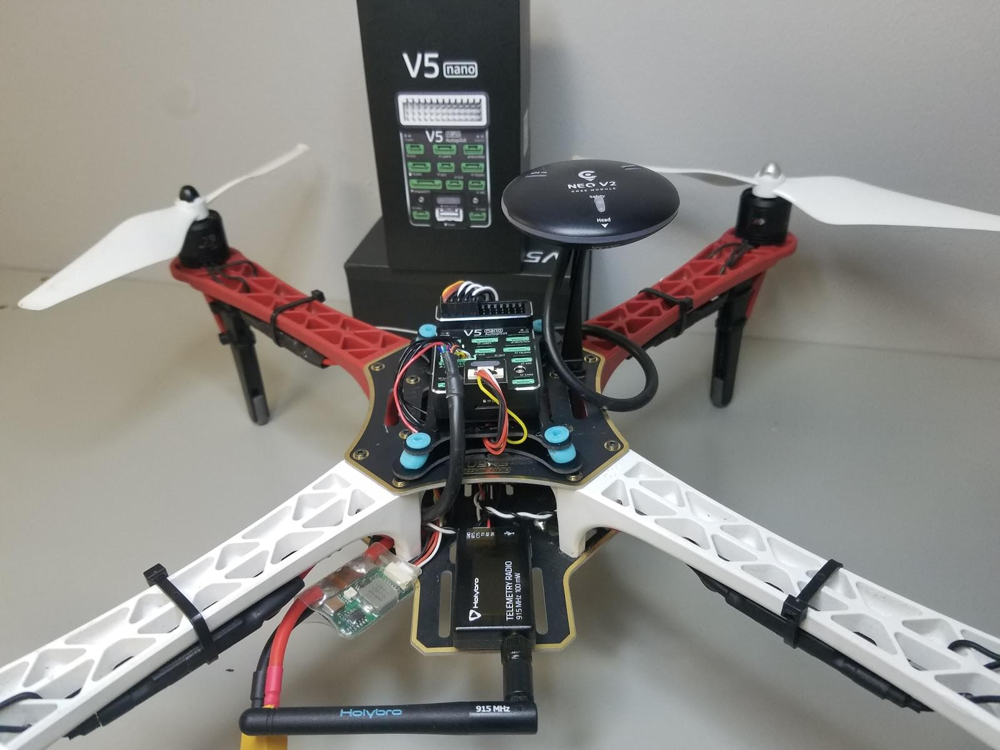

## Специфікація матеріалів

Компоненти, необхідні для цієї збірки, є:

- Flight controller: [CUAV V5 nano](https://store.cuav.net/shop/v5-nano/):
  - GPS: [CUAV NEO V2 GPS](https://store.cuav.net/index.php?id_product=97&id_product_attribute=0&rewrite=cuav-new-ublox-neo-m8n-gps-module-with-shell-stand-holder-for-flight-controller-gps-compass-for-pixhack-v5-plus-rc-parts-px4&controller=product&id_lang=1)
  - Модуль живлення
- Frame: [DJI F450](https://www.amazon.com/Flame-Wheel-Basic-Quadcopter-Drone/dp/B00HNMVQHY)
- Propellers: [DJI Phantom Built-in Nut Upgrade Propellers 9.4x5](https://www.masterairscrew.com/products/dji-phantom-built-in-nut-upgrade-propellers-in-black-mr-9-4x5-prop-set-x4-phantom)
- Battery: [Turnigy High Capacity 5200mAh 3S 12C Lipo Pack w/XT60](https://hobbyking.com/en_us/turnigy-high-capacity-5200mah-3s-12c-multi-rotor-lipo-pack-w-xt60.html?___store=en_us)
- Telemetry: [Holybro Transceiver Telemetry Radio V3](../telemetry/holybro_sik_radio.md)
- RC Receiver: [FrSky D4R-II 2.4G 4CH ACCST Telemetry Receiver](https://www.banggood.com/FrSky-D4R-II-2_4G-4CH-ACCST-Telemetry-Receiver-for-RC-Drone-FPV-Racing-p-929069.html?cur_warehouse=GWTR)
- Motors: [DJI E305 2312E Motor (960kv,CW)](https://www.amazon.com/DJI-E305-2312E-Motor-960kv/dp/B072MBMCZN)
- ESC: Hobbywing XRotor 20A APAC Brushless ESC 3-4S для RC Мультикоптерів

Крім того, ми використовували контролер FrSky Taranis.
Вам також знадобляться хомутів, двостороння стрічка, паяльник.

На наведеному нижче зображенні показані як рама, так і електронні компоненти.

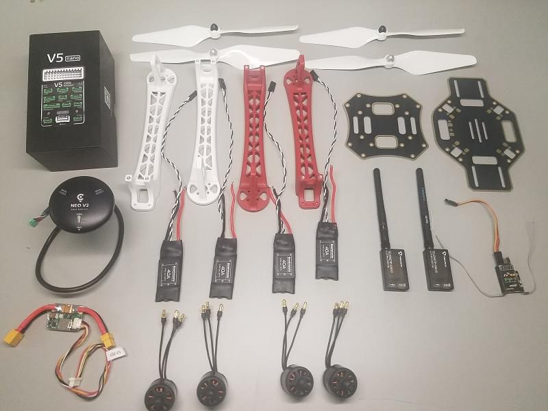

## Апаратне забезпечення(Hardware)

### Frame

Цей розділ містить усе обладнання для каркасів.

| Опис                                                              | Кількість |
| ----------------------------------------------------------------- | --------- |
| DJI F450 Нижня пластина                                           | 1         |
| DJI F450 Верхня пластина                                          | 1         |
| DJI F450 ніжки з шасі                                             | 4         |
| Гвинти M3\*8                                                      | 18        |
| Гвинти M2 5\*6                                                    | 24        |
| Акумуляторний ремінь на липучці                                   | 1         |
| DJI Phantom Built-in Nut Upgrade Propellers 9.4x5 | 1         |

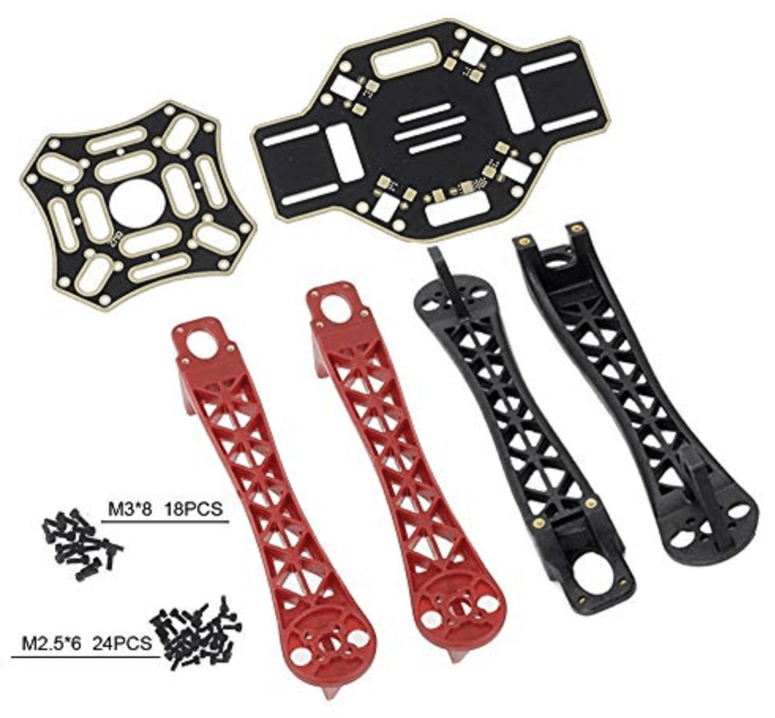

### CUAV v5 nano Package

У цьому розділі перераховані компоненти, що входять до складу пакета CUAV v5 nano.

| Опис                                        | Кількість (Набір за замовчуванням) | Кількість (+GPS Набір) |
| ------------------------------------------- | ----------------------------------------------------- | ----------------------------------------- |
| V5 nano політний контролер                  | 1                                                     | 1                                         |
| Кабель DuPont                               | 2                                                     | 2                                         |
| Кабель I2C/CAN                              | 2                                                     | 2                                         |
| Кабель ADC 6.6              | 2                                                     | 2                                         |
| Сигнальний кабель SBUS                      | 1                                                     | 1                                         |
| Кабель IRSSI                                | 1                                                     | 1                                         |
| Сигнальний кабель DSM                       | 1                                                     | 1                                         |
| Кабель ADC 3.3              | 1                                                     | 1                                         |
| Кабель для відладки                         | 1                                                     | 1                                         |
| Кабель запобіжного вимикача                 | 1                                                     | 1                                         |
| Voltage & Current Cable | 1                                                     | 1                                         |
| Кабель модуля PW-Link                       | 1                                                     | 1                                         |
| Модуль живлення                             | 1                                                     | 1                                         |
| Карта пам'яті SanDisk 16GB                  | 1                                                     | 1                                         |
| Платка розширення 12C                       | 1                                                     | 1                                         |
| ТТЛ-пластина                                | 1                                                     | 1                                         |
| NEO GPS                                     | -                                                     | 1                                         |
| GPS Bracket                                 | -                                                     | 1                                         |

### Електроніка

| Опис                                                               | Кількість |
| ------------------------------------------------------------------ | --------- |
| CUAV V5 nano                                                       | 1         |
| CUAV NEO V2 GPS                                                    | 1         |
| Holibro Telemetry                                                  | 1         |
| FrSky D4R-II 2.4G 4CH ACCST Telemetry Receiver     | 1         |
| DJI E305 2312E Motor (800kv,CW)                 | 4         |
| Hobbywing XRotor 20A APAC Brushless ESC                            | 4         |
| Модуль живлення (включено в набір CUAV V5 nano) | 1         |
| Turnigy High Capacity 5200mAh 3S 12C Lipo Pack w/XT60              | 1         |

### Необхідні інструменти

У цій збірці використовуються наступні інструменти:

- Викрутка з шестигранником 2,0 мм
- Шуруповерт Phillips 3 мм
- Кусачки
- Прецизійний пінцет
- Паяльник

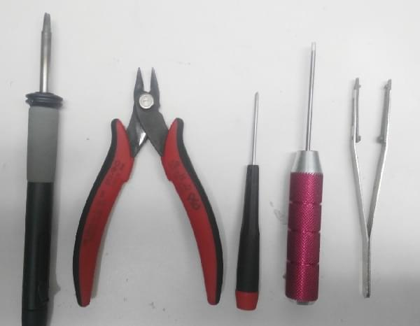

## Збірка

Приблизний час для збирання становить приблизно 90 хвилин (близько 45 хвилин на раму та 45 хвилин на встановлення автопілота та налаштування корпусу.

1. Прикріпіть 4 ніжки до нижньої пластини за допомогою наданих гвинтів.

  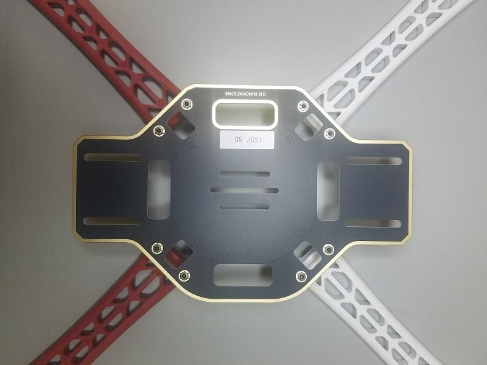

2. Припаяйте ЕСК (електронний регулятор швидкості) до плати, позитивний (червоний) та негативний (чорний).

  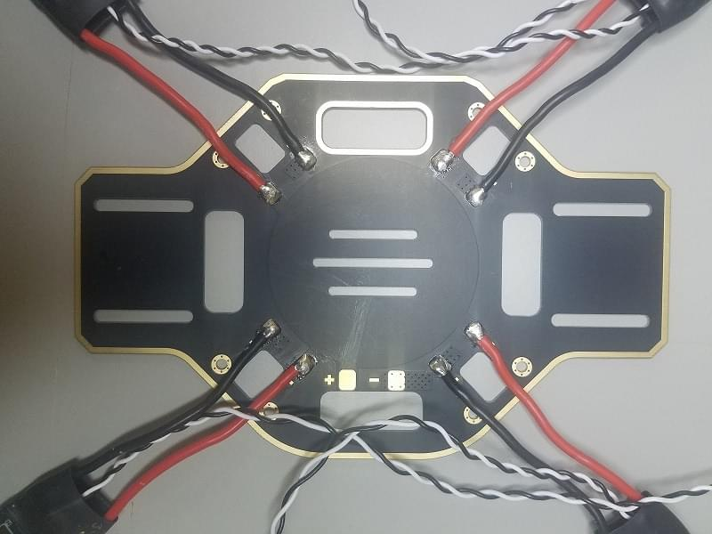

3. Припаяйте модуль живлення, позитивний (червоний) та негативний (чорний).

  

4. Підключіть двигуни до ESC відповідно до їхніх позицій.

  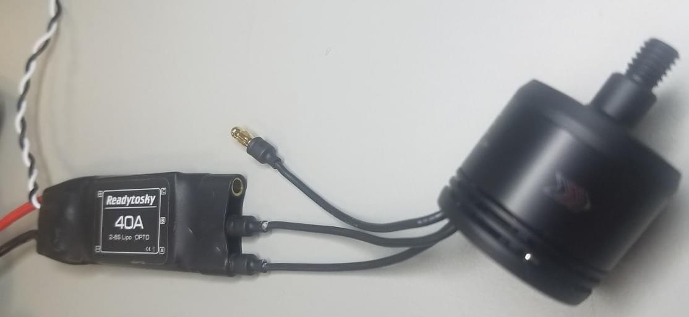

5. Прикріпіть двигуни до відповідних рук.

  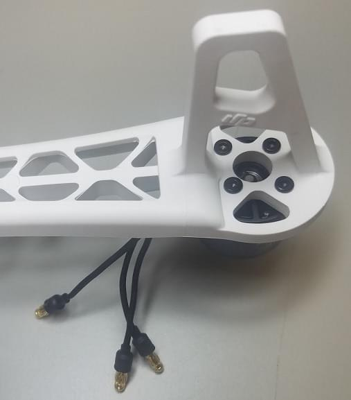
  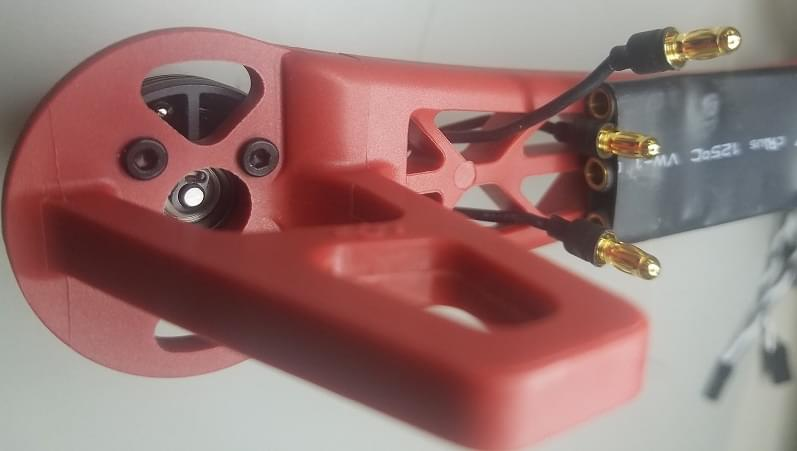

6. Додайте верхню дошку (прикрутіть до верхньої частини ніг).

  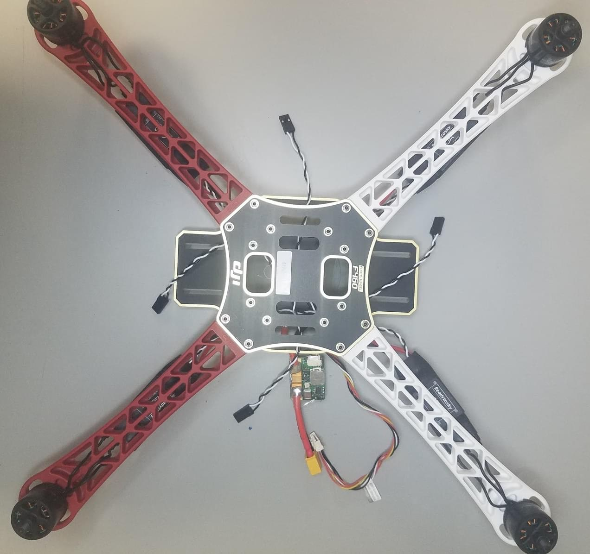

7. Add damping foam to the _CUAV V5 nano_ flight controller.

  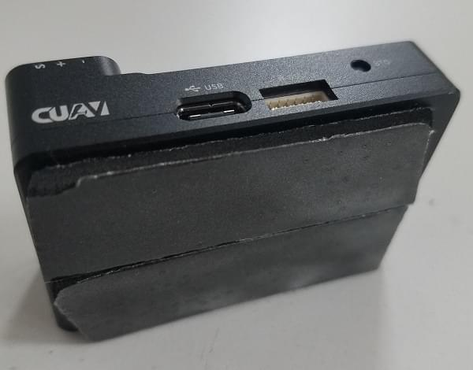
  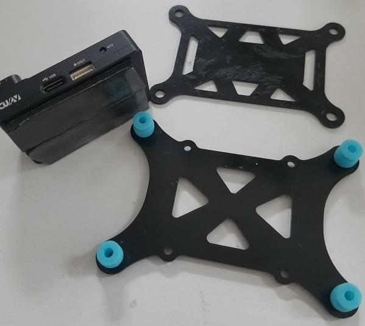

8. Прикріпіть приймач FrSky до нижньої плати за допомогою двосторонньої стрічки.

  

9. Прикріпіть телеметричний модуль до нижньої плати транспортного засобу за допомогою двосторонньої стрічки.

  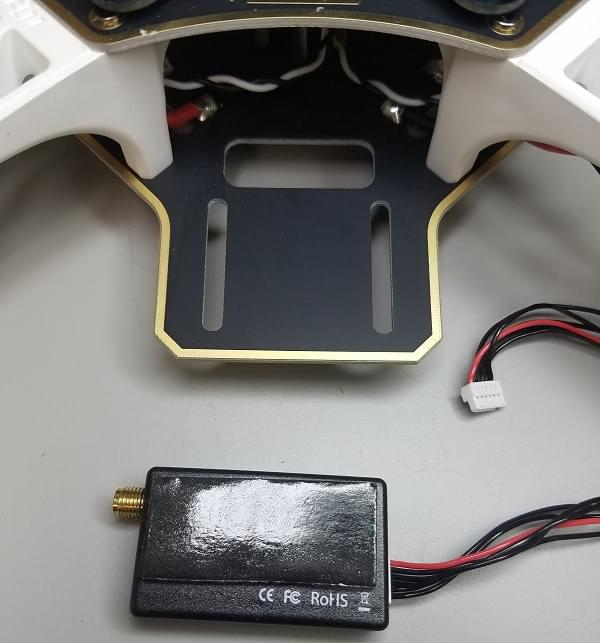
  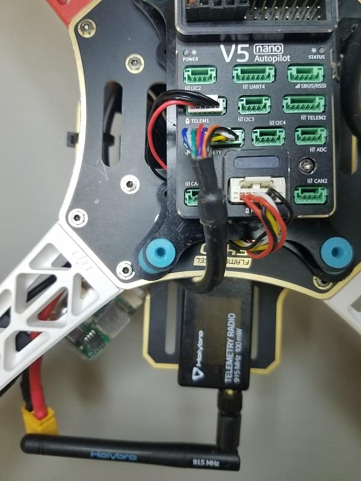

10. Поставте алюмінієві опори на платформу кнопок і прикріпіть GPS.

  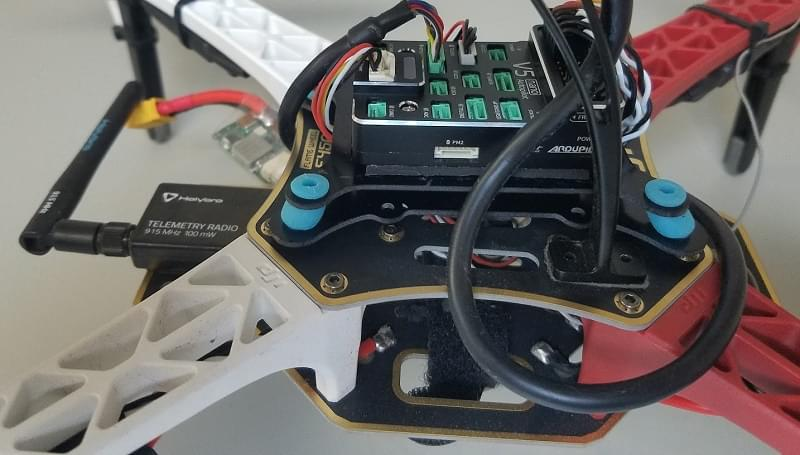

11. Plug in Telemetry (`TELEM1`), GPS module (`GPS/SAFETY`), RC receiver (`RC`), all 4 ESC’s (`M1-M4`), and the power module (`Power1`) into the flight controller.
  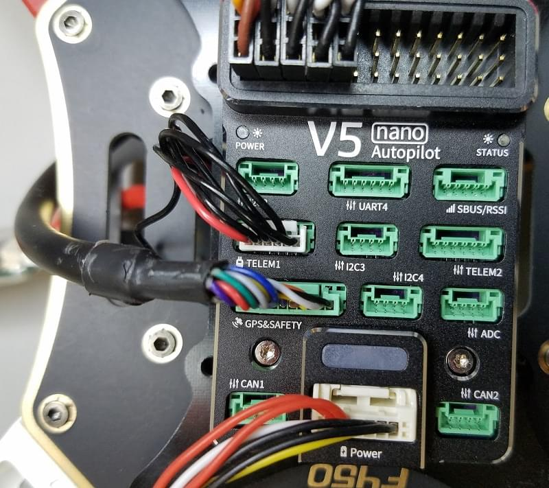

  ::: info
  The motor order is defined in the [Airframe Reference > Quadrotor x](../airframes/airframe_reference.md#quadrotor-x)

:::

Ось і все!
Останню збірку показано нижче:

## Конфігурація PX4

_QGroundControl_ is used to install the PX4 autopilot and configure/tune it for the frame.
[Download and install](http://qgroundcontrol.com/downloads/) _QGroundControl_ for your platform.

:::tip
Full instructions for installing and configuring PX4 can be found in [Basic Configuration](../config/index.md).
:::

Спочатку оновіть прошивку, конструкцію та виходи:

- [Firmware](../config/firmware.md)

- [Airframe](../config/airframe.md)

  ::: info
  You will need to select the _Generic Quadcopter_ airframe (**Quadrotor x > Generic Quadcopter**).

  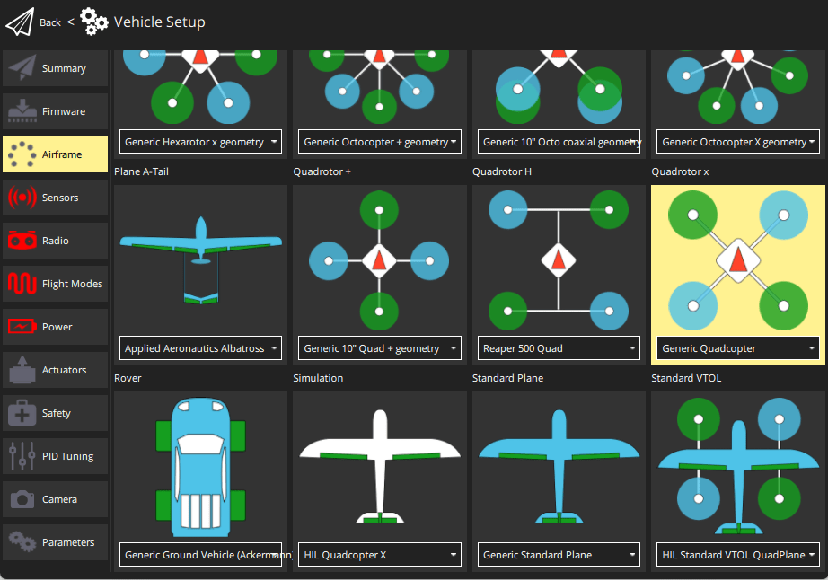

:::

- [Actuators](../config/actuators.md)
  - Оновіть геометрію транспортного засобу, щоб вона відповідала рамі.
  - Призначте функції приводу до актуаторів, щоб відповідати вашому підключенню.
  - Перевірте конфігурацію, використовуючи слайдери.

Потім виконайте обов'язкове налаштування / калібрування:

- [Sensor Orientation](../config/flight_controller_orientation.md)
- [Компас](../config/compass.md)
- [Акселерометр](../config/accelerometer.md)
- [Level Horizon Calibration](../config/level_horizon_calibration.md)
- [Radio Setup](../config/radio.md)
- [Flight Modes](../config/flight_mode.md)

  ::: info
  For this build we set up modes _Stabilized_, _Altitude_ and _Position_ on a three-way switch on the receiver (mapped to a single channel - 5).
  Це рекомендований мінімальний набір режимів для початківців.

:::

В ідеалі ви також повинні зробити:

- [ESC Calibration](../advanced_config/esc_calibration.md)
- [Battery Estimation Tuning](../config/battery.md)
- [Safety](../config/safety.md)

## Вдосконалення

Airframe selection sets _default_ autopilot parameters for the frame.
Ці можуть бути достатньо хороші для польоту, але вам слід налаштувати кожну конструкцію рами.

For instructions on how, start from [Autotune](../config/autotune_mc.md).

## Відео

<lite-youtube videoid="b0bKNdDqVHw" title="CUAV Nano"/>

## Подяки

Цей журнал збірки був наданий Командою тестового польоту Dronecode.
