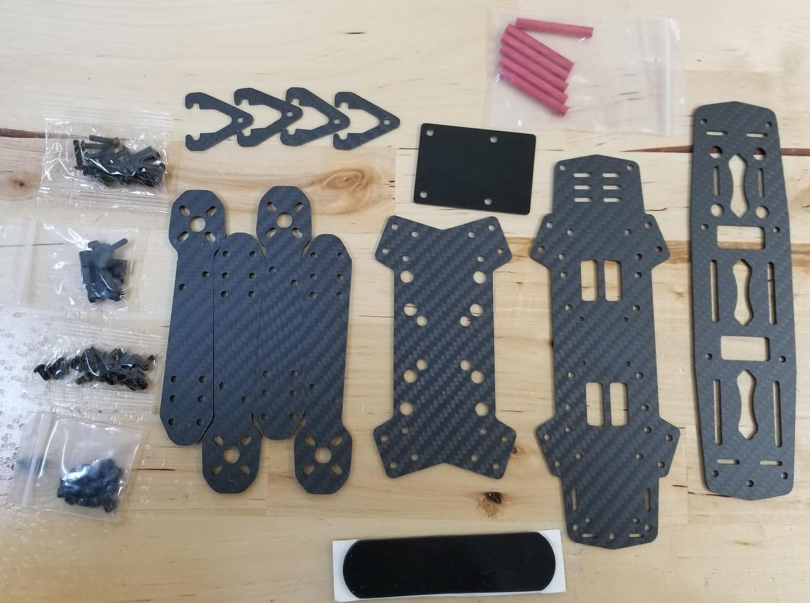
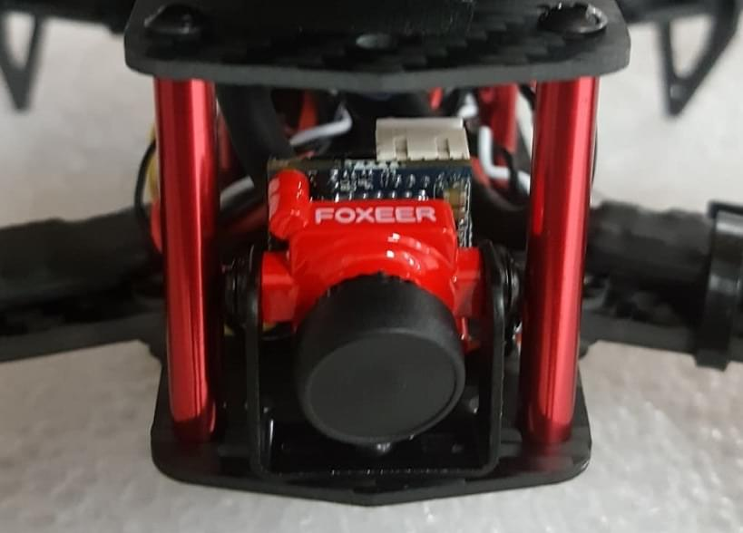
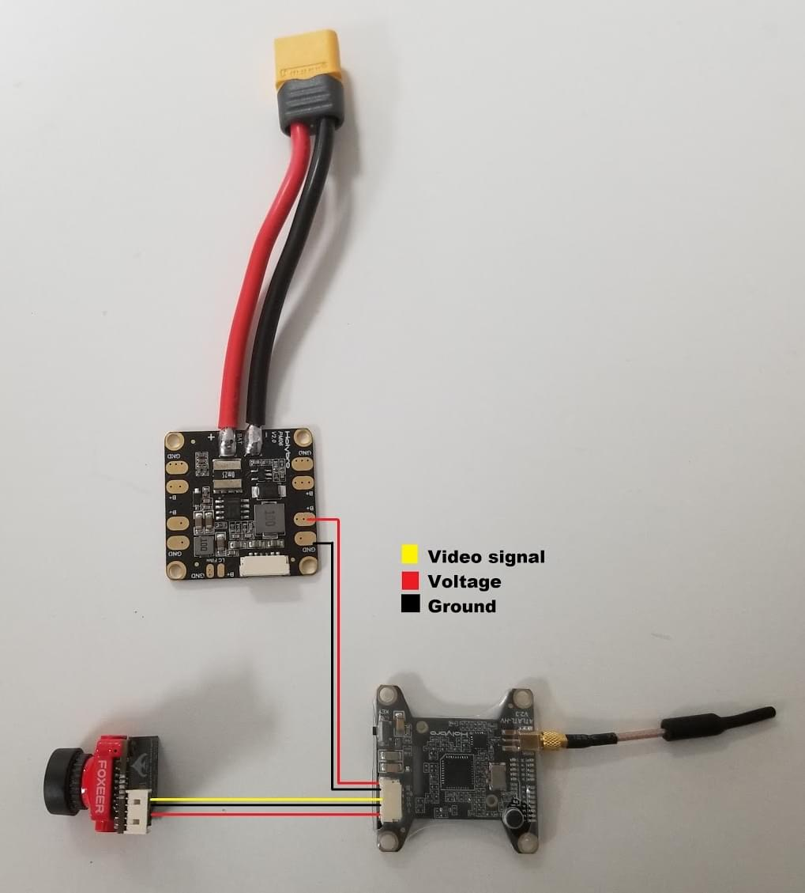
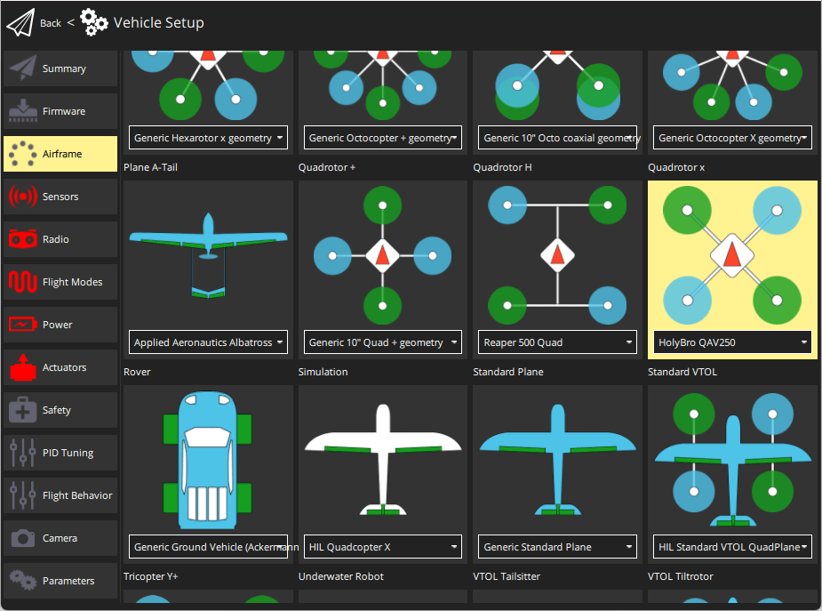

# Holybro QAV250 + Pixhawk 4 Mini Build (Припинено)

:::info
The _Holybro Pixhawk 4 Mini QAV250 Kit_ is no longer available.

The instructions have been left here because very similar kits based on the Pix32 v6 are [available here](https://holybro.com/products/qav250-kit).
Ці інструкції все ще можна виконувати (і можуть бути оновлені до Pix32 v6).
:::

Повні комплекти включають карбонову раму для гонок QAV250, контролер польоту та майже всі інші необхідні компоненти (окрім акумулятора та приймача).
Є варіанти набору як з підтримкою FPV, так і без неї.
This topic provides full instructions for building the kit and configuring PX4 using _QGroundControl_.

Основна Інформація

- **Frame:** Holybro QAV250
- **Flight controller:** [Pixhawk 4 Mini](../flight_controller/pixhawk4_mini.md)
- **Assembly time (approx.):** 3.5 hours (2 for frame, 1.5 autopilot installation/configuration)

## Швидкий старт керівництво

[Pixhawk 4 Mini QAV250 Kit Quickstart Guide](https://github.com/PX4/PX4-user_guide/raw/main/assets/flight_controller/pixhawk4mini/pixhawk4mini_qav250kit_quickstart_web.pdf)

## Специфікація матеріалів

The Holybro [QAV250 Kit](https://holybro.com/products/qav250-kit) kits includes almost all required components:

- [Holybro Transceiver Telemetry Radio V3](../telemetry/holybro_sik_radio.md)
- Модуль живлення holybro
- Повністю зібрана плата керування живленням з ESC
- Двигуни - DR2205 KV2300
- 5-дюймові пластикові стійки
- Вуглепластиковий планер 250 з обладнанням
- Камера Foxer
- Vtx 5.8ghz

Додатково вам знадобиться акумулятор та приймач (+сумісний передавач).
Ця збірка використовує:

- Receiver: [FrSSKY D4R-II](https://www.frsky-rc.com/product/d4r-ii/)
- Battery: [4S 1300 mAh](http://www.getfpv.com/lumenier-1300mah-4s-60c-lipo-battery-xt60.html)

## Апаратне забезпечення(Hardware)

У цьому розділі перераховано все обладнання для встановлення рами та автопілота.

### Frame QAV250

| Опис                            | Кількість |
| ------------------------------- | --------- |
| Каркасна пластина Unibody       | 1         |
| Кришка контролера польоту       | 1         |
| PDB                             | 1         |
| Пластина камери                 | 1         |
| 35-міліметрові стійки           | 6         |
| Вінілові гвинти та гайки        | 4         |
| Cталеві шурупи 15 мм            | 8         |
| Сталеві гайки                   | 8         |
| Cталеві шурупи 7 мм             | 12        |
| Акумуляторний ремінь на липучці | 1         |
| Піна для акумуляторів           | 1         |
| Посадкові майданчики            | 4         |

### Електроніка

| Опис                                                                        | Кількість |
| --------------------------------------------------------------------------- | --------- |
| Двигуни - DR2205 KV2300                                                     | 4         |
| Повністю зібрана плата керування живленням з ESC                            | 4         |
| Модуль живлення Holybro                                                     | 1         |
| Приймач Fr-sky D4R-II                                                       | 1         |
| Pixhawk 4 mini                                                              | 1         |
| Holybro GPS Neo-M8N                                                         | 1         |
| [Holybro Transceiver Telemetry Radio V3](../telemetry/holybro_sik_radio.md) | 1         |
| Акумуляторна батарея люмінесцентної лампи 1300 mAh 4S 14.8V | 1         |
| Vtx 5.8gHz                                                  | 1         |
| FPV-камера (тільки для повного комплекту)                | 1         |

На наведеному нижче зображенні показані як рама, так і електронні компоненти.

## Збірка

Estimated time to assemble frame is 2 hours and 1.5 hours installing the autopilot and configuring the airframe in _QGroundControl_.

### Необхідні інструменти

У цій збірці використовуються наступні інструменти:

- Викрутка з шестигранником 2,0 мм
- Шуруповерт Phillips 3 мм
- Кусачки
- Прецизійний пінцет

### Збірка рами

1. Прикріпіть руки до плати кнопки за допомогою гвинтів довжиною 15 мм, як показано:

  
2. Покладіть коротку пластину над руками

  
3. Покладіть гайки на відносно 15 мм гвинти (показано в наступному кроці)
4. Insert the plastic screws into the indicated holes (note that this part of the frame faces down when the vehicle is complete).
  
5. Add the plastic nuts to the screws (turn over, as shown)
  
6. Lower the power module over the plastic screws and then add the plastics standoffs
  
7. Put the flight controller plate on the standoffs (over the power module)
  
8. Підключіть двигуни. Двигуни мають стрілку, що показує напрямок обертання.
  
9. Use double sided tape from kit to attach the _Pixhawk 4 Mini_ to the flight controller plate.
  
10. Connect the power module's "power" cable to _Pixhawk 4 mini_.
  
11. Attach the aluminium standoffs to the button plate
  
12. Підключіть ESC з моторами та утримуйте. На цьому зображенні показаний порядок розташування двигунів та напрямок обертання.
  

  Підключіть двигуни на ESC, переконайтеся, що двигуни обертаються у правильному напрямку, якщо двигун обертається у протилежний бік, змініть кабель A на плату C та C на плату A ESC.

  :::warning
  Test motor directions with propellers removed.

:::

  
13. Підключіть кабелі сигналу ESC до виходів PWM Pixhawk у правильному порядку (див. попереднє зображення)

  
14. Підключіть приймач.
  - Якщо використовуєте приймач PPM, підключіть його до порту PPM.

    
  - Якщо використовується приймач SBUS, підключіть його до порту RC IN

    
15. Підключіть модуль телеметрії. Вставте модуль за допомогою двостворчастої стрічки та підключіть його до порту телеметрії.

  
16. Підключіть модуль GPS

  

  Прикріпіть модуль на верхню плату (використовуючи наданий стрічку 3M, або пастою). Потім покладіть верхню плиту на стойки, як показано

  
17. Останнім "обов'язковим" кроком зборки є додавання липучки для утримання батареї

  

The "basic" frame build is now complete (though if you need them, you can find more information about connecting components in the [Pixhawk 4 Wiring Quickstart](../assembly/quick_start_pixhawk4.md)).

If you have the "basic" version of the kit, you can now jump ahead to instructions on how to [Install/Configure PX4](#px4-configuration).

### Збирання FPV

"Complete" версія комплекту додатково поставляється з системою FPV, яка встановлена на передній частині транспортного засобу, як показано.

Кроки для встановлення комплекту:

1. Install the camera bracket on the frame
  
2. Install the camera on the bracket
  
3. The power module on the complete kit comes with wiring ready to connect the Video Transmitter and Camera:
  
  - Attach the camera connector
    
    The wires are: blue=voltage sensor, yellow=video out, black=ground, red=+voltage.
  - Connect the Video Transmitter (VTX) connector
    
    The wires are: yellow=video out, black=ground, red=+voltage.
4. Закріпіть відеопередавач і плату OSD на рамку за допомогою стрічки.

:::info
If you have to wire the system yourself, the diagram below shows all the connections between camera, VTX and power module:

:::

## Конфігурація PX4

_QGroundControl_ is used to install the PX4 autopilot and configure/tune it for the QAV250 frame.
[Download and install](http://qgroundcontrol.com/downloads/) _QGroundControl_ for your platform.

:::tip
Full instructions for installing and configuring PX4 can be found in [Basic Configuration](../config/index.md).
:::

Спочатку оновіть прошивку, конструкцію та відображення актуаторів:

- [Firmware](../config/firmware.md)

- [Airframe](../config/airframe.md)

  ::: info
  You will need to select the _HolyBro QAV250_ airframe (**Quadrotor x > HolyBro QAV250**).

  

:::

- [Actuators](../config/actuators.md)
  - Вам не потрібно оновлювати геометрію транспортного засобу (оскільки це попередньо налаштована конструкція повітряного каркасу).
  - Призначте функції приводу до актуаторів, щоб відповідати вашому підключенню.
    - For the Pixhawk 4 Mini, and other controllers that do not have an [I/O board](../hardware/reference_design.md#main-io-function-breakdown), you will need to assign actuators to outputs on the `PWM AUX` tab in the configuration screen.
    - Pix32 v6 має плату введення/виведення, щоб ви могли призначити його до AUX або MAIN.
  - Перевірте конфігурацію, використовуючи слайдери.

Потім виконайте обов'язкове налаштування / калібрування:

- [Sensor Orientation](../config/flight_controller_orientation.md)
- [Компас](../config/compass.md)
- [Акселерометр](../config/accelerometer.md)
- [Level Horizon Calibration](../config/level_horizon_calibration.md)
- [Radio Setup](../config/radio.md)
- [Flight Modes](../config/flight_mode.md)

В ідеалі ви також повинні зробити:

- [ESC Calibration](../advanced_config/esc_calibration.md)
- [Battery Estimation Tuning](../config/battery.md)
- [Safety](../config/safety.md)

## Вдосконалення

Airframe selection sets _default_ autopilot parameters for the frame.
Ці можуть бути достатньо хороші для польоту, але вам слід налаштувати кожну конструкцію рами.

For instructions on how, start from [Autotune](../config/autotune_mc.md).

## Подяки

Цей журнал збірки був наданий Командою тестового польоту PX4.
