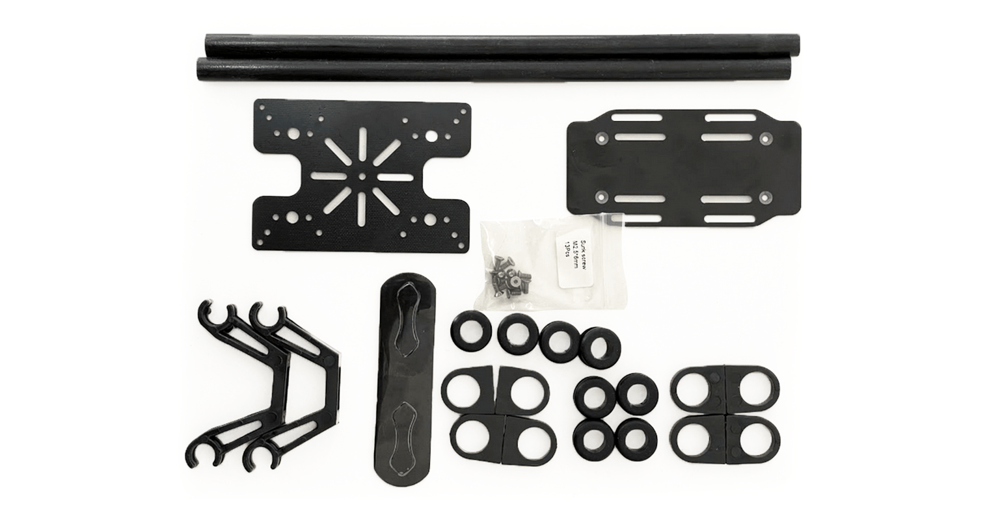
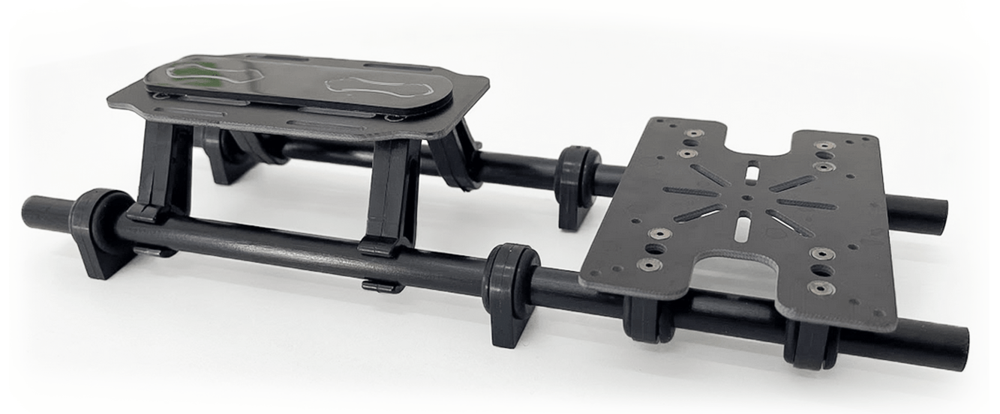
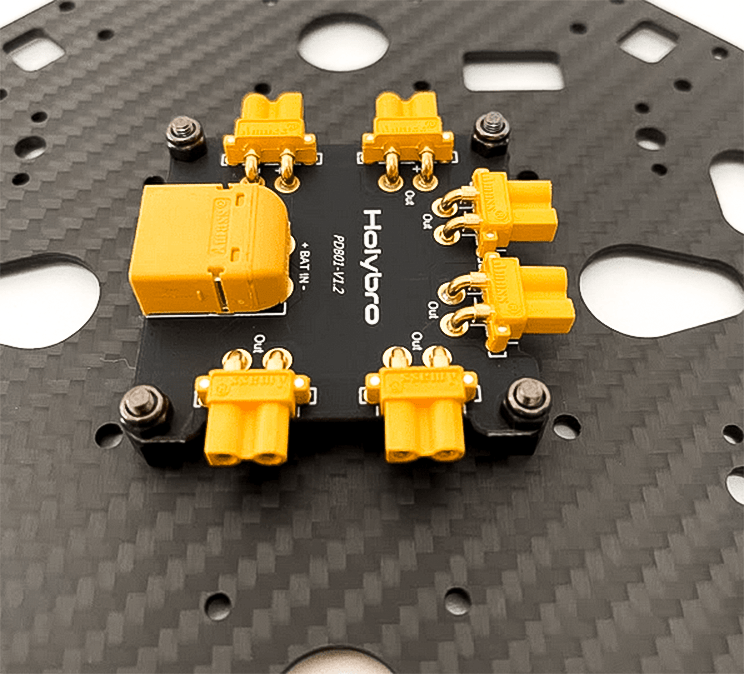
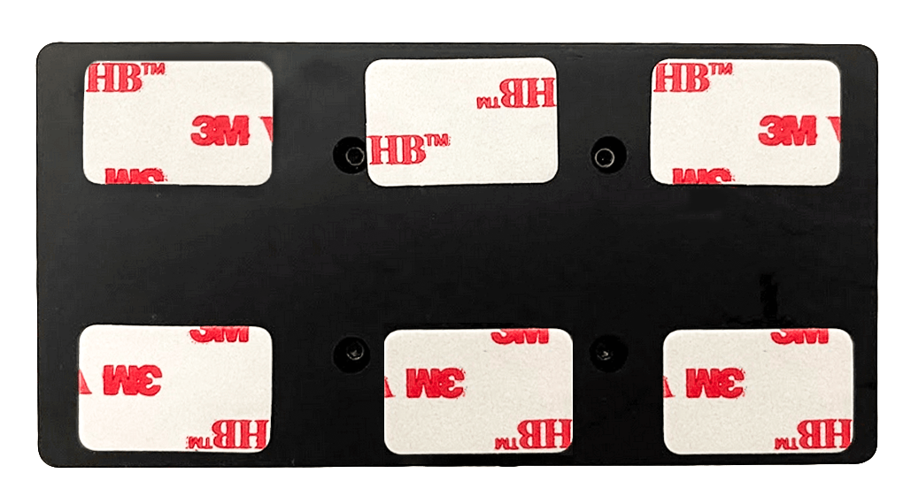

# Holybro X500 V2 (Побудова Pixhawk 5X)

:::info
Holybro initially supplied this kit with a [Pixhawk 5X](../flight_controller/pixhawk5x.md), but at time of writing this has been upgraded to a [Holybro Pixhawk 6C](../flight_controller/pixhawk6c.md).
Цей журнал збірки все ще актуальний, оскільки збірка комплекту практично однакова і, ймовірно, залишиться такою ж, оскільки контролер польоту оновлюється.
:::

This topic provides full instructions for building the [Holybro X500 V2 ARF Kit](https://holybro.com/collections/x500-kits) and configuring PX4 using _QGroundControl_.

Набір ARF ("Майже готовий до польоту") забезпечує найкоротший і простий досвід збирання для тих, хто хоче зайнятися розробкою дронів і не витрачати багато часу на налаштування апаратного забезпечення.
Воно включає в себе раму, двигуни, ESC, пропелери та плату розподілу потужності.

Крім комплекту вам знадобиться платформа керування польотом, радіопередавачі, GPS та пульт дистанційного керування.
Набір ARF може бути використаний з більшістю контролерів польоту, які підтримуються PX4.

## Основна Інформація

- **Kit:** [Holybro X500 V2 ARF Kit](https://holybro.com/collections/x500-kits)
- **Flight controller:** [Pixhawk 5X](../flight_controller/pixhawk5x.md)
- **Assembly time (approx.):** 55 min (25 minutes for frame, 30 minutes for autopilot installation/configuration)

## Специфікація матеріалів

The Holybro [X500 V2 Kit](https://holybro.com/collections/x500-kits) includes almost all the required components:

- X500V2 Frame Kit
 - Body - Full Carbon Fiber Top & Bottom plate (144 x 144mm, 2mm thick)
 - Arm - High strength & ultra-lightweight 16mm carbon fiber tubes
 - Landing gear - 16mm & 10mm diameter carbon fiber tubes
 - Platform board - With mounting holes for GPS & popular companion computer
 - Система кріплення з подвійними пружинними валиками 10 мм Ø та довжиною 250 мм
 - Кріплення батареї з двома стропами для батареї
 - Ручні інструменти для встановлення
- Holybro Motors - 2216 KV880 x6 (superseded - check [spare parts list](https://holybro.com/products/spare-parts-x500-v2-kit) for current version).
- Holybro BLHeli S ESC 20A x4 (superseded - check [spare parts list](https://holybro.com/products/spare-parts-x500-v2-kit) for current version).
- Propellers - 1045 x4 (superseded - check [spare parts list](https://holybro.com/products/spare-parts-x500-v2-kit) for current version).
- Power Distribution Board – XT60 plug for battery & XT30 plug for ESCs & peripherals
- Camera mount (optional and the 3D file can be downloaded from [here](https://cdn.shopify.com/s/files/1/0604/5905/7341/files/Holybro_X500_V2_3D_Print.rar?v=1665561017))

Other parts in this build(**Not included in the ARF kit**):

- [Pixhawk 5X autopilot](../flight_controller/pixhawk5x.md)
- [M8N GPS](https://holybro.com/products/m8n-gps)
- [Power Module - PM02D](../power_module/holybro_pm02d.md)
- [433/915 MHz Telemetry Radio](../telemetry/holybro_sik_radio.md)

Additionally you will need a battery (Holybro recommends a 4S 5000mAh) and receiver ([compatible radio system](../getting_started/rc_transmitter_receiver.md)) if you want to control the drone manually.

## Комплект апаратного забезпечення

У цьому розділі перераховано все обладнання для встановлення рами та автопілота.

| Елемент                                         | Опис                                                                  | Кількість |
| ----------------------------------------------- | --------------------------------------------------------------------- | --------- |
| Нижня пластина                                  | Вуглецеве волокно (товщиною 2 мм)                  | 1         |
| Верхня пластина                                 | Вуглецеве волокно (товщиною 1.5мм) | 1         |
| Кронштейн                                       | Вуглецева труба (складена з монтованими двигунами) | 4         |
| Шасі - Вертикальна стійка                       | Вуглепластикова трубка + інженерний пластик                           | 2         |
| Шасі - Поперечна балка                          | Вуглепластикова трубка + інженерний пластик + пінопласт               | 2         |
| Монтажна рейка                                  | Діаметр: 10мм довжина: 250мм          | 2         |
| Плата кріплення акумулятора                     | Товщина: 2мм                                          | 1         |
| Підставка для батареї                           | Чорний лист силікону товщиною 3 мм                                    | 1         |
| Плата платформи                                 | Товщина: 2мм                                          | 1         |
| Hanger & rubber ring gasket | Діаметр внутрішнього отвору: 10 мм чорний             | 8         |

_Figure 1_: X500 V2 ARF Kit what's inside

### Електроніка

| Опис предмету                                                                            | Кількість |
| ---------------------------------------------------------------------------------------- | --------- |
| Pixhawk5x & Assorted Cables                                          | 1         |
| Модуль GPS M8N                                                                           | 1         |
| Модуль живлення PM02D (з попередньо припаяними кабелями живлення ESC) | 1         |
| Двигуни 2216 KV880 (оновлення V2)                                     | 4         |
| Holybro BLHeli S ESC 20A x4                                                              | 1         |
| Holybro BLHeli S ESC 20A x4                                                              | 1         |
| 433 MHz / 915 MHz [Holybro Telemetry Radio](../telemetry/holybro_sik_radio.md)           | 1         |

### Необхідні інструменти

У комплект включені інструменти для зборки, проте вам може знадобитися:

- Кусачки
- Прецизійний пінцет

## Збірка

Орієнтовний час збірки - 55 хвилин (25 хвилин на раму, 30 хвилин на встановлення/налаштування автопілота)

1. Start by assembling the payload & battery holder.
 Втисніть гумки в захоплювачі (не використовуйте гострі предмети, щоб їх втиснути в них!).
 Далі пропустіть тримачі через планки тримача з основами тримача батарей, як показано на рисунку 3.

 

 _Figure 2_: Payload holder components

 

 _Figure 3_: Payload holder assembled

2. Наступним кроком буде прикріплення нижньої пластини до тримача вантажу.

 Вам знадобляться деталі, як показано на рисунку 4.
 Потім встановіть основу для розподільної плати живлення, використовуючи нейлонові гайки, як зображено на Рис. 5.
 Нарешті, використовуючи 8 шестигранних гвинтів, ви можете приєднати нижню пластину до тримача навантаження (Рисунок 7)

 

 _Figure 4_: Needed Materials

 

 _Figure 5_: PDB mount base

 

 _Figure 6_: Mounted pdb with nylon nuts

 

 _Figure 7_: Mounted Plate on payload holder

3. Давайте зберемо речі, необхідні для монтажу посадкового шасі, як на рисунку 8.
 Використовуйте гвинти, щоб приєднати посадкові шасі до нижньої пластини.
 Також потрібно відкрити три шестигранних гвинти на кожній з ніжок, щоб ви могли вставити їх у вуглецеві труби.
 Не забудьте знову їх затягнути.

 

 _Figure 8_: Required parts for landing gear attachment

 

 _Figure 9_: Landing gear attachment to the body

4. Зараз ми зберемо все оснащення, щоб встановити верхню пластину.
 Прошу звернути увагу, що номери моторів на кронштейнах відповідають тим, що згадані на верхній платі.
 На щастя, мотори встановлені, а ESCs були з'єднані заздалегідь.
 Почніть, проходячи через всі гвинти, так як ви зафіксували кронштейни на їхніх власних місцях (Вони мають направляючий елемент, як показано на рисунку 11, щоб переконатися, що вони на місці), і трохи підтягніть всі нейлонові гайки.
 Потім ви зможете підключити роз'єми живлення XT30 до плати живлення.
 Пам'ятайте, що дроти сигналу повинні бути проведені через верхню пластину так, що ми зможемо пізніше їх підключити до Pixhawk.

 

 _Figure 10_: Connecting arms needed materials.

 

 _Figure 11_: Guide for the arms mount

5. Для затягування всіх 16 гвинтів і гайок використовуйте як шестигранний ключ, так і гайковий ключ.

 

 _Figure 12_: Mounted top plate

6. Наступним кроком ви можете закріпити свій pixhawk на верхній плиті, використовуючи наклейки.
 Рекомендується мати напрямок стрілки вашого Pixhawk таким же, як зазначено на верхній плиті.

 

 _Figure 13_: Sticker tapes on Pixhawk

7. Якщо ви хочете встановити GPS на плату компаньйона-комп'ютера, тепер ви можете закріпити кріплення GPS на ній за допомогою 4 гвинтів і гайок.

 

 _Figure 14_: Secure GPS mount onto companion plate

8. За допомогою скотча приклейте GPS до верхньої частини GPS-щогли і встановіть її на щоглу.
 Переконайтеся, що стрілка на gps вказує вперед (зображення 15).

 

 _Figure 15_: GPS and mast

9. Наразі ви можете підключити інтерфейси Pixhawk, такі як телеметрійне радіо до 'TELEM1' та відповідно кабелі сигналів для моторів.

Please refer to [Pixhawk 5X Quick Start](../assembly/quick_start_pixhawk5x.md) for more information.

Ось і все.
Повністю зібраний комплект показаний нижче (глибинна камера не входить до комплекту):

## Конфігурація PX4

:::tip
Full instructions for installing and configuring PX4 can be found in [Basic Configuration](../config/index.md).
:::

_QGroundControl_ is used to install the PX4 autopilot and configure/tune it for the X500 frame.
[Download and install](http://qgroundcontrol.com/downloads/) _QGroundControl_ for your platform.

Спочатку оновіть прошивку, конструкцію та відображення актуаторів:

- [Firmware](../config/firmware.md)

- [Airframe](../config/airframe.md)

 You will need to select the _Holybro X500 V2_ airframe (**Quadrotor x > Holybro 500 V2**)

 

- [Actuators](../config/actuators.md)
 - Вам не потрібно оновлювати геометрію транспортного засобу (оскільки це попередньо налаштована конструкція повітряного каркасу).
 - Призначте функції приводу до актуаторів, щоб відповідати вашому підключенню.
 - Перевірте конфігурацію, використовуючи слайдери.

Потім виконайте обов'язкове налаштування / калібрування:

- [Sensor Orientation](../config/flight_controller_orientation.md)
- [Компас](../config/compass.md)
- [Акселерометр](../config/accelerometer.md)
- [Level Horizon Calibration](../config/level_horizon_calibration.md)
- [Radio Setup](../config/radio.md)
- [Flight Modes](../config/flight_mode.md)

В ідеалі ви також повинні зробити:

- [ESC Calibration](../advanced_config/esc_calibration.md)
- [Battery Estimation Tuning](../config/battery.md)
- [Safety](../config/safety.md)

## Вдосконалення

Airframe selection sets _default_ autopilot parameters for the frame.
Ці вистачають для польоту, але це добра ідея налаштувати параметри для конкретної конструкції рами.

For instructions on how, start from [Autotune](../config/autotune_mc.md).

## Подяки

Цей журнал збірки був наданий Командою PX4.
