# Holybro X500 + Pixhawk4 Build

:::info
Holybro initially supplied this kit with a [Holybro Pixhawk 4](../flight_controller/pixhawk4.md)), but at time of writing this has been upgraded to a [Holybro Pixhawk 6C](../flight_controller/pixhawk6c.md).
Цей журнал збірки все ще актуальний, оскільки збірка комплекту практично однакова і, ймовірно, залишиться такою ж, оскільки контролер польоту оновлюється.
:::

This topic provides full instructions for building the kit and configuring PX4 using _QGroundControl_.

## Основна Інформація

- **Full Kit:** [Holybro X500 Kit](https://holybro.com/products/px4-development-kit-x500-v2)
- **Flight controller:** [Pixhawk 4](../flight_controller/pixhawk4.md)
- **Assembly time (approx.):** 3.75 hours (180 minutes for frame, 45 minutes for autopilot installation/configuration)

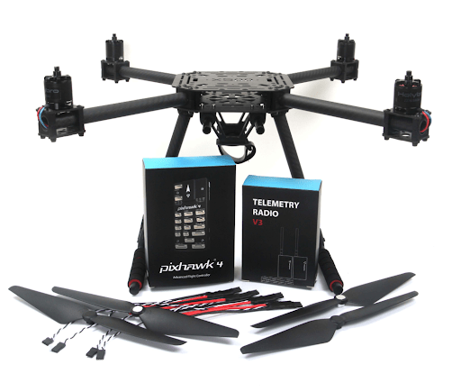

## Специфікація матеріалів

The Holybro [X500 Kit](https://holybro.com/products/px4-development-kit-x500-v2) includes almost all the required components:

- [Pixhawk 4 autopilot](../flight_controller/pixhawk4.md)
- [Holybro M8N GPS](https://holybro.com/collections/gps/products/m8n-gps)
- [Power Management - PM07](../power_module/holybro_pm07_pixhawk4_power_module.md)
- Holybro Motors - 2216 KV880 x4 (superseded - check [spare parts list](https://holybro.com/products/spare-parts-x500-v2-kit) for current version).
- Holybro BLHeli S ESC 20A x4 (superseded - check [spare parts list](https://holybro.com/products/spare-parts-x500-v2-kit) for current version).
- Propellers - 1045 x4 (superseded - check [spare parts list](https://holybro.com/products/spare-parts-x500-v2-kit) for current version).
- Ремінь для акумулятора
- Живлення та радіокабелі
- Колісна база - 500 мм
- Розміри - 410x410x300 мм
- 433 MHz / 915 MHz [Holybro Telemetry Radio](../telemetry/holybro_sik_radio.md)

Additionally you will need a battery and receiver ([compatible radio system](../getting_started/rc_transmitter_receiver.md)) if you want to control the drone manually.

## Головне апаратне забезпечення

У цьому розділі перераховано все обладнання для встановлення рами та автопілота.

| Елемент                                         | Опис                                                                                                        | Кількість |
| ----------------------------------------------- | ----------------------------------------------------------------------------------------------------------- | --------- |
| Нижня пластина                                  | Вуглецеве волокно (товщиною 2 мм)                                                        | 1         |
| Верхня пластина                                 | Вуглецеве волокно (товщиною 1.5мм)                                       | 1         |
| Кронштейн                                       | Вуглепластикова трубка (діаметр: 16 мм, довжина: 200 мм) | 4         |
| Шасі - Вертикальна стійка                       | Вуглепластикова трубка + інженерний пластик                                                                 | 2         |
| Шасі - Поперечна балка                          | Вуглепластикова трубка + інженерний пластик + пінопласт                                                     | 2         |
| Моторна база                                    | Складається з 6 частин і 4 гвинтів 4 гайок                                                                  | 4         |
| Бокова панель                                   | Діаметр: 10мм довжина: 250мм                                                | 2         |
| Плата кріплення акумулятора                     | Товщина: 2мм                                                                                | 1         |
| Підставка для батареї                           | Чорний лист силікону товщиною 3 мм                                                                          | 1         |
| Плата платформи                                 | Товщина: 2мм                                                                                | 1         |
| Hanger & rubber ring gasket | Діаметр внутрішнього отвору: 10 мм чорний                                                   | 8         |

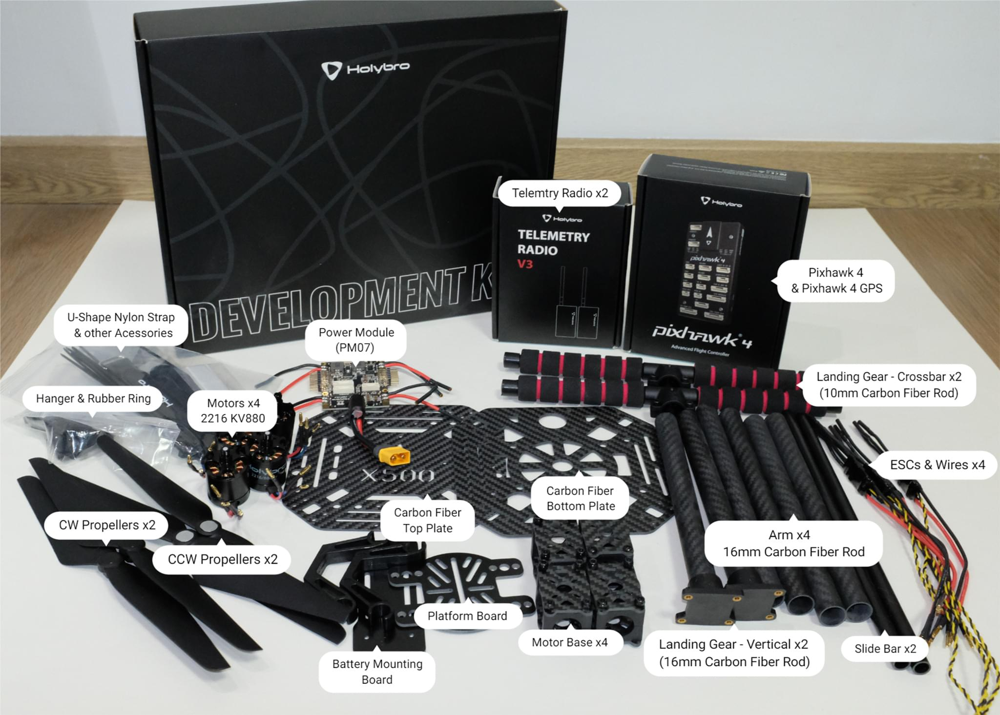

### Електроніка

| Опис предмету                                                                                | Кількість |
| -------------------------------------------------------------------------------------------- | --------- |
| Pixhawk4 & Assorted Cables                                               | 1         |
| Pixhawk4 GPS Module                                                                          | 1         |
| Управління живленням PM07 (з попередньо припаяними кабелями живлення ESC) | 1         |
| Двигуни 2216 KV880 (оновлення V2)                                         | 4         |
| Holybro BLHeli S ESC 20A x4                                                                  | 1         |
| 433 MHz / 915 MHz [Holybro Telemetry Radio](../telemetry/holybro_sik_radio.md)               | 1         |

### Необхідні інструменти

У цій збірці використовуються наступні інструменти:

- Викрутка з шестигранником 1,5 мм
- Викрутка з шестигранником 2,0 мм
- Викрутка з шестигранником 2,5 мм
- Шуруповерт Phillips 3 мм
- Торцевий ключ 5,5 мм або невелика викрутка
- Кусачки
- Прецизійний пінцет

## Збірка

Час збірки (приблизно): 3.75 години (180 хвилин на раму, 45 хвилин на встановлення/налаштування автопілота)

1. Почніть зі збирання шасі.
  Відкрутіть гвинти шасі і вставте вертикальну стійку (зобр. 1 і 2).

  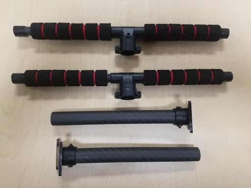

  _Figure 2_: Landing gear components

  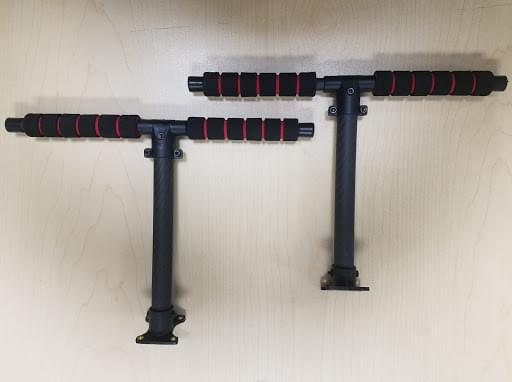

  _Figure 2_: Landing gear assembled

2. Потім просуньте 4 кронштейни через 4 основи двигуна, як показано на малюнку 3.
  Переконайтеся, що штанги злегка виступають з основи і є однаковими на всіх 4-х плечах, а також переконайтеся, що дроти електродвигуна спрямовані назовні.

  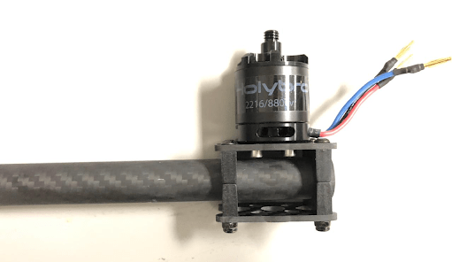

  _Figure 3_: Attach arms to motor bases

3. Вставте 4 нейлонові гвинти та нейлонові стійки і прикріпіть модуль живлення PM07 до нижньої панелі за допомогою 4 нейлонових гайок, як показано на зображенні 4.

  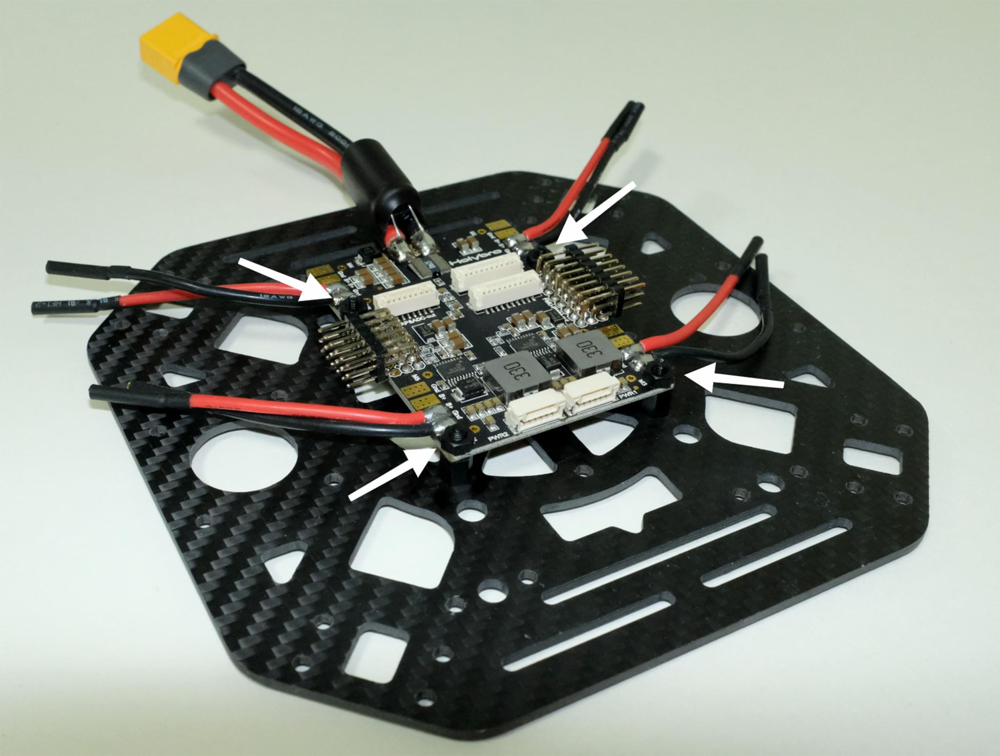

  _Figure 4_: Attach power module

4. Протягніть 4 двигуни ESC через кожне з кронштейнів і підключіть трижильні дроти до двигунів, як показано на зображенні 5.

  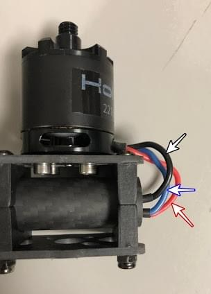

  _Figure 5_: Connect motors

5. Connect the ESCs power wires onto the power module PM07, black->black and red->red, ESC PWM signal wires goes to "FMU-PWM-Out".
  Переконайтеся, що ви підключили дроти ШІМ ESC двигуна в правильному порядку.
  Номер двигуна повітряного корпусу дивіться на зображенні 7 і підключіть його до відповідного номера на платі PM07.

  
  _Figure 7_: ESC power module and signal wiring

  Колір на верхній частині двигуна вказує на напрямок обертання (зображення 7-1), чорний кінчик - за годинниковою стрілкою, а білий - проти годинникової стрілки.
  Переконайтеся, що при виборі напрямку двигуна ви дотримуєтесь орієнтира px4 quadrotor x airframe (зображення 7-2).

  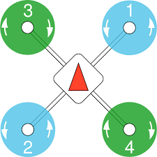

  _Figure 7_: Motor order/direction diagram

  

  _Figure 7-1_: Motor direction

6. Підключіть 10-контактні кабелі до FMU-PWM-in, а 6-контактні - до PWR1 на модулі живлення PM07.

  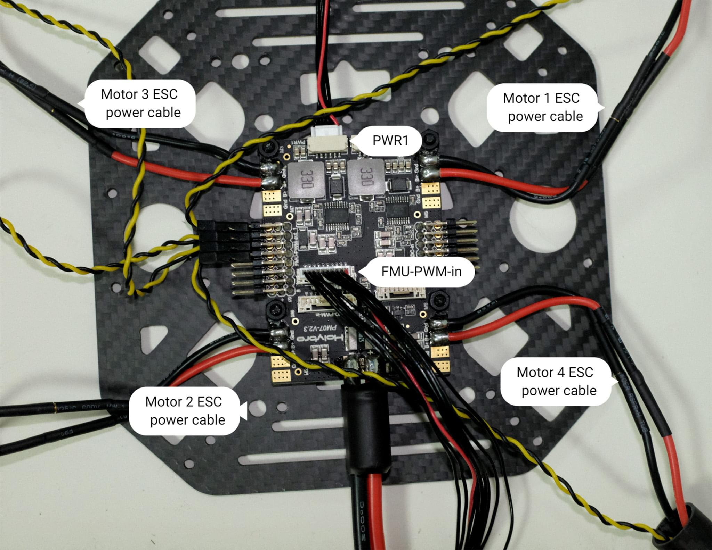

  _Figure 8_: Power module PWM and power wiring

7. Якщо ви хочете встановити GPS на верхній панелі, то тепер ви можете закріпити кріплення GPS на верхній панелі за допомогою 4 гвинтів і гайок.

  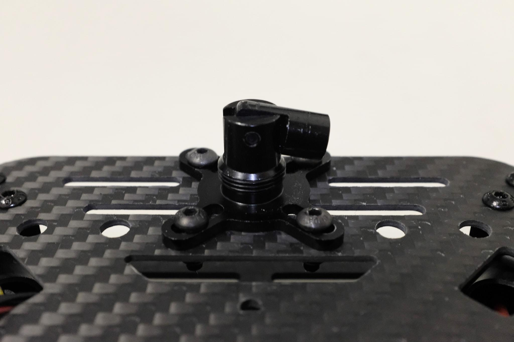

  _Figure 9_: Secure GPS mount onto top plate

8. Протягніть кабелі PM07 через верхню пластину.
  З'єднайте верхню і нижню пластини за допомогою 4 U-подібних нейлонових ременів, гвинтів і гайок з кожного боку, переконайтеся, що кабелі ESC двигуна знаходяться всередині U-подібних нейлонових ременів, як показано на зображенні 10, гайки не затягуйте.

  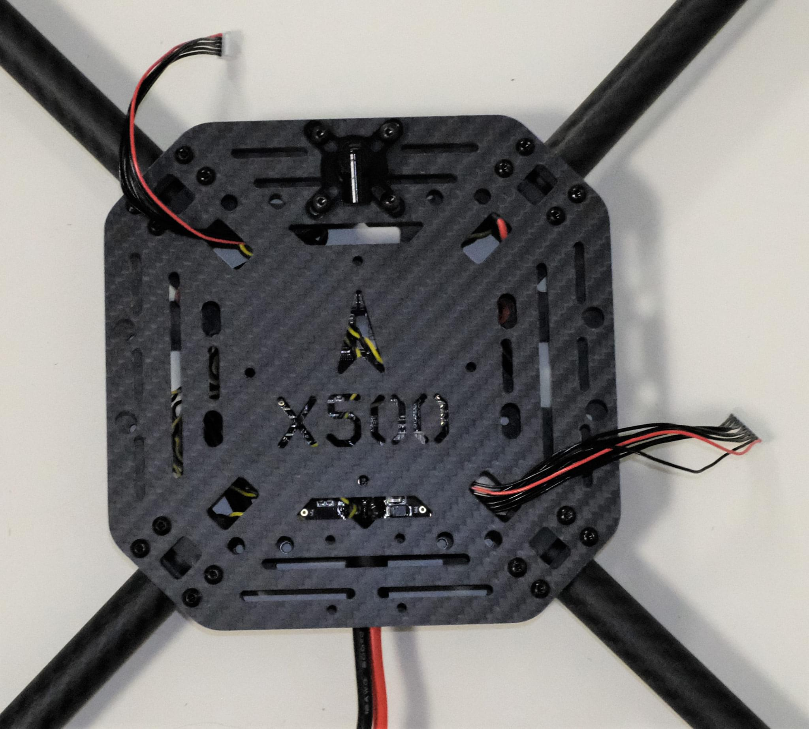

  _Figure 10-1_: Feed power module cables through top plate

  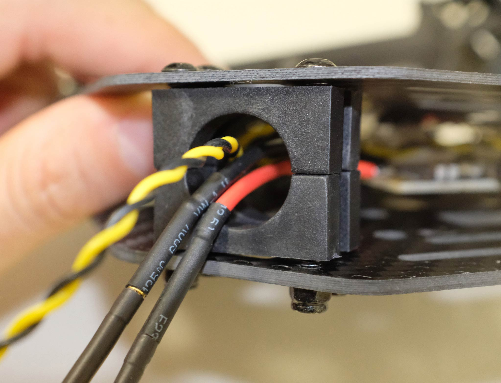

  _Figure 10-2_: Connecting top and bottom plate

9. Трохи всуньте трубки кронштейнів у раму і переконайтеся, що величина виступу (червоний квадрат на зображенні 11) є однаковою на всіх 4-х кронштейнах.
  Переконайтеся, що всі двигуни спрямовані прямо вгору, а потім затягніть усі гайки та гвинти.

  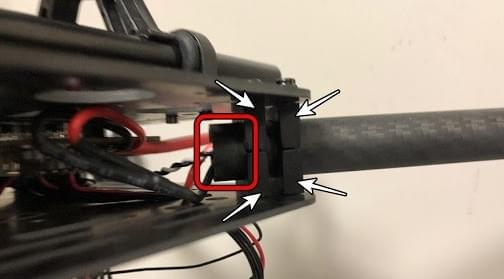

10. Вставте прокладки для підвісів у 4 підвіси та закріпіть їх на нижній пластині за допомогою 8 шестигранних гвинтів (Зображення 11).
  Отвори для гвинтів позначені білою стрілкою на зображенні 12.
  Ми рекомендуємо нахилити дрон убік, щоб полегшити встановлення.

  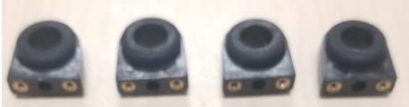

  _Figure 11_: Hanger gaskets

  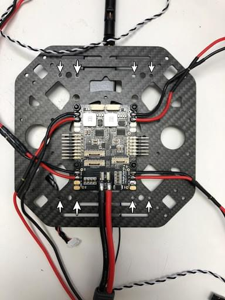

  _Figure 12_: Screw holes

11. Вставте направляючі планки на кільця кріплення (зображення 13).
  Зберіть кріплення для батареї та плату платформи і встановіть їх на направляючі, як показано на зображенні 14.

  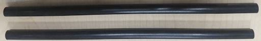

  _Figure 13_: Slide bars

  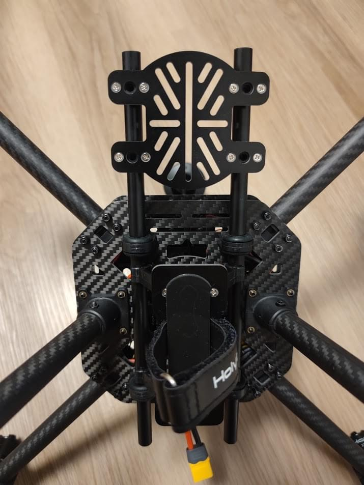

  _Figure 14_: Battery mount on slide bars

12. Встановіть шасі на нижню пластину.
  Ми рекомендуємо нахилити дрон убік, щоб полегшити встановлення.

  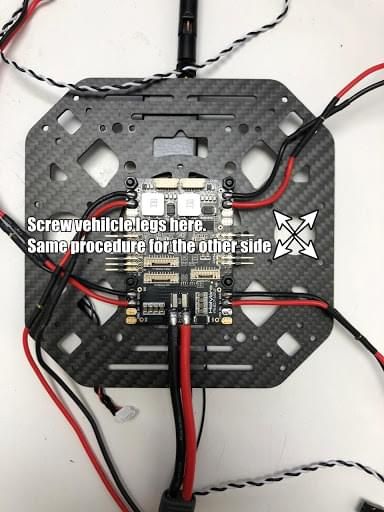

  _Figure 15_: Landing Gear

13. За допомогою скотча приклейте GPS до верхньої частини GPS-щогли і встановіть її на щоглу.
  Переконайтеся, що стрілка на gps вказує вперед (зображення 16).

  

  _Figure 16_: GPS and mast

14. Встановіть телеметричну радіостанцію на верхню пластину.
  Plug the telemetry cable into `TELEM1` port and GPS module to `GPS MODULE` port on the flight controller.
  Plug the cable from PM07 `FMU-PWM-in` to `I/O-PWM-out`on the FC and PM07 `PWR1` to `POWER1` on the FC, as shown in Figure 17.

  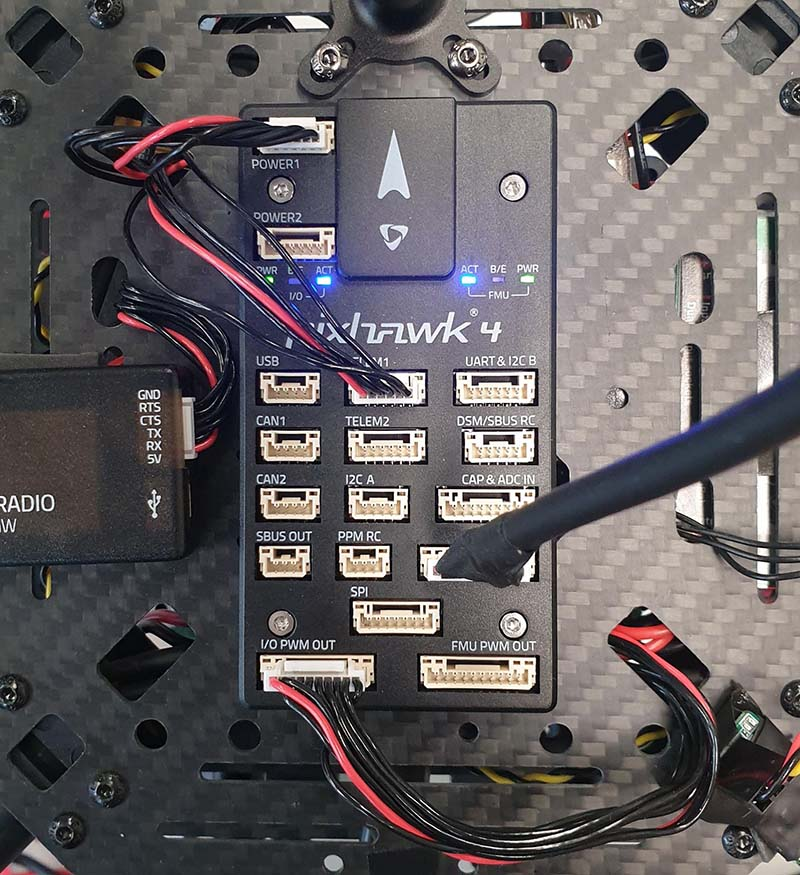

  _Figure 17_: Mount telemetry radio/plug in PWM and Power cables to Flight controller.

Please refer to [Pixhawk 4 Quick Start](../assembly/quick_start_pixhawk4.md) for more information.

Ось і все.
Повністю зібраний комплект показаний нижче:

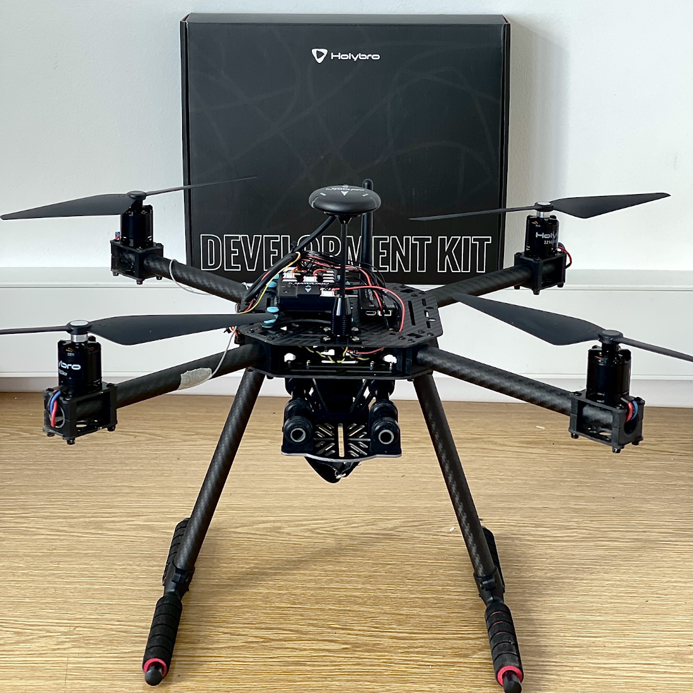

## Конфігурація PX4

:::tip
Full instructions for installing and configuring PX4 can be found in [Basic Configuration](../config/index.md).
:::

_QGroundControl_ is used to install the PX4 autopilot and configure/tune it for the X500 frame.
[Download and install](http://qgroundcontrol.com/downloads/) _QGroundControl_ for your platform.

Спочатку оновіть прошивку, конструкцію та відображення актуаторів:

- [Firmware](../config/firmware.md)

- [Airframe](../config/airframe.md)

  You will need to select the _Holybro S500_ airframe (**Quadrotor x > Holybro S500**).

  

- [Actuators](../config/actuators.md)
  - Вам не потрібно оновлювати геометрію транспортного засобу (оскільки це попередньо налаштована конструкція повітряного каркасу).
  - Призначте функції приводу до актуаторів, щоб відповідати вашому підключенню.
  - Перевірте конфігурацію, використовуючи слайдери.

Потім виконайте обов'язкове налаштування / калібрування:

- [Sensor Orientation](../config/flight_controller_orientation.md)
- [Компас](../config/compass.md)
- [Акселерометр](../config/accelerometer.md)
- [Level Horizon Calibration](../config/level_horizon_calibration.md)
- [Radio Setup](../config/radio.md)
- [Flight Modes](../config/flight_mode.md)

В ідеалі ви також повинні зробити:

- [ESC Calibration](../advanced_config/esc_calibration.md)
- [Battery Estimation Tuning](../config/battery.md)
- [Safety](../config/safety.md)

## Вдосконалення

Airframe selection sets _default_ autopilot parameters for the frame.
Ці вистачають для польоту, але це добра ідея налаштувати параметри для конкретної конструкції рами.

For instructions on how, start from [Autotune](../config/autotune_mc.md).

## Подяки

Цей журнал збірки був наданий Командою тестового польоту Dronecode.
