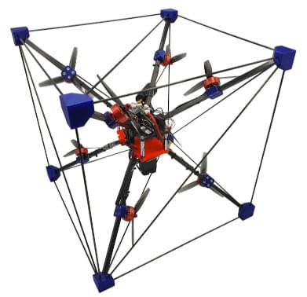
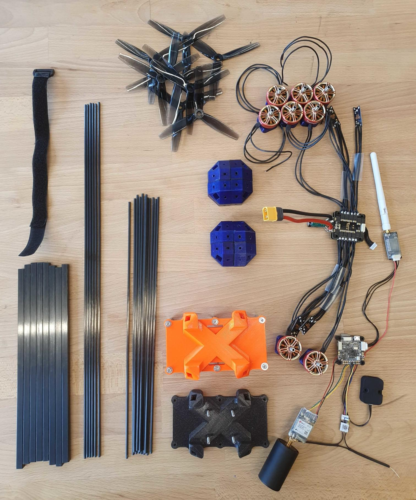
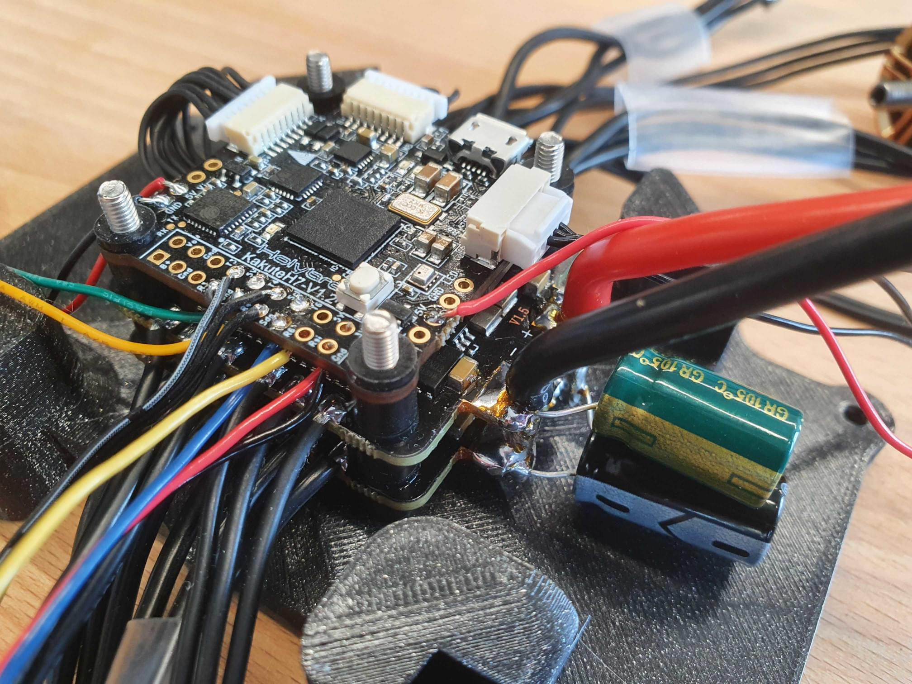
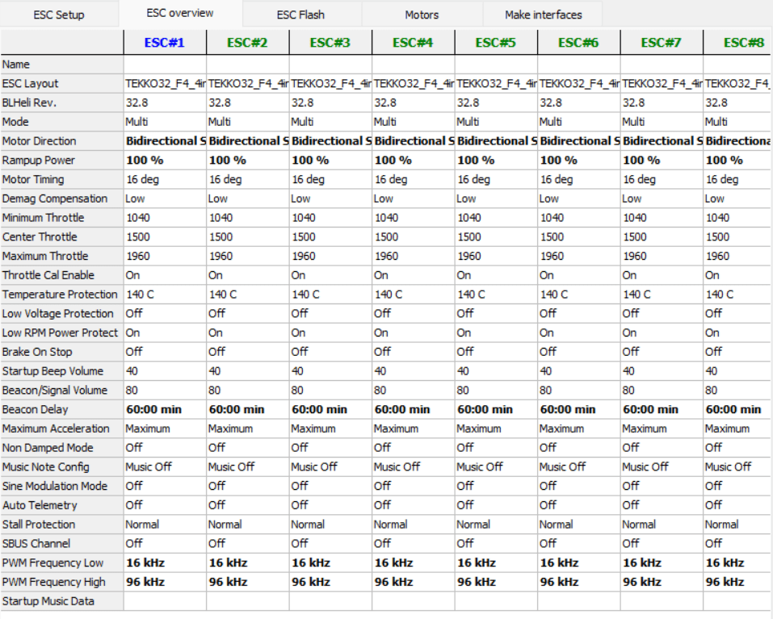

# Омнікоптер

Омнікоптер - це мультикоптер, який може забезпечити тягу в усіх напрямках (6 ступенів свободи).
Це дозволяє йому рухатися в будь-якому напрямку без нахилу, і він може зависати під довільним кутом нахилу.
Все це досягається шляхом розташування позицій двигуна і вісі тяги у певних способах:



This build follows the original design from [Brescianini, Dario, and Raffaello D'Andrea](https://www.youtube.com/watch?v=sIi80LMLJSY).

## Специфікація матеріалів

Компоненти, необхідні для цієї збірки, є:

- Електроніка:
  - Flight controller: [Holybro KakuteH7](../flight_controller/kakuteh7.md)
  - Coupled with 2x [Tekko32 F4 4in1 ESCs](https://holybro.com/products/tekko32-f4-4in1-50a-esc)
    ::: info
    You can select your own flight controller of choice, it just needs to support 8 DShot outputs.

:::
  - GPS: [ZED-F9P](https://www.gnss.store/gnss-gps-modules/105-ublox-zed-f9p-rtk-gnss-receiver-board-with-sma-base-or-rover.html?search_query=ZED-F9P&results=11)
  - [GPS helix antenna](https://www.gnss.store/rf-gps-antennas/28-high-performance-multi-band-gnss-active-quad-helix-antenna-for-rtk.html)
    ::: info
    Any other GPS may work as well, however a helix antenna is expected to perform better for inverted flights.

:::
  - Будь-який RC приймач
  - Зовнішній магнітометр. We used the [RM-3100](https://store-drotek.com/893-professional-grade-magnetometer-rm3100.html).
  - Telemetry link, e.g. [WiFi](../telemetry/telemetry_wifi.md)
- Пропульсія:
  - Motors: 8x [BrotherHobby LPD 2306.5 2000KV/2450KV/2650KV](https://www.getfpv.com/brotherhobby-lpd-2306-5-2000kv-2450kv-2650kv-motor.html)
  - 3D Propellers: 2x [HQProp 3D 5X3.5X3 3-Blade Propeller (Set of 4)](https://www.getfpv.com/hqprop-3d-5x3-5x3-3-blade-propeller-set-of-4.html) or 2x [Gemfan 513D 3-Blade 3D Propeller (Set of 4)](https://www.getfpv.com/gemfan-513d-durable-3-blade-propeller-set-of-4.html)
  - Акумулятор: ми використовували LiPo на 6S 3300mAh. Обов'язково перевірте розміри, щоб він підійшов до рами.
  - Ремінь для акумулятора
- Рама:
  - Carbon square tube R 8mm X 7mm X 1000mm, e.g. [here](https://shop.swiss-composite.ch/pi/Halbfabrikate/Rohre/Vierkant-Rohre/CFK-Vierkantrohr-8x8-7x7mm.html)
  - Carbon Rods R 3mm X 2mm X 1000mm, e.g. [here](https://shop.swiss-composite.ch/pi/Halbfabrikate/Rohre/CFK-Rohre-pultrudiert-pullwinding/Carbon-Microtubes-100cm-x-20-3mm.html)
  - Необхідні довжини:
    - квадратна трубка: 8 штук довжиною 248 мм
    - стрижні: 12x328мм, 6x465мм
  - Гвинти:
    - Двигуни та стійки: 40x M3x12мм
    - FC кріплення: 4x M3x35mm, 4x M3 гайки
  - Опори: 4x 40мм
- [3D model](https://cad.onshape.com/documents/eaff30985f1298dc6ce8ce13/w/2f662e604240c4082682e5e3/e/ad2b2245b73393cf369132f7)



## Збірка

### Frame

- Print the 3D parts
  ::: info
  The orientation of the corner pieces matters.
  Ви помітите, якщо це неправильно, коли кути важеля не вірні.

:::
- Відріжте важелі
- Перевірте, що все працює, з'єднуючи частини рамки разом:

  
- Розмістіть двигуни якомога далі від центру, без торкання гвинтів до важелів.

### Електроніка

Пропаяйте периферійні пристрої до керуючого контролера. Ми використовували наступні завдання:

- Регулятори швидкості: 2 регулятори швидкості можуть бути підключені безпосередньо до двох роз'ємів KakuteH7.
  Щоб уникнути конфліктів, ми видалили контакт живлення (праворуч) з одного з'єднувачів.
- Телеметрія до UART1
- GPS до UART4
- RC to UART6
  

Зауваження:

- Переконайтеся, що магнітометр розташований подалі від джерел живлення.
  Ми закінчили тим, що розмістили його внизу центрального елементу з пінопластом товщиною 4 см.
- Put some tape on the barometer (without taping the opening!) to avoid any influence from light.
- Ми не склеїли рамку.
  Це безумовно рекомендується зробити після початкових випробувань, але воно може працювати без цього.

## Конфігурація програмного забезпечення

### ESC

Спочатку налаштуйте ESC на режим 3D (бідирекційний).
Ми мали проблеми з налаштуваннями запасних ESC в режимі 3D: коли спробували змінити напрямок, мотор іноді більше не запускався, поки ESC не був перезавантажений.
Так що нам довелося змінити налаштування ESC.

Для цього ви можете використовувати Betaflight на контролері польоту, а потім використовувати режим пропуску і набір BL Heli (переконайтеся, що в Betaflight налаштовано повітряну раму з 8 моторами).
Це налаштування:



Зокрема:

- set the Motor Direction to **Bidirectional Soft**
- increase the Rampup Power to **100%** (this is conservative and might reduce efficiency)

:::info
Make sure the motors do not overheat with the changed settings.
:::

### PX4

- Виберіть загальний корпус багатокоптерного повітряного каркасу
- Use an [arming switch](../advanced_config/prearm_arm_disarm.md#arming-button-switch), do not use stick arming
- [Select DShot](../config/actuators.md) as output protocol on all eight outputs
- Configure the motors according to this:
  
  We used the following convention: the motors are facing the direction of where the axis points to.
  Напрям обертання відповідає напряму позитивного тяги (переміщення слайдера двигуна вгору).
  Переконайтеся, що використовуєте правильні пропси, оскільки є версія CCW та CW.
- Параметри:
  - Change the desaturation logic for better attitude tracking: set [CA_METHOD](../advanced_config/parameter_reference.md#CA_METHOD) to 0.
  - Disable failure detection: set [FD_FAIL_P](../advanced_config/parameter_reference.md#FD_FAIL_P) and [FD_FAIL_R](../advanced_config/parameter_reference.md#FD_FAIL_R) to 0.
- [This file](https://github.com/PX4/PX4-user_guide/raw/main/assets/airframes/multicopter/omnicopter/omnicopter.params) contains all the relevant parameters.

## Відео

<lite-youtube videoid="nsPkQYugfzs" title="PX4 Based Omnicopter Using the New Dynamic Control Allocation in v1.13"/>

## Симуляція

Є мішень імітації омнікоптера в Gazebo Classic:

```sh
make px4_sitl gazebo-classic_omnicopter
```


## Зауваження

Деякі загальні зауваження:

- Швидкість реакції газу становить близько 30%.
- Час польоту становить близько 4-5 хвилин. Можливо, це можна трохи покращити, використовуючи більші пропелери.
