# Lumenier QAV-R 5" Racer (Pixracer)

Lumenier QAV-R 5" FPV Гоночний квадрокоптер - це жорсткий, легкий та швидкий гоночний квадрокоптер FPV з від'ємними руками.
This topic provides full build and configuration instructions for using the frame with the _Pixracer_ flight controller and _KISS 24A Race Edition_ ESCs.
Також надає інформацію про (необов'язкове) налаштування FPV.

Основна Інформація:

- **Frame:** [Lumenier QAV-R 5"](http://www.getfpv.com/qav-r-fpv-racing-quadcopter-5.html)
- **Flight controller:** [Pixracer](../flight_controller/pixracer.md)

<lite-youtube videoid="wMYgqvsNEwQ" title="QAV-R 5 PX4 FPV Racequad"/>

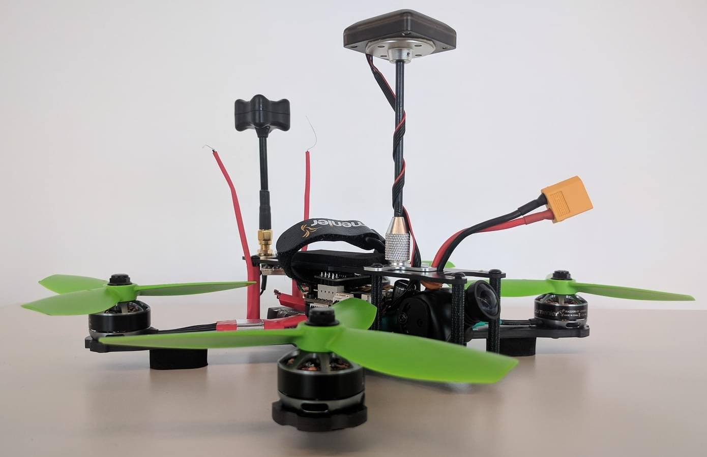
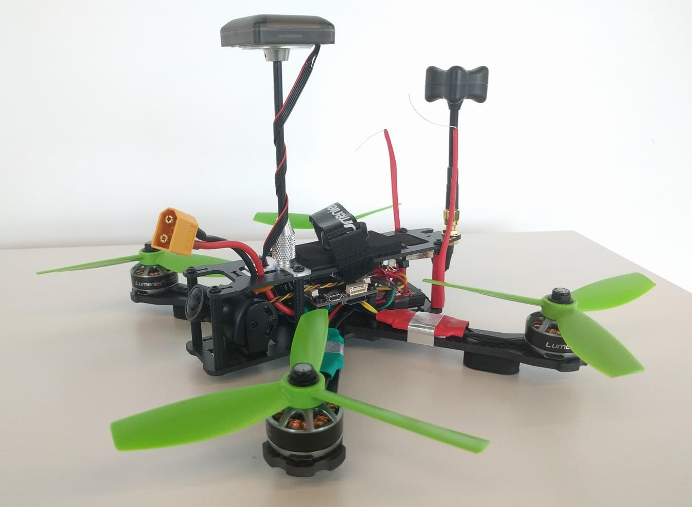

## Список деталей

### Транспортний засіб (потрібний для польоту)

- Autopilot: [Pixracer](../flight_controller/pixracer.md) from [AUAV](https://store.mrobotics.io/mRo-PixRacer-R14-Official-p/auav-pxrcr-r14-mr.htm) including ESP8266  WiFi- and [ACSP5](https://store.mrobotics.io/product-p/auav-acsp5-mr.htm)  power-module
- Frame:  [Lumenier QAV-R 5"](http://www.getfpv.com/qav-r-fpv-racing-quadcopter-5.html)
- Motors:  [Lumenier RX2206-11 2350KV](http://www.getfpv.com/lumenier-rx2206-11-2350kv-motor.html)
- ESCs:  [KISS 24A Race Edition](http://www.getfpv.com/kiss-24a-esc-race-edition-32bit-brushless-motor-ctrl.html)
- Props: HQProp 5x4.5x3 [CW](http://www.getfpv.com/hqprop-5x4-5x3rg-cw-propeller-3-blade-2-pack-green-nylon-glass-fiber.html) [CCW](http://www.getfpv.com/hqprop-5x4-5x3g-ccw-propeller-3-blade-2-pack-green-nylon-glass-fiber.html)
- GPS / Ext. Mag.: M8N taken from a [Pixhawk Mini (Discontinued)](../flight_controller/pixhawk_mini.md) set and rewired
- Battery: [TATTU 1800mAh 4s 75c Lipo](http://www.getfpv.com/tattu-1800mah-4s-75c-lipo-battery.html)
- RC Receiver: [FrSky X4R-SB](http://www.getfpv.com/frsky-x4r-sb-3-16-channel-receiver-w-sbus.html)
- RC Transmitter: [FrSky Taranis](http://www.getfpv.com/frsky-taranis-x9d-plus-2-4ghz-accst-radio-w-soft-case-mode-2.html)
- FC dampening: [O-Rings](http://www.getfpv.com/multipurpose-o-ring-set-of-8.html)
- GPS Mount: [GPS mast](http://www.getfpv.com/folding-aluminum-gps-mast-for-dji.html)

### FPV (необов'язково)

- Camera: [RunCam Swift RR Edition](https://www.getfpv.com/runcam-swift-rotor-riot-special-edition-ir-block-black.html) **includes must-have high quality wide angle lens from GoPro!**
- Video Tx: [ImmersionRC Tramp HV 5.8GHz 600mW](https://www.getfpv.com/immersionrc-tramp-hv-5-8ghz-video-tx-us-version.html) (Discontinued).
- Video Antennas: [TBS Triumph 5.8GHz CP](http://www.getfpv.com/fpv/antennas/tbs-triumph-5-8ghz-cp-fpv-antenna-3275.html) (SMA port fits ImmercionRC Tx)
- FPV voltage source plug: [Male JST Battery Pigtail](http://www.getfpv.com/male-jst-battery-pigtail-10cm-10pcs-bag.html)

:::info
These parts cover the sending side for standard FPV 5.8GHz analog FM video. Для перегляду відеопотоку в реальному часі вам потрібен сумісний приймач і пристрій відображення.
:::

## Збирання базової рами

Я зібрав основну центральну плату та руки, як показано у цьому відео між 09:25 та 13:26:

<lite-youtube videoid="7SIpJccXZjM" title="How to Build a Lumenier QAV-R"/>

Я закріпив чотири двигуни на рамі з кабелями, що виходять у напрямку центру рами.
Я використав два з довших від винтів для мотора, які йдуть разом з рамою, для кожного мотора і вставив їх у дві отвори, які знаходяться далі один від одного.

## Побудова силової передачі

Регулятори швидкості KISS відомі своєю високою продуктивністю, але вони також мають два недоліки:

- Використовуване програмне забезпечення не є відкритим джерелом (на відміну від BLHeli)
- Немає апаратного пакету з попередньо припаяними дротами та/або вилками (наскільки мені відомо)

Це означає, що нам потрібно злити принаймні 6 з'єднань на кожному ESC, але це все ще повністю варте цього.

:::tip
Always tin both sides you want to connect with solder before actually soldering them together.
Це зробить його набагато простіше, і ймовірність холодних припояних швів буде меншою.
:::

:::tip
Make sure that you use an appropriate cable gauge for the power connections that transport the high current all the way from the battery to the motors.
Всі сигнальні кабелі можуть бути дуже тонкими у порівнянні.
:::

:::tip
Put heat shrink on the cables before you start soldering!
Після успішного функціонального тесту термоусадження регуляторів швидкості, модуля живлення та вільно плаваючих незізольованих припоєних з'єднань захистить їх від бруду, вологи та фізичних пошкоджень.
:::

### Двигуни

Спочатку я відрізав всі три кабелі двигуна, щоб вони безпосередньо відповідали, коли регулятори швидкості монтуються на руки, зсунуті до центру, але все ще залишають достатньо вільного місця для легкого розміщення деталей і не створюють жодного напруження на кабелях.
Потім я їх паяв у порядку, у якому вони виходять з мотора, на вихідні контакти регуляторів швидкості, які орієнтовані так, щоб перемикаючі MOS-FET-перетворювачі були спрямовані вгору для забезпечення хорошого охолодження повітрям під час польоту.
Choosing this cable order resulted in all the motors spinning counter-clockwise in my tests and I switched where necessary the direction of rotation by bridging the dedicated [JP1 solder jumper](https://1.bp.blogspot.com/-JZoWC1LjLis/VtMP6XdU9AI/AAAAAAAAAiU/4dygNp0hpwc/s640/KISS-ESC-2-5S-24A-race-edition-32bit-brushless-motor-ctrl.jpg) to conform the [Quadrotor x configuration](../airframes/airframe_reference.md#quadrotor-x).

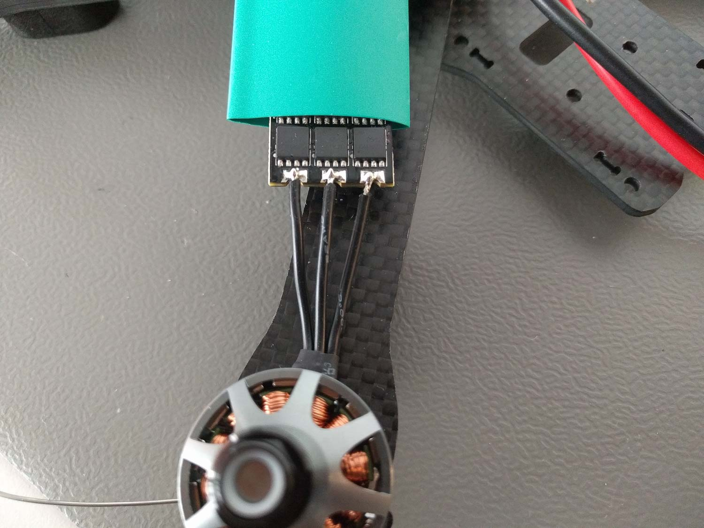

### Модуль живлення

First I soldered the XT60 connector which comes with the frame to the labeled battery side of the _ACSP5 power module_ that was shipped with the Pixracer and added the elco capacitor delivered with the power module with the correct polarity to the same side.

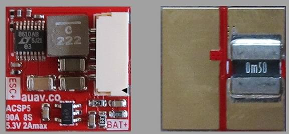

Тепер настає складна частина. Я зварив всі чотири порти напруги ESC + та - до відповідного патча на позначеному боці виходу ESC модуля живлення.
Переконайтеся, що тут немає жодного холодного припою, оскільки квадрокоптер не завершиться добре з вільним з'єднанням у польоті.
Використання додаткової плати розподілу потужності рами зробило би роботу набагато простіше, але також займає занадто багато місця на такій маленькій рамі...

:::tip
If you are also including the FPV parts don't forget to also solder your JST male power plug to the output side of the power module.
You'll need it for your [FPV setup](#fpv-setup) later on.
:::

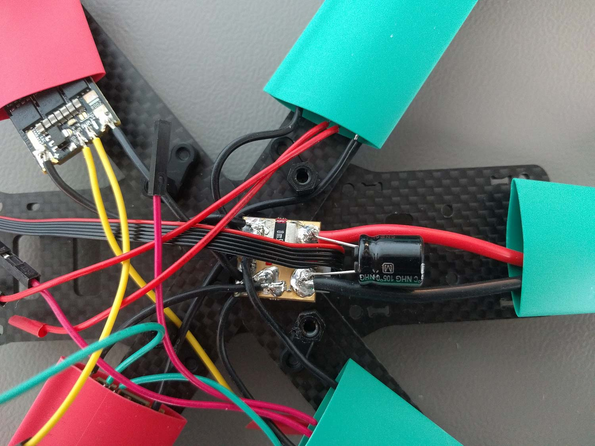

### Сигнальні кабелі

Я використовував тонкі кабелі зі стандартизованим роз'ємом заголовка шпильки, які були вирізані навпіл для сигналу ESC, оскільки це дозволить легко вставити їх на контакти Pixracer пізніше.
Only the labeled `PWM` port on the [KISS ESCs](https://1.bp.blogspot.com/-0huvLXoOygM/VtMNAOGkE5I/AAAAAAAAAiA/eNNuuySFeRY/s640/KISS-ESC-2-5S-24A-race-edition-32bit-brushless-motor-ctrl.jpg) is necessary for flying.
Вони будуть підключені до правильного вихідного сигналу двигуна pixracer.
The `TLM` port is for ESC telemetry and I soldered them on for future use as the needed protocol is not currently supported by PX4.

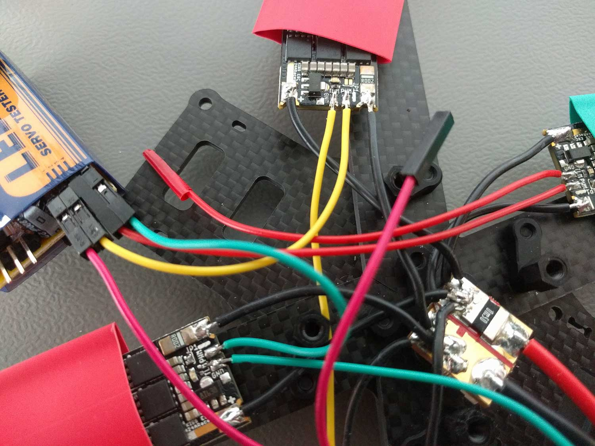

Я протестував всі пари моторів ESC та їх напрямки обертання за допомогою дешевого тестера PWM серво до продовження.

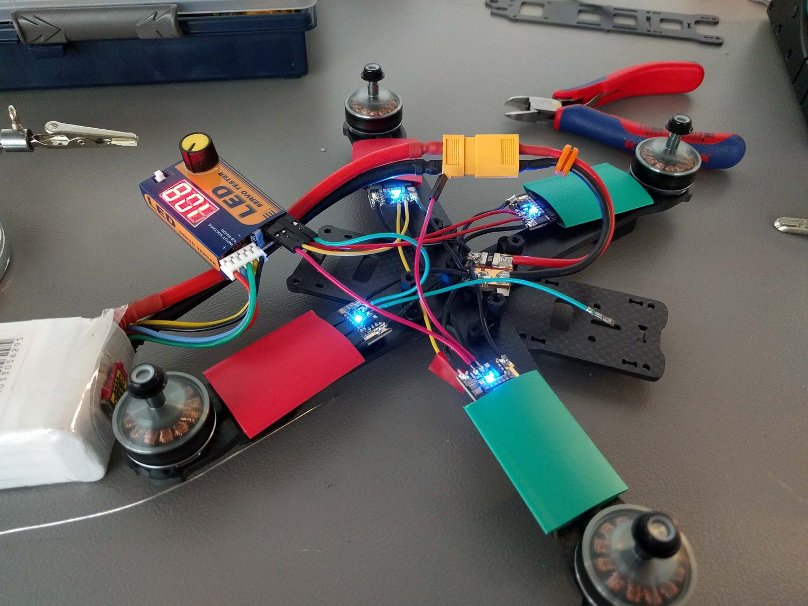

## Connecting & Mounting Electronics

:::tip
Double check the pin assignment of every component you connect.
На жаль, не кожен апаратний компонент там є підключенням і грою, навіть якщо на перший погляд може здатися, що це так.
:::

You'll need the [hardware documentation of the Pixracer](../flight_controller/pixracer.md) for this step to find all needed connectors.
Я намагався прокласти всі кабелі під дошкою Pixracer, щоб мати чисту конструкцію та заощадити місце для камери FPV та передавача у майбутньому.

I mounted the Pixracer using the nylon spacers and screws that get shipped with the QAV-R frame but **put some small O-rings** between the board and the spacers to add a bit of vibration dampening.
Make sure to **not tighten the screws too much or little**, do it such that the board clearly touches both sides but is not clamped with any tension.
Дошка не повинна ніяк висіти, але трохи рухатися, якщо ви натиснете на неї пальцями.

:::warning
This can heavily influence the vibration noise level your gyroscope and accelerometer sensors measure during flight.
:::

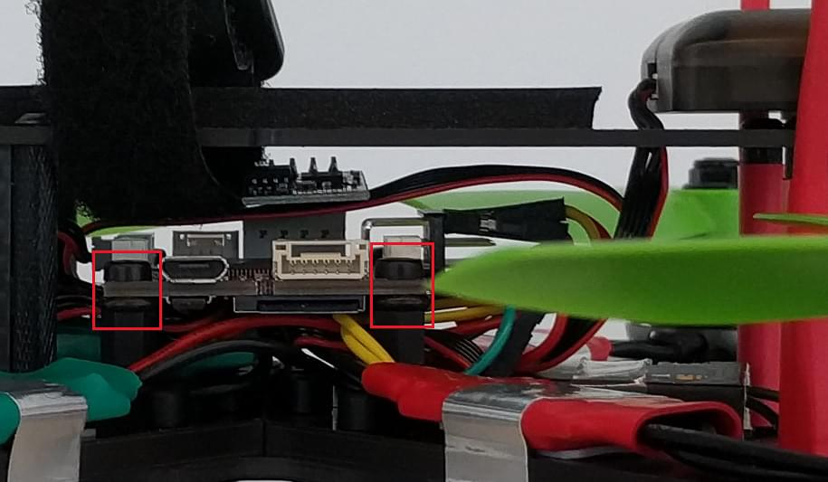

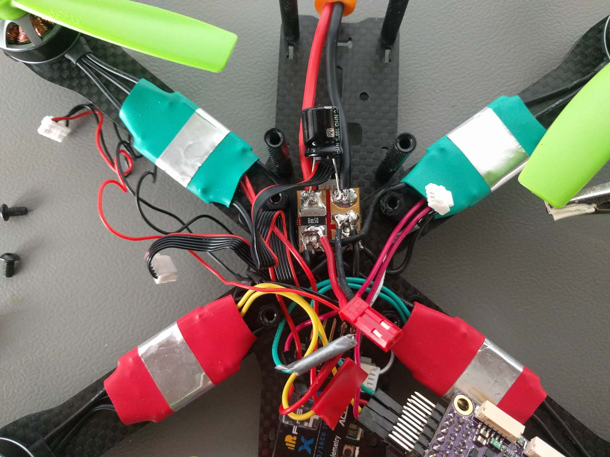
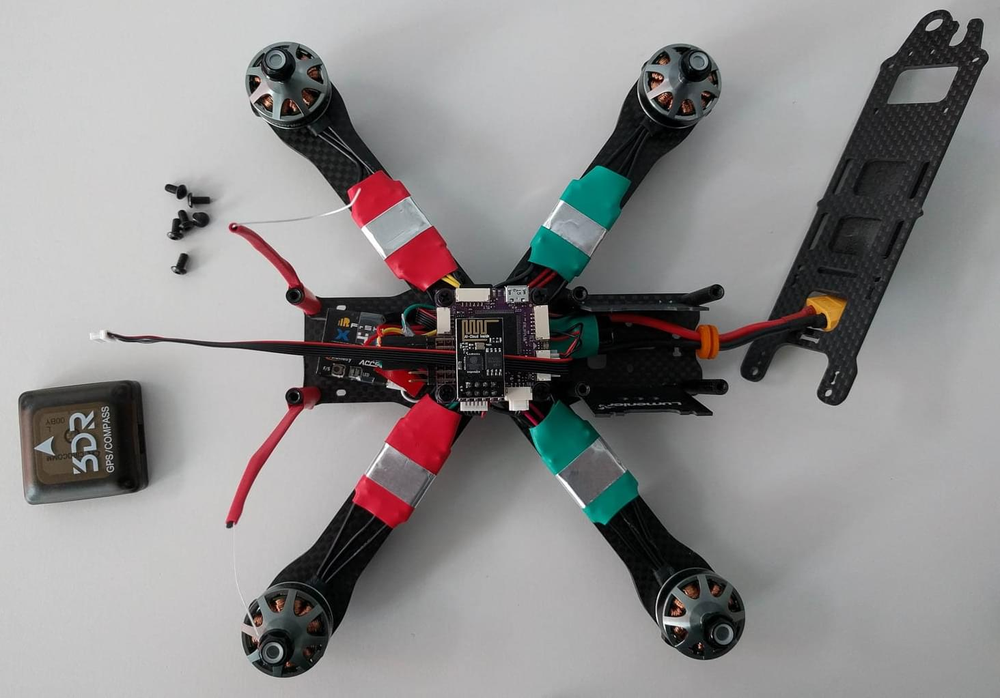

### Приймач радіокерування

Я підключив приймач FrSky S-BUS за допомогою кабелю, відправленого з Pixracer, але відгалуження з непотрібним кабелем відрізав.

Для розумного порту телеметрії я використав кабель, який поставляється з приймачем.
Я видалив усі непотрібні шпильки з роз'єму за допомогою пінцета і перемкнув білий вільний кінець кабелю на правильну шпильку роз'єму, щоб мати підключений сигнал "розумний".
Потім я припаяв вільний кінець до кабельного вводу порту FrSky, дотримуючись цієї схеми:

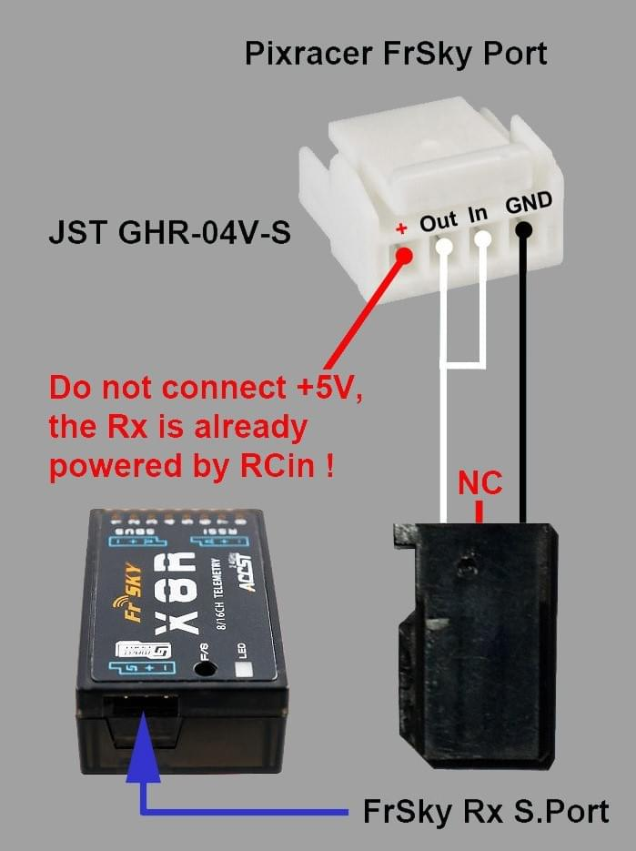

Я також пропустив земельний (GND) контакт, оскільки, подібно до позитивного контакту живлення напруги, він вже підключений через кабель RCin S-BUS.

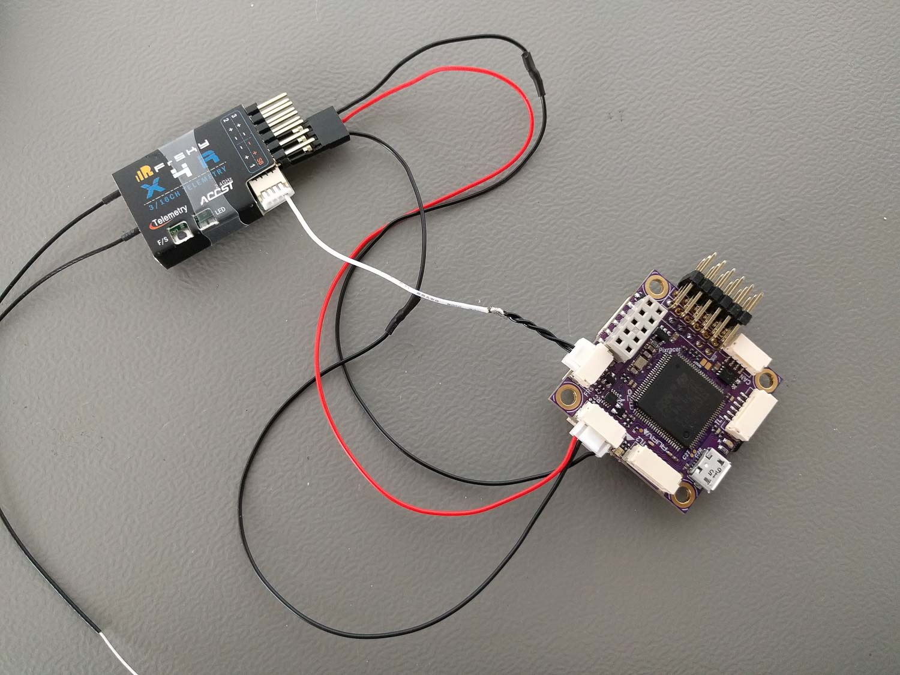

### Кріплення антени RC

Щоб мати хороше з'єднання RC, не ризикуючи мати антену в гвинтах, я використовував метод міцного кріплення за допомогою термоусадки та затяжок.

Для цього методу ви відрізаєте великий кінець з отвором від застібки-ґудзика, складаєте решту разом з антенним кабелем через довгий термоусадку та монтуєте це на ваших рамних просторах, використовуючи більшу, але коротшу термоусадку.

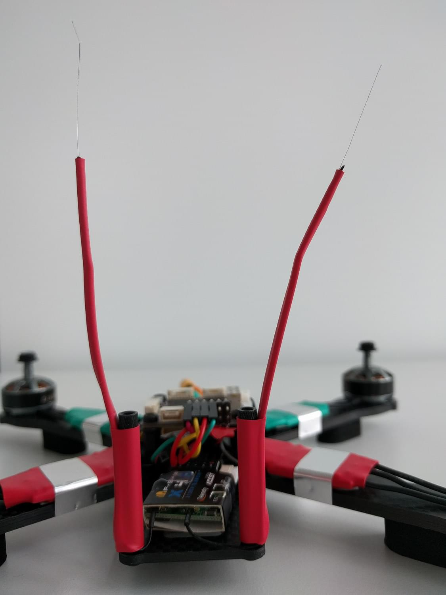

### Сигнал ESC

For the ESC signals I followed the [hardware documentation of the Pixracer](../flight_controller/pixracer.md) and the [Quadrotor x configuration](../airframes/airframe_reference.md#quadrotor-x) motor numbering scheme.
As we have no ground or positive BEC voltage connections we connect our `PWM` ESC signal cables each to its topmost pins of the corresponding output connector.

### GPS / Зовнішній магнітометр

Я взяв кабель GPS, який підходить до роз'єму використаного GPS і поставляється ​​з набором Pixracer.
Sadly the pin assignment was completely wrong and I rewired the connector again using tweezers according to the [3DR Pixhawk Mini user manual](../flight_controller/pixhawk_mini.md#connector-pin-assignments-pin-outs) GPS port.

#### Pixracer GPS/I2C Port

| Pin | Призначення |
| --- | ----------- |
| 1   | GND         |
| 2   | SDA         |
| 3   | SCL         |
| 4   | RX          |
| 5   | TX          |
| 6   | +5V         |

#### M8N 3DR Pixhawk mini GPS Connector

| Pin                        | Призначення | Connect to Pixracer Pin |
| -------------------------- | ----------- | ----------------------- |
| 1 (red) | SCL         | 3                       |
| 2                          | SDA         | 2                       |
| 3                          | VCC 5V      | 6                       |
| 4                          | RX          | 5                       |
| 5                          | TX          | 4                       |
| 6                          | GND         | 1                       |

Я встановив модуль GPS, використовуючи перерахований загальний мультікоптерний стійку GPS, оскільки встановлення його ближче до основного корпусу зробило показання магнітометра абсолютно непридатними для використання.
Експеримент, в якому модуль було прямо закріплено на далекому задньому краї рами, показав, що шум величини магнітометра в шість разів ймовірно спричинений магнітним полем струмів ESC.
Зверніть увагу, що я скоротив мачту на ~2 см, щоб вона краще підходила за довжиною кабелю та розмірами рами. Модуль GPS приклеєний двостороннім скотчем до верхньої плити мачти.

## Налаштування FPV

Це інструкція для необов'язкової передачі відео у реальному часі FPV на частоті 5,8 ГГц.
Вам знадобляться додаткові частини FPV, перераховані в початковій частині.
Трансляція FPV, описана тут, є електронно незалежною від контролера польоту, вона бере тільки напругу батареї після модуля живлення.

Спочатку я зробив контрольний тест, щоб переконатися, що все працює правильно.
Для цього підключіть кабель відеосигналу, який постачається разом з вашим передавачем, і підключіть його до задньої частини вашої FPV-камери та до відповідного роз'єму передавача. Закрутіть, а потім підключіть штекер живлення JST до вашого транспортного засобу або до іншого джерела напруги.
Світлодіод передавача повинен загорітися.
Використовуйте свій пристрій приймача 5,8 Ггц, налаштований на правильний канал, щоб перевірити відео.
To configure the transmitter to an other channel and adjust the transmission power please refer to the [Tramp HV User Manual](https://www.immersionrc.com/?download=5016).

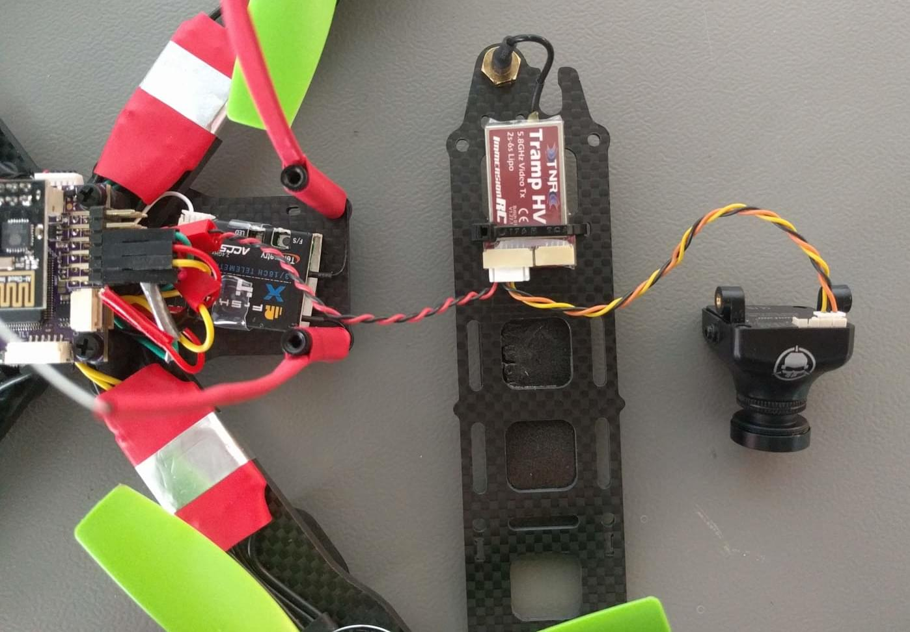

Як ви можете побачити, я закріпив передавач зсередини на "даху" рами, використовуючи затискач.
Завжди вставляйте самоклеючий шматок піни між, коли монтуєте електроніку, як цю, щоб уникнути фізичних пошкоджень під час польоту.
Переконайтеся, що передавач розташований таким чином, щоб роз'єм антени відповідав відведеній отвору рамки.

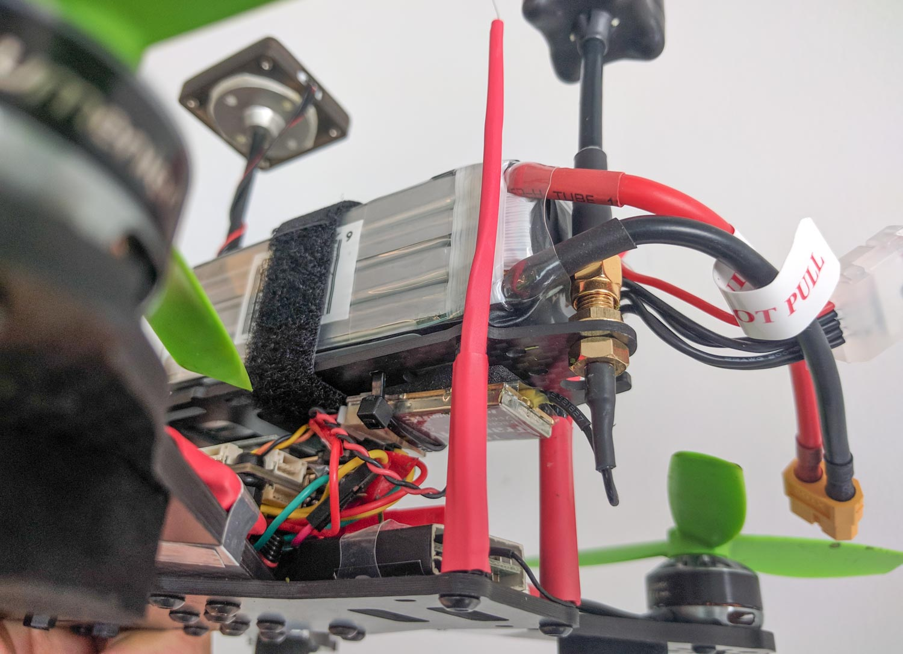

Величезна камера FPV, встановлена в частині списку, має не лише найкращий об'єктив FPV, який я бачив до цього, але також включає кілька кріплень для камери, одне з яких дуже гнучке для налаштування кута камери і гарно вписується в рамку QAV-R.
Я змонтував це, як ви можете побачити на наступному зображенні. Два гвинти та гайки для фіксації кронштейну камери до рами були взяті з запасних, що залишилися від комплекту рами.

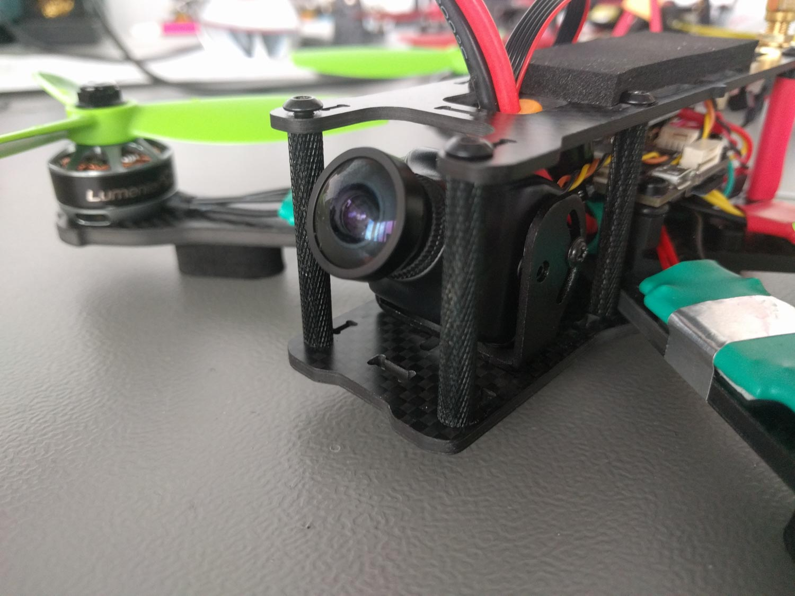

## Конфігурація PX4

_QGroundControl_ is used to install the PX4 autopilot and configure/tune it for the frame.
[Download and install](http://qgroundcontrol.com/downloads/) _QGroundControl_ for your platform.

:::tip
Full instructions for installing and configuring PX4 can be found in [Basic Configuration](../config/index.md).
:::

:::warning
Always make sure to have either battery or propellers physically removed from your vehicle during any initial configuration.
Краще перестрахуватися, ніж потім шкодувати!
:::

Спочатку оновіть прошивку, конструкцію та відображення актуаторів:

- [Firmware](../config/firmware.md)

- [Airframe](../config/airframe.md)

  You will need to select the _Generic 250 Racer_ airframe (**Quadrotor x > Generic 250 Racer**).

  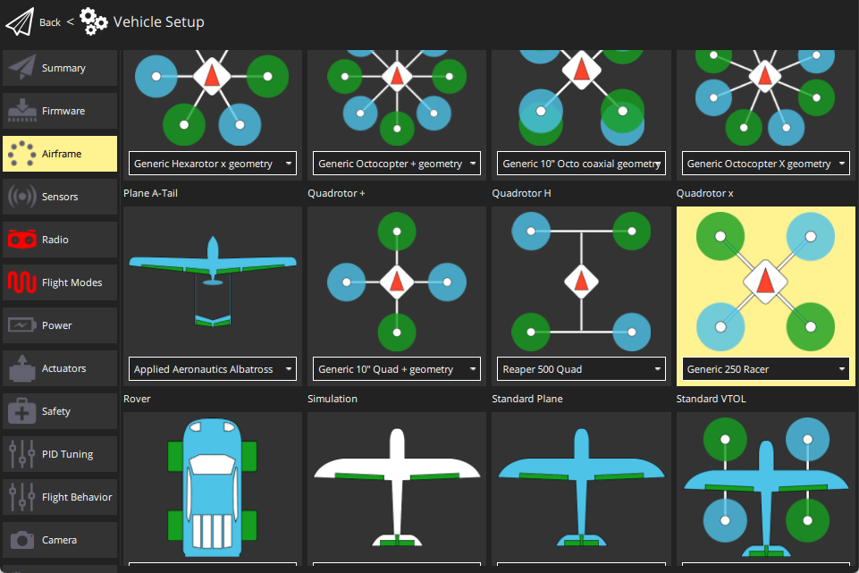

- [Actuators](../config/actuators.md)
  - Вам не потрібно оновлювати геометрію транспортного засобу.
  - Призначте функції приводу до актуаторів, щоб відповідати вашому підключенню.
  - Перевірте конфігурацію, використовуючи слайдери.

Потім виконайте обов'язкове налаштування / калібрування:

- [Sensor Orientation](../config/flight_controller_orientation.md)
- [Компас](../config/compass.md)
- [Акселерометр](../config/accelerometer.md)
- [Level Horizon Calibration](../config/level_horizon_calibration.md)
- [Radio Setup](../config/radio.md)
- [Flight Modes](../config/flight_mode.md)

В ідеалі ви також повинні зробити:

- [ESC Calibration](../advanced_config/esc_calibration.md)
- [Battery Estimation Tuning](../config/battery.md)
  - 4S (4 елементи LiPo) з напругою зарядженого елемента 4,15 В і напругою розрядженого елемента 3,5 В (або відповідні значення для вашого акумулятора).
- [Safety](../config/safety.md)

### Вдосконалення

Airframe selection sets _default_ autopilot parameters for the frame.
Ці вистачають для польоту, але це добра ідея налаштувати параметри для конкретної конструкції рами.

For instructions on how, start from [Autotune](../config/autotune_mc.md).
