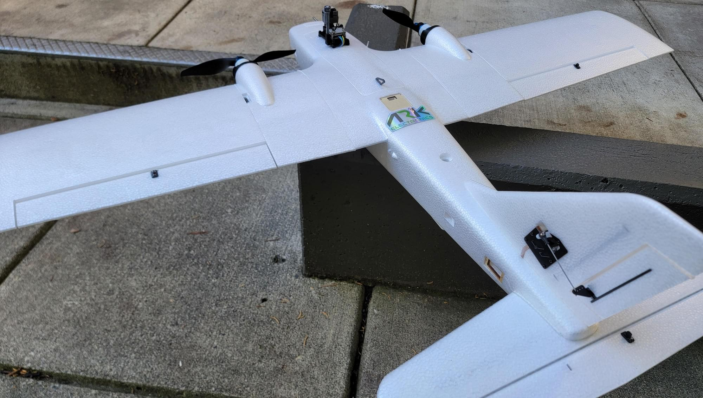
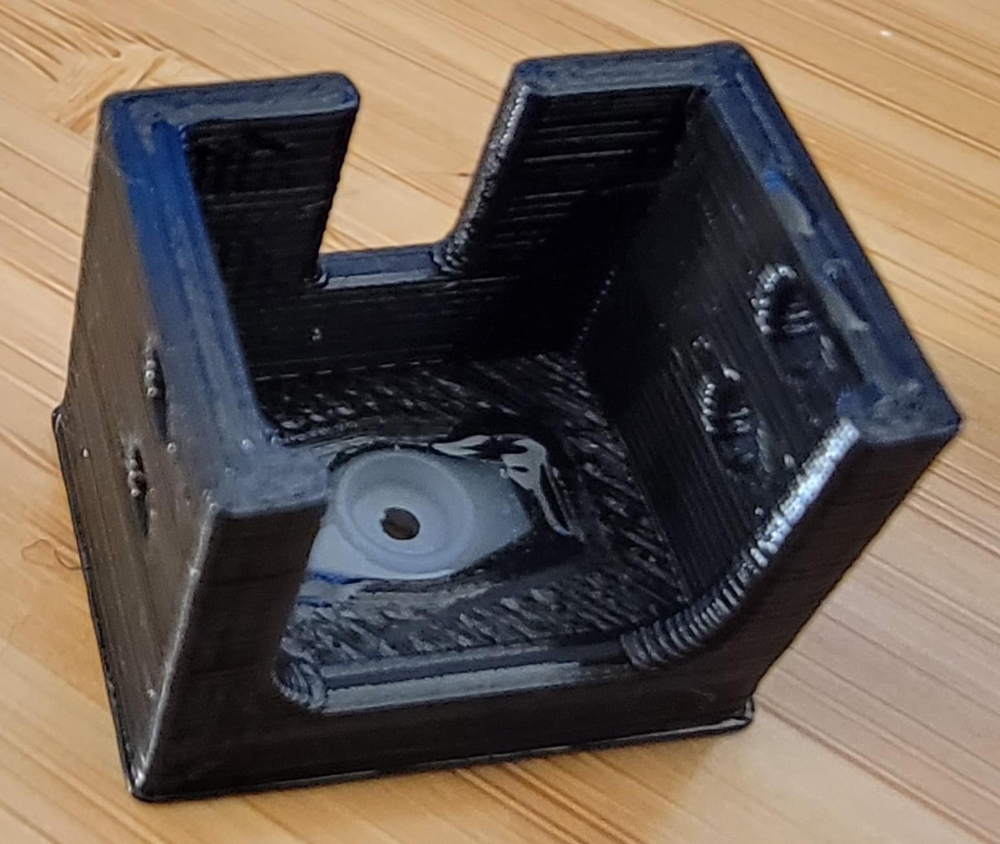
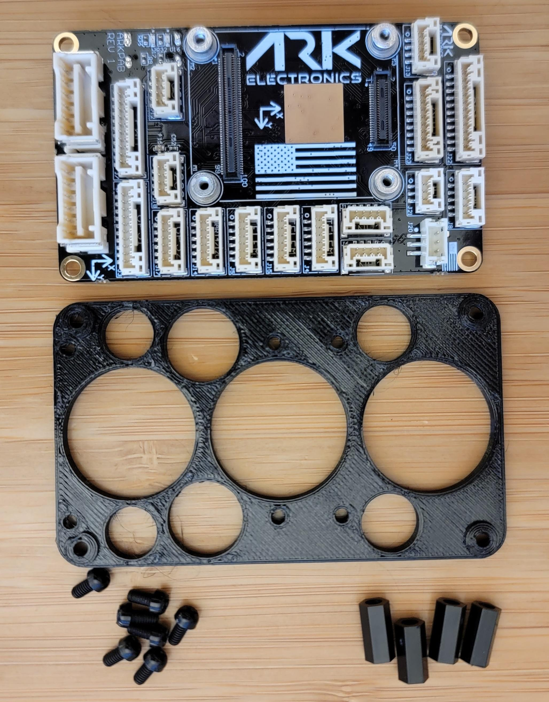
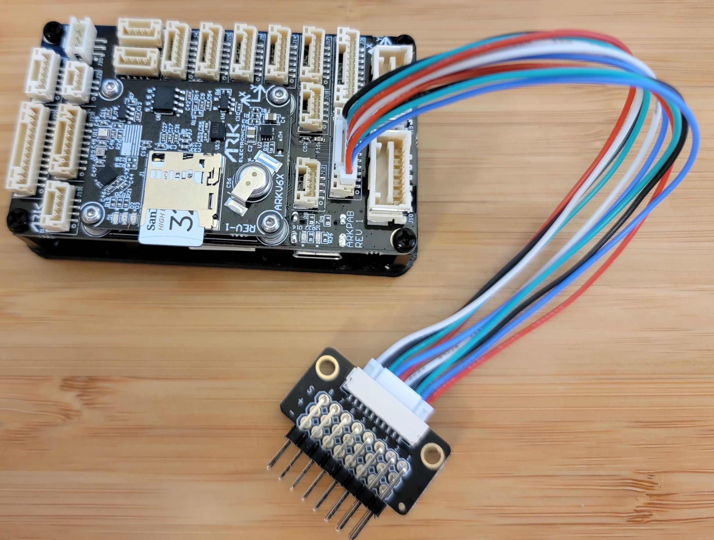
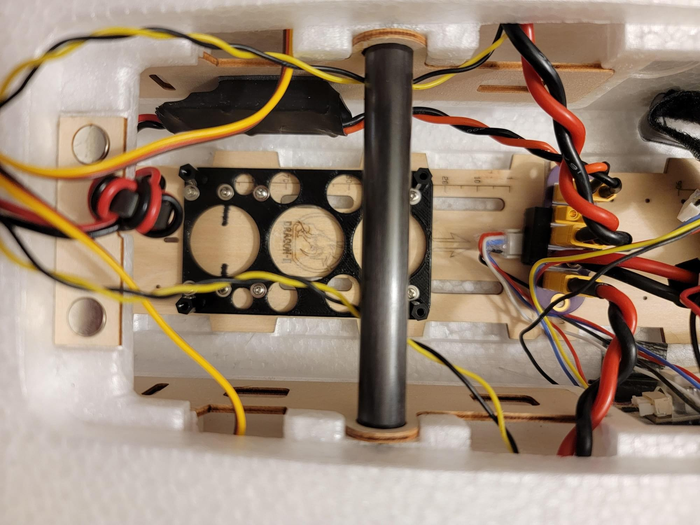
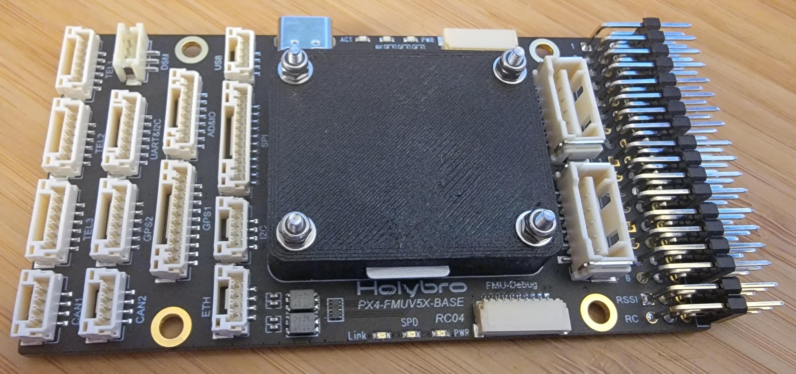
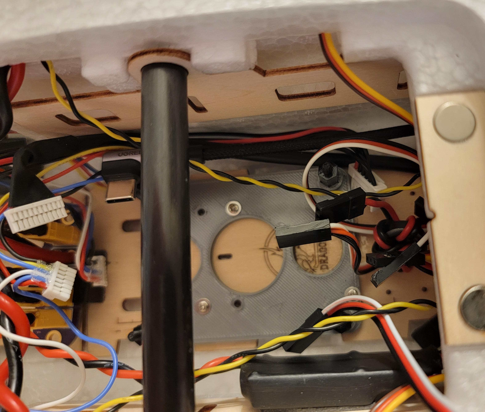
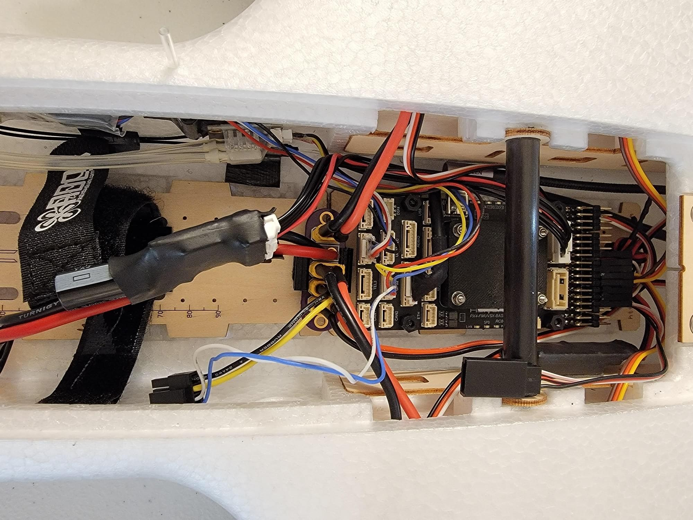
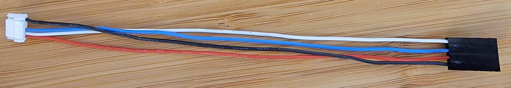
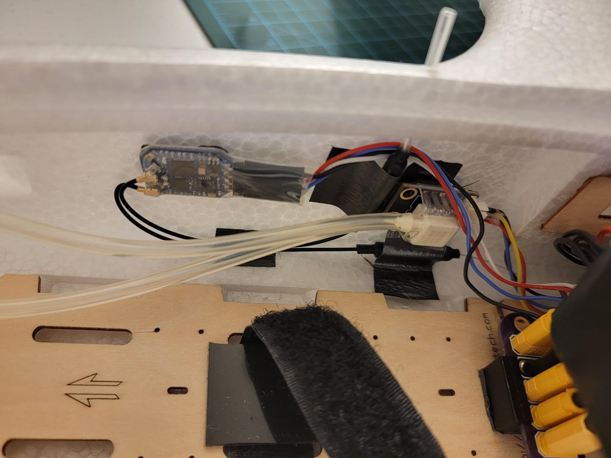

# Reptile Dragon 2 (RD2) Збірка

The Reptile Dragon 2 is a twin motor RC airplane specifically designed for efficient FPV [(first person view)](https://en.wikipedia.org/wiki/First-person_view_\(radio_control\)) flying.
Будучи специфічним для FPV, RD2 оптимізований для легкого монтажу камер, сенсорів, логічної електроніки, великих батарей, антен та інших компонентів навантаження, які можуть бути знайдені на типовому літаку FPV.
Цей акцент на корисне навантаження робить цей літак ідеальним кандидатом для установки PX4.




## Загальний огляд

Метою цієї побудови було створити ефективну, довготривалу платформу FPV для загального тестування та розвитку PX4.

Основні особливості конструкції фюзеляжу:

- Просторий салон
- Легкий доступ до всієї порожнини фюзеляжу завдяки великому верхньому люку
- Задня люк
- Видалення V-хвоста або варіанти звичайного хвоста включені
- Різьбові вставки в крилах та верхній частині фюзеляжу для зовнішнього монтажу
- Чимало кріплень-ознак
 - Отвір для верхньої антени
 - Верхнє покриття GPS
 - Кріплення антени біля гільзи "T"
 - Задній електронний лоток
 - Виріз "екшн камери" на передній панелі
 - Виріз для камери FPV спереду
- Знімні крила
- Низька швидкість стійки
- Лагідна обробка

Основні особливості збірки

- Легка загальна збірка
- Легкий доступ до Pixhawk та всіх периферійних пристроїв
- FPV з кріпленням для панорамної камери
- Дані про повітря з піто/статичного датчика
- ~40 хвилин тривалості польотів

## Список деталей

- [Reptile Dragon 2 kit](https://usa.banggood.com/REPTILE-DRAGON-2-1200mm-Wingspan-Twin-Motor-Double-Tail-EPP-FPV-RC-Airplane-KIT-or-PNP-p-1805237.html?cur_warehouse=CN&ID=531466)

- [ARK6X FMU](https://arkelectron.com/product/arkv6x/)

- [ARK6X carrier](https://arkelectron.com/product/ark-pixhawk-autopilot-bus-carrier/)

- [Alternative FMU carrier: Holybro Pixhawk 5x Carrier board](https://holybro.com/products/pixhawk-baseboards)

- [Holybro power module](https://holybro.com/products/pm02d-power-module)

- [Holybro M9N GPS module](https://holybro.com/products/m9n-gps)

- Плата розбірника PWM від Holybro

- Модуль диференційного тиску MS4525DO та пітот-трубка

- [Caddx Vista FPV air unit](https://caddxfpv.com/products/caddx-vista-kit)

- [Emax ES08MA ii](https://emaxmodel.com/products/emax-es08ma-ii-12g-mini-metal-gear-analog-servo-for-rc-model-robot-pwm-servo)

- [DJI FPV Goggles](https://www.dji.com/fpv)

- [ExpressLRS Matek Diversity RX](http://www.mateksys.com/?portfolio=elrs-r24)

- [5V BEC](https://www.readymaderc.com/products/details/rmrc-3a-power-regulator-5-to-6-volt-ubec)

- [6s2p 18650 LiIon flight battery](https://www.upgradeenergytech.com/product-page/6s-22-2v-5600mah-30c-dark-lithium-liion-drone-battery) (select XT60 connector)

- [Custom designed 3D printed parts](https://github.com/PX4/PX4-user_guide/raw/main/assets/airframes/fw/reptile_dragon_2/rd2_3d_printed_parts.zip)
 - Монтаж платформи ARK6X
 - Кріплення для каркасу Holybro Pixhawk 5x
 - FPV модуль та кріплення камери
 - Адаптер "заглушка" статичного зонда Піто

- [Custom designed power distribution PCB](https://github.com/PX4/PX4-user_guide/raw/main/assets/airframes/fw/reptile_dragon_2/xt30_power_distro_pcb.zip)

- Різноманітне кріплення: М3-фурнітура (розмітки, шайби, O-кільця, болти), підкладки та гвинти M2.5 з нейлону, роз'єми XT30, гарячий клей, термоусадка, роз'єми Molex Microfit

- Силіконові проводи (14 Awg для високого струму, 16 Awg для низького струму, 22 Awg для низької потужності та сигналів)

## Інструменти

Наступні інструменти використовувалися у цій збірці.

- Тестер сервопривода (з кнопкою центрування)
- Набір викруток
- 3D-принтер
- Набір гаєчних ключів
- Клей: гарячий клей, клей CA (цианакрилат), клей "Foamtac"
- Наждачний папір

## Побудова фюзеляжа

Літак потребує певної збірки з коробки.
Сервоприводи, крила та хвіст потрібно встановити.

:::info
Для цієї частини збірки інструкція, включена в комплект, повинна бути достатньою, але нижче наведено деякі корисні поради.
:::

### Наклейка піни

При склеюванні пінних деталей RD2 разом використовуйте шкурку для шліфування монтажної поверхні, а потім використовуйте клей CA.
Якщо піну не шліфувати шкуркою, клей не матиме поверхні, за яку можна було б "захопити" піну, і з'єднання буде погане.

Foamtac не здається добре прилипає до цієї піни, тому я використовував клей CA для всіх пар піни-піни.

### Захисна пластина

Підкладка, яка поставляється з RD2, потребує підгонки під розмір.


Відріжте формування плісняви з плоского боку піддону.
Використовуйте грубий шліфувальний папір, щоб згрубіти внутрішню поверхню бронепластини, а також поверхню з'єднання знизу каркасу.
Після перевірки на герметичність використовуйте клей CA для склеювання підкладки до нижньої частини RD2.

### Встановлення сервоприводу

:::info
Перед встановленням сервоприводу рекомендується використовувати шліфувальний папір, щоб зробити грубою сторону сервоприводу, яка спрямована на кришку сервоприводу. Під час остаточного встановлення покладіть краплю Foamtac між сервоприводом та кришкою. Це запобіжить сервоприводу рухатися після встановлення.
:::


Сервоприводи на RD2 підключені до поверхонь керування з регульованими зчепленнями сервоприводів.
Інструкції RD2 відзначать, що кожна керуюча поверхня використовує конкретну довжину зв'язки (включено в комплект).
Переконайтеся, що виміряли кожне з'єднання перед установкою, щоб бути впевненими, що це правильна довжина з'єднання для цієї поверхні керування.
Дуже важливо вирівнювати сервоприводи так, щоб механічний діапазон сервопривода був добре вирівняний з механічним діапазоном поверхні керування.
Коли серводвигун знаходиться в центрі, рука серводвигуна повинна знаходитися під кутом 90 градусів до серводвигуна, а поверхня керування повинна бути приблизно в центрі.
Можливо, не вдасться досягти ідеального вирівнювання, тому будь-який залишковий зсув буде виправлено в програмному забезпеченні.

Вирівнювання сервоприводів можна виконати за допомогою наступних кроків:

1. Почніть з сервоприводу за межами літака
2. За допомогою сервотестера перемістіть сервопривід до його центральної точки
3. Встановіть вал сервоприводу за допомогою кріпильного гвинта, що входить до комплекту, намагаючись вирівняти вал так, щоб він виходив якомога ближче до 90 градусів на правильному боці сервоприводу
4. Встановіть сервопривід у гніздо для сервоприводу на літаку
5. Встановіть кріплення та відрегулюйте його таким чином, щоб поверхня управління була якомога ближче до центру

:::info
Рогова важіль ймовірно не буде точно знаходитися під кутом 90 градусів до сервоприводу через зубці на валу сервоприводу.
Ви можете побачити це на зображенні налаштування, показаному вище.
Просто наблизьте його достатньо до 90 градусів, і залишкове зміщення буде видалено або зв'язкою, або пізніше у програмному забезпеченні.
:::

## Монтаж модуля GPS/Компасу

GPS/Компас повинен бути встановлений на задній полиці електроніки, що постачається з RD2.
Це місце далеко ззаду від електропроводки (і будь-чого іншого, що може спричиняти магнітні перешкоди), що робить його ідеальним місцем для модуля GPS/компасу


Модуль GPS може бути видалений зі свого пластикового корпусу для можливості використання отворів для монтажу.
Потім використовуйте кріплення з нейлону M3, щоб прикріпити його до задньої полиці електроніки.

Дві з трьох необхідних отворів вже випадково розташовані в лотку для електроніки, тому я використовував маркер і дриль, щоб позначити і просвердлити третій отвір.

## FPV Підставка

### Збирання FPV Pod

Спочатку встановіть сервопривід ES08MA ii в кишеню сервопривода FPV-поду.
Сервопривід просто повинен вкладатися, з кабелем, що виходить з FPV-підсистеми через отвір у кишені сервопривода.
Використовуйте краплю клею Foamtac, щоб закріпити сервопривід.



Використовуйте один з кілець керування, включених в комплект ES08ma ii.
Виріжте ріг так, щоб він вліз у паз у камери FPV-підвіски для камери.
Воно повинно лежати рівно на дні слоту.
Закріпіть ріг з клеєм CA.

Використовуйте тестер сервоприводу, щоб вирівняти сервопривод.
Прикріпіть рогатку кар'єра камери безпосередньо до верхушки сервоприводу та закріпіть її за допомогою включеної гвинта.
Закріпіть камеру DJI FPV в кар'єрі за допомогою двох бічних гвинтів.

Для завершення зборки FPV-поду встановіть Caddx Vista на задню частину поду за допомогою довгих болтів M2, стійок 1 мм та гайок з фіксацією.


### Встановлення корпусу FPV Pod

FPV-под був встановлений зверху на кришку акумулятора за допомогою нейлонових болтів M3 з двома ущільнювальними кільцями для відстані FPV-под від кришки акумулятора.

## Встановлення польотного комп'ютера

:::info
Ця збірка сумісна як з перевізником ARK6X, так і з перевізником Holybro 5X.
Інструкції надано для обох.
:::


The RD2 comes with a wooden electronics mount baseplate preglued in the airframe.
На цьому зображенні використовуються два набори вказівок маркерів, щоб показати, де повинні розташовуватися кріплення для кожного кріплення кар'єра; один маркер для кріплення кар'єра Holybro 5X і два маркера для кріплення кар'єра ARK5X.

### ARK6X Carrier (Рекомендовано)

Для переноски ARK6X було виготовлено індивідуальний друкований кріплення 3D.
Для кріплення перевізника ARK6X до кріплення використовувалися деталі з нейлону M2.5.




Кар'єр ARK6X не має звичайних роз'ємів виводу сервоприводів.
Замість цього в ньому є один роз'єм JST GH, який містить 8 виходів сервоприводу FMU.
Для розподілу одного роз'єму виводу PWM JST GH на 8 окремих серво каналів використовувалася плата розгалуження PWM Holybro.



Носій ARK6X показаний тут, встановлений на базову пластину.
Зверніть увагу на тилову частину носія, вирівняну проти двох позначок.



Нарешті, ARK6X був встановлений угорі на гірському вершині.


### Holybro 5X Carrier (Додатково)

Альтернативною платою перевізник є платформа Holybro Pixhawk 5X.

Оператор встановлений у пластиковому кейсі.
Хоча справа виглядає гарно, це додаткова вага, тому переноска була видалена з чохла.
Після видалення з корпусу ARK6X був встановлений, а захисна кришка встановлена зверху.



Спеціальний кріплення для плати-носія Pixhawk 5X було розроблено та надруковано в 3D.
Ця кріплення адаптує внутрішню плиту кріплення RD2 до отворів кріплення на платі розподільника Pixhawk 5X.


Важливо встановити цей кріплення в правильному місці всередині RD2; якомога далі назад.
З великою батареєю та FPV капсулою спереду літак буде схильний до переваги ваги в ніс.
Встановлення бортового комп'ютера далеко назад допоможе зберегти центр ваги повітряної рами (CG) у правильному місці.



Зображення вище показують повністю завершену та підключену установку переносного пристрою Holybro 5X.




## Електрика

### Розподіл електроживлення батареї

Живлення батареї подається через модуль живлення Holybro, а потім на спеціально розроблену плату розподілу живлення PCB (друкована плата).
З розподільної дошки живлення живлення від батареї розподіляється до BEC, обох ESCs та Caddx Vista через окремі роз'єми XT30.


Без спеціальної плати PCB все ще легко розподілити живлення всім компонентам у літаку.
Це зображення показує альтернативний рішення, побудоване з підключеного роз'єму XT60 до кількох роз'ємів XT30.
Серводжерело BEC також показане на цьому зображенні.


### Servo Power

Because the Holybro carrier does not include an onboard servo power supply, an external ["BEC"](https://en.wikipedia.org/wiki/Battery_eliminator_circuit) is used to provide power to the servos.
Вводні виводи EC були припаяні до роз'єму XT30, який був підключений до плати розподілу потужності.
Вихід BEC можна підключити до будь-якого невикористаного виходу сервоприводу (я вибрав вихід IO 8).

### ESCs & Motors


До 16awg проводів були припаяні кульові роз'єми, які потім були припаяні до кожного виходу фази на кожному РКШ.
Термоусадка була зменшена на готових ESCs, а булетні роз'єми з ESCs були підключені до відповідних моторів.

Напрямок руху мотора залежить від порядку підключення витків мотора до ESC.
Наразі припустіться з обох сторін. Якщо будь-який з двигунів обертається у неправильному напрямку, напрям можна змінити, помінявши місцями будь-які дві з'єднання.
Правильна напрямок руху буде перевірено під час останньої перевірки перед польотом.

### Servos & ESC Signal Leads

Сервоприводи були підключені до порту виходу FMU в такому порядку: лівий елерон, правий елерон, лівий ESC, правий ESC, елеватор, руль, FPV панорамування.

:::info
[DSHOT ESC](../peripherals/dshot.md#wiring-connections) were used (not PWM as for the servos).
To make efficient use of the [DSHOT output port restrictions](../peripherals/dshot.md#wiring-connections), the two ESCs must be wired to FMU output channels 3 and 4.
:::

### Airspeed Sensor & Pitot Tube

Датчик швидкості повітря був підключений до порту I2C на платі-адаптері FMU за допомогою постачального кабелю з роз'ємом JST GH I2C.


Пітот-трубка була протиснута через кріплення пітот-трубки та встановлена в виріз для Fpv-камери спереду.

Шланги пітоту/статики були вирізані на потрібну довжину та встановлені для з'єднання пітот-статичної зонди з датчиком швидкості повітря.
Нарешті, датчик пітот-статики був приклеєний до бічної стінки корпусу літального апарата (за допомогою двостороннього скотчу).

### ELRS RX

A custom cable was made to connect the ELRS RX to the JST GH `TELEM2` port of the FMU carrier board.



Інший кінець кабелю був завершений роз'ємом Dupont для підключення до стандартно розміщених роз'ємів на ELRS RX.
ELRS RX був підключений до кабелю, після чого термоусадка використовувалася для їх фіксації разом.




Тонка антенна трубка була протиснута через верх корпусу літального апарата, щоб установити одну з двох антен ELRS в вертикальне положення.
Друга антена для різноманітності була приклеєна до бічної стінки корпусу літального апарата під кутом 90 градусів від положення першої антени.
ELRS RX був прикріплений до бічної стінки корпусу літального апарата поруч з датчиком пітот-статики за допомогою двостороннього скотчу.

### USB

Був використаний кабель з USB-портом типу C з прямим кутом, щоб забезпечити легкий доступ до USB-порту типу C на FMU.


Кабель був встановлений таким чином, що він виходить з Pixhawk, спрямований до тильної частини літального апарата. Кабель продовжується до задньої кришки, де зайва довжина може бути безпечно змотана в вузол.
Доступ до цього кабелю можна здійснити, просто вийшовши задню кришку і розплутавши кабель.

## Збірка прошивки

You can't use prebuilt PX4 release (or main) firmware for this vehicle, as it depends on PX4 modules [crsf_rc](../modules/modules_driver.md#crsf-rc) and [msp_osd](../modules/modules_driver.md#msp-osd) that are not included by default.

Для їх використання потрібна деяка налаштування.

First, follow [this guide to setup a development environment](../dev_setup/dev_env.md) and [this guide to get the PX4 source code](../dev_setup/building_px4.md).

Once a build environment has been setup, open a terminal and `cd` into the `PX4-Autopilot` directory.
To launch the [PX4 board config tool (`menuconfig`)](../hardware/porting_guide_config.md#px4-menuconfig-setup) run:

```
make ark_fmu-v6x_default boardconfig
```

### `crsf_rc` Module

PX4 включає автономний модуль розбору CRSF, який підтримує телеметрію та CRSF LinkStatistics.
To use this module, the default `rc_input` module must be disabled and the `crsf_rc` module must be enabled.

1. In the PX4 board config tool, navigate to the `drivers` submenu, then scroll down to highlight `rc_input`.
2. Use the enter key to remove the `*` from `rc_input` checkbox.
3. Scroll to highlight the `RC` submenu, then press enter to open it.
4. Scroll to highlight `crsf_rc` and press enter to enable it.
5. Збережіть і вийдіть з інструменту конфігурації плати PX4.

For more information see [TBS Crossfire (CRSF) Telemetry](../telemetry/crsf_telemetry.md).

### `msp_osd` Module

The `msp_osd` module steams MSP telemetry to a selected serial port.
Пристрій Caddx Vista Air підтримує прослуховування телеметрії MSP і відображає отримані значення телеметрії на своєму OSD (екрані).

1. In the PX4 board config tool, navigate to the `drivers` submenu, then scroll down to highlight `OSD`.
2. Use the enter key to open the `OSD` submenu
3. Scroll down to highlight `msp_osd` and press enter to enable it

### Building & Flashing

Once the `msp_osd` and `crsf_rc` modules are enabled and the `rc_input` module is disabled, the firmware source must be compiled and the resulting image flashed to the FMU.

Для компіляції та прошивання прошивки підключіть FMU/Carrier до ПК-хоста збудови через USB і виконайте:

```
make ark_fmu-v6x_default upload
```

## Конфігурація PX4

### Конфігурація параметрів

Цей файл параметрів містить настроювану конфігурацію параметрів PX4 для цієї збірки, включаючи налаштування радіо, налаштування і датчиків.
Load the file via QGC using the instructions at [Parameters> Tools](https://docs.qgroundcontrol.com/master/en/qgc-user-guide/setup_view/parameters.html#tools) (QGC User Guide).

- [Snapshot of PX4 airframe params](https://github.com/PX4/PX4-user_guide/raw/main/assets/airframes/fw/reptile_dragon_2/reptile_dragon_2_params.params)

Можливо, вам доведеться змінити деякі параметри для вашої збірки, зокрема вам слід перевірити:

- [MSP_OSD_CONFIG](../advanced_config/parameter_reference.md#MSP_OSD_CONFIG) param must match serial port which is connected to the Caddx Vista (in this build, `/dev/ttyS7`).
- [RC_CRSF_PRT_CFG](../advanced_config/parameter_reference.md#RC_CRSF_PRT_CFG) param must match the serial port which is connected to the ELRS RX (in this build, `Telem 1`).

### Налаштування радіо

Вам слід активувати ручні, акро та позиційні режими на вашому контролері (принаймні для першого польоту).
For instructions see [Flight mode Configuration](../config/flight_mode.md)

We also recommend configuring an [autotuning switch](../config/autotune_fw.md#enable-disable-autotune-switch) for the first flight, as this makes it easier to enable/disable autotuning while flying.

The channel mappings for this build are included in the supplied [params file](#parameter-config).
Порядок каналів - це керування газом, крен, тангаж, рульове керування, (порожнє), і режим польоту

:::info
ExpressLRS requires `AUX1` as an "arming channel".
Цей канал вибору режиму є окремим від механізму зброювання PX4 і використовується для повідомлення ELRS TX, що він може перемикатися в режим високої потужності передачі.

У мапуванні каналів PX4 я просто пропускаю цей канал.
На моєму передавачі цей канал завжди встановлений на "високий", тому ELRS завжди в зброї.
:::

### Motor Setup & Prop Installation

Motors and flight control surface setup done in the [Actuator](../config/actuators.md) section.
The supplied [params file](#parameter-config) maps the actuators as described in this build.

Комплект RD2 поставляється з годинними та проти годинною пропелерами для протиопорних двигунів.
With counter rotating props, the airplane can be set up such that it has no [critical motors](https://en.wikipedia.org/wiki/Critical_engine).

З відсутністю критичних двигунів, керованість буде максимальною в разі виходу з ладу одного з двигунів.
Напрямок обертання двигунів слід встановити таким чином, щоб пропелери оберталися до фюзеляжу зверху літака.
Іншими словами, якщо ви дивитесь на лівий двигун, обертаючись від вас від літака, він повинен обертатися за годинниковою стрілкою, тоді як правий двигун повинен обертатися проти годинникової стрілки.

With the propellers removed, power the airplane up and use the [Actuator](../config/actuators.md) test in QGC to spin up the motors.
Якщо лівий або правий двигун не обертається у правильному напрямку, поміняйте місцями два з його кабелів ESC та перевірте ще раз.
Наприкінці, коли обидва двигуни обертаються у правильному напрямку, скористайтеся ключем для закріплення пропелерів.

## Останні перевірки

Перед першим польотом необхідно провести всебічний попередній огляд.

Я рекомендую перевірити наступні елементи:

- Калібрування датчиків (QGC)
 - Калібрування магнітів
 - Калібрування акселерометра
 - Калібрування швидкості повітря
 - Калібрування рівня горизонту
- Перевірка контролю над відхиленням поверхні
- Right stick -> Right aileron goes up, left aileron goes down
- Left stick -> Left aileron goes up, right aileron goes down
- Stick back -> elevator goes up
 -Stick forward -> elevator goes down
- Left rudder -> Rudder goes left
- Right rudder -> Rudder goes right
- Check Px4 inputs (in `stabilized mode`)
- Roll right -> Right Aileron goes down
- Roll left -> Left aileron goes down
- Pitch up -> Elevator goes down
- Pitch down -> Elevator goes up

## Перший політ

Рекомендую виконати перший зліт в ручному режимі.
Тому що у цього літака немає шасі, вам доведеться кинути літак самостійно або, в ідеалі, мати помічника, який кине його.
Під час кидання будь-якого літака кидайте з невеликим підняттям носа з повною потужністю двигуна.

Критично бути готовим дати введення задньої палиці, щоб запобігти літаку від удару по землі, якщо він випадково буде вирівняний носом вниз.
Once the airplane is successfully airborne, cruise up to an altitude of a few hundred feet and switch to [Acro mode](../flight_modes_fw/acro.md).
This is a good time to use [Autotuning](../config/autotune_fw.md) to tune the airframe.

If the airplane is well behaved in _Acro mode_, switch to [Position mode](../flight_modes_fw/position.md).

## Build Results & Performance

Загалом, ця збірка була успішною.
RD2 добре літає в цій конфігурації та має достатньо місця на борту для сенсорів та додаткового обладнання.

### Продуктивність

- Швидкість зупинки: вказано 15 миль/год
- Круїзна швидкість: 35-50м/год
- Витривалість: ~40 хвилин о 28м/год

### Videos & Flight Logs

[Demo Flight log](https://review.px4.io/plot_app?log=6a1a279c-1df8-4736-9f55-70ec16656d1e)

FPV video of flight log:

<lite-youtube videoid="VqNWwIPWJb0" params="ab_channel=ChrisSeto" title="Reptile Dragon 2 Demo Flight For Px4 Log Review"/>
