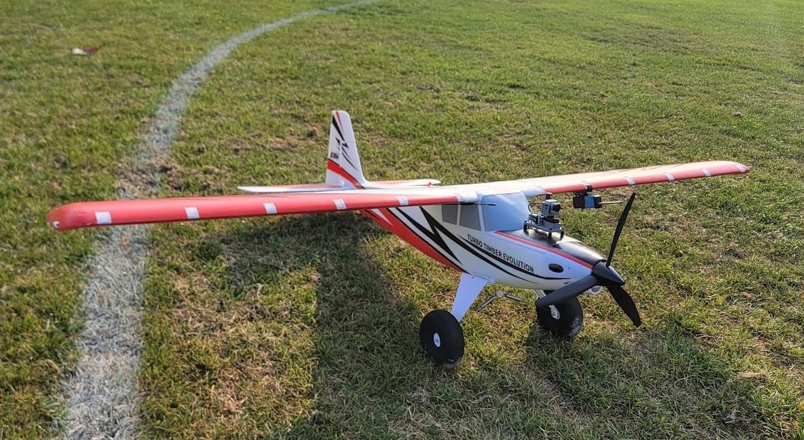
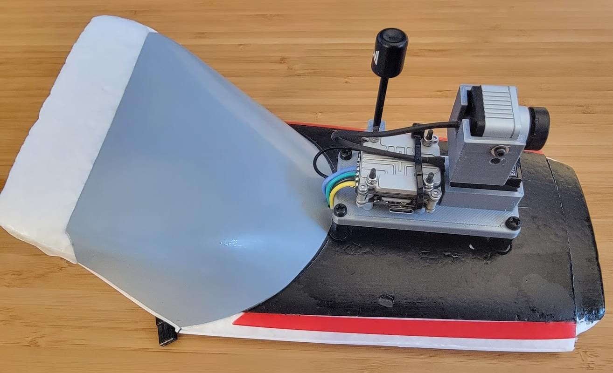
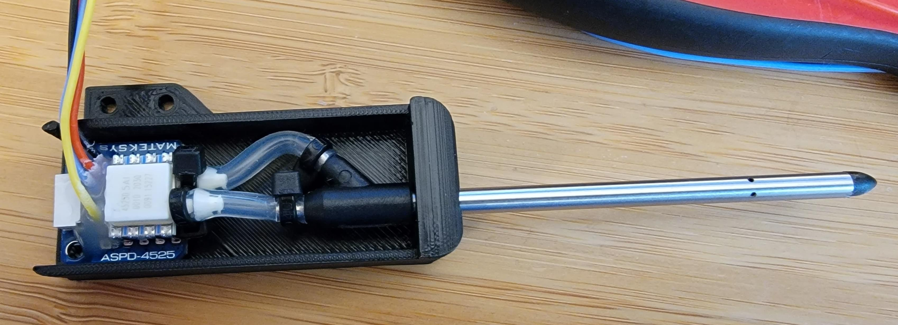
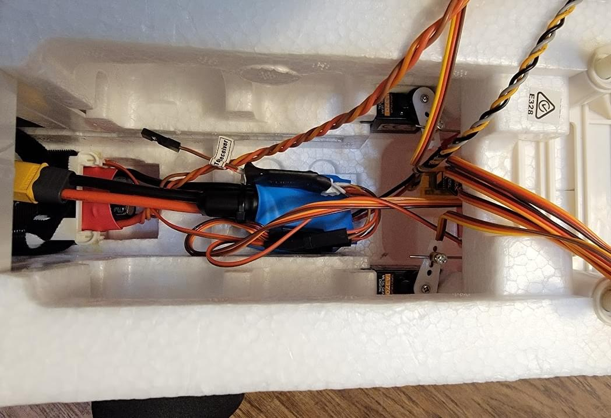
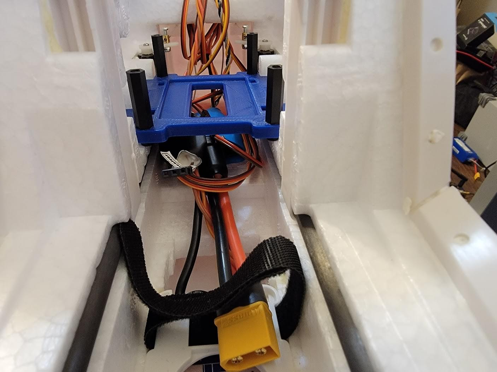
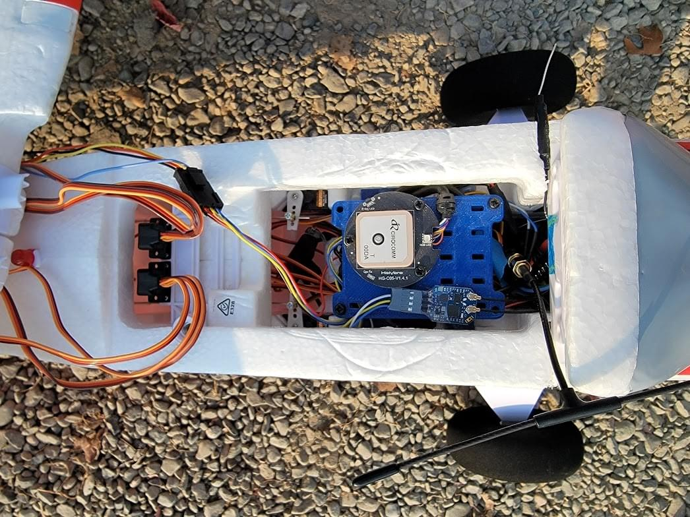
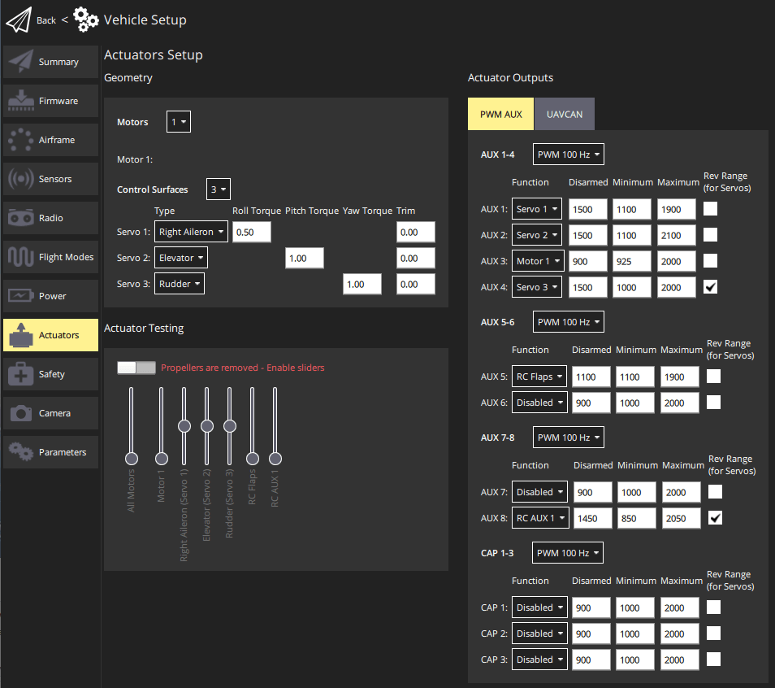
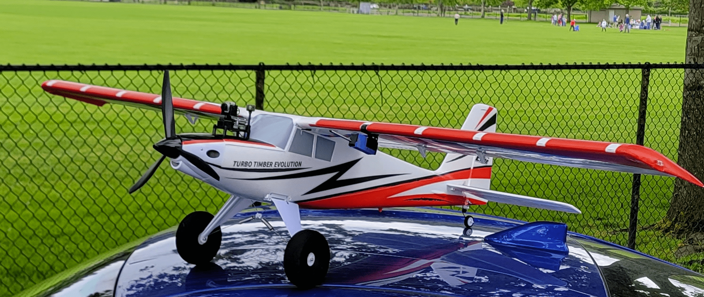
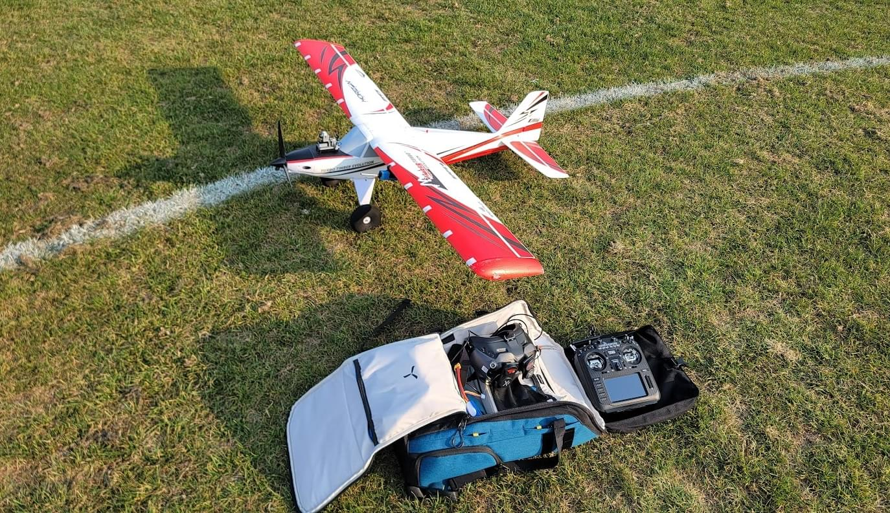

# Turbo Timber Evolution (TTE) Build

Турбоверсія Turbo Timber призначена для класичного керування моделями RC із видимості.
This model is designed to excel at [STOL](https://en.wikipedia.org/wiki/STOL) flying and has a number of notable traits that also make it an ideal candidate to be converted into a FPV PX4 platform.

## Загальний огляд

Метою цієї побудови було створити платформу, яка може бути використана для загального тестування/розвитку PX4.
Ця концепція дизайну позначала, що збалансовані управління, представлені типовим літаком, були бажаними.
Оскільки класичні RC-літаки зазвичай призначені для польоту без додаткового комп'ютерного контролю, вони, як правило, спеціально розроблені таким чином, щоб бути добре вирівняними і збалансованими з коробки.
Ці літаки також мають більше уваги, приділеної тому, щоб вони добре керувалися у повітрі.
Хоча навіть найпростіші плівкові літаки можна літати, багато нюансів в повітряному керуванні можуть бути вирішені з допомогою трохи більшого інженерного зусилля.
Цей літак є преміальним прикладом такої роботи, з особливостями, такими як фриз-ейлерони для мінімізації негативного закручування.

Основні особливості конструкції фюзеляжу:

- Просторий салон
- Верхня кришка для батареї
- Опційні передні крайові щілини
- Фаулерівські закрилки
- Міцна шасі з рулевим кермом
- Зовнішнє освітлення передвстановлене
- Опціональні поплавці
- М'які літні характеристики
- Низький опір повітря з внутрішніми з'єднаннями та мінімальними виступами

Основні будівельні особливості:

- Проста загальна збірка з мінімальною настройкою конструкції

- Легкий доступ до USB-порту Pixhawk та роз'єму для налагодження

- [First Person View (FPV)](https://en.wikipedia.org/wiki/First-person_view_\(radio_control\)) with camera pan mount

- Аеродинамічні дані надаються крилом, яке має навісний пітот-статичний модуль

- Long flight times (with Liion battery option > 24 minutes)

## Список деталей

- [Turbo Timber Evolution PNP (includes motor, servos, esc, etc, all fully installed)](https://www.horizonhobby.com/product/turbo-timber-evolution-1.5m-pnp-includes-floats/EFL105275.html#)

- [80A Plush-32 ESC](https://hobbyking.com/en_us/turnigy-plush-32-80a-2-6s-brushless-speed-controller-w-bec-rev1-1-0.html)

- [Pixhawk 4 Mini](../flight_controller/pixhawk4_mini.md) (with GPS and Power module)

- [SIK telemetry radio](../telemetry/sik_radio.md)

- Модуль диференційного тиску MS4525DO та пітот-трубка

- [Caddx Vista FPV air unit](https://caddxfpv.com/products/caddx-vista-kit)

- [DJI FPV Goggles](https://www.dji.com/fpv)

- [ExpressLRS Matek Diversity RX](http://www.mateksys.com/?portfolio=elrs-r24)

- [Custom designed 3D printed parts](https://github.com/PX4/PX4-user_guide/raw/main/assets/airframes/fw/turbo_timber_evolution/3d_printed_parts.zip)
  - Кріплення для Pixhawk 4 Mini та верхнє кріплення для GPS
  - FPV модуль та кріплення камери
  - Пітот-статичний модуль та кріплення на крило

- Різноманітне кріплення: М3-фурнітура (розмітки, шайби, болти), роз'єм XT30, гарячий клей, термоусадка, роз'єми Molex Microfit

- Силіконові проводи (14 Awg для високого струму, 16 Awg для низького струму, 22 Awg для низької потужності та сигналів)

- Літій-полімерний акумулятор 4S ємністю 3,6 Агод або 4S2P LiIon 18650

## Побудова фюзеляжа

Літак виходить з коробки практично готовим до польоту.
Сервоприводи та з'єднання вже встановлені, і єдине справжнє завдання - це встановлення шасі та горизонтального стабілізатора.
Для цієї частини збирання просто дотримуйтеся інструкції.

:::info
[Some reports](https://www.rcgroups.com/forums/showthread.php?3904021-NEW-E-flite-Turbo-Timber-Evolution-1-5m-%C2%96-Smartest-Most-Capable-Durable-Timber-Yet/page50) have indicated that the stock ESC bundled with the airplane has an issue with overheating.

Оскільки ця збірка буде особливо важкою, і, отже, ймовірно, потребуватиме більшого середнього потужності від регулятора швидкості, стандартний регулятор швидкості на 60 А був замінений на 80-амперний регулятор швидкості Turnigy PLUSH-32 під час тестування.
The stock motor was also replaced with a [higher power motor](https://hobbyking.com/en_us/turnigy-aerodrive-sk3-3548-840kv-brushless-outrunner-motor.html).
The stock propeller was replaced with an [APC 13x4](https://www.apcprop.com/product/13x4/) for better efficiency than the stock tri-blade prop.
Ця нова комбінація регулятора швидкості, двигуна та пропелера показала гарні результати під час тестування.
:::

## FPV Підставка

FPV підставка була закріплена зверху кришки батарейного люку за допомогою кріпильних елементів з нейлоновими гвинтами М3.
Отвори для кріплення підставки були знайдені, розмістивши її зверху (будучи уважними, щоб центрувати її за допомогою лінійки) і потім пробиваючи отвори для кріплення підставки в пінцеті за допомогою викрутки.
Довгу нейлонову гвинтівку М3 та шайбу знизу, наступною шайбою та стійкою зверху кришки батарейного люку, потім використовували для кріплення FPV підставки.

## Підвіс для динамічного тиску

An [airspeed sensor](../sensor/airspeed.md) is highly recommended for use on fixed-wing vehicles.
Для цієї побудови використовується модуль диференційного тиску MS4525DO та піто-труба, розміщені в 3D-надрукованому підвісі, який має вісь для кріплення до крила.

Усередині піто-підвісу датчик диференційного тиску MS4525DO підключений до піто/статичної трубки коротким шлангом.
Спеціальні кабельні стяжки використовуються як герметизатори, щоб запобігти відстійливості шлангу від портів датчика та піто.
Лідери i2c та живлення були припаяні безпосередньо до модуля MS4525, а потім механічно зміцнені гарячим клеєм.

Датчик диференційного тиску піто/статичний був закріплений на крилі (поза радіусом пропелера) за допомогою 3D-надрукованого "вішака", приклеєного до переднього краю крила.
Болт M2 та гайка з локтіком утримують підвіс на вішаку.

Ці чотири відводи потім були приклеєні під дно крила до Pixhawk 4 Mini.

Лідер піто-підвісу спочатку був приклеєний на місце, щоб дозволити тестуванню і, за необхідності, модифікації після першого польоту.
Після першого польоту кришка була закріплена гарячим клеєм.

## Встановлення польотного комп'ютера

A custom mount for the PX4 Mini was designed and 3d printed (see [3D printed parts](https://github.com/PX4/PX4-user_guide/raw/main/assets/airframes/fw/turbo_timber_evolution/3d_printed_parts.zip) for all parts).
Це кріплення було ретельно розроблено з використанням внутрішніх пінопластових формоспеціфікацій стандартної конструкції корпусу TTE, щоб бути надійно закріпленим та добре вирівняним.
Кріплення складається з двох частин у конфігурації подвійного ярусу, які з'єднані болтами з різьбленими стійками М3.
Нижня підставка несе Pixhawk та прикріплюється до корпусу, а верхня підставка несе GPS та приймач ExpressLRS.

Спочатку Pixhawk 4 Mini був поміщений у нижнє кріплення.
Гарячий клей був доданий, щоб жорстко з'єднати керуючу систему з кріпленням, а дві кабелетки забезпечили додаткову безпеку.
Кріплення стійок для верхньої підставки були встановлені, а болти надійно затягнуті.
Як тільки нижня підставка встановлена, ці гвинти недоступні, тому було приділено увагу тому, щоб вони були достатньо затягнуті, щоб вони не випадково відкрутилися.

## Електрика

### Power

Поміщену модуль живлення Holybro було підключено в лінію з ESC.
Також було виділено запасний провід живлення 16AWG, закінчений XT30.
Цей запасний провід буде використовуватися для живлення функцій FPV-системи Caddx Vista, але також може бути підключений до розгалужувача для живлення додаткових периферійних пристроїв.
Живлення для сервопривода та освітлення буде забезпечено "BEC" живленням від ESC.

ТЕ дуже гнучкий щодо варіантів акумуляторів.
Я використовую як акумулятор Turnigy 3,6 Аг 4S, так і акумулятор Upgrade Energy 4s2p liion.
Хоча LiPo 3,6 Аг є недорогим, з акумулятором Upgrade Energy Liion можна досягти майже вдвічі більшого часу польоту (24 хвилини проти 12 хвилин).

### Сервоприводи

Сервоприводи були підключені до польотного комп'ютера в порядку елементів керування: елерон, крен, руль, газ, закрилки та FPV-поворот.
Також потрібно встановити додатковий роз'єм для живлення освітлення, але він не передає сигнал сервоприводу, тому його можна підключити до будь-якого вільного каналу.

The [Acutator Configuration](../config/actuators.md) screen is shown below.

Кінцеві положення сервоприводів були отримані за допомогою тестера сервоприводів, щоб визначити ширину імпульсу PWM сервоприводу для досягнення максимального руху кожної поверхні в кожному напрямку.

### Config & Debug

Для доступу до Pixhawk 4 Mini необхідно зняти верхнє кріплення.
Хоча це не занадто складно, це було враховано для спрощення налагодження на місці.
Було використано коротке правильне подовження USB micro, щоб забезпечити легкий доступ до USB-інтерфейсу Pixhawk 4 Mini.
USB-A кінець цього кабелю залишено висіти в батарейному відсіку.
Аналогічно, було зроблено адаптер JST PH до загальновживаних заголовків, і він також був залишений легко доступним в батарейному відсіку.

### Периферійні пристрої

#### Приймач радіокерування

A custom cable was made to connect the ExpressLRS RX ([RC Reciever](../getting_started/rc_transmitter_receiver.md)) to the Pixhawk 4 Mini.

Оскільки у Pixhawk 4 Mini обмежена кількість UART, RX був підключений до входу RC, який не має піна TX.
Це означає, що RX буде відправляти дані керування до FCU, але телеметрія не може бути відправлена до RX з FCU.
Термоусадка була використана для закріплення роз'єму Dupont кабелю таким чином, що він не може випадково вийти з заголовків приймача ExpressLRS RX.

#### FPV Pod & Airspeed Cable

Another custom cable was made to connect the Caddx Vista FPV transmitter to the FCU UART (from the `UART/I2C B` port) and battery power from the Holybro power module.
Біля Vista було додано роз'єм Molex Microfit, щоб його можна було легко від'єднати без необхідності доступу до Pixhawk.
As the name implies, the `UART/I2C B` port provides both a UART and I2C interface.
Цей порт розділено за допомогою спеціального кабелю, і одна сторона надає живлення та дані для I2C датчика швидкості повітря, тоді як інша сторона надає живлення та UART TX/RX для Caddx Vista.
Від порту UART/I2C B, 5V, GND та I2C SCL/SDA підключені до датчика швидкості повітря по I2C, тоді як лише серійний RX та TX підключені до Caddx Vista (заземлення надається окремими лініями живлення/землі для Vista)

The [msp_osd](../modules/modules_driver.md#msp-osd) module is used to stream telemetry to the Caddx Vista which can be seen on the DJI Goggles with the "custom OSD" feature enabled.

#### Телеметричне радіо SIK

Пластиковий корпус телеметричного радіомодуля SIK був знятий для зменшення ваги та об'єму модуля.
Термоусадка використовувалася для електричної ізоляції голого плати та радіомодуль був встановлений між верхнім та нижнім кріпленнями комп'ютера польоту.

## Build Results & Performance

Загалом, ця збірка була успішною.

Навіть з додатковою вагою встановлення Pixhawk 4 Mini літак добре балансується і має достатньо потужності, щоб зберегти свої оригінальні характеристики STOL.
PX4 is easily capable of stabilizing the airplane and fine tuning of the rate loops were accomplished using [fixed-wing autotuning](../config/autotune_fw.md).
The results of tuning can be found in the [parameter file linked below](#parameter-file).

Під час тестування виявлено, що зльоти можуть бути лише на відстані 10 футів (3 м) без використання закрилок.
Я використовую повні закрилки при посадці, щоб сповільнити інакше ковзний фюзеляж.

### Продуктивність

- Швидкість струму (без закрилок): 14 миль/год
- Швидкість крейсера: 35-65 миль/год
- Takeoff roll (with full flaps): < 10ft
- Тривалість польоту: ~24 хвилини на 5,2 Аг 4S2P LiIon, ~12 хвилин на 3,6 Аг 4S LiPo

### Відео

<lite-youtube videoid="vMFCi3G5s6E" title="PX4 Turbo Timber Spot Landing"/>

---

<lite-youtube videoid="1DUV7QjcXrA" title="PX4 Turbo timber Evolution Short Flight"/>

### Журнали польотів

[Evening Flight (video of flight shown below)](https://review.px4.io/plot_app?log=d3f2c1f9-f802-48c1-ab5d-3983fc8b8719)

<lite-youtube videoid="6CqigySqyAQ" params="ab_channel=ChrisSeto" title="Turbo Timber Evolution Px4 Build Log Example Flight"/>

### Огляд параметрів

[Snapshot of PX4 airframe params](https://github.com/PX4/PX4-user_guide/raw/main/assets/airframes/fw/turbo_timber_evolution/tteparams.params)

Цей файл param містить налаштування PX4 для цієї збірки, включаючи налаштування радіо, настройку та конфігурацію датчиків.
The param file can be loaded via QGC using the instructions at [Parameters> Tools ](https://docs.qgroundcontrol.com/master/en/qgc-user-guide/setup_view/parameters.html#tools) (QGC User Guide).
