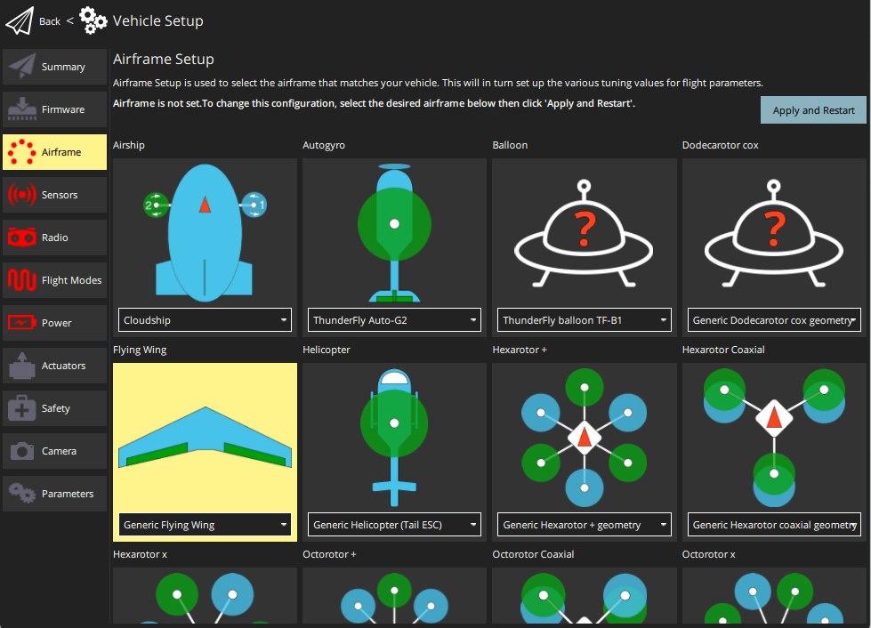

# Wing Wing Z84 Pixracer Збірка

Літаюче крило Wing Wing Z-84 - це каркас літаючого крила.
It is small, rugged and just large enough to host a [Pixracer](../flight_controller/pixracer.md).

Основна Інформація:

- **Frame:** Wing Wing Z-84
- **Flight controller:** Pixracer

## Список деталей

### Z-84 Plug n' Fly (PNF/PNP) або Комплект

Один з цих:

- [Banggood](https://www.banggood.com/Wing-Wing-Z-84-Z84-EPO-845mm-Wingspan-Flying-Wing-PNP-p-973125.html)
- [Hobbyking US Warehouse](https://hobbyking.com/en_us/wing-wing-z-84-epo-845mm-kit.html)

:::tip
PNF (or "PNP") versions include motor, propeller and electronic speed controller.
Версія "комплекту" не включає ці компоненти, які слід окремо придбати.
:::

### Електронний регулятор швидкості (ESC)

One of these (any small (>=12A) ESC will do):

- [Turnigy 20A Brushed ESC ESC](https://hobbyking.com/en_us/turnigy-20a-brushed-esc.html) (Hobbyking)
- [Lumenier Regler 30A BLHeli_S ESC OPTO](https://www.getfpv.com/lumenier-30a-blheli-s-esc-opto-2-4s.html) (GetFPV)

### Автопілот та основні компоненти

- [Pixracer](../flight_controller/pixracer.md) kit (including GPS and power module)
- Приймач FrSky D4R-II або йому еквівалентний (з'єднаний за допомогою перемички з виходом PPM sum відповідно до інструкції)
- [Mini telemetry set](../flight_controller/pixfalcon.md#availability) for Holybro pix32
- [Digital airspeed sensor](../flight_controller/pixfalcon.md#availability) for Holybro pix32 / Pixfalcon
- 1800 mAh 2S LiPo Battery - e.g. [Team Orion 1800mAh 7.4V 50C 2S1P](https://teamorion.com/en/batteries-en/lipo/soft-case/team-orion-lipo-1800-2s-7-4v-50c-xt60-en/)

### Рекомендовані запасні частини

- 1 cm diameter O-ring for prop saver ([Hobbyking](https://hobbyking.com/en_us/wing-wing-z-84-o-ring-10pcs.html))
- 125x110 mm propellers ([Hobbyking](https://hobbyking.com/en_us/gws-ep-propeller-dd-5043-125x110mm-green-6pcs-set.html))

## Підключення

Проведіть дроти до сервоприводів та двигунів, як показано.
Use the `MAIN` outputs (not the ones labeled with AUX).
Регулятор обертань потрібно мати вбудований BEC, оскільки автопілот не живить рейку сервопривода.

| Порт   | Підключення                                                 |
| ------ | ----------------------------------------------------------- |
| RC IN  | PPM або вхід S.BUS / S.BUS2 |
| MAIN 1 | Лівий елерон                                                |
| MAIN 2 | Правий елерон                                               |
| MAIN 3 | Пусто                                                       |
| MAIN 4 | Двигун 1                                                    |

## Журнал збірки

Зображення нижче дають уявлення про процес збирання, який є простим і може бути виконаний за допомогою паяльної пістолета.

## Конфігурація PX4

### Конфігурація планера

Select **Flying Wing > Generic Flying Wing** in the QGroundControl [Airframe Configuration](../config/airframe.md):

### Відображення активатора

Set up the [Actuator Configuration](../config/actuators.md) to match the wiring for the ailerons and throttle as [indicated above](#wiring).

### Інша Конфігурація

Perform all the the other [Basic Configuration](../config/index.md), including [Autotuning](../config/autotune_fw.md).

Advanced tuning is optional - see [Fixed-wing Vehicle Configuration](../config_fw/index.md).
