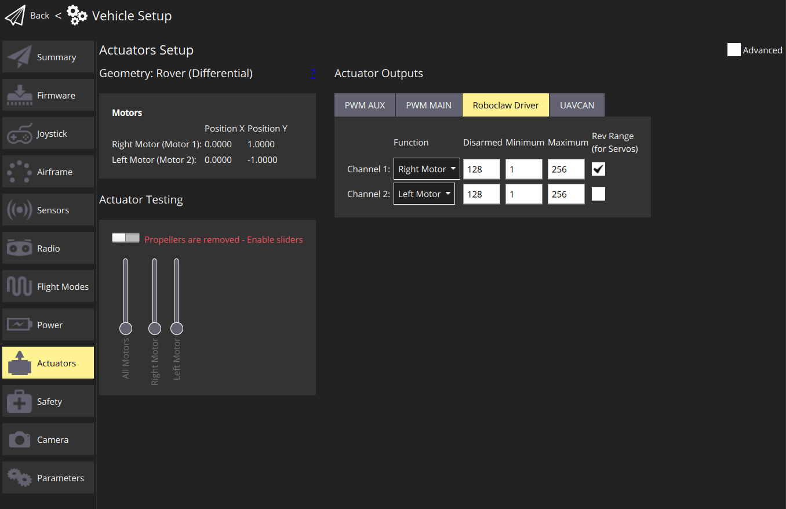

# Aion Robotics R1 UGV

<Badge type="tip" text="PX4 v1.15" />

The [Aion R1](https://www.aionrobotics.com/) vehicle was chosen to test and improve the differential drive support for PX4, and to improve driver support for Roboclaw Motor Controllers, such as the [RoboClaw 2x15A](https://www.basicmicro.com/RoboClaw-2x15A-Motor-Controller_p_10.html).

Документація та інформація про драйвери тут також повинна полегшити роботу з контролерами Roboclaw на інших транспортних засобах, а також з транспортними засобами, такими як [Aion R6](https://www.aionrobotics.com/r6).

На даний момент PX4 підтримує режим MANUAL для цієї настройки.


## Список деталей

- [Aion R1 (Припинено)](https://www.aionrobotics.com/)
  - [Документація](https://github-docs.readthedocs.io/en/latest/r1-ugv.html)
- [RoboClaw 2x15A](https://www.basicmicro.com/RoboClaw-2x15A-Motor-Controller_p_10.html)
  - [Характеристики R1 Roboclaw](https://resources.basicmicro.com/aion-robotics-r1-autonomous-robot/)
- [Auterion Skynode](../companion_computer/auterion_skynode.md)

## Збірка

Збірка складається з рами, виготовленої за допомогою 3D-друку, на яку були закріплені всі частини автопілота.
Для цієї збірки це включає [Auterion Skynode](../companion_computer/auterion_skynode.md), підключений до плати адаптера Pixhawk, яка взаємодіє з контролерами руху RoboClaw через послідовний порт.


:::info
Якщо використовуєте стандартний Pixhawk, ви можете підключити RoboClaw до автопілота без плати адаптера.
:::

RoboClaw повинен бути підключений до відповідного послідовного (UART) порту на контролері польоту, такого як `GPS2` або `TELEM1`.
Інші з'єднання RoboClaw детально описані в розділі [Посібник користувача RoboClaw](https://downloads.basicmicro.com/docs/roboclaw_user_manual.pdf) "Проводка пакетної послідовної передачі даних" та показані нижче (ця настройка була перевірена на сумісність).


## Конфігурація PX4

### Конфігурація Rover

Використовуйте _QGroundControl_ для налаштування рухомого об'єкту:

1. У розділі [Основні налаштування](../config/index.md) виберіть вкладку [Каркас](../config/airframe.md).
2. Оберіть **Aion Robotics R1 UGV** у категорії **Rover**.


### Конфігурація RoboClaw

Спочатку налаштуйте послідовне з'єднання:

1. Перейдіть до розділу [Параметри](../advanced_config/parameters.md) в QGroundControl.

  - Встановіть параметр [RBCLW_SER_CFG](../advanced_config/parameter_reference.md#RBCLW_SER_CFG) на послідовний порт, до якого підключений RoboClaw (наприклад, `GPS2`).
  - [RBCLW_COUNTS_REV](../advanced_config/parameter_reference.md#RBCLW_COUNTS_REV) визначає кількість лічильників енкодера, необхідних для одного оберту колеса.
    Це значення повинно бути залишено на `1200` для протестованого `Контролера руху RoboClaw 2x15A`.
    Відрегулюйте значення на основі вашого конкретного енкодера та налаштувань колеса.
  - Контролери моторів RoboClaw повинні мати унікальну адресу на шині.
    Стандартна адреса - 128, і вам не потрібно її змінювати (якщо ви це робите, оновіть параметр PX4 [RBCLW_ADDRESS](../advanced_config/parameter_reference.md#RBCLW_ADDRESS) відповідно).

    :::info
    PX4 не підтримує кілька контролерів моторів RoboClaw у тому ж транспортному засобі — кожен контролер повинен мати унікальну адресу на шині, і є лише один параметр для встановлення адреси в PX4 (`RBCLW_ADDRESS`).

:::

Потім налаштуйте конфігурацію приводу:

1. Перейдіть до [Конфігурації та тестування приводів](../config/actuators.md) в QGroundControl.
2. Виберіть драйвер RoboClaw зі списку _Виводів приводів_.

  Для призначень каналу, роззброю, мінімальних та максимальних значень, будь ласка, звертайтеся до зображення нижче.

  

  Для систем з більш ніж двома двигунами можливо призначити одну й ту ж функцію кільком двигунам.
  Причина нестандартних значень можна знайти в [Користувацькому посібнику RoboClaw](https://downloads.basicmicro.com/docs/roboclaw_user_manual.pdf) під `Командами сумісності` для `Пакетної послідовної передачі даних`:

  ```plain
  Приводити двигун вперед. Діапазон дійсних даних - від 0 до 127. Значення 127 = повна швидкість вперед, 64 =
  приблизно напівшвидкість вперед і 0 = повна зупинка.
  ```

## Дивись також

- [roboclaw](../modules/modules_driver.md#roboclaw) driver
- [Посібник користувача Roboclaw](https://downloads.basicmicro.com/docs/roboclaw_user_manual.pdf)
