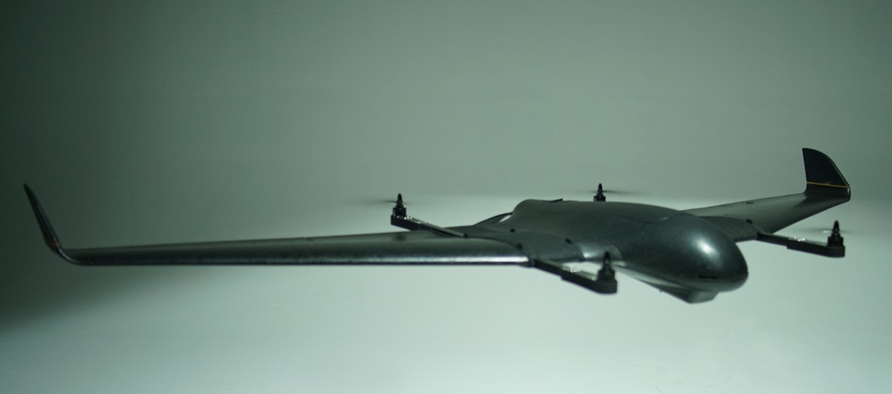

# VTOLs

PX4 використовує термін VTOL для посилання на транспортні засоби, які підтримують як перельоту вперед, як фіксований крило літака ("літак"), так і вертикального зльоту та посадки, як гелікоптер або багтротор.

Літальні апарати VTOL пропонують переваги як багтороторних, так і фіксованих крил:

- **Vertical takeoff and landing:** Even inexperienced pilots can take off and land virtually anywhere.
- **Fast and efficient fixed-wing flight:** Faster, further, and longer missions, carrying heavier payloads.
- **Hovering:** Steady platform for photography, structure scans etc.

Цей розділ описує типи та конфігурації VTOL, які підтримує PX4, та надає високорівневі напрямки для збирання, налаштування та польоту.

## Типи VTOL

PX4 підтримує три найважливіші/основні типи VTOL.

  

    
<a href="tailsitter.html" title="Tailsitter"><big>Tailsitter</big></a>

    

    Ротори постійно в фіксованому положенні крила.
    Злітає та сідає на хвіст. Уся транспортна засіб нахиляється вперед, щоб увійти в режим польоту вперед.
    
    <ul>
      <li>Простий та надійний</li>
      <li>Мінімальний набір приводів</li>
      <li>Може бути важко контролювати, особливо на вітер</li>
      <li>Компроміс між ефективністю у режимі гвинтокрилу та прямолітання, оскільки використовуються одні й ті ж приводи</li>
    </ul>
    

  

  
<a href="tiltrotor.html" title="Tiltrotor"><big>Tiltrotor</big></a>

  
  Ротори обертаються на 90 градусів для переходу від багатокоптерного до орієнтації польоту вперед.
  Злітає та сідає на живіт.
  

  
  <ul>
    <li>Додаткові приводи для нахилу двигуна</li>
    <li>Механічно складний механізм нахилу</li>
    <li>Легше контролювати у режимі гвинтокрилу, ніж у режимі вертикального зльоту через більшу владу над керуванням</li>
  </ul>
  

  
<a href="standardvtol.html" title="Standard VTOL"><big>Standard VTOL</big></a>

  

  Окремі ротори/керування польотом для багтороторника та прямого польоту. Злітає та сідає на живіт.
  
  <ul>
    <li>Додаткова вага від окремих систем пропульсії для гвинтового/впередового польоту</li>
    <li>Найлегше керувати завдяки присвяченим активаторам підйому/переміщення вперед</li>
    <li>Може зависити</li>
    <li>Паливні двигуни для просування вперед можуть бути використані</li>
  </ul>
  

 

Загалом, зі збільшенням механічної складності літаки стають легшими у керуванні, але збільшується вартість та вага.
Кожен тип має переваги й недоліки, і є успішні комерційні проекти, що ґрунтуються на них.

У межах кожного з основних «типів» вище є багато можливих варіацій, наприклад, кількість двигунів, геометрія двигуна, повітряні поверхні тощо.
PX4 provides _airframe configurations_ for many of the more common vehicle setups.
The supported set is listed in [Airframes Reference > VTOL](../airframes/airframe_reference.md#vtol).

::: info

- If the vehicle setup you need is not supported you may need to [Add an Airframe](../dev_airframes/adding_a_new_frame.md) (requires some [PX4 Development](../development/development.md) expertise).
- The VTOL codebase is the same codebase as for all other airframes and just adds additional control logic, in particular for transitions.

:::

## Літання та Режими Польоту

A VTOL aircraft can fly as either a multicopter or as fixed-wing vehicle.
Multicopter mode is mainly used for take off and landing while the fixed-wing mode is used for efficient travel and/or mission execution.

The flight modes for VTOL vehicles are the same as for [multicopter](../flight_modes_mc/index.md) when flying in MC mode and [fixed-wing](../flight_modes_fw/index.md) when flying in FW mode.

The transition between modes is initiated either by the pilot using an RC switch or automatically by PX4 when needed in missions or other auto modes.

## Збірка

:::info
For information about commercial and kit VTOL vehicles see: [Complete Vehicles](../complete_vehicles/index.md)
:::

PX4 controlled vehicles generally share the same core components: a flight controller connected to a power system, GPS, external compass (highly recommended), radio control system (optional) and/or telemetry radio system (optional), and airspeed sensor (highly recommended for VTOL vehicles).

The flight controller outputs are connected to the vehicle motor ESCs and/or flight control servos and actuators, which are separately powered.

The mapping between flight controller outputs and specific controls/motors depends on the vehicle frame used, and is specified in the [Airframes Reference > VTOL](../airframes/airframe_reference.md#vtol).

Assembly information is covered in several sections:

- [Basic Assembly](../assembly/index.md) contains topics shows the setup of core components for a number of popular [flight controllers](../flight_controller/index.md).
 Контролери польоту, для яких у нас немає посібників, зазвичай налаштовуються таким же чином (і майже завжди містять схожі посібники з налаштуванням).
- [Peripherals](../peripherals/index.md) contains information about other peripherals, including [Airspeed Sensors](../sensor/airspeed.md).
- [Airframes Reference > VTOL](../airframes/airframe_reference.md#vtol) explains which flight controller outputs must be connected to different flight controls for each airframe configuration:
 - Виберіть конфігурацію для вашого транспортного засобу, якщо вона існує, оскільки вона буде достатньо попередньо налаштована для польоту (можливо, потребує тільки дрібного налаштування).
 - В іншому випадку виберіть "Загальну конструкцію", яка відповідає вашому транспортному засобу.

In addition, build logs showing how others have set up different types of vehicles are provided as sub topics.
For example see [FunCub QuadPlane](../frames_vtol/vtol_quadplane_fun_cub_vtol_pixhawk.md).

## Налаштування

VTOL configuration is covered in a number of sections:

- [Basic Configuration](../config/index.md) - Configuration that is common to all vehicle types (sensors, safety systems, batteries etc).
- [VTOL Specific Configuration](../config_vtol/index.md)
- [Peripheral Hardware](../peripherals/index.md) - Configuration for optional hardware and sensors.
- [Advanced Configuration](../advanced_config/index.md): Additional configuration covering factory tuning and advanced and optional configuration.

## Відео

### Освітній

VTOL Control & Airspeed Fault Detection (PX4 Developer Summit 2019)

<lite-youtube videoid="37BIBAzD6fE" title="VTOL control and airspeed fault detection"/>

<!-- 20190704 -->

### Tailsitter

[UAV Works VALAQ Patrol Tailsitter](https://www.valaqpatrol.com/valaq_patrol_technical_data/)

<lite-youtube videoid="pWt6uoqpPIw" title="UAV Works VALAQ"/>

[TBS Caipiroshka](../frames_vtol/vtol_tailsitter_caipiroshka_pixracer.md)

<lite-youtube videoid="acG0aTuf3f8" title="PX4 VTOL - Call for Testpilots"/>

### Tiltrotor

[Convergence Tiltrotor](../frames_vtol/vtol_tiltrotor_eflite_convergence_pixfalcon.md)

<lite-youtube videoid="E61P2f2WPNU" title="E-flite Convergence Autonomous Mission Flight"/>

### QuadPlane VTOL

[FunCub QuadPlane](../frames_vtol/vtol_quadplane_fun_cub_vtol_pixhawk.md)

<lite-youtube videoid="4K8yaa6A0ks" title="Fun Cub PX4 VTOL Maiden"/>

[Falcon Vertigo QuadPlane](../frames_vtol/vtol_quadplane_falcon_vertigo_hybrid_rtf_dropix.md)

<lite-youtube videoid="h7OHTigtU0s" title="PX4 Vtol test"/>

[Ranger QuadPlane](../frames_vtol/vtol_quadplane_volantex_ranger_ex_pixhawk.md)

<lite-youtube videoid="7tGXkW6d3sA" title="PX4 Autopilot - Experimental VTOL with Pixhawk and U-Blox M8N GPS"/>
