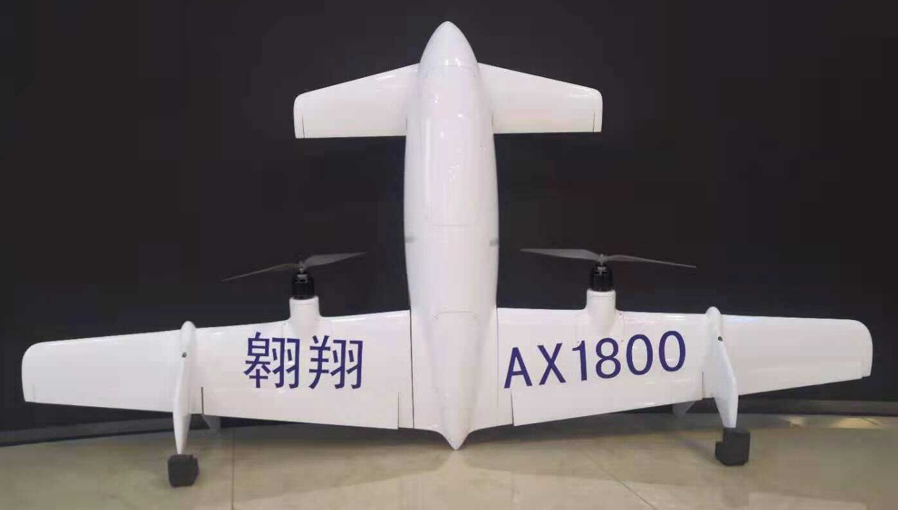

# Тейлсіттер

A **Tailsitter VTOL** takes off and lands on its tail, but flips into the fixed-wing orientation for normal flight.
Ротори тейлсіттера постійно зафіксовані в положенні для польоту вперед.

Tailsitters are typically mechanically less complex than [other types of VTOL](../frames_vtol/index.md), and hence may be less expensive to build and maintain.
Однак вони мають складнішу аеродинаміку, їх важче налаштовувати і керувати ними в режимі вертикального зльоту і переходу, особливо у вітряну погоду.

## Тейлсіттер фрейми

:::: tabs

:::tab Duo Tailsitter
Two rotor VTOL that uses elevons to flip from hover into fixed-wing flight.

- Прямолінійний політ більш ефективний
- Важче зависати в повітрі, особливо під час вітру
- Важче налаштувати наведення та перехід
- Більш компактний форм-фактор

:::

:::tab VTOL Tailsitter
VTOL with optional elevons. Використовує ротори для переходу між режимами (разом з елеронами, якщо вони є).

- У режимі зависання керувати літальним апаратом легше, він є більш стабільним
- Менш компактний форм-фактор (важче транспортувати)
- Підтримується конфігурація роторів "X" та "+" (див. Airframe Reference)

:::

::::

Duo Tailsitters зазвичай більш ефективні в крейсерському польоті (4 менших гвинта менш ефективні, ніж 2 більших) і фізично більш компактні.
Однак, оскільки аеродинамічно вони набагато складніші в режимі зависання, їх набагато важче налаштовувати як для зависання, так і для переходу.
Квадрокоптерам легше літати в режимі зависання, і вони більш стабільні у вітряну погоду.
Обидва варіанти підтримуються за допомогою одного типу айфреймів у PX4.

## Налаштування/політ

VTOL setup and flying are covered in the [VTOL](../frames_vtol/index.md) parent topic.

:::info
The instructions are essentially the same for all VTOL.
Основні специфічні для рами відмінності - це електропроводка двигуна та деякі аспекти тюнінгу конфігурації.
:::

## Журнали збірки

Нижче наведені покрокові інструкції з налаштування PX4 на фреймах з тайлсіттером:

- [TBS Caipiroshka Tailsitter Build (Pixracer)](../frames_vtol/vtol_tailsitter_caipiroshka_pixracer.md)

:::tip
We recommend that you also review build logs for other PX4 VTOL, and Copter vehicles (most of the setup is the same).
:::

## Відео

This section contains videos that are specific to Tailsitter VTOL (videos that apply to all VTOL types can be found in [VTOL](../frames_vtol/index.md)).

### Duo

---

[TBS Caipiroshka](../frames_vtol/vtol_tailsitter_caipiroshka_pixracer.md) - Tailsitter takeoff (close up), hover, level flight, transitions.

<lite-youtube videoid="acG0aTuf3f8" title="PX4 VTOL - Call for Testpilots"/>

---

[Woshark](http://www.laarlab.cn/#/) _PX4 Tailsitter prototype_ - Tailsitter takeoff, transition, landing.

<!-- provided by slack user xdwgood: https://github.com/PX4/PX4-user_guide/issues/2328#issuecomment-1467234118 -->

<!-- Update issue https://github.com/PX4/PX4-user_guide/issues/3007 -->

<lite-youtube videoid="gjHj6YsxcZk" title="PX4 Autopilot Tailsitter"/>

### Quad

[UAV Works VALAQ Patrol Tailsitter](https://www.valaqpatrol.com/valaq_patrol_technical_data/) - Tailsitter takeoff, transition, landing.

<lite-youtube videoid="pWt6uoqpPIw" title="UAV Works VALAQ"/>

## Галерея

  

    
<big><a href="https://wingtra.com/mapping-drone-wingtraone/">WingtraOne</a></big>

    

    
    

  

  

    
<big><a href="https://www.skypull.technology/">Skypull</a></big>

    

      
    

  

  

    
<big><a href="../frames_vtol/vtol_tailsitter_caipiroshka_pixracer.html">TBS Caipiroshka</a></big>

    

      
    

  

  

    
<big><a href="http://uav-cas.ac.cn/WOSHARK/">Woshark</a></big>

    

      
    

  

  

    
<big><a href="https://www.valaqpatrol.com/valaq_patrol_technical_data/">UAV Works VALAQ Patrol Tailsitter</a></big>

    

      
    

  

