# Припинено: Falcon Vertigo Hybrid VTOL RTF (Dropix)

:::warning
Discontinued
The Falcon Venturi FPV Wing frame on which this vehicle is based is no longer available.
:::

The _Falcon Vertigo Hybrid VTOL_ is a quadplane VTOL aircraft that has been designed to work with PX4 and the Dropix (Pixhawk compatible) flight controller. Він може нести невелику камеру GoPro.

Набір RTF містить все необхідне для повної системи, за винятком приймача RC та телеметричного модуля.
Компоненти також можуть бути куплені окремо.

Основна Інформація:

- **Frame:** Falcon Vertigo Hybrid VTOL
- **Flight controller:** Dropix
- **Wing span:** 1.3m

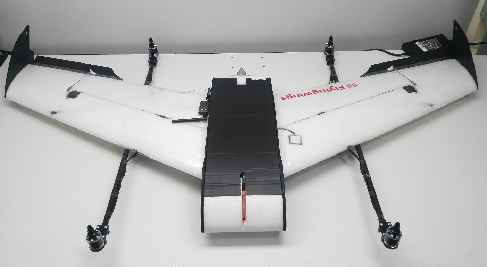

## Специфікація матеріалів

Майже все необхідне надається в комплекті RTF (посилання поруч з компонентами нижче надаються у випадку, якщо ви бажаєте придбати будь-який компонент окремо):

- Попередньо ламіновані крила з EPP
- Кінчики крил і повне обладнання
- Контролер польоту Dropix (знято з виробництва) з
  - GPS u-blox M8N
  - Датник живлення
  - [Airspeed Sensor](https://store-drotek.com/793-digital-differential-airspeed-sensor-kit-.html)
- Quad power set  [Tiger Motor MT-2216-11 900kv V2](https://www.getfpv.com/tiger-motor-mt-2216-11-900kv-v2.html) (discontinued)
- 4 x пропелер 10”x 5” (квадро-мотори)
- 4 x [ESC 25A](http://www.getfpv.com/tiger-motor-flame-25a-esc.html)
- 1 x пропелер 10” x 5” (двигун-штовхач)
- 1 x ESC 30A
- Система потужності двигуна-штовхача
- Вуглецеві труби та кріплення
- Кронштейни для мотора G10
- 1 x [3700mah 4S 30C Lipo battery](https://www.overlander.co.uk/batteries/lipo-batteries/power-packs/3700mah-4s-14-8v-25c-lipo-battery-overlander-sport.html)
- Плата розподілу живлення Dropix та кабель

Набір не постачається з радіоприймачем або (опціональними) модулями телеметрії.
Для цієї конфігурації ми використали наступні компоненти:

- Receiver: [FrSSKY D4R-II](https://www.frsky-rc.com/product/d4r-ii/)
- Telemetry: [Holybro 100mW 915MHz modules](https://www.getfpv.com/holybro-100mw-fpv-transceiver-telemetry-radio-set-915mhz.html) (Discontinued)

## Необхідні інструменти

Наступні інструменти використовувалися для збирання корпусу повітряного судна:

- Шуруповерт Phillips
- 5.5 мм шестигранник гайковерт
- Кусачки
- 1x паяльник та припій
- Hobby пінцет з нержавіючої сталі
- Клей Gorilla
- Скловолоконна армована стрічка

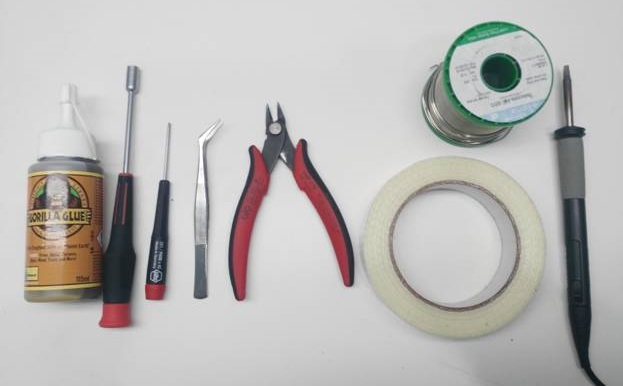

## Кроки збірки

Набір RTF потребує наступного монтажу.

### Крок 1: Прикріпіть кріплення двигунів

1. Нанесіть клей Gorilla всередину кронштейнів крила, як показано.

  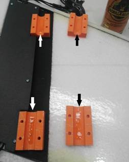

2. Вкріпіть карбонову трубку в держаки. Для вирівнювання піддона та трубки слід використовувати білу позначку (як показано на зображенні).

  ::: info
  This is very important because the white mark indicates the center of gravity.

:::

  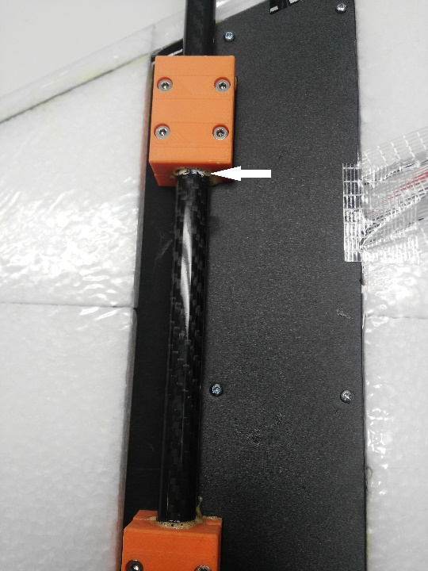

3. Наступні зображення показують вирівнювання стержнів з інших точок зору:

  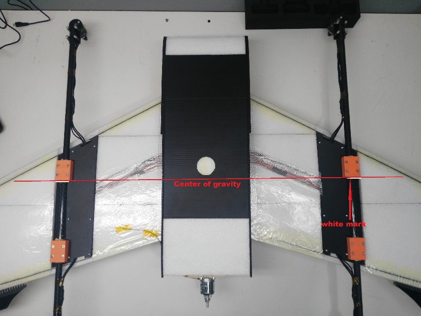
  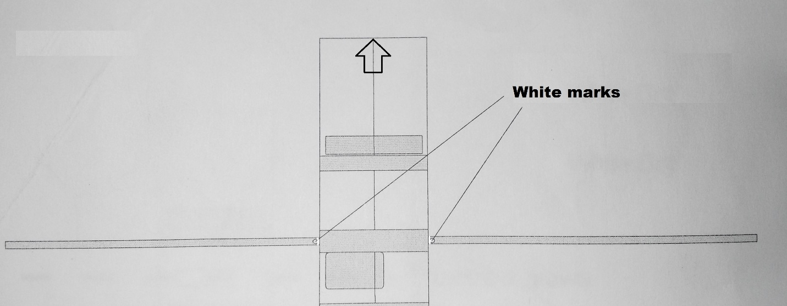

### Крок 2: Прикріпіть крила

1. Вставте обидві вуглецеві труби в фюзеляж.

  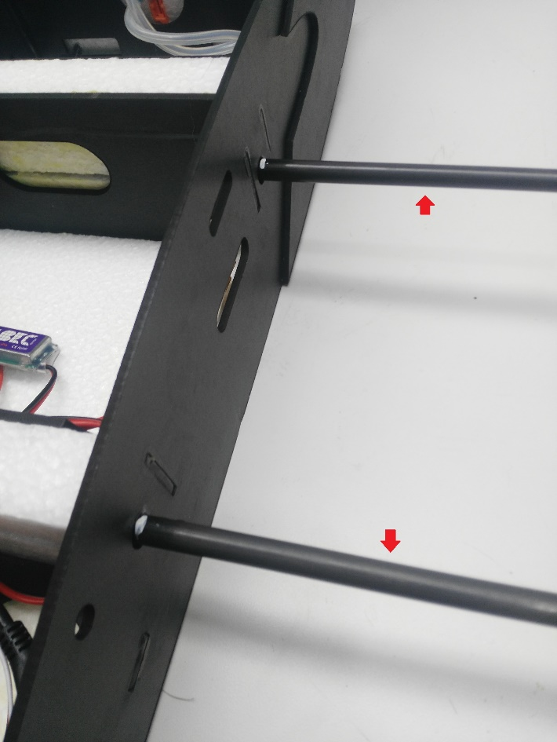

2. Нанесіть клей gorilla між двома білими позначками на кожну трубку (вказано червоними стрілками). Білий знак по центру (синя стрілка) буде розміщений в центрі фюзеляжу, а інші знаки - по боках.

  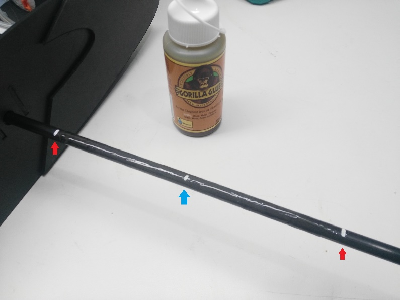

3. Після того, як вуглецеві трубки знаходяться всередині фюзеляжу, розподіліть клей gorilla на решту трубки та прикріпіть крила.

4. Фюзеляж має два отвори для кабелів двигуна та сервоприводів. Пропустіть кабелі через отвори, а потім приєднайте крила до фюзеляжу.

  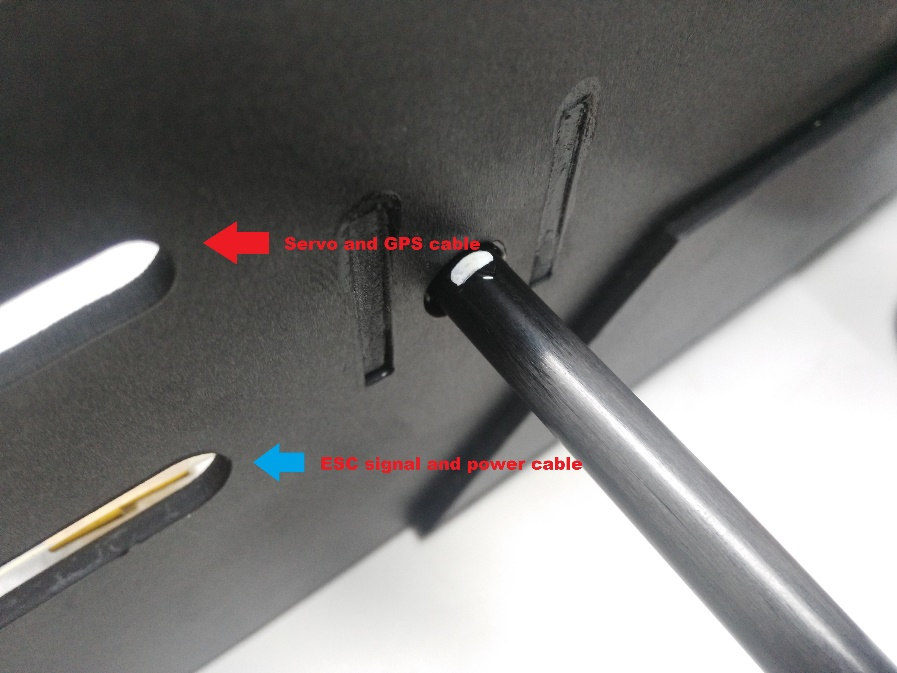

5. Усередині фюзеляжу під'єднайте сигнальні кабелі, які ви щойно прокинули з крил до регулятора ESC, використовуючи надані роз'єми. Регулятори швидкості ESC вже підключені до двигунів і налаштовані на обертання в правильному порядку (вам потрібно буде підключити ESC PDB до модуля живлення на пізнішому етапі).

  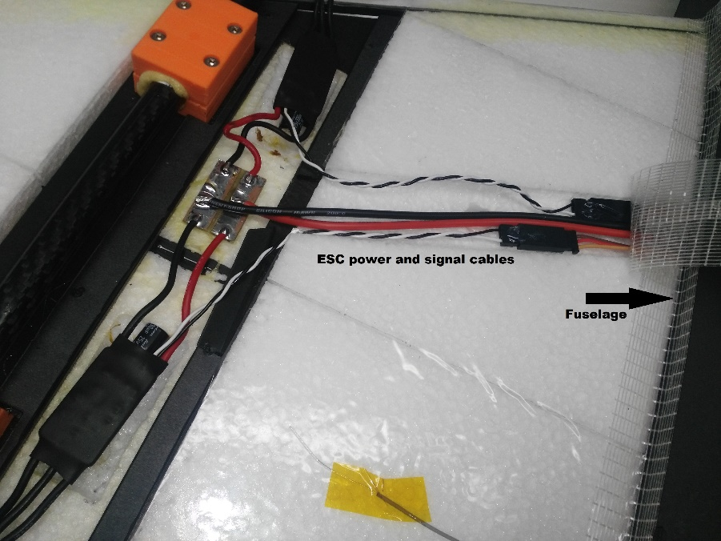

6. Так само, як і з ESC, сервопристосування вже встановлені. Підключіть сигнальний кабель з крила (проходить через фюзеляж) до контролера польоту.

  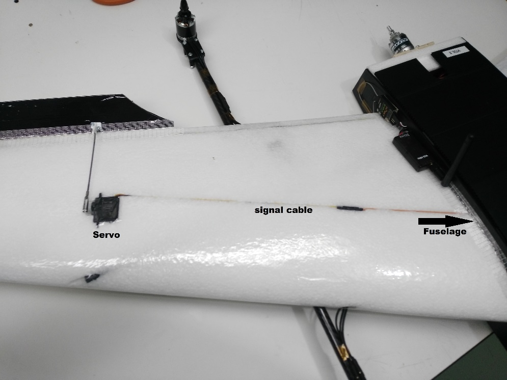

7. Повторіть ці кроки для іньшого крила.

### Крок 3: Підключіть електроніку

Цей комплект включає контролер польоту Dropix з вже підключеною більшістю необхідної електроніки (якщо ви використовуєте інший контролер польоту, сумісний з Pixhawk, підключення схожі).

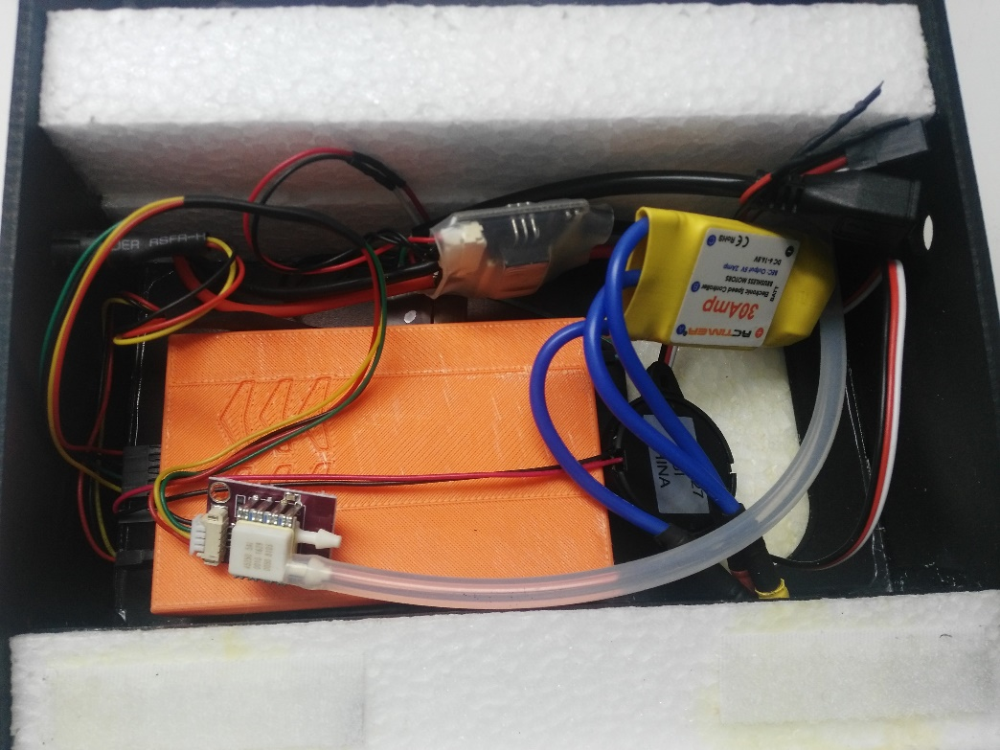

:::info
General information about connecting Dropix can be found in [Dropix Flight Controller](../flight_controller/dropix.md).
:::

#### Підключіть роз'єм живлення ESC та прокладіть кабелі сигналів до контролера польоту

1. Підключіть ЕСС до модуля живлення за допомогою роз'єму XT60

  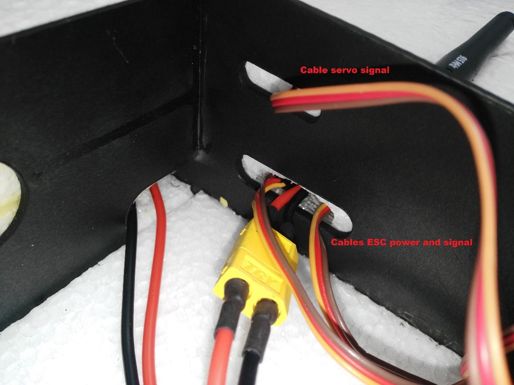

2. Передайте кабелі сигналів до контролера польоту

  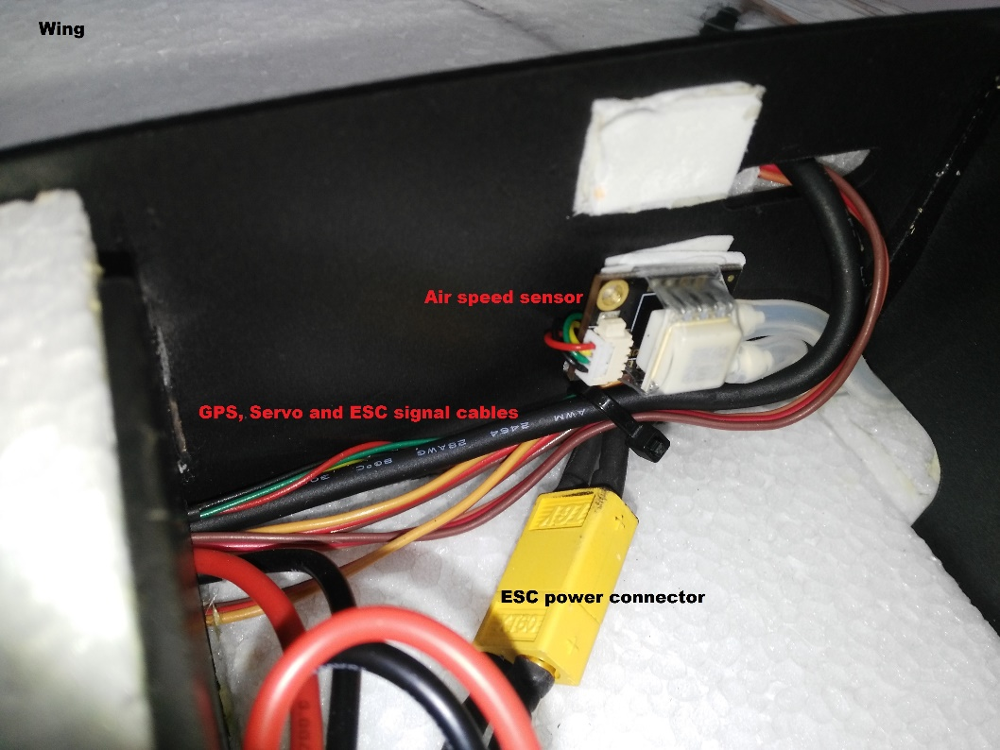

#### Підключення двигуна

Motor and servo wiring is nearly entirely up to you, but should match the [Generic Standard VTOL](../airframes/airframe_reference.md#vtol_standard_vtol_generic_standard_vtol) configuration, as shown in the airframe reference.
The geometry and output assignment can be configured in the [Actuators Configuration](../config/actuators.md#actuator-outputs)

Наприклад, ви можете з’єднати його так, як у цьому прикладі (орієнтація як у "сидячи в літаку"):

| Порт   | Підключення                |
| ------ | -------------------------- |
| MAIN 1 | Передній правий мотор, CCW |
| MAIN 2 | Задній лівий мотор, CCW    |
| MAIN 3 | Передній лівий мотор, CW   |
| MAIN 4 | Задній правий мотор, CW    |
| AUX  1 | Лівий елерон               |
| AUX  2 | Правий елерон              |
| AUX  3 | Elevator                   |
| AUX  4 | Rudder                     |
| AUX  5 | Тяга                       |

#### Підключення контролера польоту: Мотори, Сервомеханізми, Приймач RC, датчик струму

Нижче показане зображення задньої плати керування польотом dropix, підкреслюючи вихідні контакти для підключення кабелів квадрокоптерних моторів, кабелів сигналу елерону, мотору, дросельного мотору, а також контактів поточного сенсора та введення радіоприймача (RC IN).

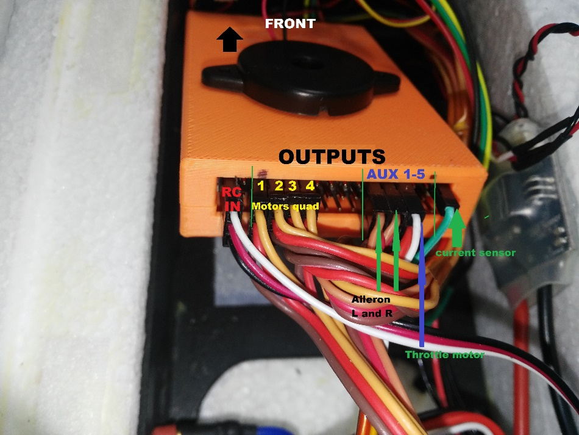

1. Підключіть сигнальні кабелі квадро моторів.

2. Підключіть кабелі елеронів та мотора керування ручкою газу в допоміжні виходи.

3. Підключіть кабель сигналу двигуна дроселя від ESC до відповідного допоміжного порту контролера польоту. Підключіть ESC до регулятора газу.

  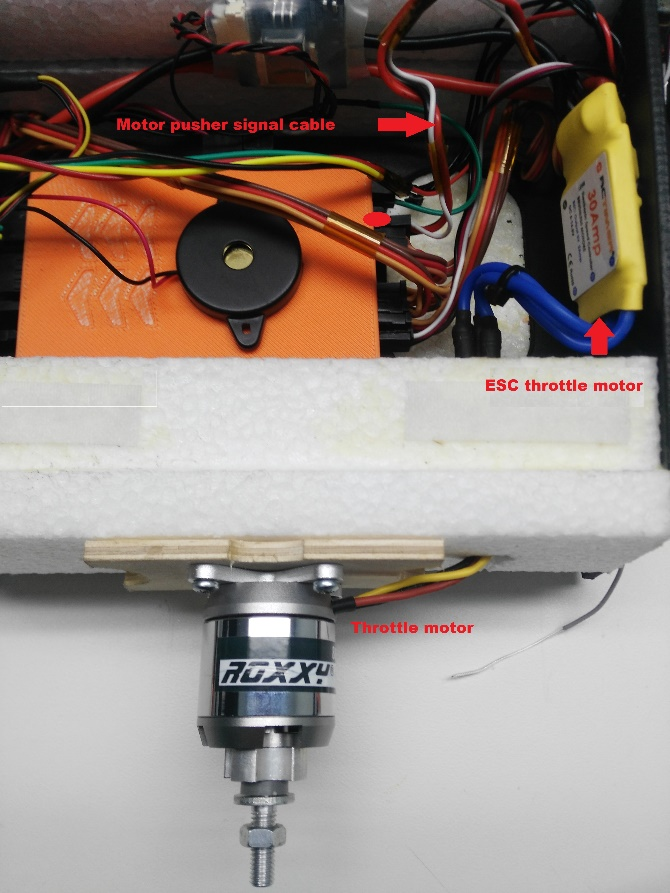

4. Підключіть приймач (RC IN).

#### Підключення контролера польоту: телеметрія, датчик швидкості повітря, GPS, сигналізація та перемикач безпеки

Датчикові входи, телеметрія, сигналізація та безпечний вимикач розташовані з переднього боку керування польотом, як показано на схемі підключення нижче.

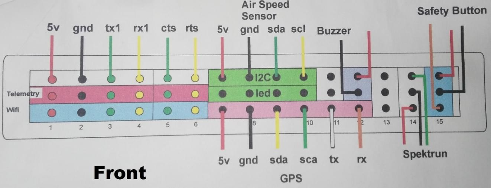

1. Підключіть телеметрію, датчик швидкості, GPS, гудок та безпечний перемикач, як показано.

  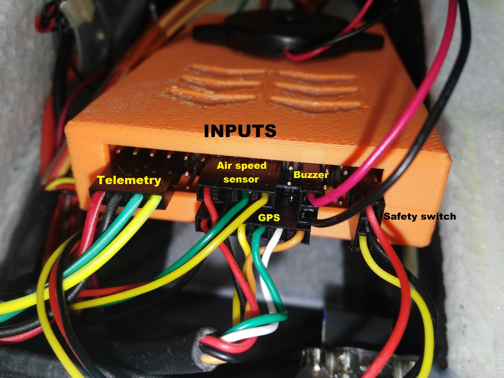

#### Контролер польоту: Підключіть модуль живлення та зовнішній USB

Входи для порту USB, модуля живлення та зовнішнього USB розташовані на правому боці контролера польоту.

1. Підключіть живлення та USB, як показано

  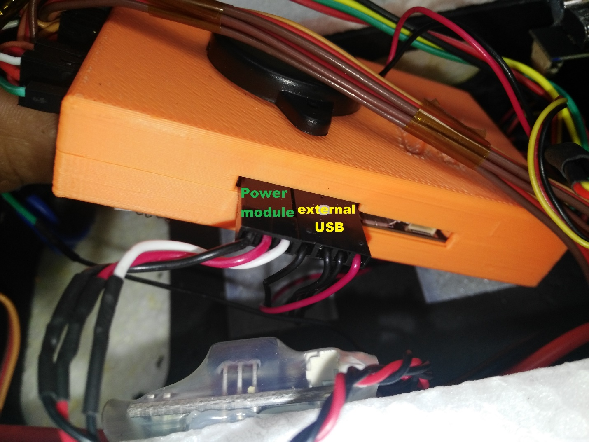

:::tip
The external USB is optional.
Він повинен бути використано, якщо доступ до порту USB ускладнений після закріплення контролера польоту.
:::

#### Встановіть пітотрубку (датчик швидкості)

Труба пітота встановлена спереду літака й підключена до датчика швидкості через трубу.

:::warning
It is important that nothing obstructs airflow to the Pitot tube. Це критично для фіксованих крил та для переходу від квадрокоптера до літака.
:::

1. Встановіть трубку Піто у передній частині літака

  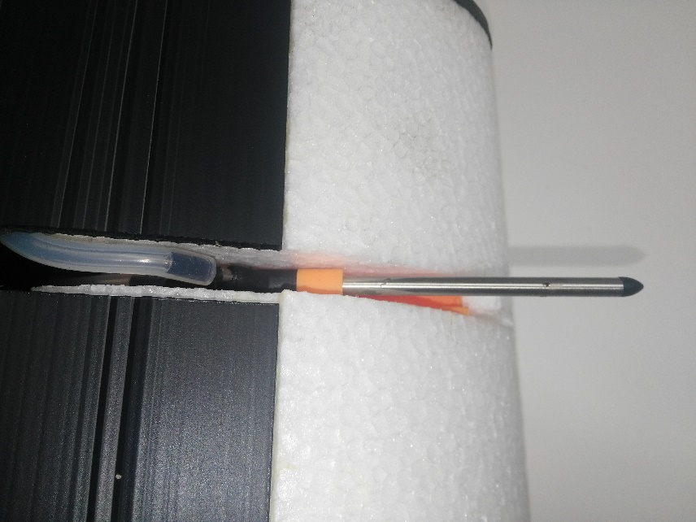

2. Зафіксуйте з'єднуючі трубки та переконайтеся, що вони не зігнуті / пом'яті.

  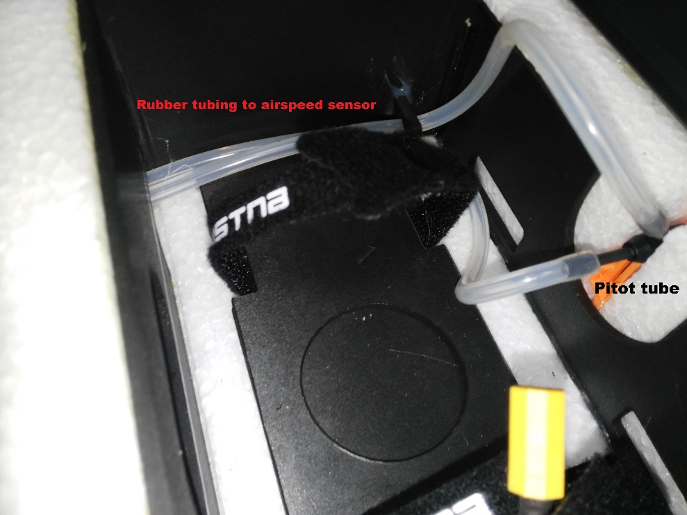

3. Підключіть трубки до датчика швидкості.

  

#### Встановлення/підключення приймача та модуля телеметрії

1. Вставте приймач та телеметричний модуль на зовнішню сторону рами транспортного засобу.

  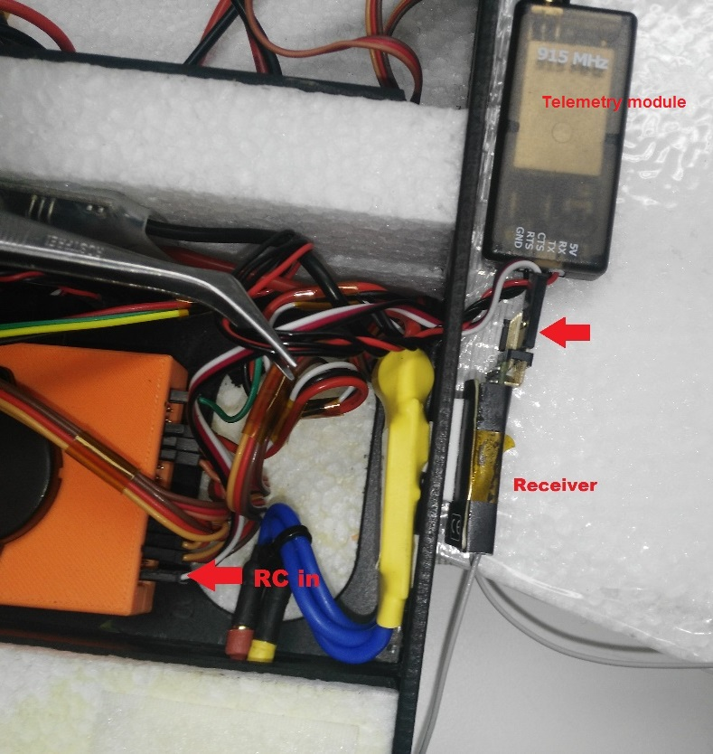

2. Connect the receiver to the RC IN port on the _back_ of the dropix, as shown above (also see the [flight controller instructions](#dropix_back)).

3. Connect the telemetry module to the _front_ of the flight controller as shown below (see the [flight controller instructions](#dropix_front) for more detail on the pins).

  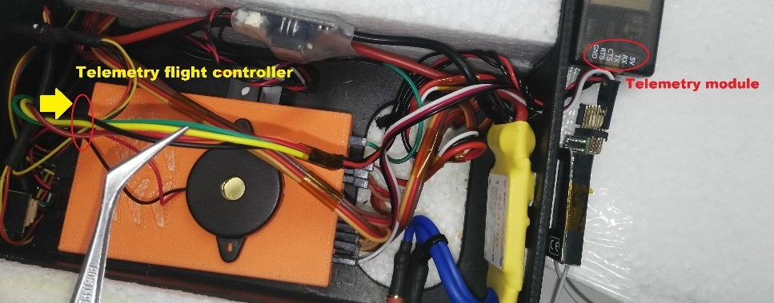

#### Модуль GPS/Компас

Модуль GPS/Компас вже встановлено на крило в типовому положенні. Вам не потрібно робити щось додаткове для цього!

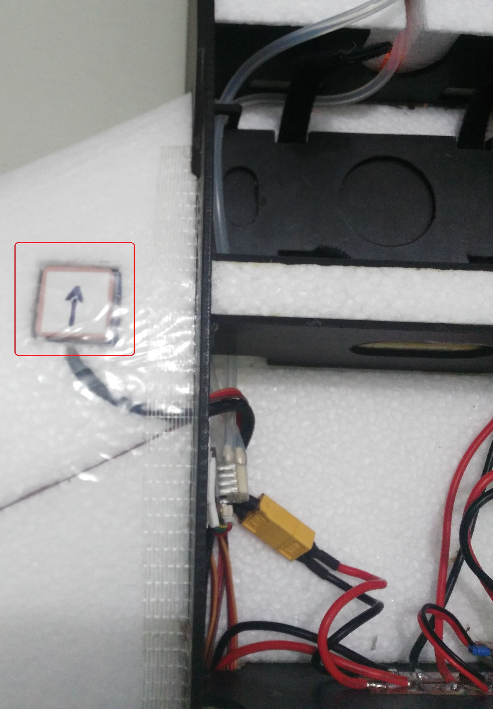

#### Монтаж та орієнтація політного контролера

1. Встановіть орієнтацію вашого політ контролеру на 270 градусів.

  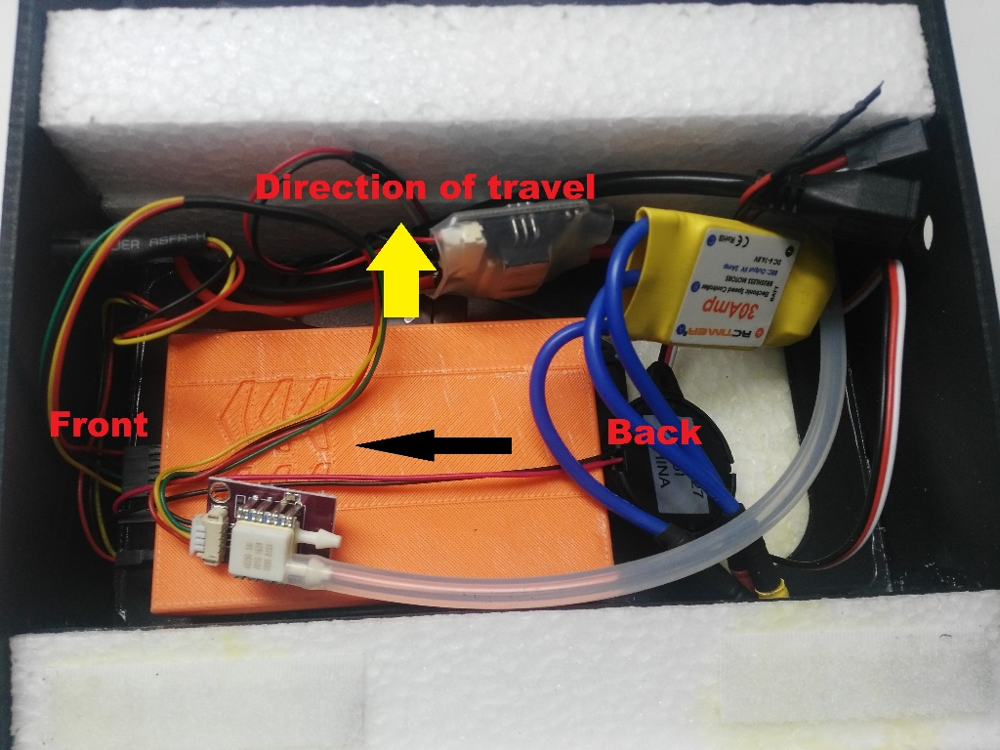

2. Закріпіть контролер на місці за допомогою піни для поглинання вібрації.

### Крок 4: Перевірка остаточної збірки

Останнім етапом збирання є перевірка стійкості дрона та правильності налаштування двигунів.

1. Перевірте, що двигуни обертаються у правильних напрямках (як у діаграмі QuadX нижче).

  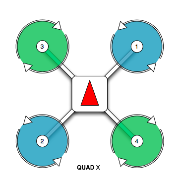

  ::: info
  If necessary the servo direction can be reversed using the `Rev Range (for servos)` checkbox associated with each servo output in the QGroundControl [Actuator Output](../config/actuators.md#actuator-outputs) configuration (for servos only) (this sets the [PWM_AUX_REV](../advanced_config/parameter_reference.md#PWM_AUX_REV) or [PWM_AUX_MAIN](../advanced_config/parameter_reference.md#PWM_MAIN_REV) parameter).

:::

2. Перевірте, чи транспортний засіб збалансований навколо очікуваного центру мас

  - Утримуйте транспортний засіб пальцями у центрі ваги та переконайтеся, що транспортний засіб залишається стабільним.

    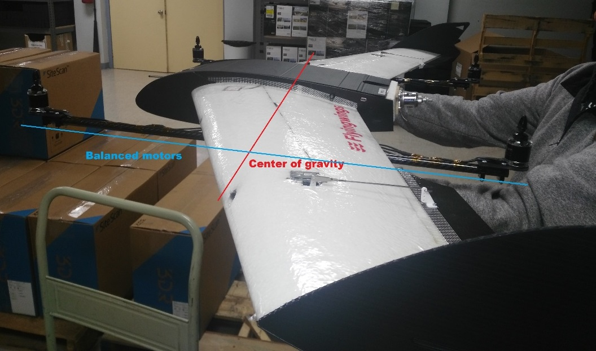

  - Якщо транспортний засіб нахиляється вперед або назад, перемістіть двигуни, щоб утримати рівновагу.

    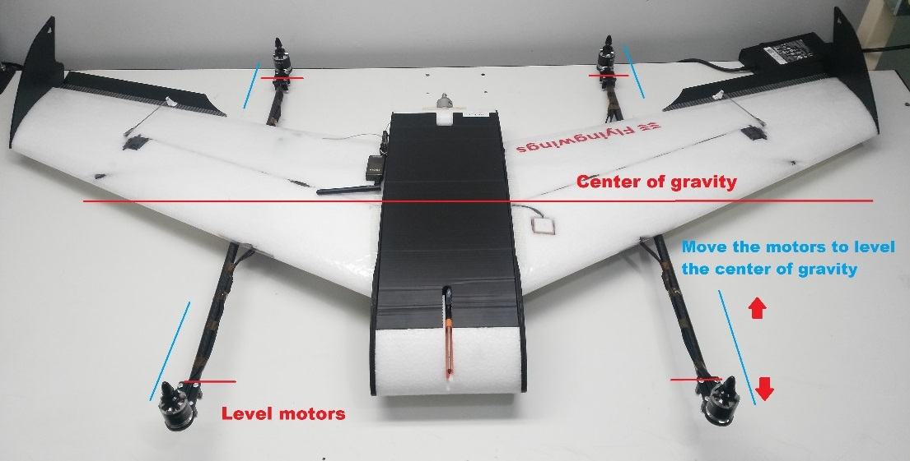

## Налаштування

Perform the normal [Basic Configuration](../config/index.md).

Примітки:

1. For [Airframe](../config/airframe.md) select the vehicle group/type as _Standard VTOL_ and the specific vehicle as [Generic Standard VTOL](../airframes/airframe_reference.md#vtol_standard_vtol_generic_standard_vtol) as shown below.

  

2. Set the [Autopilot Orientation](../config/flight_controller_orientation.md) to `ROTATION_YAW_270` as the autopilot is mounted [sideways](#flight_controller_orientation) with respect to the front of the vehicle. The compass is oriented forward, so you can leave that at the default (`ROTATION_NONE`).

3. Configure the outputs and geometry following the instructions in [Actuators Configuration](../config/actuators.md)

4. За замовчуванням параметри часто достатні для стабільного польоту. For more detailed tuning information see [Standard VTOL Wiring and Configuration](../config_vtol/vtol_quad_configuration.md).

Після завершення калібрування, VTOL готовий до польоту.

## Відео

<lite-youtube videoid="h7OHTigtU0s" title="PX4 Vtol test"/>

## Підтримка

If you have any questions regarding your VTOL conversion or configuration please visit <https://discuss.px4.io/c/px4/vtol>.
