# Припинено: Falcon Vertigo Hybrid VTOL RTF (Dropix)

:::warning
Discontinued
The Falcon Venturi FPV Wing frame on which this vehicle is based is no longer available.
The Dropix FC used by this vehicle is discontinued.
:::

The _Falcon Vertigo Hybrid VTOL_ is a quadplane VTOL aircraft that has been designed to work with PX4 and the Dropix (Pixhawk compatible) flight controller. Він може нести невелику камеру GoPro.

Набір RTF містить все необхідне для повної системи, за винятком приймача RC та телеметричного модуля.
Компоненти також можуть бути куплені окремо.

Основна Інформація:

- **Frame:** Falcon Vertigo Hybrid VTOL
- **Flight controller:** Dropix (Discontineud)
- **Wing span:** 1.3m

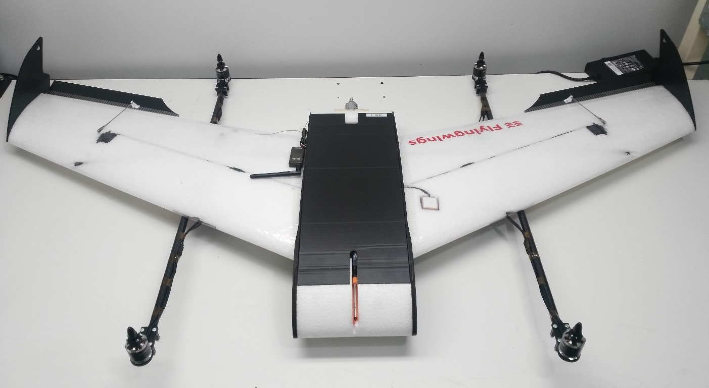

## Специфікація матеріалів

Майже все необхідне надається в комплекті RTF (посилання поруч з компонентами нижче надаються у випадку, якщо ви бажаєте придбати будь-який компонент окремо):

- Попередньо ламіновані крила з EPP
- Кінчики крил і повне обладнання
- Контролер польоту Dropix (знято з виробництва) з
  - GPS u-blox M8N
  - Датник живлення
  - [Airspeed Sensor](https://store-drotek.com/793-digital-differential-airspeed-sensor-kit-.html)
- Quad power set [Tiger Motor MT-2216-11 900kv V2](https://www.getfpv.com/tiger-motor-mt-2216-11-900kv-v2.html) (discontinued)
- 4 x пропелер 10”x 5” (квадро-мотори)
- 4 x [ESC 25A](https://www.getfpv.com/tiger-motor-flame-25a-esc.html)
- 1 x пропелер 10” x 5” (двигун-штовхач)
- 1 x ESC 30A
- Система потужності двигуна-штовхача
- Вуглецеві труби та кріплення
- Кронштейни для мотора G10
- 1 x [3700mah 4S 30C Lipo battery](https://wheelspinmodels.co.uk/i/3700mah-4s-14.8v-25c-lipo-battery-overlander-262221/)
- Плата розподілу живлення Dropix та кабель

Набір не постачається з радіоприймачем або (опціональними) модулями телеметрії.
Для цієї конфігурації ми використали наступні компоненти:

- Receiver: [FrSSKY D4R-II](https://www.frsky-rc.com/product/d4r-ii/)
- Telemetry: [Holybro 100mW 915MHz modules](https://www.getfpv.com/holybro-100mw-fpv-transceiver-telemetry-radio-set-915mhz.html) (Discontinued)

## Необхідні інструменти

Наступні інструменти використовувалися для збирання корпусу повітряного судна:

- Шуруповерт Phillips
- 5.5 мм шестигранник гайковерт
- Кусачки
- 1x паяльник та припій
- Hobby пінцет з нержавіючої сталі
- Клей Gorilla
- Скловолоконна армована стрічка

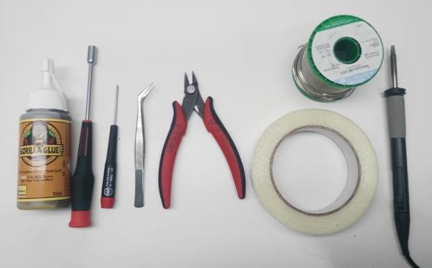

## Кроки збірки

Набір RTF потребує наступного монтажу.

### Крок 1: Прикріпіть кріплення двигунів

1. Нанесіть клей Gorilla всередину кронштейнів крила, як показано.

   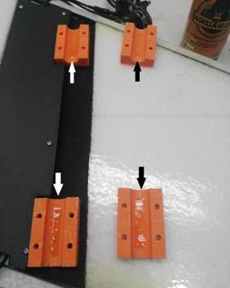

2. Вкріпіть карбонову трубку в держаки. Для вирівнювання піддона та трубки слід використовувати білу позначку (як показано на зображенні).

   ::: info
   This is very important because the white mark indicates the center of gravity.

:::

   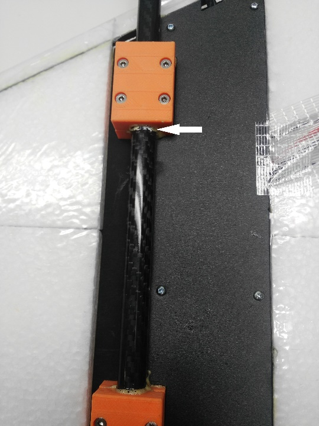

3. Наступні зображення показують вирівнювання стержнів з інших точок зору:

   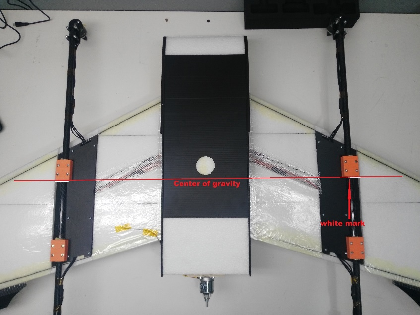
   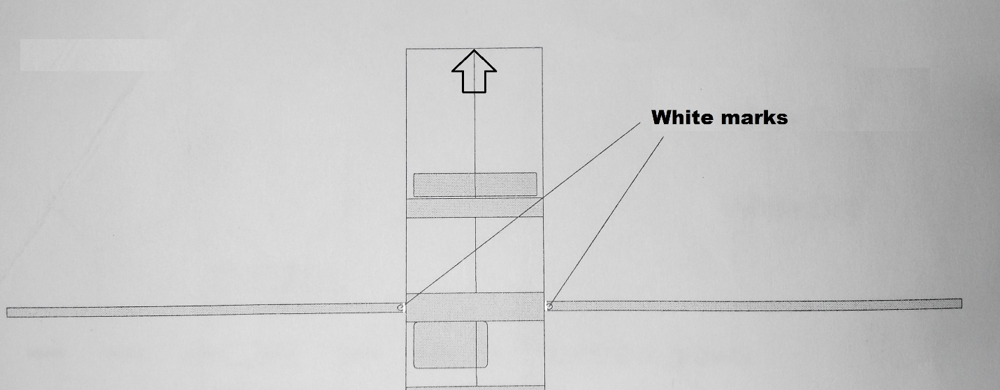

### Крок 2: Прикріпіть крила

1. Вставте обидві вуглецеві труби в фюзеляж.

   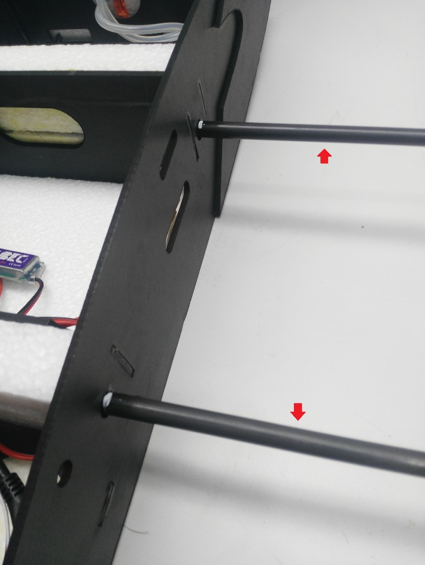

2. Нанесіть клей gorilla між двома білими позначками на кожну трубку (вказано червоними стрілками). Білий знак по центру (синя стрілка) буде розміщений в центрі фюзеляжу, а інші знаки - по боках.

   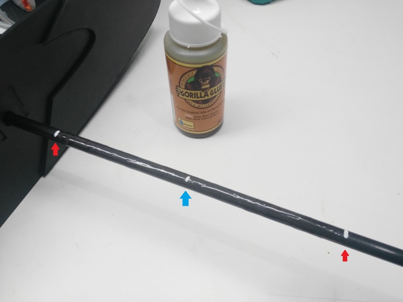

3. Після того, як вуглецеві трубки знаходяться всередині фюзеляжу, розподіліть клей gorilla на решту трубки та прикріпіть крила.

4. Фюзеляж має два отвори для кабелів двигуна та сервоприводів. Пропустіть кабелі через отвори, а потім приєднайте крила до фюзеляжу.

   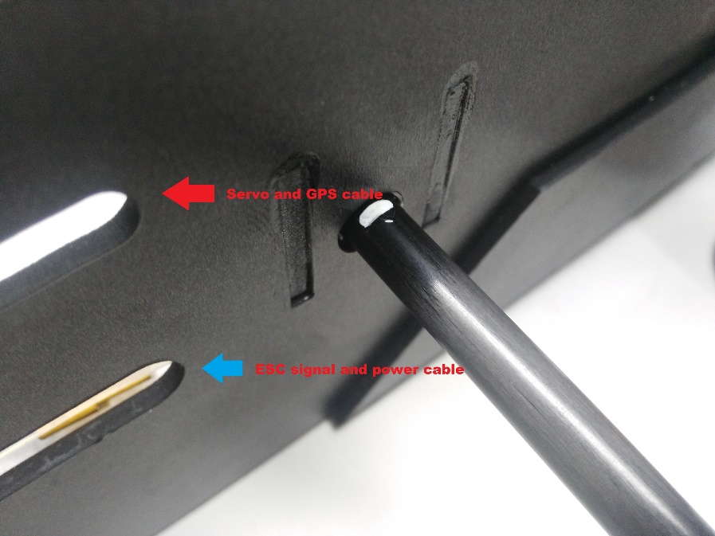

5. Усередині фюзеляжу під'єднайте сигнальні кабелі, які ви щойно прокинули з крил до регулятора ESC, використовуючи надані роз'єми. Регулятори швидкості ESC вже підключені до двигунів і налаштовані на обертання в правильному порядку (вам потрібно буде підключити ESC PDB до модуля живлення на пізнішому етапі).

   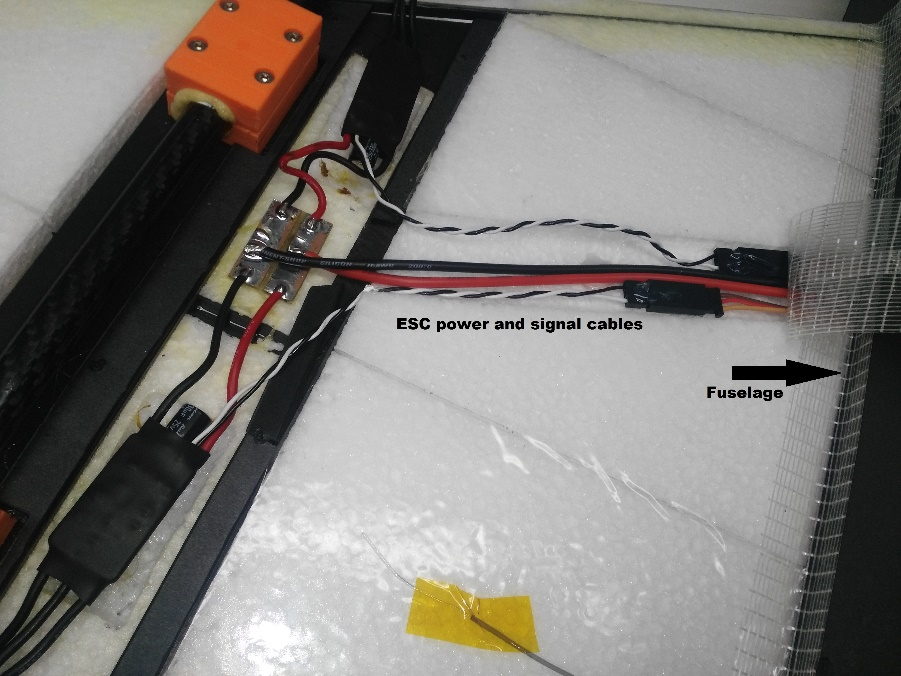

6. Так само, як і з ESC, сервопристосування вже встановлені. Підключіть сигнальний кабель з крила (проходить через фюзеляж) до контролера польоту.

   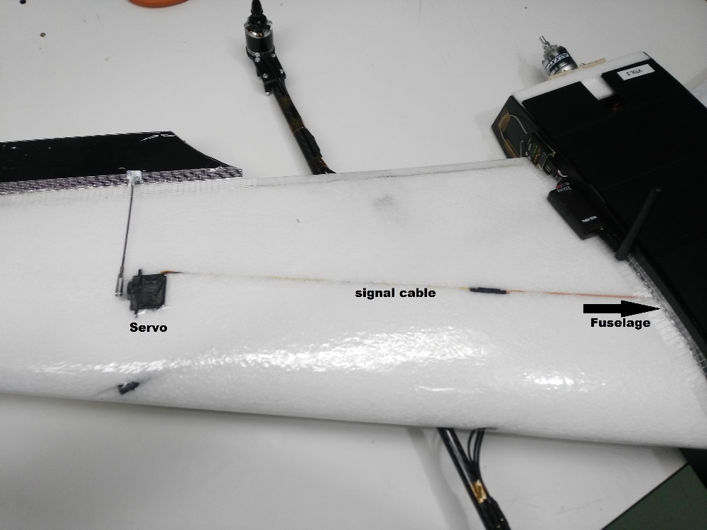

7. Повторіть ці кроки для іньшого крила.

### Крок 3: Підключіть електроніку

Цей комплект включає контролер польоту Dropix з вже підключеною більшістю необхідної електроніки (якщо ви використовуєте інший контролер польоту, сумісний з Pixhawk, підключення схожі).

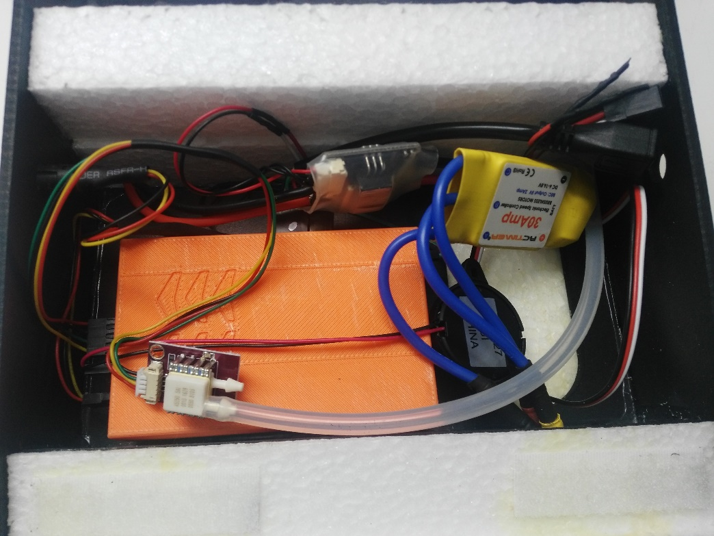

#### Connect the ESC power connector and pass the signals cables to the flight controller

1. Connect the ESC to the power module using the XT60 connector

   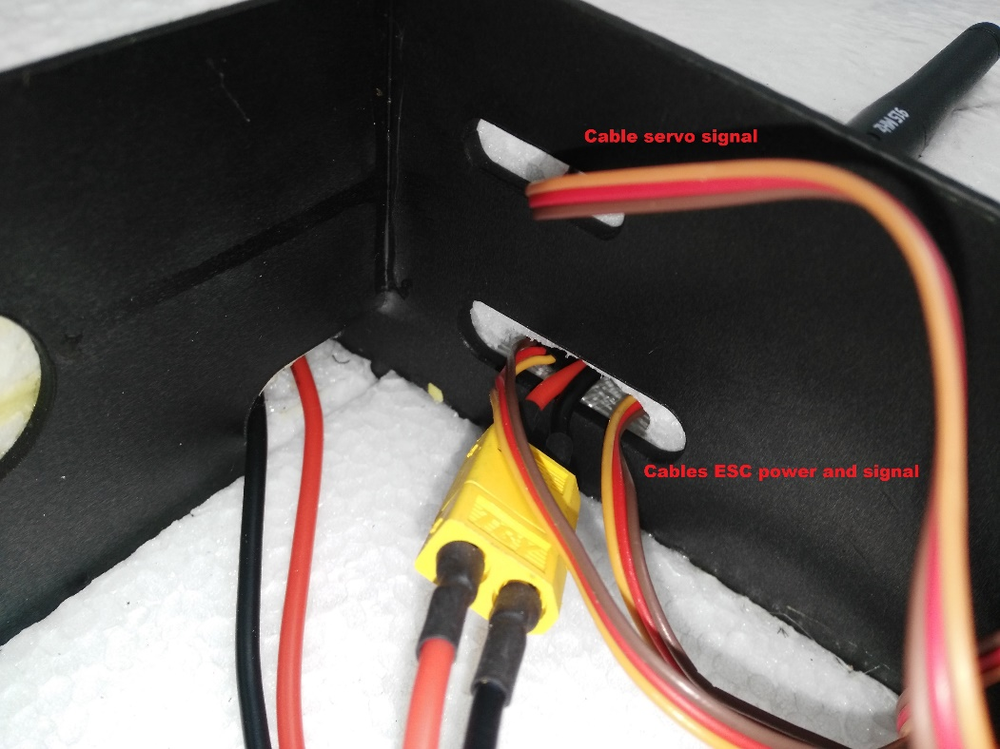

2. Pass the signals cables through to the flight controller

   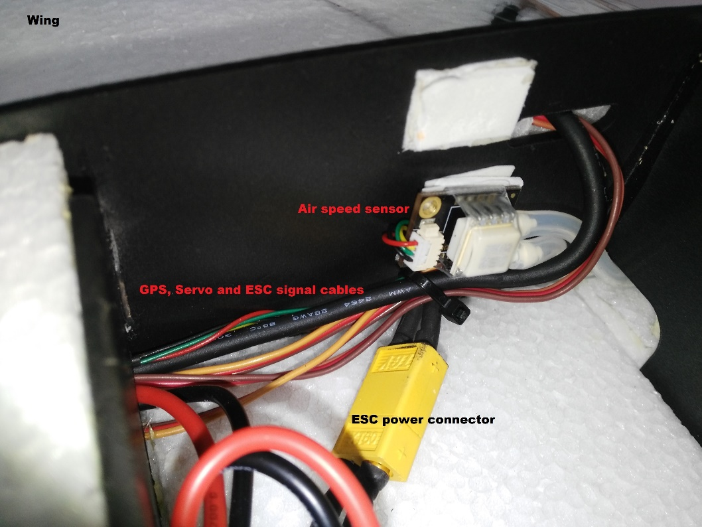

#### Motor Wiring

Motor and servo wiring is nearly entirely up to you, but should match the [Generic Standard VTOL](../airframes/airframe_reference.md#vtol_standard_vtol_generic_standard_vtol) configuration, as shown in the airframe reference.
The geometry and output assignment can be configured in the [Actuators Configuration](../config/actuators.md#actuator-outputs)

For example, you might wire it up like this example (orientation as if "sitting in the plane"):

| Порт   | Підключення            |
| ------ | ---------------------- |
| MAIN 1 | Front right motor, CCW |
| MAIN 2 | Back left motor, CCW   |
| MAIN 3 | Front left motor, CW   |
| MAIN 4 | Back right motor, CW   |
| AUX 1  | Left aileron           |
| AUX 2  | Right aileron          |
| AUX 3  | Elevator               |
| AUX 4  | Rudder                 |
| AUX 5  | Throttle               |

#### Flight Controller Connections: Motors, Servos, RC receiver, current sensor

The image below shows back of the dropix flight controller, highlighting the outputs pins to connect quad motors cables, aileron signal cables, throttle motor, and the current sensor and receiver (RC IN) input pins.

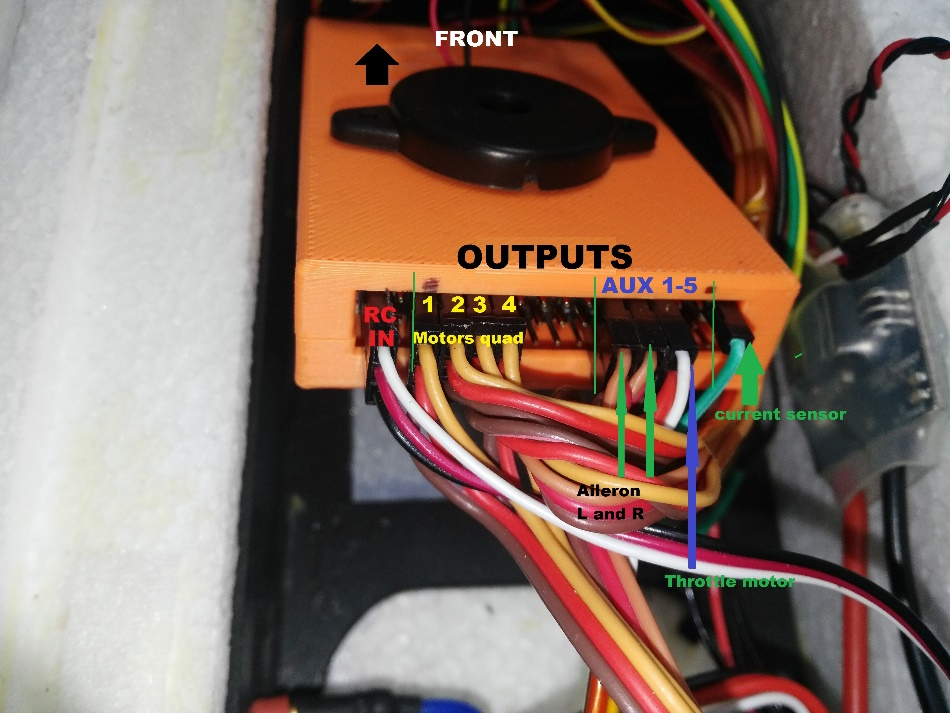

1. Connect quad motors signal cables.

2. Connect the aileron cables and throttle motor in the auxiliary outputs.

3. Connect the throttle motor signal cable from the ESC to the appropriate flight controller auxiliary port. Connect the ESC to the throttle motor.

   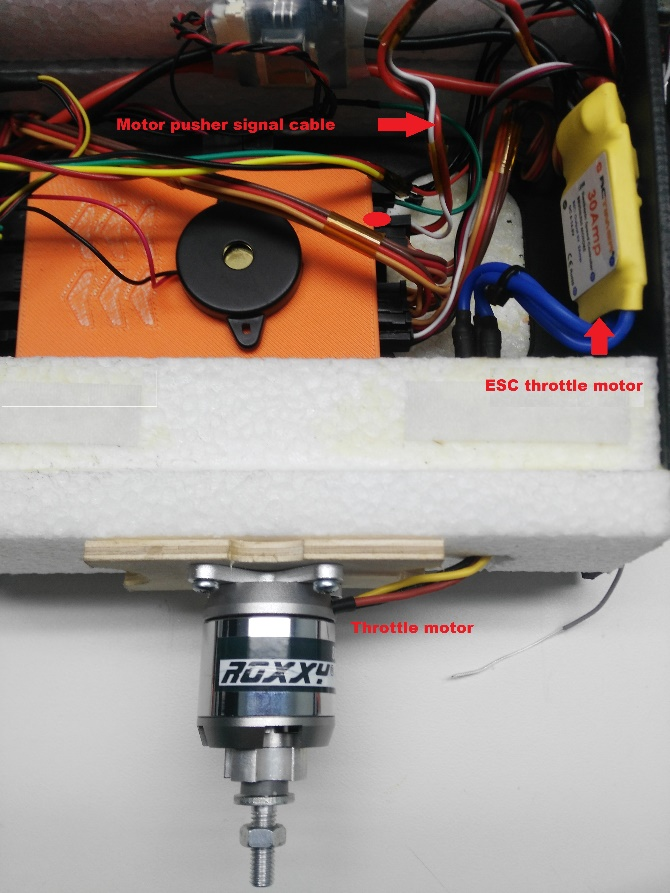

4. Connect the receiver (RC IN).

#### Flight Controller Connections: Telemetry, Airspeed Sensor, GPS, Buzzer and Safety Switch

The sensor inputs, telemetry, buzzer and safety switch are located in the front of the flight controller, as shown in the connection diagram below.

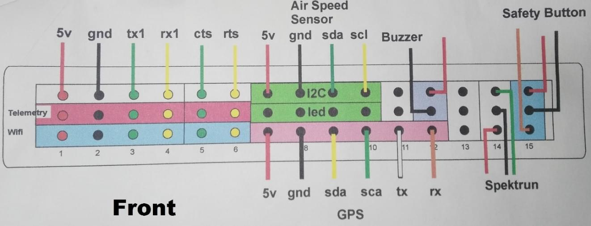

1. Connect the telemetry, airspeed sensor, GPS, buzzer and safety switch as shown.

   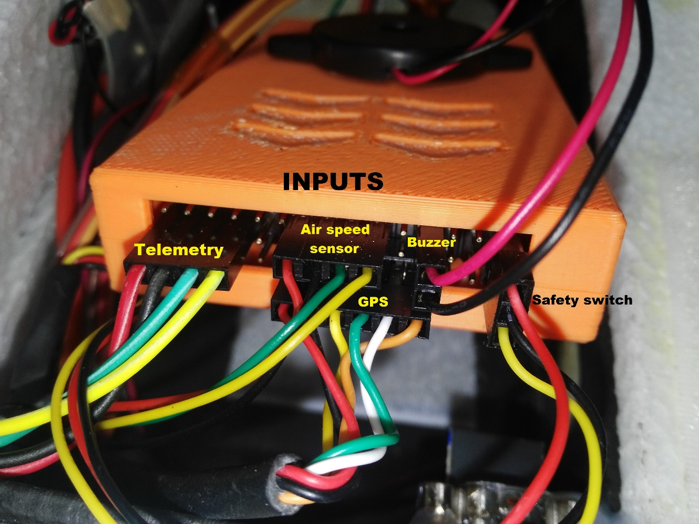

#### Flight Controller: Connect power module and external USB

The inputs for the USB port, power module and external USB are located on the right side of the flight controller.

1. Connect power and USB as shown

   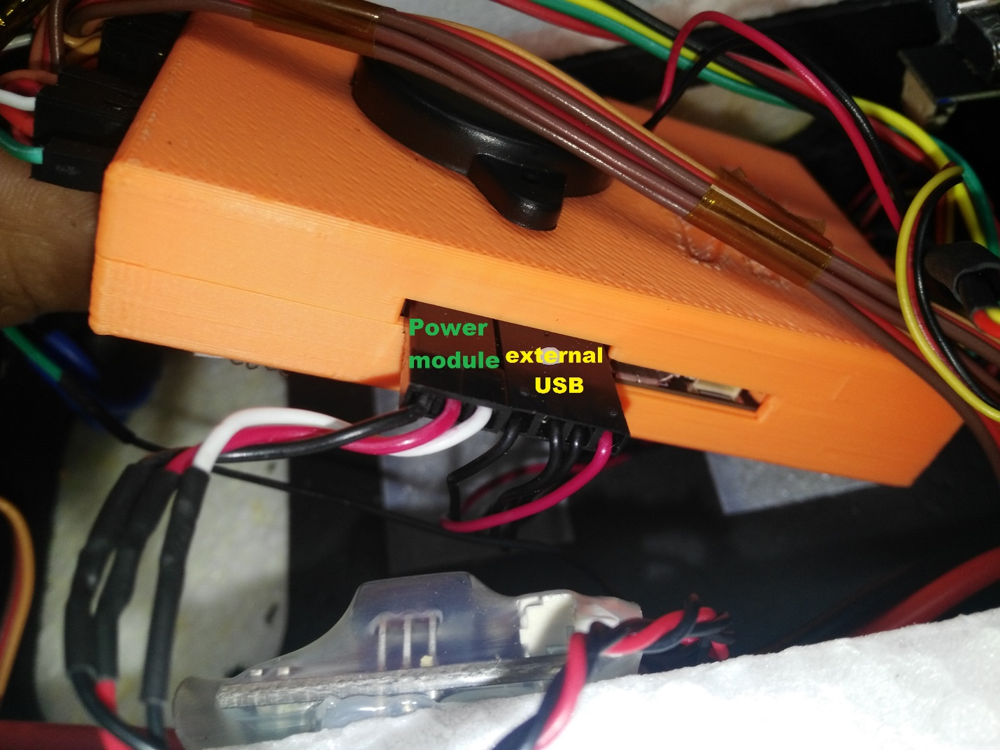

:::tip
The external USB is optional.
It should be used if access to the USB port is difficult once the flight controller is mounted.
:::

#### Install the pitot tube (airspeed sensor)

The pitot tube is installed on the front of the plane and connected to the airspeed sensor via a tube.

:::warning
It is important that nothing obstructs airflow to the Pitot tube. This is critical for fixed-wing flight and for transitioning from quad to plane.
:::

1. Install the Pitot tube in the front of the plane

   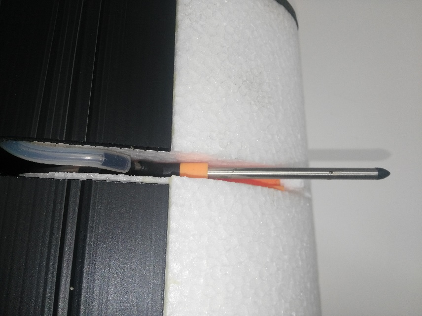

2. Secure the connecting tubing and ensure that it is not bent/kinked.

   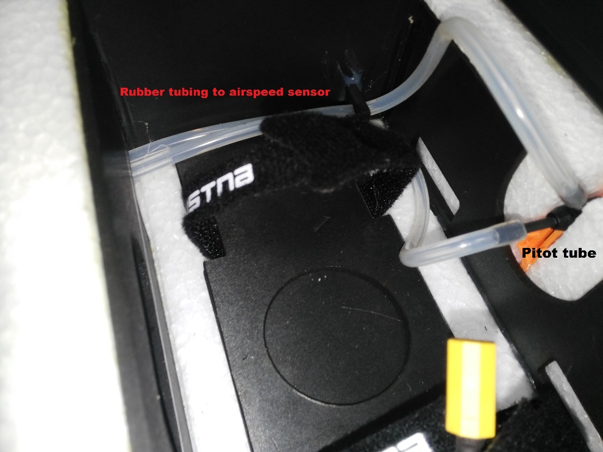

3. Connect the tubes to the airspeed sensor.

   

#### Install/connect receiver and telemetry module

1. Paste the receiver and telemetry module to the outside of the vehicle frame.

   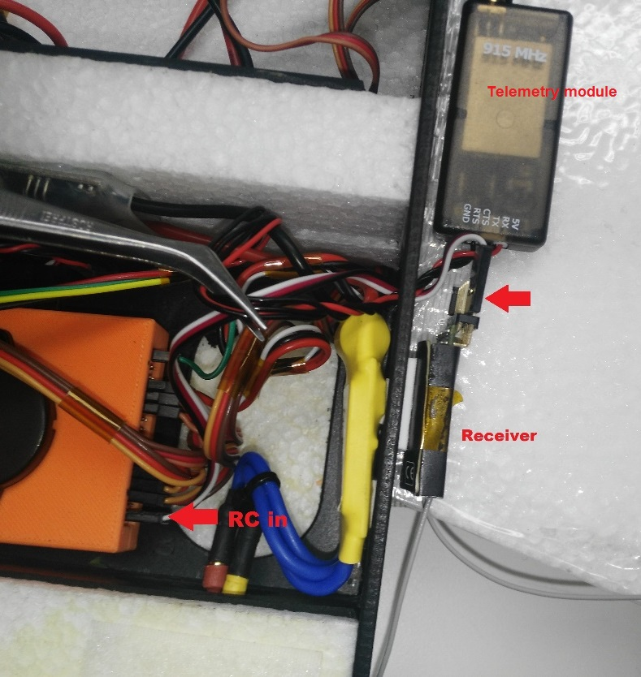

2. Connect the receiver to the RC IN port on the _back_ of the dropix, as shown above (also see the [flight controller instructions](#dropix_back)).

3. Connect the telemetry module to the _front_ of the flight controller as shown below (see the [flight controller instructions](#dropix_front) for more detail on the pins).

   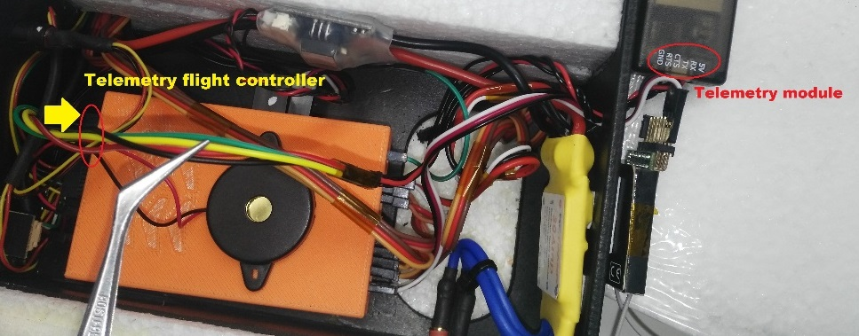

#### GPS/Compass module

The GPS/Compass module is already mounted on the wing, in the default orientation. You don't need to have to do anything extra for this!

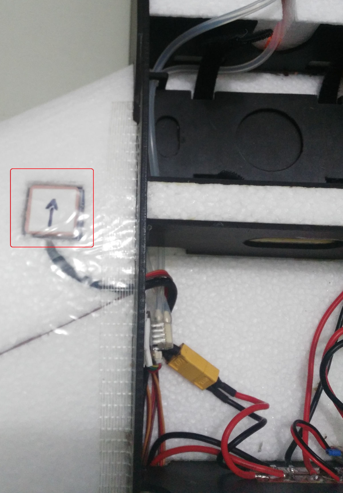

#### Mount and orient the flight controller

1. Set your flight controller orientation to 270 degrees.

   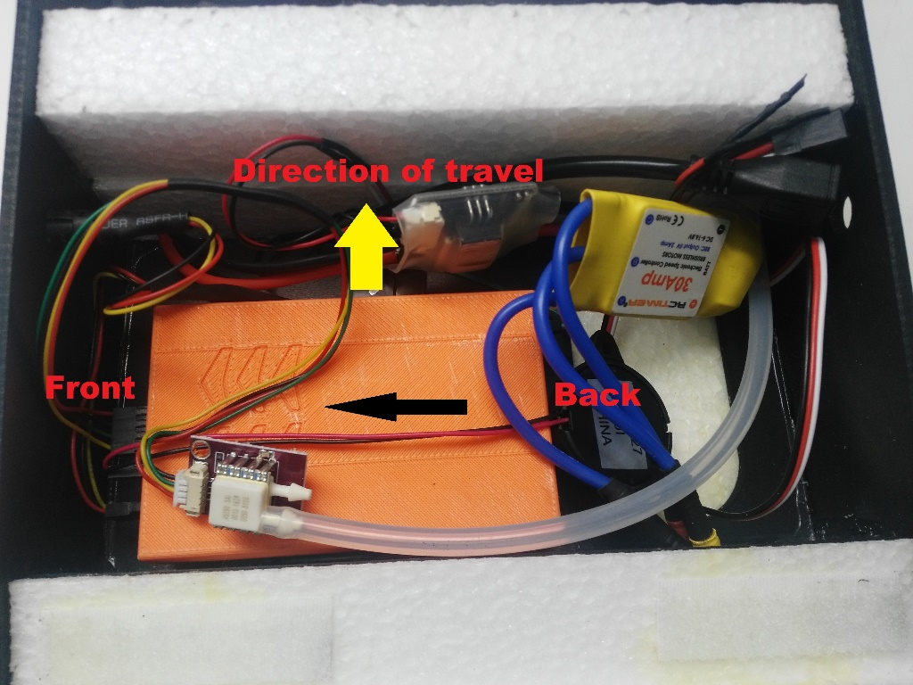

2. Secure the controller in place using vibration damping foam.

### Step 4: Final Assembly Checks

The final assembly step is to check the vehicle is stable and that the motors have been set up correctly.

1. Check that the motors turn in the correct directions (as in the QuadX diagram below).

   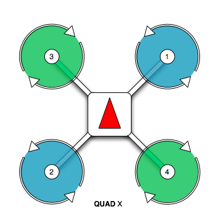

   ::: info
   If necessary the servo direction can be reversed using the `Rev Range (for servos)` checkbox associated with each servo output in the QGroundControl [Actuator Output](../config/actuators.md#actuator-outputs) configuration (for servos only) (this sets the [PWM_AUX_REV](../advanced_config/parameter_reference.md#PWM_AUX_REV) or [PWM_AUX_MAIN](../advanced_config/parameter_reference.md#PWM_MAIN_REV) parameter).

:::

2. Check the vehicle is balanced around the expected centre of gravity
   - Hold the vehicle with your fingers at the center of gravity and check that the vehicle remains stable.

     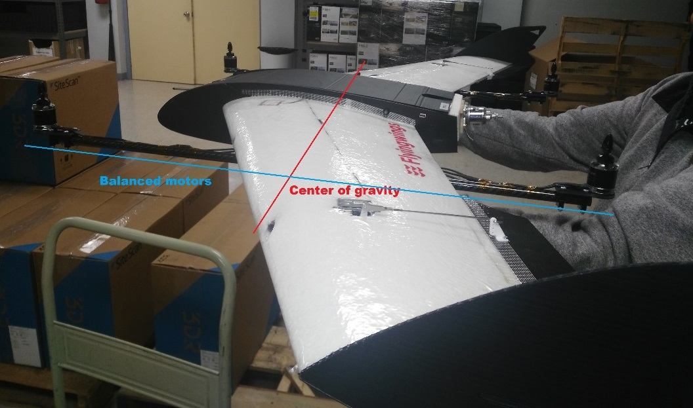

   - If the vehicle leans forward or backwards, move the motors to balance it.

     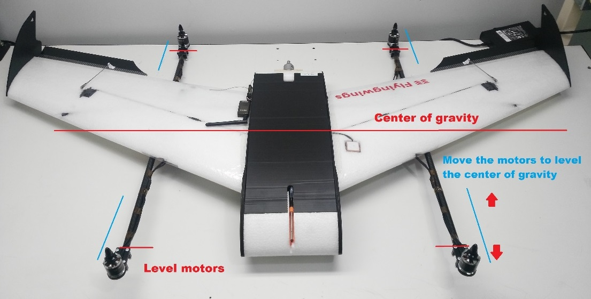

## Налаштування

Perform the normal [Basic Configuration](../config/index.md).

Notes:

1. For [Airframe](../config/airframe.md) select the vehicle group/type as _Standard VTOL_ and the specific vehicle as [Generic Standard VTOL](../airframes/airframe_reference.md#vtol_standard_vtol_generic_standard_vtol) as shown below.

   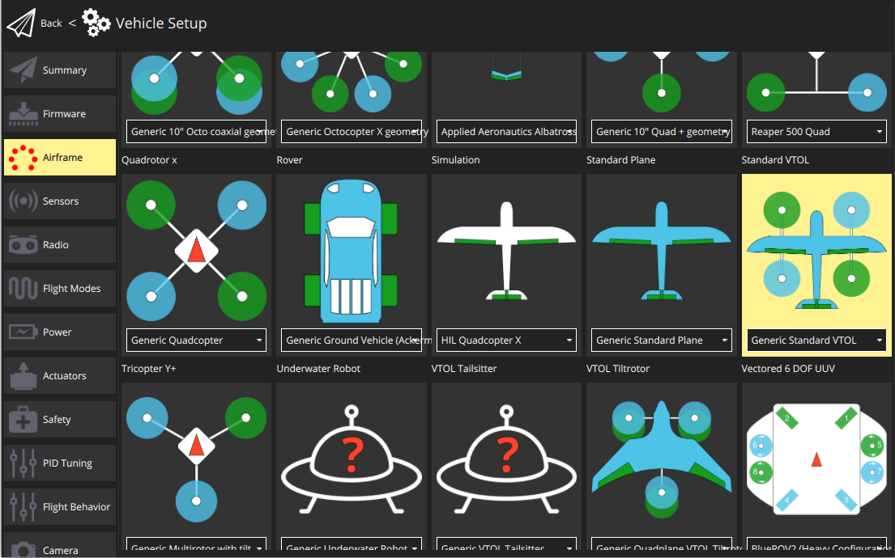

2. Set the [Autopilot Orientation](../config/flight_controller_orientation.md) to `ROTATION_YAW_270` as the autopilot is mounted [sideways](#flight_controller_orientation) with respect to the front of the vehicle. The compass is oriented forward, so you can leave that at the default (`ROTATION_NONE`).

3. Configure the outputs and geometry following the instructions in [Actuators Configuration](../config/actuators.md)

4. The default parameters are often sufficient for stable flight. For more detailed tuning information see [Standard VTOL Wiring and Configuration](../config_vtol/vtol_quad_configuration.md).

After you finish calibration the VTOL is ready to fly.

## Відео

<lite-youtube videoid="h7OHTigtU0s" title="PX4 Vtol test"/>
