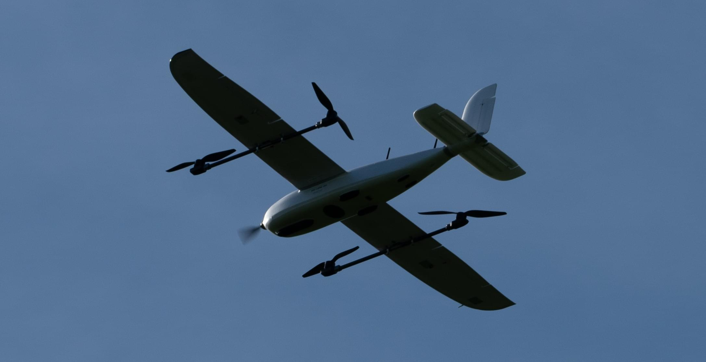
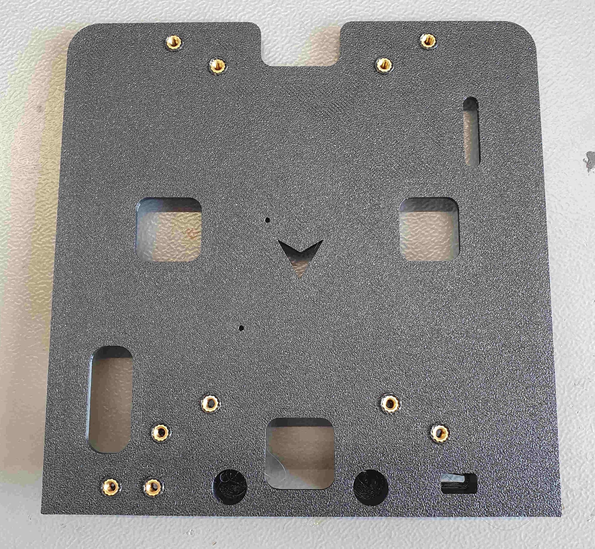
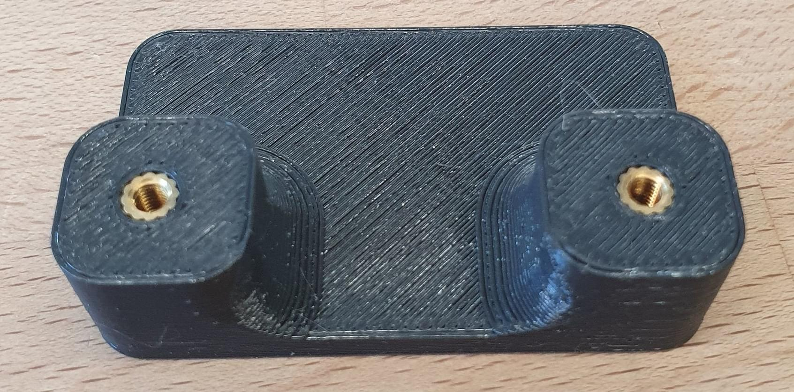
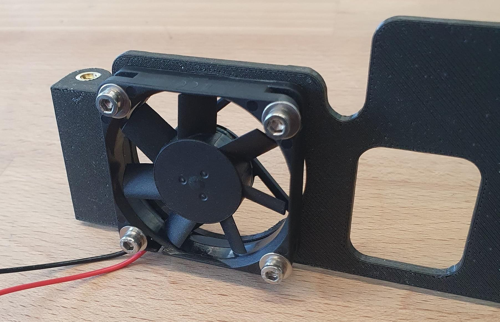
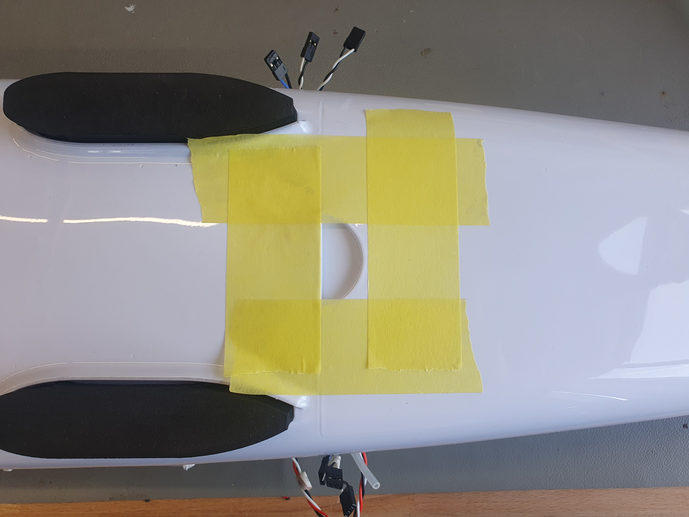
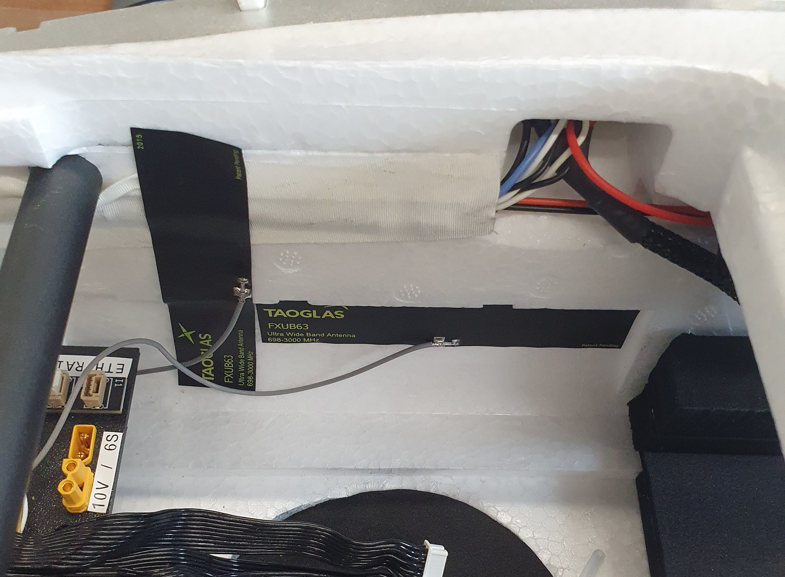

# Foxtech Loong 2160 VTOL

Foxtech Loong 2160 VTOL - це легкий у монтажі майже готовий до польоту (ARF) квадрокоптерний ВТОЛ дрон з розмахом крила 2160 мм.
Цей посібник зі збірки показує, як додати систему керування польотом, використовуючи набір оцінки [Auterion Skynode evaluation kit](../companion_computer/auterion_skynode.md) або [Pixhawk 6C](../flight_controller/pixhawk6c.md), і налаштувати PX4.

## Загальний огляд

Специфікації:

- Розмах крила: 2160 мм
- Довжина фюзеляжу: 1200 мм
- Вага при зльоті: Приблизно 7 кг (без вантажу)
- Максимальний час польоту: До 1 години і 30 хвилин
- Крейсерська швидкість: Приблизно 17 м/с
- Максимальна вага вантажу: Близько 1,5 кг
- Розміри чохла: 125 см х 34 см х 34 см

Основні характеристики:

- Легка збірка: Швидке і просте налаштування
- Переносимість: Компактний дизайн для зручного транспортування у включеному чохлі
- Готовий до польоту: Всі приводи вже встановлені та підключені, що мінімізує час налаштування
- Подовжений час польоту: До 1 години і 30 хвилин в залежності від погодних умов та ваги при зльоті
- Універсальна вантажопідйомність: Просторий фюзеляж вміщує різноманітні вантажі, включаючи варіанти, такі як камера Sony A7R для картографічних застосувань.

## Де купити

- [Foxtech FPV (ARF Combo)](https://www.foxtechfpv.com/foxtech-loong-2160-vtol.html) - рекомендується
- [Alibaba](https://www.alibaba.com/product-detail/Loong-2160-Long-Endurance-VTOL-Mapping_1600280686653.html)

## Політний контролер

Наступна конфігурація протестована:

- [Auterion Skynode evaluation kit](../companion_computer/auterion_skynode.md)
- [Pixhawk 6C](../flight_controller/pixhawk6c.md)

## Додаткові аксесуари

- Auterion 12S Power Module
- [Модуль живлення Holybro PM08D (альтернатива Auterion PM)](https://holybro.com/collections/power-modules-pdbs/products/pm08d-digital-power-module-14s-200a)
- [GPS F9P (включено в Skynode оціночний. комплект)](../gps_compass/rtk_gps_holybro_h-rtk-f9p.md)
- [GPS M9N (дешевша альтернатива F9P)](../gps_compass/rtk_gps_holybro_h-rtk-m8p.md)
- [Датчик швидкості (включено в Skynode eval. kit)](https://www.dualrc.com/parts/airspeed-sensor-sdp33) — рекомендований для покращення безпеки та продуктивності
- [Датчик швидкості (дешевший альтернативний варіант)](https://holybro.com/products/digital-air-speed-sensor?pr_prod_strat=use_description&pr_rec_id=236dfda00&pr_rec_pid=7150470561981&pr_ref_pid=7150472462525&pr_seq=uniform)
- [Lidar Lightware lw20-c (включено в Skynode eval. kit)](../sensor/sfxx_lidar.md) (Необов'язково)
- [Інфрачервоний сенсор вимірювання відстані Seeed Studio PSK-CM8JL65-CC5 (дешевший аналог)](https://www.seeedstudio.com/PSK-CM8JL65-CC5-Infrared-Distance-Measuring-Sensor-p-4028.html) (Опціонально)
- [Радіо (RC) система](../getting_started/rc_transmitter_receiver.md) на ваш вибір
- [Наземна станція та радіо зв'язок](https://holybro.com/collections/rc-radio-transmitter-receiver/products/skydroid-h12?variant=42940989931709)
- [Розширення кабеля USB-C](https://www.digitec.ch/en/s1/product/powerguard-usb-c-usb-c-025-m-usb-cables-22529949?dbq=1&gclid=Cj0KCQjw2cWgBhDYARIsALggUhrh-z-7DSU0wKfLBVa8filkXLQaxUpi7pC0ffQyRzLng8Ph01h2R1gaAp0mEALw_wcB&gclsrc=aw.ds)
- [Розгалужувач I2C](https://www.3dxr.co.uk/autopilots-c2/the-cube-aka-pixhawk-2-1-c9/cube-cables-accessories-sensors-c15/cubepilot-i2c-can-splitter-jst-gh-4pin-p2840)
- [Монтажі, виготовлені на 3D-принтері](https://github.com/PX4/PX4-user_guide/raw/main/assets/airframes/vtol/foxtech_loong_2160/loong-3d-prints.zip)
  - 1x Базова плита
  - 1x Stack-fixture
  - 1x Кріплення вентилятора
  - 1x Монтаж радіо
  - 1x Верхня плита
  - 1x Адаптер радіоантени
  - 1x USB-C Holder 1
  - 1x USB-C Holder 2
- [Монтаж вставних гвинтових вкладень](https://cnckitchen.store/products/gewindeeinsatz-threaded-insert-set-standard-200-stk-pcs)
- [XT30 роз'єми](https://www.amazon.com/Connectors-Female-Pieces-Shrink-Battery/dp/B0875MBLNH/ref=sr_1_1?keywords=xt30+connector&qid=1700643604&sr=8-1)
- [Div. Screws](https://de.aliexpress.com/item/1005005999729125.html?spm=a2g0o.productlist.main.1.7fe0c7fcvInMsM&algo_pvid=2e5373e9-747f-4a28-9739-cd59d05d64f1&aem_p4p_detail=202311220106396068090130108300006423842&algo_exp_id=2e5373e9-747f-4a28-9739-cd59d05d64f1-0&pdp_npi=4%40dis%21CHF%2114.42%213.72%21%21%2116.01%21%21%402101f04d17006439995917563eeeb0%2112000035246480339%21sea%21CH%210%21AB&curPageLogUid=24AixvgVOlG3&search_p4p_id=202311220106396068090130108300006423842_1)
- [Кабельні стяжки-затискачі](https://www.amazon.com/Superun-Cable-Tie-Kit-Assorted/dp/B07TMKJP5S/ref=sr_1_2?crid=968Z3XJK9N3J&keywords=zip%2Bties%2Bset&qid=1700644053&sprefix=zip%2Bties%2Bset%2Caps%2C155&sr=8-2&th=1)
- [Кабель продления антенны - соответствует вашей радиосистеме](https://www.digikey.ch/de/products/detail/amphenol-rf/095-902-536-012/13246174)
- [Рекомендована батарея (12S 22Аг)](https://genstattu.com/tattu-22-2v-30c-6s-22000mah-lipo-battery-with-xt90-s-plug-for-uav.html)

## Інструменти

Наступні інструменти використовувалися у цій збірці.

- Набір шестигранних викруток
- Набір гаєчних ключів
- [Станція для паяння](https://www.amazon.com/UY-CHAN-Programmable-Pocket-size-Soldering/dp/B07G71CKC4/ref=sr_1_7?crid=2S2XK6363XRDF&keywords=ts+80+soldering+iron&qid=1700644208&sprefix=ts+80%2Caps%2C151&sr=8-7)
- Клей: гарячий клей, епоксидна смола 5 хв
- Скотч
- Двостороння стрічка 3M ([стрічка 3M VHB](https://www.amazon.in/3M-VHB-Tape-4910-Length/dp/B00GTABM3Y))
- 3D-принтер
- [Синій Loctite](https://www.amazon.com/Loctite-Heavy-Duty-Threadlocker-Single/dp/B000I1RSNS?th=1)

## Інтеграція апаратних засобів

У цій документації описано інтеграцію Auterion Skynode.
Встановлення Pixhawk можна виконати аналогічно.

### Підготовка

### Авіонічний блок

#### Підготуйте деталі, надруковані на 3D-принтері

:::info
Використовуйте паяльник, щоб натиснути різьбові вкладки в надруковані деталі 3D.
:::

1. Вставте 10x різьбових вкладок M3 в піддон, як показано на малюнку:

  

2. Вставте 2x різьбові вставки M3 в пристрій для накладання, як показано на зображенні нижче:

  

3. Вставте 2x різьбові вкладки M4 в кріплення вентилятора та кріплення радіо, як показано на малюнку нижче.

  

  Якщо ви хочете додати 40-мм вентилятор з напругою 5 В на кріплення вентилятора, вставте 4x вставки M3.

  

4. Змініть кабельний роз'єм на роз'єм для сервоприводу, щоб його можна було вставити в шину сервоприводу для живлення.

  ::: info
  Можливо знадобиться вентилятор, якщо використовується потужне радіо.

:::

  

5. Вилучіть оригінальну кронштейнну пластину з автомобіля.
  Приклейте кабелі до зовнішньої частини фюзеляжу.

  

6. Перемістіть підставку в транспортний засіб.

7. Закрутіть кріплення стопора до основної плити та позначте місце розташування кріплення стопора стрічкою або ручкою.

8. Вилучіть частини з фюзеляжу та склейте кріплення стопки на місце за допомогою гарячого клею.

### Модуль потужністю 40A

Модуль живлення 40A забезпечує живлення для авіоніки при використанні Skynode (і поставляється із комплектом оцінки Skynode):

1. Вилучіть корпус з 40A PM.
2. Зафіксуйте ПМ з 2x M2x6mm до нижньої пластини.
3. Створіть кабель для подовження роз'єму XT60 до XT30, який закріплений на базовій платі.
  З цим, живлення від акумулятора 6S може бути підключено безпосередньо до роз'єму XT30 за допомогою попередньо налаштованого кабелю, що поставляється з транспортним засобом.

  

Якщо потрібно, вихід 10V з радіопорту на PM також може бути викладений через XT30, який може бути встановлений поруч зі входом батареї 6S XT60.

### Датчики

#### Трубка Піто

1. Датчик може бути встановлений за допомогою 2x винтів M3x16мм в передньому правому куті підставки.
  Піклуйтесь, щоб конектор був звернутий у бік центру фюзеляжу.

  

  Лише передню трубу (не так, як показано на картинці) використовується; іншу трубу можна видалити, оскільки наш досвід показав, що тиск всередині фюзеляжу достатній як статичний тиск.

2. Коли стек встановлено всередині фюзеляжу, труба, що йде з крила, та труба, що йде з датчика швидкості повітря, повинні бути з'єднані разом.
  Використовуйте трохи слини (це найлегший спосіб) щоб з'єднати їх разом, а потім використовуйте термоусадочну трубку, щоб посилити з'єднання.

  :::warning
  Використовуйте джерело тепла обережно, оскільки піна починаєтся танути при високих температурах.

:::

#### Лідар

:::info
Лідар є рекомендованим!
Якщо лідар не встановлено, ви повинні вимкнути використання дії фіксованого крила в режимі утримання для прискорення вперед (встановіть [VT_FWD_THRUST_EN](../advanced_config/parameter_reference.md#VT_FWD_THRUST_EN) на `0` замість `1`).
:::

1. Позначте місце для встановлення лідару за допомогою скотчу або ручки.
  Виріжте отвір всередині оболонки з ПВХ та піни, щоб лідар вміщувався на місце.

  

2. Закріпіть лідар з гарячим клеєм.

  

#### GPS/компас

1. Використовуйте двосторонній скотч для кріплення GPS на задній частині транспортного засобу під задньою засувкою.

  

  Стрілка на GPS для орієнтації може бути проігнорована.
  Орієнтацію буде визначено під час калібрування автопілота.

### Політний контролер

Встановіть на базову платформу або Pixhawk, або Skynode.

#### Pixhawk 6c/6c mini

1. Використовуйте двосторонню стрічку для кріплення контролера польоту до базової платформи.

#### Skynode

1. Використовуйте 4x гвинти M3x8 для кріплення Skynode до підстави.
  Переконайтеся, що верхня частина "A" спрямована вперед транспортного засобу.
2. Вставте 40-амперний модуль живлення в верхній з двох роз'ємів живлення.
3. Вставте один (або якщо потрібно, два) USB адаптери в 4-контактні роз'єми JST-GH на задній частині Skynode та прокладіть їх до передньої панелі.
  Виправте кабелі за допомогою хомутів-ґудзиків на місці.
4. Приклейте розгалужувач I2C до правої передньої сторони підставки (Розгалужувач може бути використаний для підключення пристроїв ETH, таких як радіозв'язок.)
5. Підключіть розгалужувач I2C до порту ETH на задній панелі Skynode.
6. Вставте два 40-контактних кабелі у передню частину Skynode.
7. Підключіть USB-C кабель подовження та згинайте його впереду.
  Згин повинен бути дуже тугим, щоб пластина влізла в дрон.

#### Плати адаптерів

1. Закрутіть до верхньої пластини плати адаптерів Pixhawk.

### Антени та RC приймач

1. Приклейте антени Skynode LTE до боку фюзеляжу, як показано на зображенні:

  

2. Якщо ви використовуєте модуль радіотелеметрії, ви можете встановити антени на верх фюзеляжу.
  Зверху ви можете прямо встановити кабель подовження антени.

  

  На задній частині ви можете використовувати адаптер антени з використанням технології 3D-друку.
  Адаптер можна склеювати на місці гарячим клеєм.

  

### Модуль потужності 12S

Цей модуль живлення 12S є основним модулем живлення для двигунів.
Цей блок може витримувати більше струму, ніж блок живлення потужністю 40A, що використовується для живлення авіоніки, і потрібен, оскільки Loong використовує до 120A у фазі зависання.

Модуль живлення 12S буде встановлено на верхній частині батареї.
Підключіть XT90, який встановлений всередині транспортного засобу, до PM.
Потрібно подовжити кабель живлення для підключення до Skynode.
Це необхідно для отримання показників батареї з блоку живлення.

Модуль живлення може бути використаний як резервна для Skynode на 5В.

### Збірка

Кроки зборки:

1. Перемістіть підставку в транспортний засіб.
2. Вставте LTE-антени в Skynode.
3. Закрутіть кріплення вентилятора та радіо на базову пластину.
4. Зсуньте основну пластину назад і закрутіть її на фіксатор стопки.
5. Поставте верхню плиту на верх стека та прокладіть 40-контактні кабелі від Skynode через дві отвори перед платами адаптерів Pixhawk.
6. Впевніться, що підключите верхній з'єднувач до плати адаптера, на якій є вхід 'GPS1'.

Вставте приводи в адаптерну плату Pixhawk у такій послідовності:

MAIN:

1. Мотор
2. Порожній, або вентилятор, якщо встановлено
3. Правий ельєрон
4. Лівий ейлерон
5. Правий руль висоти
6. Лівий руль висоти
7. Rudder

AUX:

1. Мотор правий передній
2. Мотор лівий задній
3. Мотор лівий передній
4. Мотор правий задній

Якщо ви бажаєте підключити приводи до різних виходів, вам потрібно буде змінити відображення виходів приводу (див. [Конфігурацію приводу](../config/actuators.md)).

## Налаштування програмного забезпечення

### Вибір планера

1. Відкрийте QGC, виберіть значок **Q**, а потім виберіть **Налаштування транспортного засобу**.
2. Виберіть вкладку [Airframe](../config/airframe.md)
3. Виберіть [Generic Standard VTOL](../airframes/airframe_reference.md#vtol_standard_vtol_generic_standard_vtol) з групи _Standard VTOL_ а потім клікніть **Apply and Restart**.

### Завантажте файл параметрів

Далі ми завантажуємо [файл параметрів](https://github.com/PX4/PX4-user_guide/raw/main/assets/airframes/vtol/foxtech_loong_2160/loong.params), який містить параметри, що визначають геометрію каркасу, відображення виводів та значення настройки - тож вам не потрібно!
Якщо ви дотримувалися інструкцій з підключення двигунів, вам, ймовірно, не знадобиться багато додаткових налаштувань, окрім калібрування датчиків і фіксації кріплень.

Щоб завантажити файл:

1. Завантажте [файл параметрів](https://github.com/PX4/PX4-user_guide/raw/main/assets/airframes/vtol/foxtech_loong_2160/loong.params).
2. Виберіть вкладку [Параметри](../advanced_config/parameters.md#finding-updating-parameters), а потім натисніть на **Tools** в правому верхньому кутку.
3. Виберіть **Завантажити з файлу**, а потім виберіть файл `loong.params`, який ви щойно завантажили.
4. Перезапустіть транспортний засіб.

### Вибір сенсора

- Якщо [Lidar Lightware lw20-c (включено в Skynode eval. kit)](../sensor/sfxx_lidar.md) використовується, потрібно встановити [SENS_EN_SF1XX](../advanced_config/parameter_reference.md#SENS_EN_SF1XX) на 6 (SF/LW/20c).
- Впевніться, що обраний правильний датчик швидкості.
  Якщо ви використовуєте рекомендований [датчик швидкості SDP33](https://www.dualrc.com/parts/airspeed-sensor-sdp33), зміни не будуть потрібні, оскільки [SENS_EN_SDP3X](../advanced_config/parameter_reference.md#SENS_EN_SDP3X) увімкнено (встановлено на `1`) в файлі параметрів.

### Калібрування сенсорів

Спочатку переконайтеся, що встановлено [правильну орієнтацію контролера політної системи](../config/flight_controller_orientation.md).
Це має бути значенням за замовчуванням (`ROTATION_NONE`).

Потім відкалібруйте основні датчики:

- [Компас](../config/compass.md)
- [Гіроскоп](../config/gyroscope.md)
- [Акселерометр](../config/accelerometer.md)
- [Швидкість](../config/airspeed.md)

### RC-налаштування

[Відкалібруйте ваш RC Controller](../config/radio.md) та налаштуйте [перемикач режиму польоту](../config/flight_mode.md).

Ми рекомендуємо вам призначити RC перемикачі для набору режимів, визначених у [Flight Mode Configuration > What Flight Modes and Switches Should I Set?](../config/flight_mode.md#what-flight-modes-and-switches-should-i-set).
Зокрема, ви повинні призначити _VTOL Transition Switch_, _Kill Switch_ та перемикач для вибору [Режиму стабілізації](../flight_modes_fw/stabilized.md) та [Режиму позиціювання](../flight_modes_fw/position.md).

### Налаштування приводу та калібрування ESC

:::warning
Переконайтеся, що пропелери зняті!
Двигуни легко випадково запустити на вкладці приводів.
:::

Двигуни, керуючі поверхні та інші виконавчі пристрої налаштовані в [Керуванні актуаторами та тестуванні](../config/actuators.md) QGroundControl.

Файл параметрів, завантажений раніше [параметр-файл](#load-parameters-file), означає, що цей екран вже повинен бути налаштований правильно: вам лише потрібно відрегулювати обтинання для вашого конкретного транспортного засобу.
Якщо двигуни/сервоприводи були підключені до інших виходів, ніж запропоновано, вам потрібно буде змінити відповідність між виходами та функціями в розділі «Виходи приводів».

Для калібрування потужності ESC увімкніть транспортний засіб без крил і перейдіть на вкладку **Actuators** в QGC.
Увімкніть тестування двигуна та зсуньте слайдер для двигуна, який ви бажаєте налаштувати, до максимуму.
Вставте крила в фюзеляж і зачекайте, поки закінчиться послідовність звуків (близько 5 секунд).
Потім передвиньте боковий слайдер на мінімум.

#### Керуючі поверхні

Перевірте, чи потрібно реверсувати приводи за допомогою пульта дистанційного керування:

- Перемкніться в [Ручний режим](../flight_modes_fw/stabilized.md)
- Перемістіть стік вправо.
  Правий елерон повинен піднятися вгору, лівий елерон повинен опуститися вниз.
- Нахили стік назад (політ вверх).
  Обидві поверхні V-подібного хвоста повинні піднятися.
- Упріть стік вправо.
  Обидві площини повинні зміститися вправо

Тепер відкоригуйте значення газу так, щоб всі поверхні були в нейтральному положенні.

#### Напрямок та орієнтація моторів

Зафіксуйте літальний апарат зі знімними пропелерами у режимі [Стабілізованого польоту](../flight_modes_fw/stabilized.md).
Перевірте, щоб всі чотирьохмотори обертались з схожою низькою швидкістю холостого ходу та перевірте, що напрямок правильний.
Перевірте наступні реакції:

- Перемістіть стік вправо.
  Ліві два двигуни повинні розганятися
- Перемістіть стік вниз.
  Передні два двигуни повинні розганятися
- Упріть стік вправо.
  Передній правий та задній лівий двигун повинні розганятися

:::info
збільшіть газ трохи, якщо ви не бачите реакції, оскільки [Airmode](../config_mc/pid_tuning_guide_multicopter.md#airmode-mixer-saturation) не ввімкнено для осі розвороту.
:::

## Перший політ

- Встановити гвинти (використовувати блакитний Loctite для гвинтів).
- Перевірте центр мас (GG).
  Щоб перевірити ЦМ ліфтінг - підніміть транспортний засіб двома пальцями вгору на засувках, що з'єднують крило.
  Транспортний засіб повинен бути в горизонтальному положенні.
  Якщо транспортний засіб нахилився вперед або назад, вам потрібно перемістити батарею в протилежному напрямку.
  Якщо ви не здатні врівноважити транспортний засіб цим методом, вам доведеться перенести деякі компоненти або додати вагу для вирівнювання транспортного засобу.
- Перевірте орієнтацію приводів та нейтральну передачу
- Перевірте реакції поверхонь управління в режимі [Стабілізованого польоту](../flight_modes_fw/stabilized.md).
  Перемикайте транспортний засіб у режим польоту вперед.
  - Перемістіть транспортний засіб праворуч.
    Правий елерон повинен піти вниз.
    Лівий елерон повинен піднятися.
  - Підійміть транспортний засіб вверх (носом вгору).
    Обидва елерони повинні йти вниз.
  - Поверніть транспортний засіб праворуч (носом праворуч).
    Обидва елерони повинні опуститися вліво.
- Якщо використовується [kill-switch](../config/safety.md#kill-switch), переконайтеся, що він працює належним чином і не буде активований випадково в повітрі!
- Включіть [режим стабілізації](../flight_modes_fw/stabilized.md) та перевірте, чи відповідають двигуни на команди, наприклад, перевалюємося вліво, збільшувати оберти на правому двигуні
- Злетайте у режимі [стабілізованого положення](../flight_modes_fw/stabilized.md) і виконайте деякі базові маневри
- Якщо все пройшло без проблем, злітайте у [Position mode](../flight_modes_fw/position.md) та зробіть перехід приблизно на висоті 50м.
  Якщо щось пішло не так, якнайшвидше перейдіть в режим мультикоптера (використовуючи перемикач переходу).
