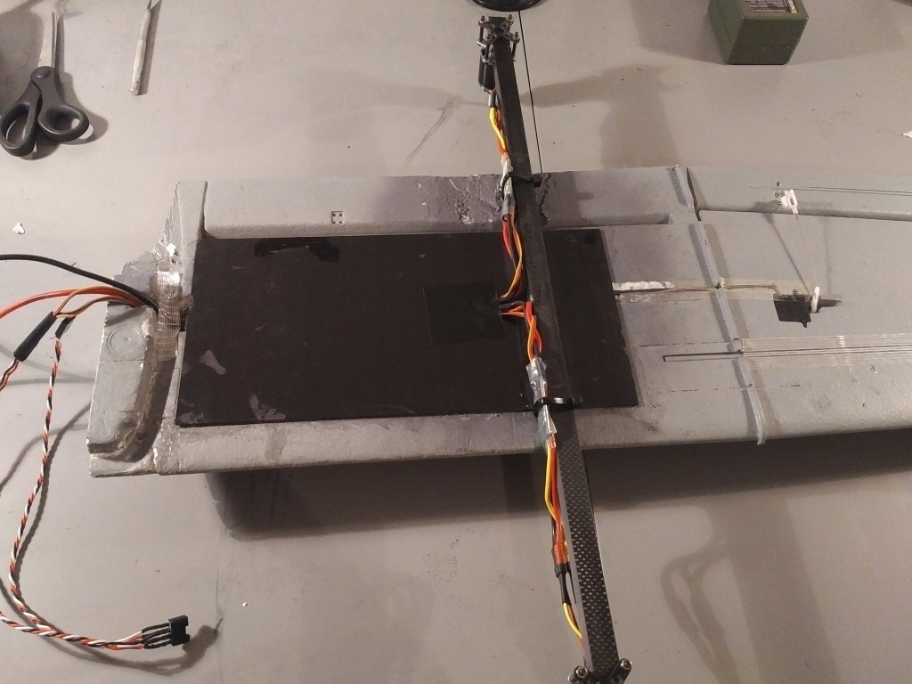

# Volantex Ranger-Ex QuadPlane VTOL (Pixhawk)

QuadRanger VTOL - це стандартний повітряний літак з хвостовим оперенням на основі Volantex Ranger-Ex, який був модернізований з системою QuadCopter.
Ranger-Ex є простою у виліті платформою FPV, яка широко доступна.
Він також доступний в магазині HobbyKing, де він перевиданий як Quanum Observer.
Пластиковий фюзеляж і 2-метрове крило EPO роблять його міцною конструкцією з величезним обсягом корисного навантаження.

Основна Інформація:

- **Frame:** Volantex Ranger-Ex or _Quanum Observer_
- **Flight controller:** Pixhawk

Конверсія VTOL робить літак трохи важчим (близько 3,5 кг, включаючи LiPo).
З цією конверсією літак буде летіти приблизно на 65% потужності двигуна.
Запропонована чотирьохмоторна установка забезпечує тягу 7,5 кг, а конструкція повітряного каркасу може летіти з загальною вагою близько 4,5 кг.
Це залишає достатньо потужності для вантажів, таких як обладнання для перегляду з першої особи та камери.

Конверсія призначена для мінімізації впливу на аеродинаміку та надання додаткової міцності для мінімізації згину крила.

## Специфікація матеріалів

- Volantex Ranger-Ex або Quanum Observer
- 1200KV 530W двигуни
- Регулятори швидкості 30A
- батарея 4s
- Електричні гвинти APC 11x5

## Комплект конверсії

- Необхідні основні частини;
- Pixhawk або сумісний
- Цифровий датчик швидкості польоту
- Модуль живлення 3DR або сумісний
- GPS

For a full parts list with links to Hobbyking EU and International warehouse see:
[QuadRanger-VTOL-partslist](https://px4.io/wp-content/uploads/2016/01/QuadRanger-VTOL-partslist-1.xlsx)

Зображення нижче показує деталі, необхідні для одного крила.

Необхідні інструменти для конвертації;

- Інструмент Dremel або подібний поворотний інструмент
- Ніж для хобі
- Клей UHU POR
- Клей CA
- Вимірювальний стрічка
- Скотч

## Конверсія крила

:::info
Please note that the conversion in this build log is performed on a wing that shows damage from a previous conversion.
:::

Відріжте обидва 800 мм квадратні вуглецеві труби до довжини 570 мм та 230 мм.

Виготовлення пазу у понівеченому крилі глибиною 1,5 см за допомогою обертаючого інструменту з якоюсь формою керівництва для збереження постійної глибини.
Ящірка повинна мати довжину, глибину і ширину одного квадратного вуглецевого труби розміром 230 мм.
Воно повинно бути розташоване так, як показано нижче.

Приклейте вуглецевий лист розміром 300x150x1,5 мм до вуглецевої труби розміром 230 мм за допомогою клею CA та створіть отвір для прокладання проводів через нього.
Вставте проводи для живлення та сигналу до ESC.
Використовуючи клей UHU POR, приклейте лист і вуглепластикову трубку до крила з пінопласту, як показано нижче.

Використовуючи клей СА, заліпіть квадратну вуглецеву трубу довжиною 570 мм на вуглецевий лист.
Воно повинно знаходитись на відстані 285 мм від місця приєднання крил.
Трубка повинна бути центрована відносно вертикальної області крила.
Він повинен розширюватися точно на 165 мм з обох сторін.

Прикріпіть кронштейн для двигуна до двигуна.
З іншою пластиною кріплення двигуна та 4 гвинтами M3x25 мм закріпіть двигун на кінці квадратної вуглецевої труби, як показано нижче.
Прикріпіть РЕБ зі стяжками до вуглецевої труби.
Під час використання Afro ESC обов'язково підключіть принаймні сигнальний та земельний провід.

## Підключення

Виходи Pixhawk повинні бути підключені таким чином (орієнтація, як бачиться
як "сидячи в літаку").

| Порт   | Підключення                |
| ------ | -------------------------- |
| MAIN 1 | Передній правий мотор, CCW |
| MAIN 2 | Задній лівий мотор, CCW    |
| MAIN 3 | Передній лівий мотор, CW   |
| MAIN 4 | Задній правий мотор, CW    |
| AUX  1 | Лівий елерон               |
| AUX  2 | Правий елерон              |
| AUX  3 | Elevator                   |
| AUX  4 | Rudder                     |
| AUX  5 | Тяга                       |

:::info
The servo direction can be reversed using the PWM\_REV parameters in the PWM\_OUTPUT group of QGroundControl (cogwheel tab, last item in the left menu)
:::

For further instructions on wiring and configurations please see: [Standard VTOL Wiring and Configuration](../config_vtol/vtol_quad_configuration.md)

## Налаштування

Configure the frame as shown in QGroundControl below (do not forget to click **Apply and Restart** in the top).

## Підтримка

If you have any questions regarding your VTOL conversion or configuration please visit <https://discuss.px4.io/c/px4/vtol>.

