# OMP Hobby ZMO FPV

The OMP Hobby ZMO is a small [tiltrotor VTOL](../frames_vtol/tiltrotor.md) that is available in an RTF kit.
This build guide shows add a flight controller system (using [Auterion Skynode evaluation kit](../companion_computer/auterion_skynode.md), [Pixhawk 6C](../flight_controller/pixhawk6c.md) or [Pixhawk 6C mini](../flight_controller/pixhawk6c_mini.md)) and setup PX4.

## Загальний огляд

Основні особливості конструкції фюзеляжу:

- Компактна і легка для транспортування
- Попередньо встановлені приводи
- Система швидкого від'єднання крил
- Кейс для транспортування у комплекті
- ~35 хвилинний час польоту (залежить від ваги зльоту)
- VTOL дозволяє літати в місцях, де не може літати дрон з фіксованим крилом
- Батарея та зарядний пристрій включені в комплект
- Легка загальна збірка
- Місце для монтажу FPV або екшн-камери спереду

Залежно від кінцевої злітної ваги час зависанні може бути обмежений (у фюзеляжі мало циркуляції повітря під час зависання транспортного засобу, тому ESC регулятори швидкості можуть перегрітися).

## Де купити

- [OMP-Hobby](https://www.omphobby.com/OMPHOBBY-ZMO-VTOL-FPV-Aircraft-With-DJI-Goggles-And-Remote-Controller-p3069854.html)
- [GetFPV](https://www.getfpv.com/omphobby-zmo-z3-vtol-fpv-1200mm-arf-plane-kit-no-fpv-system.html)
- [FoxtechFPV](https://www.foxtechfpv.com/zmo-pro-fpv-vtol.html)

## Політний контролер

Наступна конфігурація протестована:

- [Auterion Skynode evaluation kit](../companion_computer/auterion_skynode.md)
- [Pixhawk 6C](../flight_controller/pixhawk6c.md) with [PM02 V3](../power_module/holybro_pm02.md)
- [Pixhawk 6C mini](../flight_controller/pixhawk6c_mini.md) with [PM02 V3](../power_module/holybro_pm02.md)

Приблизний максимальний розмір FC становить: 50x110x22мм

## Додаткові аксесуари

- [GPS F9P (включено в Skynode оціночний. комплект)](../gps_compass/rtk_gps_holybro_h-rtk-f9p.md)
- [GPS M9N (дешевша альтернатива F9P)](../gps_compass/rtk_gps_holybro_h-rtk-m8p.md)
- [Датчик швидкості (включено в Skynode eval. kit)](https://www.dualrc.com/parts/airspeed-sensor-sdp33) — рекомендований для покращення безпеки та продуктивності
- [Датчик швидкості (дешевший альтернативний варіант)](https://holybro.com/products/digital-air-speed-sensor?pr_prod_strat=use_description&pr_rec_id=236dfda00&pr_rec_pid=7150470561981&pr_ref_pid=7150472462525&pr_seq=uniform)
- [Lidar Lightware lw20-c (включено в Skynode eval. kit)](../sensor/sfxx_lidar.md) (Необов'язково)
- [Інфрачервоний сенсор вимірювання відстані Seeed Studio PSK-CM8JL65-CC5 (дешевший аналог)](https://www.seeedstudio.com/PSK-CM8JL65-CC5-Infrared-Distance-Measuring-Sensor-p-4028.html) (Опціонально)
- [5V BEC](http://www.mateksys.com/?portfolio=bec12s-pro)
- [Радіо (RC) система](../getting_started/rc_transmitter_receiver.md) на ваш вибір
- [Servo cable extension cable male 30cm 10 pcs](https://www.getfpv.com/male-to-male-servo-extension-cable-twisted-22awg-jr-style-5-pcs.html)
- [Розширення кабеля USB-C](https://www.digitec.ch/en/s1/product/powerguard-usb-c-usb-c-025-m-usb-cables-22529949?dbq=1&gclid=Cj0KCQjw2cWgBhDYARIsALggUhrh-z-7DSU0wKfLBVa8filkXLQaxUpi7pC0ffQyRzLng8Ph01h2R1gaAp0mEALw_wcB&gclsrc=aw.ds)
- [3M VHB tape](https://www.amazon.in/3M-VHB-Tape-4910-Length/dp/B00GTABM3Y)
- [3D-Printed mounts](https://github.com/PX4/PX4-user_guide/raw/main/assets/airframes/vtol/omp_hobby_zmo_fpv/omp_hobby_zmo_3d_prints.zip)
  - 2x кріплення для роз’єму крила
  - 1x кріплення датчика швидкості
  - 1x GPS-кріплення
  - 1x кріплення лідару
  - 1x кріплення Skynode
- [USB camera (included in Skynode dev kit)](https://www.amazon.com/ELP-megapixel-surveillance-machine-monitor/dp/B015FIKTZC)
- Гвинти, вставки, термоусадка та ін.

## Інструменти

Наступні інструменти використовувалися у цій збірці.

- Набір шестигранних викруток
- Набір гаєчних ключів
- Паяльна станція
- Клей: гарячий клей, епоксидна смола 5 хв
- Скотч
- Двостороння стрічка 3M ([стрічка 3M VHB](https://www.amazon.in/3M-VHB-Tape-4910-Length/dp/B00GTABM3Y))
- Наждачний папір
- 3D-принтер

## Інтеграція апаратних засобів

### Підготовка

Вийміть оригінальний контролер польоту, ESC регулятор швидкості та кабелі з'єднання крила.
Також зніміть пропелери.
Це допоможе вам з управлінням транспортного засобу і зменшить ризик отримання травми внаслідок ненавмисного запуску двигуна.

ZMO FPV в його початковому стані.

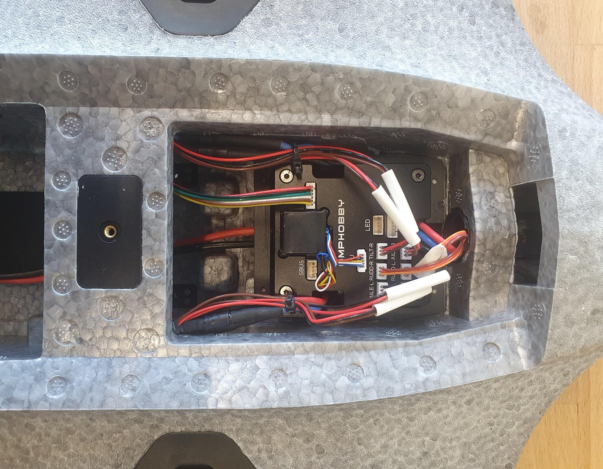

Контролер польоту та з'єднувачі крила знято з транспортного засобу.

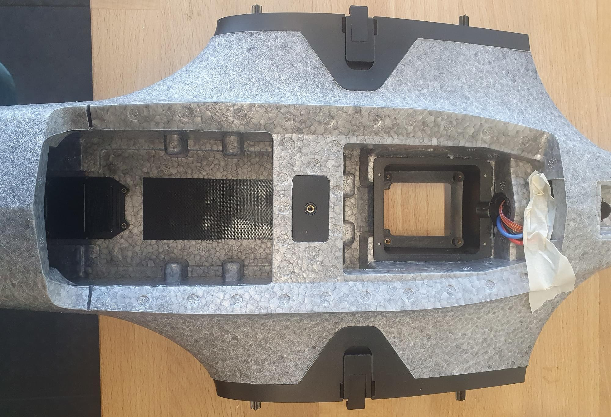

### ESC регулятори швидкості

1. Відпаяйте сигнальні контакти PWM та контакти заземлення ESC регулятора швидкості та припаяйте до контактів подовжувач сервоприводу.
  Кабель повинен бути достатньо довгим, щоб підключити дріт до контактів FMU плати керування польотом.

2. Розпаяйте 3 роз’єми «банан» заднього двигуна (може не знадобитися для інтеграції Pixhawk 6).

3. Прикрутіть ESC регулятор швидкості назад на місце 4 гвинтами M2.5 x 12.

4. Укоротіть дроти заднього двигуна та припаяйте їх на місце, як показано на малюнку.

5. Припаяйте сигнальні та GND-дроти до входу PWM ESC регулятора швидкості.

  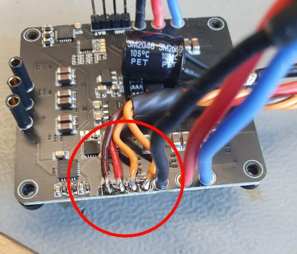

6. Зніміть гніздову вилку на ESC.
  Це надасть вам більше місця для встановлення польотного контролера.

  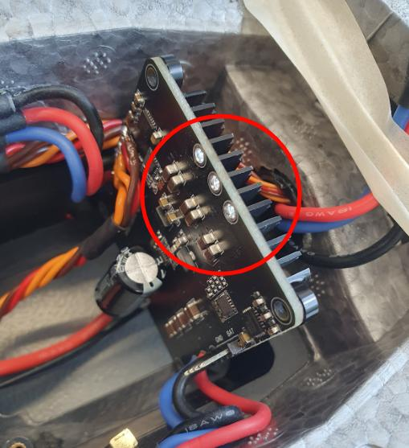

7. Припаяйте проводи заднього двигуна до ESC регулятора швидкості.
  Переконайтеся, що підключаєте так, щоб двигун обертався у правильному напрямку.

  

### З'єднувач крила

Для безпосереднього підключення крилового з'єднувача при кріпленні крила потрібні деякі виготовлені на 3D-принтері кріплення, щоб відцентрувати з'єднувач.
Цей крок не обов'язковий, але значно полегшує обробку, і вам потрібно буде робити на крок менше, коли будете встановлювати літак у полі.

1. Приклейте з'єднувачі крила до деталі, надрукованої на 3D-принтері, гарячим клеєм або 5 хвилинною епоксидною смолою.
2. Приклейте 3D-друковану частину разом із з'єднувачем у фюзеляж.
  Переконайтеся, що правильно вирівняли з'єднувач, поки клей сохне.

  Найпростіший спосіб вирівняти роз'єм - встановити крило, поки клей застигає, але переконайтеся, що клей не потрапив між фюзеляжем і крилом, інакше крило може застрягти.

Роз'єм, вклеєний у 3D-друковану частину

Роз'єм, вклеєний у фюзеляж. Не забудьте належним чином вирівняти конектор.

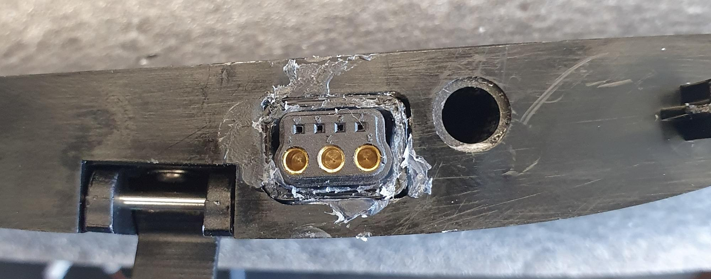

### Плати адаптерів Pixhawk та BEC

1. Виріжте пінопласт, як показано на малюнках, щоб створити простір для кріплення адаптерних плат Pixhawk і BEC двостороннім скотчем.
  Плата FMU розміщується зліва (у напрямку польоту) від фюзеляжу.
  Зпаяйте серво конектор та кабель для напруги батареї до BEC.

  
  

2. Підготуйте BEC для підключення до IO плати та батареї.
  BEC також можна припаяти безпосередньо до акумуляторних колодок ESC.

  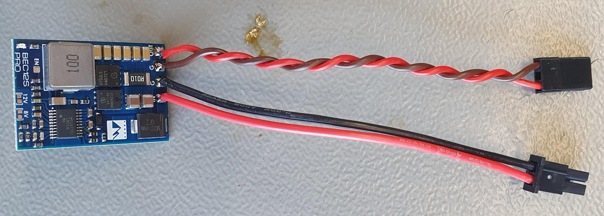

3. Закріпіть BEC двостороннім скотчем.

  

### Кабелі

1. Відріжте роз’єми від сервоприводів і припаяйте подовжувачі сервоприводів до кабелів.
  Переконайтеся, що кабелі достатньо довгі, щоб дістатися до адаптерної плати Pixhawk.
  Якщо у вас є обтискний інструмент, ви також можете безпосередньо додати роз’єми без пайки.

2. Під'єднайте кабелі сервоприводу до IO плати адаптера в такому порядку:

  - 1 - Aileron left
  - 2 - Aileron right
  - 3 - V-Tail left
  - 4 - V-Tail right
  - 5 - Tilt left
  - 6 - Tilt right

3. Під'єднайте сигнальні кабелі мотора до адаптерної плати FMU у такому порядку:

  - 1 - Передній лівий
  - 2 - Передній правий
  - 3 - Задній

### Датчики

#### Трубка Піто

1. Спочатку перевірте, чи трубка Піто влазить у кріплення, надруковане на 3D-принтері.
  Якщо це так, то приклейте трубку Піто на місце у кріплення.

  Щоб вирівняти трубку пропустіть її через другий отвір праворуч від передньої пластини FPV.
  Кріплення дозволить вам вдавити трубку назад у фюзеляж, щоб захистити її під час транспортування та обробки.
  Датчик може бути встановлений зверху на кріпленні, надрукованому на 3D-принтері, за допомогою двостороннього скотчу.

2. Приклейте кріплення, надруковане на 3D-принтері, на місце.

  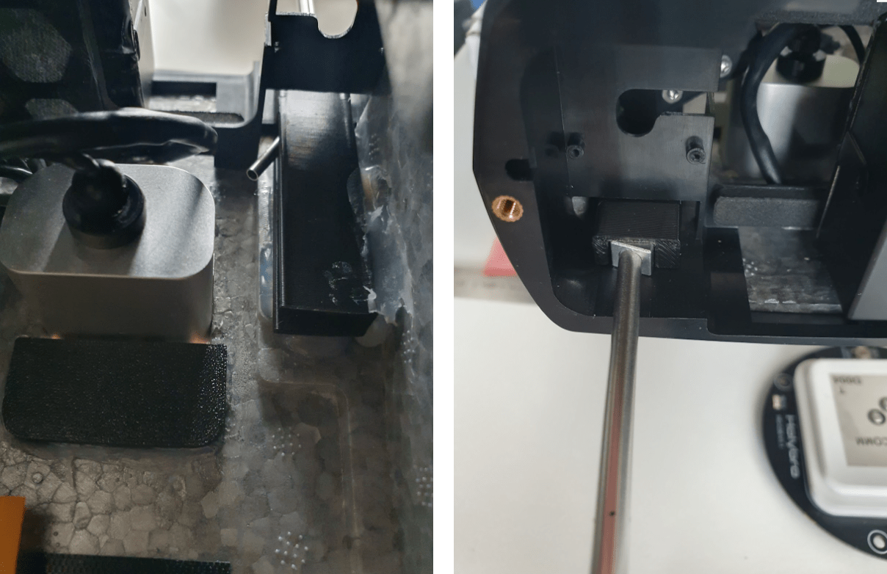

3. Датчик може бути встановлений зверху на кріпленні, надрукованому на 3D-принтері.

  

#### Лідар

За потреби лідар можна встановити спереду фюзеляжу.

Щоб встановити Лідар:

1. Зніміть радіатор
2. Приклейте лідар + надруковане на 3D-принтері кріплення для лідара на місце.

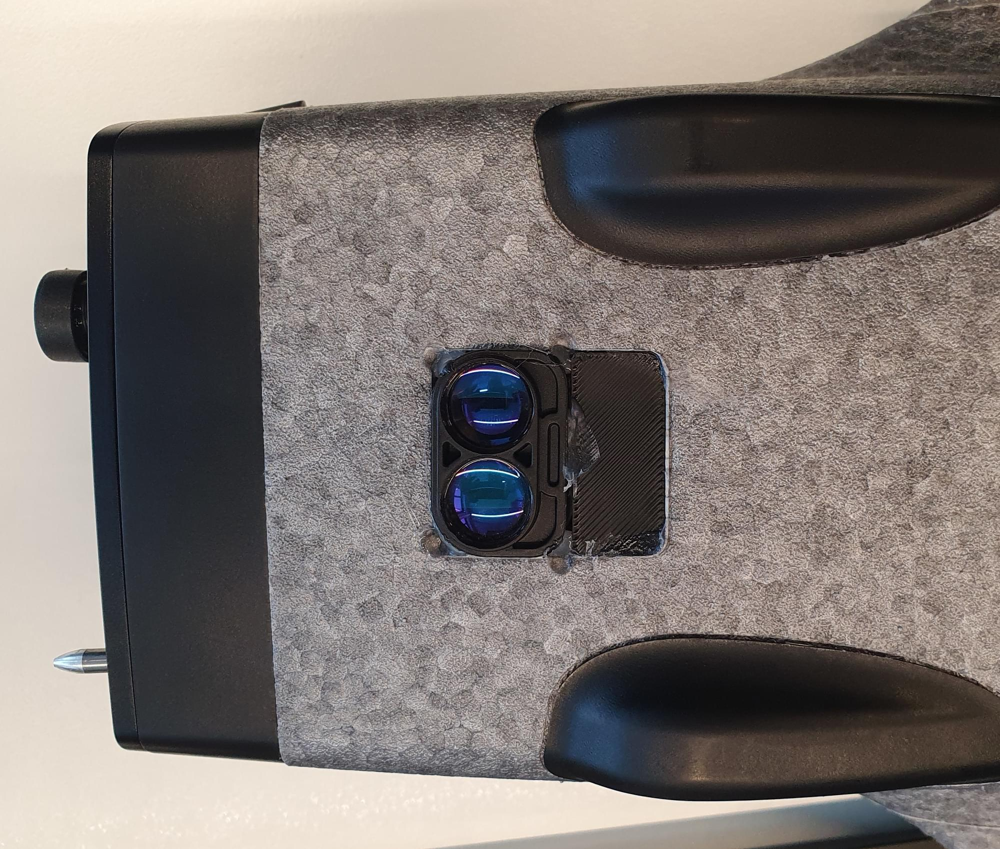

#### GPS/компас

Щоб встановити GPS:

1. З’єднайте дві надруковані на 3D-принтері частини трьома гвинтами M3x10.
2. Вийміть GPS із пластикового корпусу та від’єднайте роз’єм.
3. Протягніть кабель через вуглецевий лонжерон.
4. Glue the 3D-Printed part with 5 min epoxy in place.
  
5. After the glue has cured, screw the GPS with 4x M2.5x10 screws to the plate.
  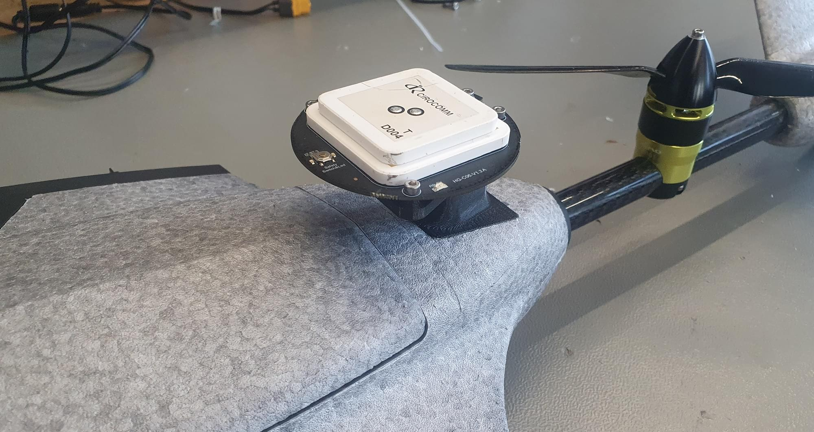

#### USB Камера

1. Обріжте USB-кабель камери так, щоб його довжина становила 15 см.
2. Відріжте кабель USB-адаптера на 25 см і спаяйте два кабелі між собою.
3. Для встановлення камери потрібно вирізати отвір у пінопласті перегородки.

  

  Потім ви можете закріпити камеру на перегородці за допомогою двостороннього скотча.

### Політний контролер

Польотний контролер може бути встановлений над ESC.

#### Pixhawk 6c/6c mini

Якщо використовується Pixhawk 6c або 6c mini, просто приклейте контролер польоту двостороннім скотчем на місце.

#### Skynode

Якщо використовується Skynode:

1. Помістіть його на верхню частину ESC і позначте 2 задніх місця кріплення на литій пластиковій частині ZMO.
2. Remove the Skynode from the vehicle and drill 2 holes with a 2.8 mm drill bit into the plastic part.
  
3. Встановіть Skynode на місце і прикрутіть його 2-ма гвинтами M3x10.

Інший варіант - додати в отвори різьбові вставки.
Оскільки литі під тиском частини ZMO дуже тонкі, їх потрібно склеїти на місці.

1. Прикрутіть переднє кріплення Skynode 2-ма гвинтами M3x10 до Skynode.
2. Потім додайте трохи епоксидного клею на 5 хвилин в нижню частину кріплення і покладіть вантаж зверху на Skynode, поки клей не затвердіє.
  Щоб отримати доступ до 2 кріпильних гвинтів спереду, проткніть 2 отвори зверху через пінопласт.

  

### Антени та RC приймач

:::info
Якщо встановлено Skynode, LTE можна використовувати для телеметрії та відеозв'язку.
If a Pixhawk is used a different [telemetry link](../telemetry/index.md) will be needed.
An inexpensive example would be a [SiK Telemetry Radio](../telemetry/sik_radio.md).
:::

1. Одна антена LTE може бути встановлена в нижній частині транспортного засобу.
  Для цього ви можете протягнути дріт антени через отвір для радіатора ESC.

  

2. Другу антену можна встановити всередині транспортного засобу з лівого боку акумуляторного відсіку.
  Пульт дистанційного керування також можна розмістити з лівого боку батарейного відсіку.

  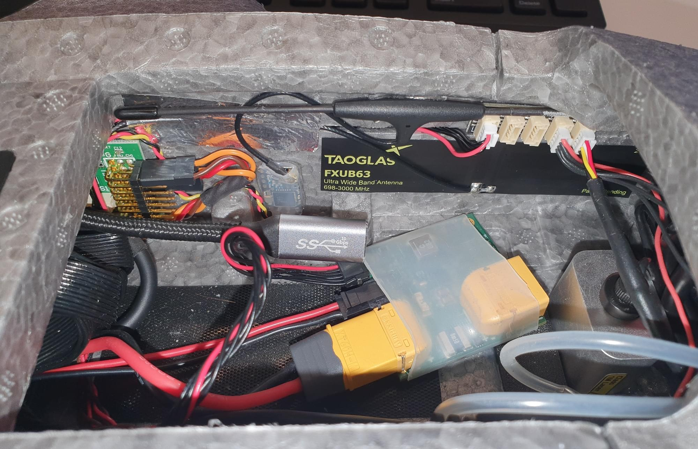

## Налаштування програмного забезпечення

### Вибір планера

1. Відкрийте QGC, виберіть значок **Q**, а потім виберіть **Налаштування транспортного засобу**.

2. Виберіть вкладку [Airframe](../config/airframe.md)

3. Select [Generic Tiltrotor VTOL](../airframes/airframe_reference.md#vtol_vtol_tiltrotor_generic_tiltrotor_vtol) from the _VTOL Tiltrotor_ group, and then and click **Apply and Restart**.

### Завантажте файл параметрів

Next we load a [parameter file](https://github.com/PX4/PX4-user_guide/raw/main/assets/airframes/vtol/omp_hobby_zmo_fpv/omp_hobby_zmo.params) that contains parameters that define the frame geometry, output mappings, and tuning values — so you don't have to!
Якщо ви дотримувалися інструкцій з підключення двигунів, вам, ймовірно, не знадобиться багато додаткових налаштувань, окрім калібрування датчиків і фіксації кріплень.

Щоб завантажити файл:

1. Download the [parameter file](https://github.com/PX4/PX4-user_guide/raw/main/assets/airframes/vtol/omp_hobby_zmo_fpv/omp_hobby_zmo.params).
2. Виберіть вкладку [Параметри](../advanced_config/parameters.md#finding-updating-parameters), а потім натисніть на **Tools** в правому верхньому кутку.
3. Select **Load from file** and then choose the `omp_hobby_zmo.params` file you just downloaded.
4. Перезапустіть транспортний засіб.

### Вибір сенсора

The airspeed sensor can be enabled in the [Parameters](../advanced_config/parameters.md#finding-updating-parameters) tab.

- If the [recommended airspeed sensor (SDP33)](https://www.dualrc.com/parts/airspeed-sensor-sdp33) is used, `SENS_EN_SDP3X` needs to be enabled.
- Якщо [Lidar Lightware lw20-c (включено в Skynode eval. kit)](../sensor/sfxx_lidar.md) is used, `SENS_EN_SF1XX` needs to be set to 6 (SF/LW/20c).

### Калібрування сенсорів

Спочатку переконайтеся, що встановлено [правильну орієнтацію контролера політної системи](../config/flight_controller_orientation.md).
Це має бути значенням за замовчуванням (`ROTATION_NONE`).

Потім відкалібруйте основні датчики:

- [Компас](../config/compass.md)
- [Гіроскоп](../config/gyroscope.md)
- [Акселерометр](../config/accelerometer.md)
- [Швидкість](../config/airspeed.md)

### RC-налаштування

[Відкалібруйте ваш RC Controller](../config/radio.md) та налаштуйте [перемикач режиму польоту](../config/flight_mode.md).

Ми рекомендуємо вам призначити RC перемикачі для набору режимів, визначених у [Flight Mode Configuration > What Flight Modes and Switches Should I Set?](../config/flight_mode.md#what-flight-modes-and-switches-should-i-set).
Зокрема, ви повинні призначити _VTOL Transition Switch_, _Kill Switch_ та перемикач для вибору [Режиму стабілізації](../flight_modes_fw/stabilized.md) та [Режиму позиціювання](../flight_modes_fw/position.md).

### Налаштування приводу

:::warning
Переконайтеся, що пропелери зняті!
Двигуни легко випадково запустити на вкладці приводів.
:::

Двигуни, керуючі поверхні та інші виконавчі пристрої налаштовані в [Керуванні актуаторами та тестуванні](../config/actuators.md) QGroundControl.

Файл параметрів, завантажений раніше [параметр-файл](#load-parameters-file), означає, що цей екран вже повинен бути налаштований правильно: вам лише потрібно відрегулювати обтинання для вашого конкретного транспортного засобу.
Якщо двигуни/сервоприводи були підключені до інших виходів, ніж запропоновано, вам потрібно буде змінити відповідність між виходами та функціями в розділі «Виходи приводів».

#### Сервоприводи кута нахилу

1. Switch the vehicle into manual mode (either via the flight mode switch or type `commander mode manual` into the MAVLink shell).

2. Перевірте, чи двигуни спрямовані вгору.
  Якщо двигуни спрямовані вперед, то пов'язані з ними сервоприводи нахилу потрібно змінити на протилежні (встановіть прапорець біля кожного сервоприводу).

  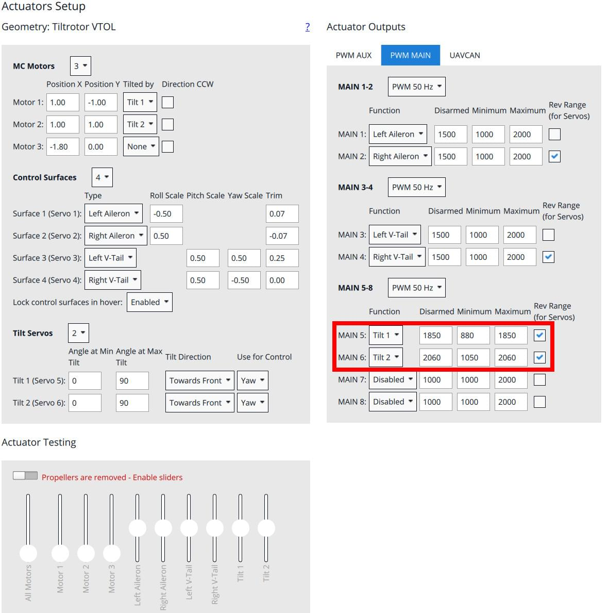

3. Налаштуйте мінімальне або максимальне значення, на яке сервопривід спрямовується вертикально вгору.

4. Then type `commander transition` into the MAVLink shell to adjust the horizontal position.

#### Керуючі поверхні

Перевірте, чи потрібно реверсувати приводи за допомогою пульта дистанційного керування:

- Перемістіть стік вправо. Правий елерон повинен піднятися вгору, лівий елерон повинен опуститися вниз.
- Нахили стік назад (політ вверх). Обидві поверхні V-подібного хвоста повинні піднятися.
- Упріть стік вправо. Обидві площини повинні зміститися вправо

Тепер відкоригуйте значення газу так, щоб всі поверхні були в нейтральному положенні.

#### Напрямок та орієнтація моторів

Переконайтеся, що пропелери зняті!!

- `Motor 1`: Front left motor should spin CW
- `Motor 2`: Front right motor should spin CCW
- `Motor 3`: Rear motor should spin CCW

Якщо двигун обертається в неправильному напрямку, необхідно поміняти місцями два з трьох дротів двигуна.
The direction can't be changed in software because the vehicle does not use [DShot ESC](../peripherals/dshot.md).

## Перший політ

- Check tilt rotor reactions in [Stabilized mode](../flight_modes_fw/stabilized.md). Утримуйте палицю керування газом в мінімумі і помістіть транспортний засіб на землю. Для активації сервоприводів нахилу вам потрібно озброїти транспортний засіб.
  - Yaw the vehicle to the right (nose to the right) -> left motor should tilt down
  - Yaw the vehicle to the left (nose to the left) -> right motor should tilt down
- Встановіть пропелери.
- Перевірте центр мас (GG).
  Перемикайте транспортний засіб у режим польоту вперед.
  Щоб перевірити ЦМ, підніміть транспорт з двома пальцями вгору на маркування під крилом.
  Транспортний засіб повинен бути в горизонтальному положенні.
  Якщо транспортний засіб нахилився вперед або назад, вам потрібно перемістити батарею в протилежному напрямку.
  Якщо ви не здатні врівноважити транспортний засіб цим методом, вам доведеться перенести деякі компоненти або додати вагу для вирівнювання транспортного засобу.
- Перевірте орієнтацію приводів та нейтральну передачу
- Перевірте реакції поверхонь управління в режимі [Стабілізованого польоту](../flight_modes_fw/stabilized.md). Перемикайте транспортний засіб у режим польоту вперед.
  - Перемістіть транспортний засіб праворуч.
    Правий елерон повинен піти вниз. Лівий елерон повинен піднятися.
  - Підійміть транспортний засіб вверх (носом вгору).
    Обидва елерони повинні йти вниз.
  - Поверніть транспортний засіб праворуч (носом праворуч).
    Обидва елерони повинні опуститися вліво.
- Якщо використовується [kill-switch](../config/safety.md#kill-switch), переконайтеся, що він працює належним чином і не буде активований випадково в повітрі!
- Включіть [режим стабілізації](../flight_modes_fw/stabilized.md) та перевірте, чи відповідають двигуни на команди, наприклад, перевалюємося вліво, збільшувати оберти на правому двигуні
- Злетайте у режимі [стабілізованого положення](../flight_modes_fw/stabilized.md) і виконайте деякі базові маневри
- Якщо все пройшло без проблем, злітайте у [Position mode](../flight_modes_fw/position.md) та зробіть перехід приблизно на висоті 50м.
  Якщо щось пішло не так, якнайшвидше перейдіть в режим мультикоптера (використовуючи перемикач переходу).
