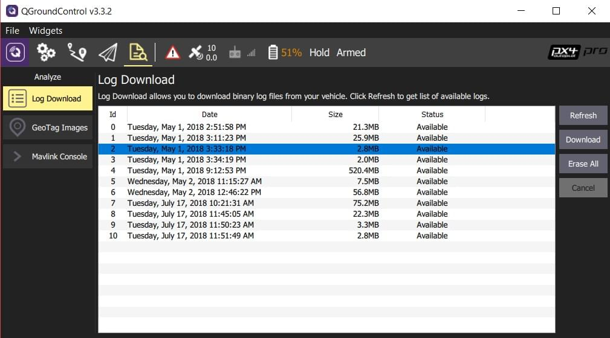

# Політні звіти

PX4 реєструє детальний стан апарату і дані датчиків, які можна використовувати для аналізу проблем з продуктивністю.
У цій темі пояснюється, як ви можете завантажувати та аналізувати бортові журнали, а також ділитися ними з командою розробників.

:::tip
Keeping flight logs is a legal requirement in some jurisdictions.
:::

## Завантаження журналів з політного контролера

Logs can be downloaded using [QGroundControl](http://qgroundcontrol.com/): **[Analyze View > Log Download](https://docs.qgroundcontrol.com/master/en/qgc-user-guide/analyze_view/log_download.html)**.

## Аналіз журналів

Upload the log file to the online [Flight Review](http://logs.px4.io) tool.
Після завантаження вам буде надіслано посилання на сторінку аналізу журналу.

[Log Analysis using Flight Review](../log/flight_review.md) explains how to interpret the plots, and can help you to verify/reject the causes of common problems: excessive vibration, poor PID tuning, saturated controllers, imbalanced vehicles, GPS noise, etc.

:::info
There are many other great tools for visualising and analysing PX4 Logs.
For more information see: [Flight Analysis](../dev_log/flight_log_analysis.md).
:::

:::tip
If you have a constant high-rate MAVLink connection to the vehicle (not just a telemetry link) then you can use _QGroundControl_ to automatically upload logs directly to _Flight Review_.
For more information see [Settings > MAVLink Settings > MAVLink 2 Logging (PX4 only)](https://docs.qgroundcontrol.com/master/en/qgc-user-guide/settings_view/mavlink.html#logging).
:::

## Надання доступу до файлів журналів розробникам PX4

The [Flight Review](http://logs.px4.io) log file link can be shared for discussion in the [support forums](../contribute/support.md#forums-and-chat) or a [Github issue](../index.md#reporting-bugs-issues).

## Конфігурація журналу

The logging system is configured by default to collect sensible logs for use with [Flight Review](http://logs.px4.io).

Logging may further be configured using the [SD Logging](../advanced_config/parameter_reference.md#sd-logging) parameters or with a file on the SD card.
Details on configuration can be found in the [logging configuration documentation](../dev_log/logging.md#configuration).

## Ключові посилання

- [Flight Review](http://logs.px4.io)
- [Log Analysis using Flight Review](../log/flight_review.md)
- [Flight Log Analysis](../dev_log/flight_log_analysis.md)
