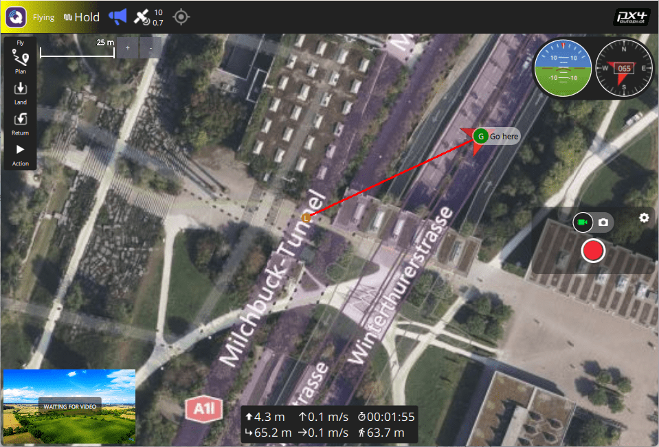

# Основні поняття

Цей розділ надає базовий вступ до безпілотників та використання PX4 (призначений в основному для користувачів початківців, але також є хорошим введенням для досвідчених користувачів).

If you are already familiar with the basic concepts, you can move on to [Basic Assembly](../assembly/index.md) to learn how to wire your specific autopilot hardware.
To load firmware and set up the vehicle with _QGroundControl_, see [Basic Configuration](../config/index.md).

## Що таке безпілотник?

Безпілотник, або Безпілотні Транспортні Засоби (БТЗ), - це безпілотний "роботизований" рухомий засіб, яким можна дистанційно або автономно керувати.
They can travel in air, on the ground, on/under the water, and are used for many [consumer, industrial, government and military applications](https://px4.io/ecosystem/commercial-systems/), including aerial photography/video, carrying cargo, racing, search and surveying, and so on.

Дрони більш формально називаються Безпілотними Повітряними Літальними Апаратами (UAV), Безпілотними Наземними Транспортними Засобами (UGV), Безпілотними Надводними Транспортними Засобами (USV), Безпілотними Підводними Транспортними Засобами (UUV).

:::info
The term Unmanned Aerial System (UAS) typically refers to a UAV and all of the other components of a complete system, including a ground control station and/or radio controller, and any other systems used to control the drone, capture, and process data.
:::

## Типи дронів

Існує багато різних рам автомобілів (типів), і всередині типів є багато варіацій.
Деякі типи, разом з використанням для яких вони найбільш підходять, перераховані нижче.

- [Multicopters](../frames_multicopter/index.md) — Multi-rotors offer precision hovering and vertical takeoff, at the cost of shorter and generally slower flight.
  Вони є найпопулярнішим типом літаючого транспорту, частково через те, що їх легко складати, і PX4 має режими, які роблять їх легкими у керуванні та дуже підходять як платформа для камери.
- [Helicopters](../frames_helicopter/index.md) — Helicopters similar benefits to Multicopters but are mechanically more complex and more efficient.
  Також їм набагато складніше літати.
- [Planes (Fixed-wing)](../frames_plane/index.md) — Fixed-wing vehicles offer longer and faster flight than multicopters, and hence better coverage for ground surveys etc.
  However they are harder to fly and land than multicopters, and aren't suitable if you need to hover or fly very slowly (e.g. when surveying vertical structures).
- [VTOL](../frames_vtol/index.md) (Vertical Takeoff and Landing) - Hybrid Fixed-wing/Multicopter vehicles offer the best of both worlds: take off in vertical mode and hover like a multicopter but transition to forward flight like an airplane to cover more ground.
  Апарати VTOL часто дорожчі за мультикоптери або апарати літакового типу, а також їх важче збирати та налаштовувати.
  Вони існують у ряді типів: тілтротори, тейлсітери, квадроплани тощо.
- [Airships](../frames_airship/index.md)/[Balloons](../frames_balloon/index.md) — Lighter-than-air vehicles that typically offer high altitude long duration flight, often at the cost of having limited (or no) control over speed and direction of flight.
- [Rovers](../frames_rover/index.md) — Car-like ground vehicles.
  Вони прості в керуванні та часто приємні у використанні.
  Вони не можуть рухатися так швидко, як більшість повітряних суден, але можуть нести важчі вантажі, і не використовують багато енергії, коли стоять.
- **Boats** — Water-surface vehicles.
- [Submersibles](../frames_sub/index.md) — Underwater vehicles.

Для додаткової інформації дивіться:

- [Vehicle Types & Setup](../airframes/index.md)
- [Airframe setup](../config/airframe.md)
- [Airframe Reference](../airframes/airframe_reference.md).

## Автопілоти

"Мізками" дрону є автопілот.

It minimally consists of _flight stack_ software running on a real time OS ("RTOS") on _flight controller_ (FC) hardware.
Політний стек забезпечує основну стабілізацію та функції безпеки, а зазвичай також певний рівень допомоги пілоту для ручного польоту та автоматизації загальних завдань, таких як зліт, посадка та виконання попередньо визначених місій.

Деякі автопілоти також включають універсальну обчислювальну систему, яка може забезпечувати "вищий рівень" управління та контролю, а також підтримувати більш просунуті мережеві технології, машинний зір та інші можливості.
This might be implemented as a separate [companion computer](#offboard-companion-computer), but in future it is increasingly likely to be a fully integrated component.

## Політний стек PX4

[PX4](https://px4.io/) is powerful open source autopilot _flight stack_ running on the NuttX RTOS.

Деякі ключові можливості PX4:

- Supports many different vehicle frames/types, including: [multicopters](../frames_multicopter/index.md), [fixed-wing aircraft](../frames_plane/index.md) (planes), [VTOLs](../frames_vtol/index.md) (hybrid multicopter/fixed-wing), [ground vehicles](../frames_rover/index.md), and [underwater vehicles](../frames_sub/index.md).
- Great choice of drone components for [flight controller](#flight-controller), [sensors](#sensors), [payloads](#payloads), and other peripherals.
- Flexible and powerful [flight modes](#flight-modes) and [safety features](#safety-settings-failsafe).
- Robust and deep integration with [companion computers](#offboard-companion-computer) and [robotics APIs](../robotics/index.md) such as [ROS 2](../ros2/user_guide.md) and [MAVSDK](http://mavsdk.mavlink.io).

PX4 is a core part of a broader drone platform that includes the [QGroundControl](#qgc) ground station, [Pixhawk hardware](https://pixhawk.org/), and [MAVSDK](http://mavsdk.mavlink.io) for integration with companion computers, cameras and other hardware using the MAVLink protocol.
PX4 is supported by the [Dronecode Project](https://www.dronecode.org/).

## Наземні станції керування

Станції земного контролю (GCS) - це системи на землі, які дозволяють операторам УЗ контролювати і керувати безпілотником та його вантажем.
Підмножина продуктів, які відомо, що працюють з PX4, перераховані нижче.

### QGroundControl {#qgc}

The Dronecode GCS software is called [QGroundControl](http://qgroundcontrol.com/) ("QGC").
Він працює на апаратному забезпеченні Windows, Android, MacOS або Linux і підтримує широкий спектр форм факторів екрану.
You can download it (for free) from [here](http://qgroundcontrol.com/downloads/).

QGroundControl communicates with the drone using a telemetry radio (a bidirectional data link), which allows you to get real-time flight and safety information, and to control the vehicle, camera, and other payloads using a point-and-click interface.
На апаратному забезпеченні, яке їх підтримує, ви також можете вручну керувати транспортним засобом за допомогою джойстиків.
QGC також може бути використаний для візуального планування, виконання та моніторингу автономних місій, встановлення геозахисту та багато іншого.

Настільні версії QGroundControl також використовуються для встановлення (прошивки) PX4 та налаштування PX4 на автопілоті/контролері польоту дрона.

### Auterion Mission Control (AMC) {#amc}

[Auterion Mission Control](https://auterion.com/product/mission-control/) is a powerful and fully featured ground control station application that is optimized for _pilots_ rather than vehicle configuration.
Хоча призначений для роботи з продуктами Auterion, його можна використовувати з "ванільним" PX4.

Для додаткової інформації дивіться:

- [AMC docs](https://docs.auterion.com/vehicle-operation/auterion-mission-control)
- [Download from Auterion Suite](https://suite.auterion.com/)

## Drone Components & Parts

### Політний контролер

Контролери польоту (FC) - це апаратне забезпечення, на яке завантажується та виконується прошивка стеку польоту PX4.
Вони підключені до датчиків, за допомогою яких PX4 визначає свій стан, а також до виконавчих пристроїв/двигунів, які він використовує для стабілізації та переміщення транспортного засобу.

PX4 can run on many different types of [Flight Controller Hardware](../flight_controller/index.md), ranging from [Pixhawk Series](../flight_controller/pixhawk_series.md) controllers to Linux computers.
These include [Pixhawk Standard](../flight_controller/autopilot_pixhawk_standard.md) and [manufacturer-supported](../flight_controller/autopilot_manufacturer_supported.md) boards.
Вам слід обирати плату, яка відповідає фізичним обмеженням вашого апарату, видам діяльності, які ви хочете виконувати та, за вартістю.

For more information see: [Flight Controller Selection](flight_controller_selection.md)

### Датчики

Системи на основі PX4 використовують датчики для визначення стану транспортного засобу, який їй потрібен для стабілізації транспортного засобу та увімкнення автономного керування.
Стани транспортного засобу включають: позицію/висоту, курс, швидкість, швидкість польоту, орієнтацію (відносно чогось), швидкість обертання в різних вісях, рівень заряду батареї тощо.

PX4 _minimally requires_ a [gyroscope](../sensor/gyroscope.md), [accelerometer](../sensor/accelerometer.md), [magnetometer](../gps_compass/magnetometer.md) (compass) and [barometer](../sensor/barometer.md).
This minimal set of sensors is incorporated into [Pixhawk Series](../flight_controller/pixhawk_series.md) flight controllers (and may also be in other controller platforms).

До контролера можна приєднати додаткові/зовнішні датчики.
The following sensors are recommended:

- A [GNSS/GPS](../gps_compass/index.md) or other source of global position is needed to enable all automatic modes, and some manual/assisted modes.

  Typically a module that combines a GNSS and Compass is used, as an external compass can be made less susceptible to electromomagnetic interference than the internal compass in the flight controller.

- [Airspeed sensors](../sensor/airspeed.md) are highly recommended for fixed-wing and VTOL-vehicles.

- [Distance Sensors \(Rangefinders\)](../sensor/rangefinders.md) are highly recommended for all vehicle types, as they allow smoother and more robust landings, and enable features such as terrain following on multicopters.

- [Optical Flow Sensors](../sensor/optical_flow.md) can be used with distance sensors on multcopters and VTOL to support navigation in GNSS-denied environments.

For more information about sensors see: [Sensor Hardware & Setup](../sensor/index.md).

### Виводи: Двигуни, Сервоприводи, Актуатори, або приводи

PX4 uses _outputs_ to control: motor speed (e.g. via [ESC](#escs-motors)), flight surfaces like ailerons and flaps, camera triggers, parachutes, grippers, and many other types of payloads.

The outputs may be PWM ports or DroneCAN nodes (e.g. DroneCAN [motor controllers](../dronecan/escs.md)).
The images below show the PWM output ports for [Pixhawk 4](../flight_controller/pixhawk4.md) and [Pixhawk 4 mini](../flight_controller/pixhawk4_mini.md).

 

The outputs are divided into `MAIN` and `AUX` outputs, and individually numbered (i.e. `MAINn` and `AUXn`, where `n` is 1 to usually 6 or 8).
They might also be marked as `IO PWM Out` and `FMU PWM OUT` (or similar).

:::warning
A flight controller may only have `MAIN` PWM outputs (like the _Pixhawk 4 Mini_), or may have only 6 outputs on either `MAIN` or `AUX`.
Ensure that you select a controller that has enough ports/outputs for your [airframe](../airframes/airframe_reference.md).
:::

You can connect almost any output to any motor or other actuator, by assigning the associated function ("Motor 1") to the desired output ("AUX1") in QGroundControl: [Actuator Configuration and Testing](../config/actuators.md).
Note that the functions (motor and control surface actuator positions) for each frame are given in the [Airframe Reference](../airframes/airframe_reference.md).

**Notes:**

- Pixhawk controllers have an FMU board and _may_ have a separate IO board.
  If there is an IO board, the `AUX` ports are connected directly to the FMU and the `MAIN` ports are connected to the IO board.
  Otherwise the `MAIN` ports are connected to the FMU, and there are no `AUX` ports.
- The FMU output ports can use [D-shot](../peripherals/dshot.md) or _One-shot_ protocols (as well as PWM), which provide much lower-latency behaviour.
  Це може бути корисним для тих хто займається перегонами та інших планерів які потребують кращої ефективності.
- There are only 6-8 outputs in `MAIN` and `AUX` because most flight controllers only have this many PWM/Dshot/Oneshot outputs.
  В теорії може бути більше виводів, якщо шина підтримує це (наприклад UAVCAN не обмежена такою малою кількістю вузлів).

### ESCs & Motors

Багато безпілотників на базі P4X використовують безколекторні електродвигуни, які керуються польотним контролером через електронний регулятор швидкості (ECS) (ECS перетворює сигнал з політного контролера у відповідний рівень потужності, що передається на мотор).

Для отримання інформації про те, які ESC/мотори підтримуються PX4 дивіться:

- [ESC & Motors](../peripherals/esc_motors.md)
- [ESC Calibration](../advanced_config/esc_calibration.md)
- [ESC Firmware and Protocols Overview](https://oscarliang.com/esc-firmware-protocols/) (oscarliang.com)

### Батарея/Живлення

Безпілотники на базі PX4 найчастіше працюють від літій-полімерних акумуляторів (LiPo).
The battery is typically connected to the system using a [Power Module](../power_module/index.md) or _Power Management Board_, which provide separate power for the flight controller and to the ESCs (for the motors).

Information about batteries and battery configuration can be found in [Battery Estimation Tuning](../config/battery.md) and the guides in [Basic Assembly](../assembly/index.md) (e.g. [Pixhawk 4 Wiring Quick Start > Power](../assembly/quick_start_pixhawk4.md#power)).

### Ручне керування

Pilots can control a vehicle manually using either a [Radio Control (RC) System](../getting_started/rc_transmitter_receiver.md) or a [Joystick/Gamepad](../config/joystick.md) controller connected via QGroundControl.

 

Системи радіокерування використовують спеціалізований наземний радіопередавач та приймач на апараті для передачі сигналів керування.
Вони завжди повинні використовуватися, коли ви вперше налаштовуєте/тестуєте нову конструкцію рами або під час польотів на перегонах / акробатичних польотах (та інших випадках коли важлива мала затримка).

Системи з джойстиком використовують QGroundControl для кодування інформації керування з "стандартного" ігрового джойстика комп'ютера у повідомлення MAVLink та надсилають її до апарату за допомогою (спільного) радіоканалу телеметрії.
Вони можуть використовуватися для більшості випадків ручного польоту, таких як зліт, обстеження тощо, за умови, що ваш канал телеметрії має достатньо високу пропускну спроможність / низьку затримку.

Джойстики часто використовуються в інтегрованих GCS / системах ручного керування, тому що інтеграція джойстика дешевша та простіша, ніж окремої системи радіокерування, і для більшості випадків використання нижча затримка не має значення.
Вони також ідеально підходять для польотів у симуляторі PX4, оскільки їх можна безпосередньо під'єднати до вашого комп'ютера наземної станції керування.

:::info
PX4 does not _require_ a manual control system for autonomous flight modes.
:::

### Запобіжний перемикач

Vehicles may include a _safety switch_ that must be engaged before the vehicle can be [armed](#arming-and-disarming) (when armed, motors are powered and propellers can turn).

This switch is almost always integrated into the [GPS](../gps_compass/index.md) module that is connected to the Pixhawk `GPS1` port — along with the [buzzer](#buzzer) and [UI LED](#leds).

The switch may be disabled by default, though this depends on the particular flight controller and airframe configuration.
You can disable/enable use of the switch with the [CBRK_IO_SAFETY](../advanced_config/parameter_reference.md#CBRK_IO_SAFETY) parameter.

:::info
Safety switches are optional.
Many argue that it is safer for users never to approach a powered system, even to enable/disable this interlock.
:::

### Зумер

Vehicles commonly include a buzzer for providing audible notification of vehicle state and readiness to fly (see [Tune meanings](../getting_started/tunes.md)).

This buzzer is almost always integrated into the [GPS](../gps_compass/index.md) module that is connected to the Pixhawk `GPS1` port — along with the [safety switch](#safety-switch) and [UI LED](#leds).
You can disable the notification tunes using the parameter [CBRK_BUZZER](../advanced_config/parameter_reference.md#CBRK_BUZZER).

### Світлодіоди

Vehicles should have a superbright [UI RGB LED](../getting_started/led_meanings.md#ui-led) that indicates the current readiness for flight.

Historically this was included in the flight controller board.
On more recent flight controllers this is almost always an [I2C peripheral](../sensor_bus/i2c_general.md) integrated into the [GPS](../gps_compass/index.md) module that is connected to the Pixhawk `GPS1` port — along with the [safety switch](#safety-switch) and [buzzer](#buzzer).

### Радіопередавачі даних/телеметрії

[Data/Telemetry Radios](../telemetry/index.md) can provide a wireless MAVLink connection between a ground control station like _QGroundControl_ and a vehicle running PX4.
Це дозволяє налаштовувати параметри, коли транспортний засіб в польоті, перевіряти телеметрію в режимі реального часу, змінювати політне завдання на льоту тощо.

### Бортовий / Супутній комп'ютер

A [Companion Computer](../companion_computer/index.md) (also referred to as "mission computer" or "offboard computer"), is a separate on-vehicle computer that communicates with PX4 to provide higher level command and control.

Супутній комп'ютер зазвичай працює на Linux, оскільки це краща платформа для розробки програмного забезпечення та дозволяє безпілотникам отримувати перевагу від наявності передвстановленого програмного забезпечення для машинного зору, мережевої взаємодії тощо.

Політний контролер та супутній комп'ютер можуть бути інтегровані на одній платі, полегшуючи розробку апаратного забезпечення, чи бути окремими пристроями, під'єднаними через serial кабель, Ethernet кабель чи WiFi.
The companion computer typically communicates with PX4 using a high level Robotics API such as [MAVSDK](https://mavsdk.mavlink.io/) or [ROS 2](../ros2/user_guide.md).

Відповідні теми:

- [Companion Computers](../companion_computer/index.md)
- [Off-board Mode](../flight_modes/offboard.md) - Flight mode for offboard control of PX4 from a GCS or companion computer.
- [Robotics APIs](../robotics/index.md)

### SD-карти (знімна пам'ять)

PX4 uses SD memory cards for storing [flight logs](../getting_started/flight_reporting.md), and they are also required in order to use UAVCAN peripherals and fly [missions](../flying/missions.md).

By default, if no SD card is present PX4 will play the [format failed (2-beep)](../getting_started/tunes.md#format-failed) tune twice during boot (and none of the above features will be available).

:::tip
The maximum supported SD card size on Pixhawk boards is 32GB.
The _SanDisk Extreme U3 32GB_ and _Samsung EVO Plus 32_ are [highly recommended](../dev_log/logging.md#sd-cards).
:::

SD карти, однак, не обов'язкові.
Політні контролери, які не містять слот для SD карти, можуть:

- Disable notification beeps are disabled using the parameter [CBRK_BUZZER](../advanced_config/parameter_reference.md#CBRK_BUZZER).
- [Stream logs](../dev_log/logging.md#log-streaming) to another component (companion).
- Зберігати місії в RAM/FLASH.
  <!-- Too low-level for this. But see FLASH_BASED_DATAMAN in  Intel Aero: https://github.com/PX4/PX4-Autopilot/blob/main/boards/intel/aerofc-v1/src/board_config.h#L115 -->

## Корисне навантаження

Корисне навантаження — це обладнання, яке переноситься апаратом для досягнення цілей користувача або місії, такі як камери в місіях з обстеження, інструменти, що використовуються для інспектування, наприклад, детектори радіації, та вантаж, який потрібно доставити.
PX4 підтримує багато камер та широкий спектр корисних навантажень.

Payloads are connected to [Flight Controller outputs](#outputs-motors-servos-actuators), and can be triggered automatically in missions, or manually from an RC Controller or Joystick, or from a Ground Station (via MAVLink/MAVSDK commands).

For more information see: [Payloads & Cameras](../payloads/index.md)

## Увімкнення та вимкнення

A vehicle is said to be _armed_ when all motors and actuators are powered, and _disarmed_ when nothing is powered.
There is also a _prearmed_ state when only servo actuators are powered, which is primarily used for testing.

A vehicle is usually disarmed on the ground, and must be armed before taking off in the current flight mode.

:::warning
Armed vehicles are dangerous because propellers can start spinning at any time without further user input, and in many cases will start spinning immediately.
:::

Arming and disarming are triggered by default using RC stick _gestures_.
On Mode 2 transmitters you arm by holding the RC throttle/yaw stick on the _bottom right_ for one second, and to disarm you hold the stick on bottom left for one second.
Також альтернативно є можливість налаштувати PX4 для увімкнення за допомогою RC перемикача або кнопки (й можна відправляти MAVLink команди увімкнення з наземної станції).

Для зменшення нещасних випадків, коли рухомі засоби на землі, вони повинні бути увімкненими якомога менше часу.
За замовчуванням рухомі засоби:

- _Disarmed_ or _Prearmed_ (motors unpowered) when not in use, and must be explicitly _armed_ before taking off.
- Автоматично перемикаються у стан disarmed/prearmed якщо засіб не злетів достатньо швидко після увімкнення (час перемикання налаштовується).
- Автоматично перемикаються у стан disarmed/prearmed незабаром після посадки (час налаштовується).
- Увімкнення запобігається, якщо засіб не в "нормальному" стані.
- Arming is prevented if the vehicle has a [safety switch](#safety-switch) that has not been engaged.
- Arming is prevented if a VTOL vehicle is in fixed-wing mode ([by default](../advanced_config/parameter_reference.md#CBRK_VTOLARMING)).
- Arming may be prevented due to a number of other optional [arming pre-condition settings](../config/safety.md#arming-pre-conditions), such as low battery.

В стані prearmed можна користуватись приводами, тоді як disarmed вимикає усе живлення.
Prearmed та disarmed стани є безпечними, а конкретний рухомий засіб може підтримувати один зі станів або обидва.

:::tip
Sometimes a vehicle will not arm for reasons that are not obvious.
QGC v4.2.0 (Daily build at time of writing) and later provide an arming check report in [Fly View > Arming and Preflight Checks](https://docs.qgroundcontrol.com/master/en/qgc-user-guide/fly_view/fly_view.html#arm).
Починаючи з PX4 v1.14 це забезпечує комплексну інформацію про проблеми увімкнення разом з можливими рішеннями.
:::

A detailed overview of arming and disarming configuration can be found here: [Prearm, Arm, Disarm Configuration](../advanced_config/prearm_arm_disarm.md).

## Режими польоту

Modes are special operational states that provide different types/levels of vehicle automation and autopilot assistance to the user (pilot).

_Autonomous modes_ are fully controlled by the autopilot, and require no pilot/remote control input.
These are used, for example, to automate common tasks like takeoff, returning to the home position, and landing.
Other autonomous modes execute pre-programmed missions, follow a GPS beacon, or accept commands from an offboard computer or ground station.

_Manual modes_ are controlled by the user (via the RC control sticks/joystick) with assistance from the autopilot.
Different manual modes enable different flight characteristics - for example, some modes enable acrobatic tricks,
while others are impossible to flip and will hold position/course against wind.

:::tip
Not all modes are available on all vehicle types, and some modes can only be used when specific conditions have been met (e.g. many modes require a global position estimate).
:::

An overview of the flight modes implemented within PX4 for each vehicle can be found below:

- [Flight Modes (Multicopter)](../flight_modes_mc/index.md)
- [Flight Modes (Fixed-Wing)](../flight_modes_fw/index.md)
- [Flight Modes (VTOL)](../flight_modes_vtol/index.md)
- [Drive Modes (Differential Rover)](../flight_modes_rover/differential.md)
- [Drive Modes (Ackermann Rover)](../flight_modes_rover/ackermann.md)

Instructions for how to set up your remote control switches to enable different flight modes is provided in [Flight Mode Configuration](../config/flight_mode.md).

PX4 also supports external modes implemented in [ROS 2](../ros2/index.md) using the [PX4 ROS 2 Control Interface](../ros2/px4_ros2_control_interface.md).
These are indistinguishable from PX4 internal modes, and can be used to override internal modes with a more advanced version, or to create entirely new functionality.
Note that these depend on ROS 2 and can therefore only run on systems that have a [companion computer](#offboard-companion-computer).

## Налаштування безпеки (Відмовостійкість)

PX4 має системи відмовостійкості, які можна налаштувати для захисту та повернення вашого засобу якщо щось піде не так!
Вони дозволяють вам вказати території й умови, за яких можна безпечно літати, а також дію, що буде виконуватися, якщо відбудеться умова запобігання відмові (наприклад, посадка, утримання позиції або повернення до зазначеної точки).

:::info
You can only specify the action for the _first_ failsafe event.
Як тільки запобіжна подія станеться, система перейде в режим спеціального виконання таким чином, що наступні тригери запобігання відмові будуть управлятися окремим рівнем системи та кодом притаманним конкретному рухомому засобу.
:::

Основні запобіжні випадки перераховані нижче:

- Низький заряд батареї
- Втрата дистанційного керування (RC)
- Втрата позиції (якість глобальної оцінки позиції занадто низька).
- Втрата бортового комп'ютера (наприклад втрата зв'язку із супутнім комп'ютером)
- Втрата каналу даних (наприклад втрата з'єднання телеметрії з GCS).
- Порушення геозони (обмеження польоту апарату у віртуальному циліндрі).
- Запобігання відмові місії (запобігає запуску попередньої місії під час зльоту з нової локації).
- Уникнення трафіку (викликається даними з, наприклад ADSB транспондера).

For more information see: [Safety](../config/safety.md) (Basic Configuration).

## Курс та напрямок руху

Усі транспортні засоби, човни та літаки мають напрям курсу або орієнтацію, що базується на їхньому русі вперед.

:::info
For a VTOL Tailsitter the heading is relative to the multirotor configuration (i.e. vehicle pose during takeoff, hovering, landing).
:::

Важливо знати напрямок курсу рухомого засобу з метою приведення автопілота у відповідність з вектором руху.
Мультикоптери мають напрямок руху навіть якщо вони симетричні з усіх боків!
Usually manufacturers use a coloured props or coloured arms to indicate the heading.

In our illustrations we will use red colouring for the front propellers of multicopter to show heading.

You can read in depth about heading in [Flight Controller Orientation](../config/flight_controller_orientation.md)
