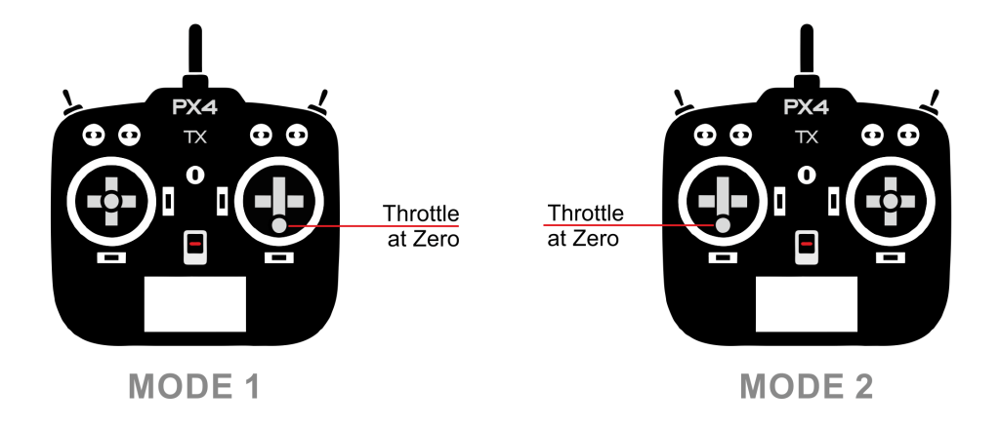

# Системи радіо керування

A Radio Control (RC) system can be used to _manually_ control your vehicle from a handheld RC controller.
У цьому розділі наведено огляд того, як працює RC система, як вибрати відповідну радіосистему для вашого засобу, і як під'єднати її до політного контролера.

:::tip
PX4 can also be manually controlled using a [Joystick](../config/joystick.md) or gamepad-like controller: this is different to an RC system!
The [COM_RC_IN_MODE](../advanced_config/parameter_reference.md#COM_RC_IN_MODE) parameter [can be set](../advanced_config/parameters.md) to choose whether RC (default), Joystick, both, or neither, are enabled.
:::

:::info
PX4 does not require a remote control system for autonomous flight modes.
:::

## Як працюють системи радіо керування?

An _RC system_ has a ground-based _remote control unit_ that is used by the operator to command the vehicle.
The remote has physical controls that can be used to specify vehicle movement (e.g. speed, direction, throttle, yaw, pitch, roll, etc.) and to enable autopilot [flight modes](../flight_modes/index.md) (e.g. takeoff, land, return to land, mission etc.).
On _telemetry-enabled_ RC systems, the remote control unit can also receive and display information from the vehicle, such as battery level, flight mode, and warnings.

Наземний RC контролер містить радіомодуль, який пов'язаний із (сумісним) радіомодулем у рухомому засобі та спілкується з ним.
Пристрій радіомодуля на апараті під'єднано до політного контролера.
Політний контролер визначає як інтерпретувати команди в залежності від поточного режиму польоту автопілота і відповідно керує моторами та приводами апарату.

<!-- image showing the different parts here would be nice -->

:::info
The ground- and vehicle- based radio modules are referred to as the transmitter and receiver respectively (even if they support bidirectional communication) and are collectively referred to as a _transmitter/receiver pair_.
RC контролер та включений в нього радіомодуль часто називають просто "передавачем".
:::

Важлива якість RC системи це кількість "каналів", яку вона підтримує.
Кількість каналів визначає скільки різних фізичних елементів керування на пульті можна використовувати для відправлення команд рухомому засобу (наприклад скільки перемикачів, стіків керування можна використовувати).

Літальний апарат повинен використовувати систему, яка підтримує щонайменше 4 канали (для крену, тангажу, рискання, тяги).
Наземні транспортні засоби потребують не менше двох каналів (кермо + газ). An 8 or 16 channel transmitter provides additional channels that can be used to control other mechanisms or activate different [flight modes](../flight_modes/index.md) provided by the autopilot.

## Типи пристроїв дистанційного керування

### Пристрої керування для літальних апаратів

The most popular _form_ of remote control unit for UAVs is shown below.
Як можна бачити, він має окремі стіки керування для крену/тангажу та для тяги/рискання (тобто літальний апарат потребує принаймні 4 канали).

Існує багато можливих розташувань для стіків керування, перемикачів і т. ін.
Найпоширеніші розташування мають власний номер "режиму". _Mode 1_ and _Mode 2_ (shown below) differ only in the placement of the throttle.

:::info
The choice of mode is largely one of taste (_Mode 2_ is more popular).
:::

## Пристрої керування для наземних засобів

Безпілотний наземний транспортний засіб (UGV)/автомобіль мінімально потребує передавача з 2 каналами для того, щоб передавати дані для керування та швидкості.
Часто передавачі задають ці дані за допомогою колеса та тригера, двох одновісних стіків керування або одного двовісного стіку.

Вам ніщо не заважає користуватися додатковими каналами або механізмами керування і це може бути дуже корисно для залучення додаткових приводів та режимів автопілота.

## Вибір компонентів RC системи

Вам необхідно буде обрати пару передача/приймача сумісних між собою.
In addition, receivers have to be [compatible with PX4](#compatible_receivers) and the flight controller hardware.

Сумісні радіосистеми часто продаються разом.
For example, [FrSky Taranis X9D and FrSky X8R](https://hobbyking.com/en_us/frsky-2-4ghz-accst-taranis-x9d-plus-and-x8r-combo-digital-telemetry-radio-system-mode-2.html?___store=en_us) are a popular combination.

### Пари передавач/приймач

One of the most popular RC units is the _FrSky Taranis X9D_.
It has an internal transmitter module can be used with the recommended _FrSky X4R-SB_ (S-BUS, low delay) or _X4R_ (PPM-Sum, legacy) receivers out of the box.
Він також має спеціальний роз'єм для радіо передавача та прошивку з відкритим кодом OpenTX яку можна налаштувати.

:::info
This remote control unit can display vehicle telemetry when used with [FrSky](../peripherals/frsky_telemetry.md) or [TBS Crossfire](../telemetry/crsf_telemetry.md) radio modules.
:::

Інші популярні пари передавач/приймач

- Пульт Turnigy з, наприклад, парою передавач/приймач FrSky.
- Передавачі Futaba та сумісні S-Bus приймачі Futaba.
- Передавачі на далеку відстань у діапазоні ~900МГц з низькою затримкою: набори "Team Black Sheep Crossfire" або "Crossfire Micro" із сумісним пультом (наприклад Taranis)
- Передавач на далеку відстань у діапазоні ~433МГц: набір ImmersionRC EzUHF із сумісним пультом (наприклад Taranis)

### PX4-Compatible Receivers {#compatible_receivers}

На додачу до пари передавач/приймач, приймач також повинен бути сумісним з PX4 та політним контролером.

_PX4_ and _Pixhawk_ have been validated with:

- PPM sum receivers

- S.BUS and S.BUS2 receivers from:

  - Futaba
  - FrSky S.BUS and PPM models
  - TBS Crossfire with SBUS as output protocol
  - Herelink

- TBS Crossfire with ([CRSF protocol](../telemetry/crsf_telemetry.md))

- Express LRS with ([CRSF protocol](../telemetry/crsf_telemetry.md))

- TBS Ghost with (GHST protocol)

- Spektrum DSM

- Graupner HoTT

Receivers from other vendors that use a supported protocol are likely to work but have not been tested.

:::info
Historically there were differences and incompatibilities between receiver models, largely due to a lack of detailed specification of protocols.
The receivers we have tested all now appear to be compatible, but it is possible that others may not be.
:::

## Підключення приймачів

Як загальне правило: приймачі з'єднуються з політним контролером використовуючи порт відповідного протоколу що ним підтримується:

- Spektrum/DSM receivers connect to the "DSM" input.
  Pixhawk flight controllers variously label this as: `SPKT/DSM`, `DSM`, `DSM/SBUS RC`, `DSM RC`, `DSM/SBUS/RSSI`.
- Graupner HoTT receivers: SUMD output must connect to a **SPKT/DSM** input (as above).
- PPM-Sum and S.BUS receivers must connect directly to the **RC** ground, power and signal pins.
  This is typically labeled: `RC IN`, `RCIN` or `RC`, but has in some FCs has been labeled `PPM RC` or `PPM`.
- PPM receivers that have an individual wire for each channel must connect to the RCIN channel _via_ a PPM encoder [like this one](http://www.getfpv.com/radios/radio-accessories/holybro-ppm-encoder-module.html) (PPM-Sum receivers use a single signal wire for all channels).
- TBS Crossfire/Express LRS Receivers using [CRSF Telemetry](../telemetry/crsf_telemetry.md) connect via a spare UART.

Flight controllers usually include appropriate cables for connecting common receiver types.

Instructions for connecting to specific flight controllers are given in their [quick-start](../assembly/index.md) guides (such as [CUAV Pixhawk V6X Wiring Quick Start: Radio Control](../assembly/quick_start_cuav_pixhawk_v6x.md#radio-control) or [Holybro Pixhawk 6X Wiring Quick Start: Radio Control](../assembly/quick_start_pixhawk6x.md#radio-control)).

:::tip
See the manufacturer's flight controller setup guide for additional information.
:::

## Прив'язка передавача/приймача

Before you can calibrate/use a radio system you must _bind_ the receiver and transmitter so that they communicate only with each other.
Процес прив'язки пари передавача та приймача залежить від апаратного забезпечення (дивіться посібник користувача для інструкцій).

If you are using a _Spektrum_ receiver, you can put it into bind mode using _QGroundControl_: [Radio Setup > Spectrum Bind](../config/radio.md#spectrum-bind).

## Налаштування поведінки при втраті сигналу

У RC приймачів є різні способи визначення втрати сигналу:

- Відсутній вивід (автоматично виявляється PX4)
- Output a low throttle value (you can [configure PX4 to detect this](../config/radio.md#rc-loss-detection)).
- Виводиться останній отриманий сигнал (PX4 не може впоратися з цим випадком!)

Виберіть приймач, який може нічого не виводити коли RC втрачається (бажано) або виводить низьке значення газу.
Ця поведінка може вимагати налаштування апаратного забезпечення приймача (перевірте інструкцію користувача).

For more information see [Radio Control Setup > RC Loss Detection](../config/radio.md#rc-loss-detection).

## Пов'язані теми

- [Radio Control Setup](../config/radio.md) - Configuring your radio with PX4.
- Manual Flying on [multicopter](../flying/basic_flying_mc.md) or [fixed wing](../flying/basic_flying_fw.md) - Learn how to fly with a remote control.
- [TBS Crossfire (CRSF) Telemetry](../telemetry/crsf_telemetry.md)
- [FrSky Telemetry](../peripherals/frsky_telemetry.md)
