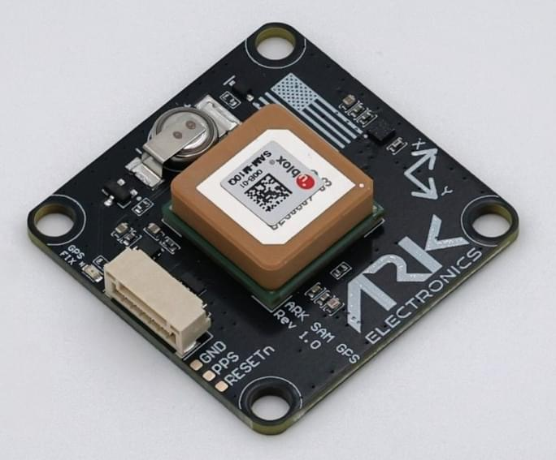

# ARK SAM GPS

[ARK SAM GPS](https://arkelectron.gitbook.io/ark-documentation/gps/ark-sam-gps>) is a made in the USA and NDAA-compliant [GNSS/GPS](../gps_compass/index.md) u-blox SAM-M10Q GPS and industrial magnetometer.

## Де купити

Замовте цей модуль з:

- [ARK Electronics](https://arkelectron.com/product/ark-sam-gps/) (US)

## Характеристики обладнання

- [Open Source Schematic and BOM](https://github.com/ARK-Electronics/ARK_SAM_GPS/tree/main)
- Датчики
  - [u-blox SAM-M10Q](https://www.u-blox.com/en/product/sam-m10q-module)
    - Less than 38 mW power consumption without compromising GNSS performance
    - Maximum position availability with 4 concurrent GNSS reception
    - Просунуте виявлення підробки сигналу та перешкод
  - [ST IIS2MDC Magnetometer](https://www.st.com/en/mems-and-sensors/iis2mdc.html)
- Pixhawk Standard UART/I2C Connector (6 Pin JST SH)
- Вимоги до живлення
  - 5V
  - 15mA Average
  - 20mA Max
- LED індикатори
  - GPS Fix
- USA Built
- NDAA Compliant
- 6 Pin Pixhawk Standard UART/I2C Cable

## Налаштування обладнання

The module comes with a Pixhawk-standard 6pin connector that will plug into the `GPS2` port on recent Pixhawk flight controllers.
It should be mounted front facing, as far away from the flight controller and other electronics as possible.

For more information see [Mounting the GNSS/Compass](../gps_compass/index.md#mounting-the-gnss-compass) and [Hardware Setup](../gps_compass/index.md#hardware-setup).

## Конфігурація PX4

The module should be plug-n-play when used with the `GPS2` port on most flight controllers.

[Secondary GPS Configuration (UART)](../gps_compass/index.md#secondary-gps-configuration-uart) explains how you can configure the port if the GPS is not detected (note, that the configuration is the same, even if you are using GPS 2 as the primary compass).

## Схема розташування виводів

### Pixhawk Standard UART/I2C Connector - 6 Pin JST-SH

| Pin Number | Signal Name | Напруга              |
| ---------- | ----------- | -------------------- |
| 1          | 5V          | 5.0V |
| 2          | RX          | 3.3V |
| 3          | TX          | 3.3V |
| 4          | SCL         | 3.3V |
| 5          | SDA         | 3.3V |
| 6          | GND         | GND                  |

## Дивіться також

- [ARK SAM GPS Documentation](https://arkelectron.gitbook.io/ark-documentation/gps/ark-sam-gps) (ARK Docs)
