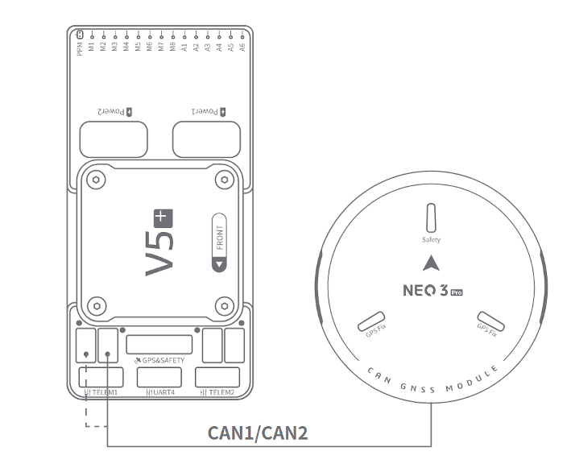

# CUAV NEO 3 Pro

<Badge type="tip" text="PX4 v1.13" />

NEO 3Pro - це приймач GPS DroneCan, вироблений CUAV.
Він інтегрує UBLOX M9N, STM32F4 MCU, компас RM3100, триколірний світлодіодний індикатор та вимикач безпеки.

## Технічні характеристики

| Апаратне забезпечення(Hardware) | Тип                                                                                                                        |
| :------------------------------------------------- | :------------------------------------------------------------------------------------------------------------------------- |
| Процесор                                           | STM32F412                                                                                                                  |
| Компас                                             | RM3100                                                                                                                     |
| Барометр                                           | MS5611                                                                                                                     |
| Приймач GNSS                                       | UBLOX NEO M9N                                                                                                              |
| RGB привід                                         | NCP5623C                                                                                                                   |
| Зумер                                              | Пасивний зумер                                                                                                             |
| Запобіжний перемикач                               | Фізична кнопка                                                                                                             |
| GNSS                                               | Beidou, Galileo, GLONASS, GPS                                                                                              |
| Система розширення GNSS                            | SBAS:WAAS,EGNOS,MSAS QZSS:L1s(SAIF) other：RTCM3.3 |
| Кількість одночасних GNSS                          | 4                                                                                                                          |
| Смуга частот                                       | GPS:L1C/A GLONASS:L10F Beidou:B1I Galileo:E1B/C   |
| Горизонтальна точність                             | 2.0M                                                                                                       |
| Точність швидкості                                 | 0.05M/S                                                                                                    |
| Частота оновлення навігації                        | 25Hz(Max)                                                                                               |
| Отримання даних                                    | Холодний старт: 24 с Гарячий старт: 2 с Допоміжний старт: 2 с        |
| Кількість супутників(MAX)       | 32+                                                                                                                        |
| Чутливість                                         | Відстеження та нав-167dBm Холодний старт Гарячий старт-148dBm Повторний збір -160dBm                                 |
| Протокол                                           | UAVCAN                                                                                                                     |
| Тип порту                                          | GHR-04V-S                                                                                                                  |
| Підтримувані автопілоти включають                  | серія CUAV, серія Pixahwk                                                                                               |
| Фільтрування хвиль                                 | SAW+LNA+SAW                                                                                                                |
| Протиелектромагнітний/радіочастотний перешкід      | EMI+RFI                                                                                                                    |
| Оновлення прошивки                                 | підтримка                                                                                                                  |
| Вхідна напруга                                     | 5V                                                                                                                         |
| Робоча температура                                 | -10~70℃                                                                                                    |
| Розмір                                             | 60_60_16MM                                                                                                                 |
| Вага                                               | 33g                                                                                                                        |

## Де купити

- [CUAV](https://cuav.en.alibaba.com/product/1600165544920-820872629/Free_shipping_CUAV_Neo_3_pro_drone_UAVCAN_GNSS_processor_STM32F412_autopilot_ublox_M9N_positioning_RM3100_compass_uav_gps_module.html?spm=a2700.shop_oth.74.2.636e28725EvVHb)

## Підключення та з'єднання

NEO 3 Pro, підключений до інтерфейсу автопілоту CAN1/CAN2

## Конфігурація PX4

Відкрийте **QGroundControl > Parameters** та змініть наступні параметри:

- `UAVCAN_ENABLE`: встановити на `Sensors Automatic config` .
- `UAVCAN_SUB_GPS` Встановлено на `Увімкнути`.

## Додаткова інформація

- [Документація CUAV](https://doc.cuav.net/gps/neo-series-gnss/en/neo-3-pro.html)
