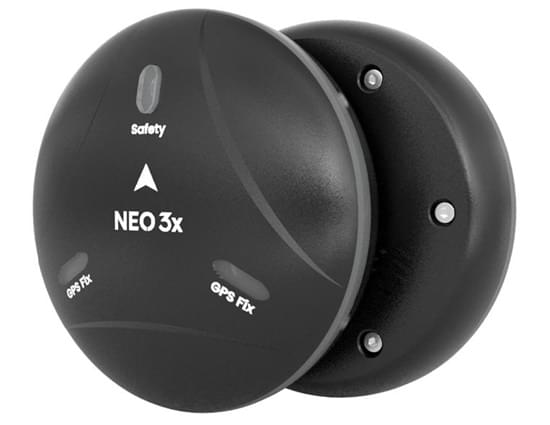
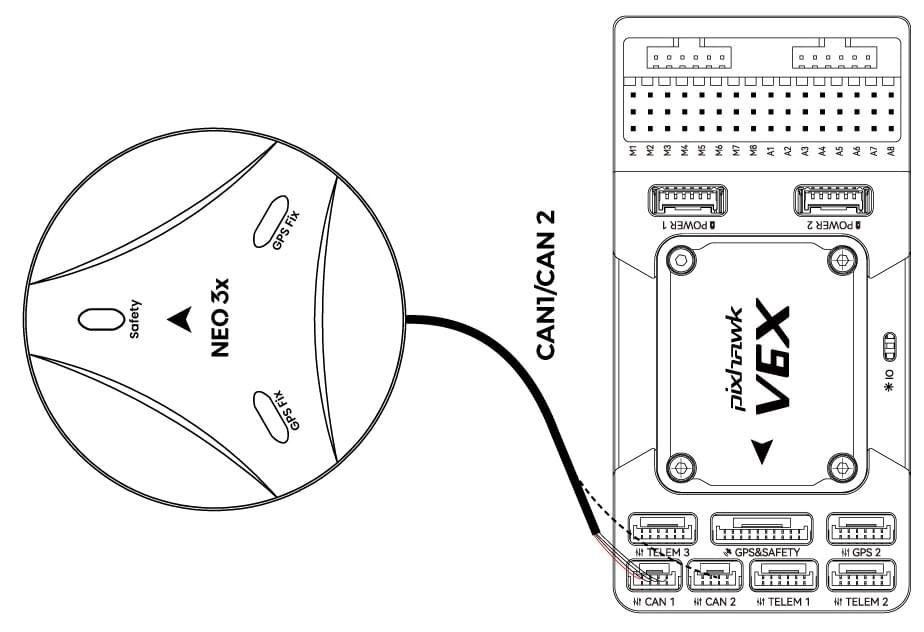
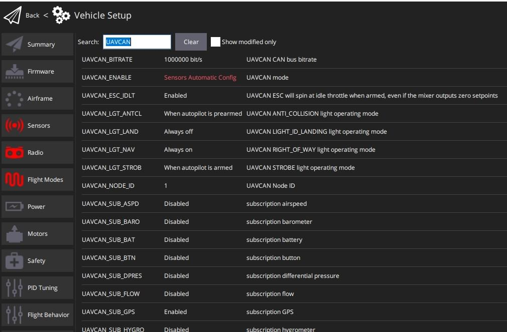

# CUAV NEO 3X GPS

<Badge type="tip" text="PX4 v1.13" />

CUAV Neo 3X - це водо- та пилонепроникний GNSS-приймач.
Він має ступінь захисту IP66 та інтегрує модуль UBLOX M9N, компас RM3100, кольоровий світлодіодний індикатор і запобіжний вимикач.

Основні характеристики:

- Професійний водонепроникний і пилонепроникний дизайн.
- Підтримка протоколу DroneCAN.
- Quad Satellite System Receiver (Ublox M9N).

## Технічні характеристики

| Апаратне забезпечення(Hardware) | Тип                                                                                                                                                 |
| :------------------------------------------------- | :-------------------------------------------------------------------------------------------------------------------------------------------------- |
| MUC                                                | STM32F412                                                                                                                                           |
| Протокол                                           | DroneCAN                                                                                                                                            |
| Компас                                             | RM3100                                                                                                                                              |
| Барометр                                           | ICP-20100                                                                                                                                           |
| Приймач GNSS                                       | Ublox M9N                                                                                                                                           |
| Смуга частот                                       | GPS: L1C/A GLONASS:L10F  Beidou:B1I Galileo:E1B/C                          |
| Кількість одночасних GNSS                          | 4                                                                                                                                                   |
| Горизонтальна точність                             | 1,5 м                                                                                                                                               |
| Кількість супутників(MAX)       | 32+                                                                                                                                                 |
| Отримання даних                                    | Холодний старт: 24 с Гарячий старт: 2 с Допоміжний старт: 2 с                                 |
| Частота оновлення навігації                        | 5Гц (за замовчуванням), 25Гц (MAX)                                                                            |
| Чутливість                                         | Відстеження та навігація:-167дБм Холодний старт Гарячий старт:-148дБм Повторний збір: -160дБм |
| Рівень захисту                                     | IP66                                                                                                                                                |
| Вхідна напруга                                     | 4.7~5.2В                                                                                            |
| Робоча температура                                 | -10~70℃                                                                                                                             |
| Розмір                                             | 67_67_21.2мм                                                                                                                        |
| Вага                                               | 46г (без кабелю)                                                                                                                 |

## Де купити

- [CUAV](https://www.alibaba.com/product-detail/Free-shipping-CUAV-NEO-3X-GPS_1601004167114.html?spm=a2747.manage.0.0.6aa271d2urCPnP)

## Підключення та з'єднання

NEO 3X, підключений до інтерфейсу автопілоту CAN1/CAN2

## Конфігурація PX4

Відкрийте **QGroundControl > Parameters** та змініть наступні параметри:

- `UAVCAN_ENABLE`: встановити на `Sensors Automatic config` .
- `UAVCAN_SUB_GPS` Встановлено на `Увімкнути`.

## Додаткова інформація

- [Документація CUAV](https://doc.cuav.net/gps/neo-series-gnss/en/neo-3x.html)
