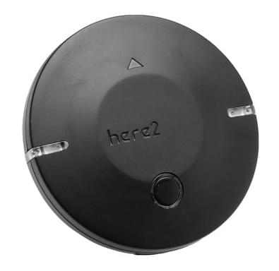
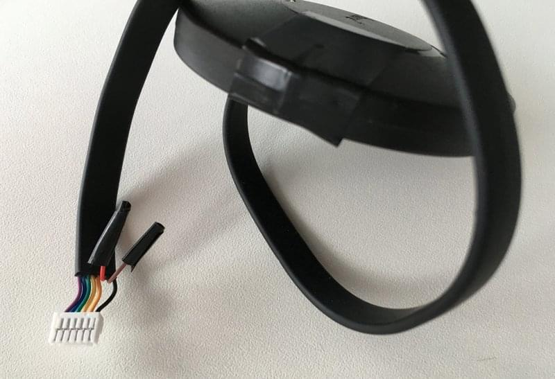

# HEX/ProfiCNC Here2 GPS (Discontinued)

:::warning
This has been superseded by the [Cube Here 3](https://www.cubepilot.com/#/here/here3)
:::

The [Here2 GPS receiver](http://www.proficnc.com/all-products/152-gps-module.html) is an update to the Here GPS module from HEX.

Основні функції включають:

- Одночасний прийом до 3 GNSS (GPS, Galileo, GLONASS, BeiDou)
- Найкраща в галузі навігаційна чутливість -167 дБм
- Безпека та захист цілісності
- Підтримує всі системи супутникового доповнення
- Просунуте виявлення перешкод і спуфінгу

## Де купити

- [ProfiCNC](http://www.proficnc.com/all-products/152-gps-module.html) (Australia)
- [Other resellers](http://www.proficnc.com/stores)

## Налаштування

Налаштування та використання PX4 відбувається за принципом «підключи і працюй».

::: info

- If the GPS is _not detected_ then [update the Here2 firmware](https://docs.cubepilot.org/user-guides/here-2/updating-here-2-firmware).
- If the GPS is detected but does not work, attempt the process outlined in [allocating node uavcan ID](https://docs.cubepilot.org/user-guides/here-2/here-2-can-mode-instruction).

:::

## Підключення та з'єднання

The Here2 GPS comes with an 8 pin connector that can be inserted directly into the [Pixhawk 2](http://www.hex.aero/wp-content/uploads/2016/07/DRS_Pixhawk-2-17th-march-2016.pdf) GPS UART port.

У Pixhawk 3 Pro та Pixracer є роз'єм для GPS з 6 контактами.
Для цих контролерів ви можете модифікувати GPS-кабель (як показано нижче), видаливши контакти 6 і 7.

Виводи 6 і 7 призначені для кнопки безпеки - їх також можна прикріпити за потреби.

### Схема розташування виводів

Схема виводів Here2 GPS наведена нижче. Це може бути використано для модифікації роз'єму для інших плат автопілота.

| pin | Here2 GPS                       | pin | Pixhawk 3 Pro GPS           |
| --- | ------------------------------- | --- | --------------------------- |
| 1   | VCC_5V     | 1   | VCC                         |
| 2   | GPS_RX     | 2   | GPS_TX |
| 3   | GPS_TX     | 3   | GPS_RX |
| 4   | SCL                             | 4   | SCL                         |
| 5   | SDA                             | 5   | SDA                         |
| 6   | BUTTON                          | -   | -                           |
| 7   | BUTTON_LED | -   | -                           |
| 8   | GND                             | 6   | GND                         |

## Специфікація

- **Processor:** STM32F302
- **Sensor**
  - **Compass, Gyro, Accelerometer:** ICM20948
  - **Barometer:** MS5611
- **Receiver Type:** 72-channel u-blox M8N engine, GPS/QZSS L2 C/A, GLONASS L10F, BeiDou B11, Galileo E1B/C, SBAS L1 C/A: WAAS, EGNOS, MSAS, GAGAN
- **Navigation Update Rate:** Max: 10 Hz
- **Positionaing Accuracy:** 3D Fix
- **Time to first fix:**
  - **Cold start:** 26s
  - **Aided start:** 2s
  - **Reacquisition:** 1s
- **Sensitivity:**
  - **Tracking & Navigation:** -167 dBm
  - **Hot start:** -148 dBm
  - **Cold start:** -157 dBm
- **Assisted GNSS**
  - AssistNow GNSS Online
  - AssistNow GNSS Offline (до 35 днів)
  - AssistNow Autonomous (до 6 днів)
  - OMA SUPL& 3GPP compliant
- **Oscillator:** TCXO (NEO-8MN/Q)
- **RTC crystal:** Build in
- **ROM:** Flash (NEO-8MN)
- **Available Antennas:** Active Antenna & Passive Antenna
- **Signal Integrity:** Signature feature with SHA 256
- **Protocols & Interfaces:**
  - **UART/I2C/CAN:** JST_GH Main interface, Switch internally.
  - **STM32 Main Programming Interface:** JST_SUR
