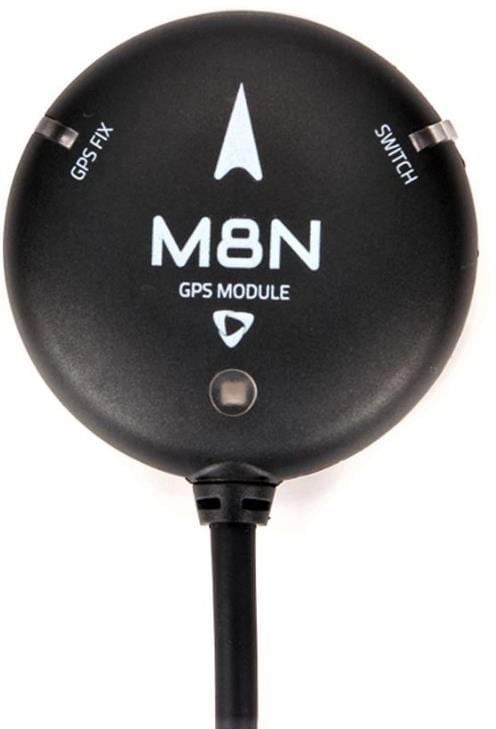
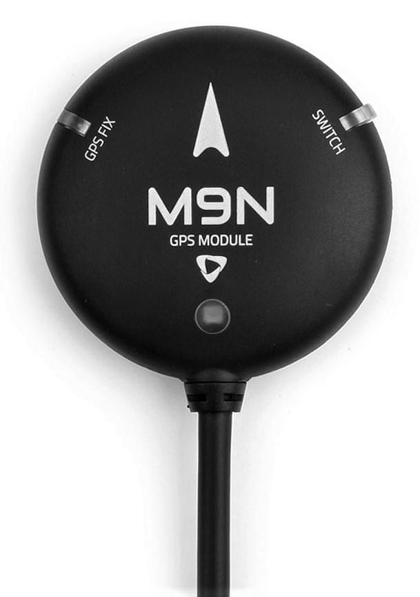
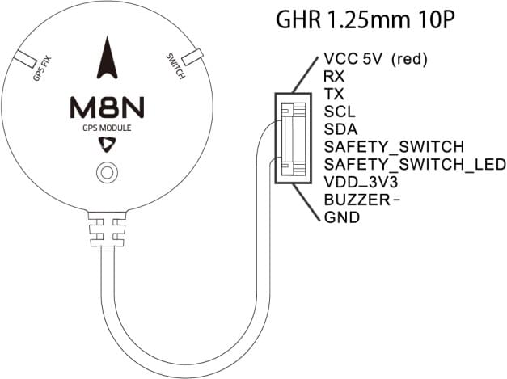
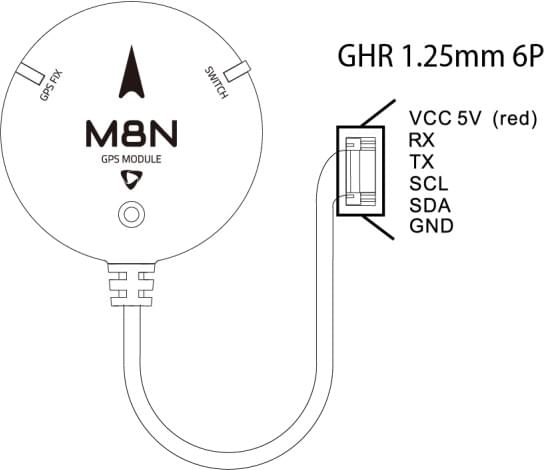
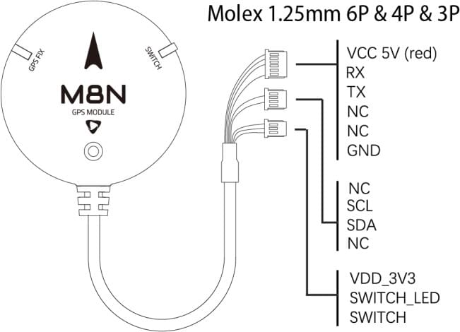
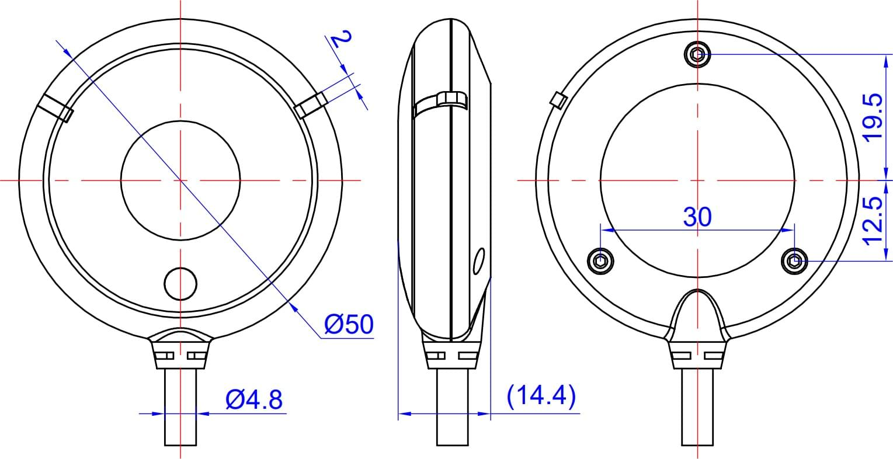

# Holybro M8N & M9N GPS

GPS включає в себе модуль M8N або M9N UBLOX, компас IST8310, триколірний світлодіодний індикатор і запобіжний вимикач.

Існує 3 різних варіанти роз'ємів, що дозволяють легко під'єднуватися до польотних контролерів, сумісних зі стандартом роз'єму Pixhawk, як до основного або додаткового GPS-приймача.
Цей модуль поставляється зі швидкістю передачі даних 38400 Гц.

Основна відмінність між модулями полягає в тому, що M8N дозволяє одночасний прийом до 3 систем GNSS, тоді як M9N може одночасно підключатися до 4.

 

### Функції та специфікації

- Модуль Ublox Neo-M8N або M9N
- Найкраща в галузі навігаційна чутливість -167 дБм
- Холодний запуск: 26 с
- LNA MAX2659ELT+
- 25 x 25 x 4 мм керамічна патч-антена
- Конденсатор Фараха, що перезаряджається
- Малошумний стабілізатор 3,3 В
- Струм споживання: менше 150 мА при 5 В
- Фіксація індикаторних світлодіодів
- Захисний чохол
- У комплекті є кабель завдовжки 26 см
- Діаметр: 50 мм загальний розмір, 32 грами з кейсом.
- **M8N:** Concurrent reception of up to 3 GNSS (GPS, Galileo, GLONASS, BeiDou)
- **M9N:** Concurrent reception of up to 4 GNSS (GPS, Galileo, GLONASS, BeiDou)

## Де купити

- [Holybro](https://holybro.com/collections/gps)

Зверніть увагу, що існують варіанти як для M8N, так і для M9N, а також три різні роз'єми.

## Підключення та з'єднання

GPS-модулі M8N і M9N випускаються в трьох варіантах.
Вони дозволяють підключатись до польотних контролерів, які відповідають стандарту роз'єму Pixhawk, як основний або додатковий GPS.

- **SKU12012 Holybro M8N GPS (JST GHR1.25mm 10 pin cable)**.

  This JST GH 10Pin connector can be used on Pixhawk Series 10pin `GPS Module` or `GPS1` input port.

  

- **SKU12014 Holybro M8N 2nd GPS (JST GHR1.25m m 6pin cable)**

  This JST GH 6Pin connector can be used on Pixhawk Series 6pin `UART`, `I2C` or `GPS2` input port as secondary GPS.

  

- **SKU12013 Holybro M8N GPS for Pix32 (Molex 1.25mm 6pin & 4pin & 3pin cable)**

  These Molex 1.25mm 6pin & 4pin & 3pin connectors are for the [Holybro pix32 Flight Controller](../flight_controller/holybro_pix32.md) `Switch`, `GPS`, and `I2C` input ports (not for the Pix32 v5 or v6).

  

## Розміри

