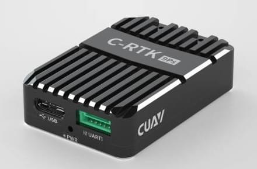
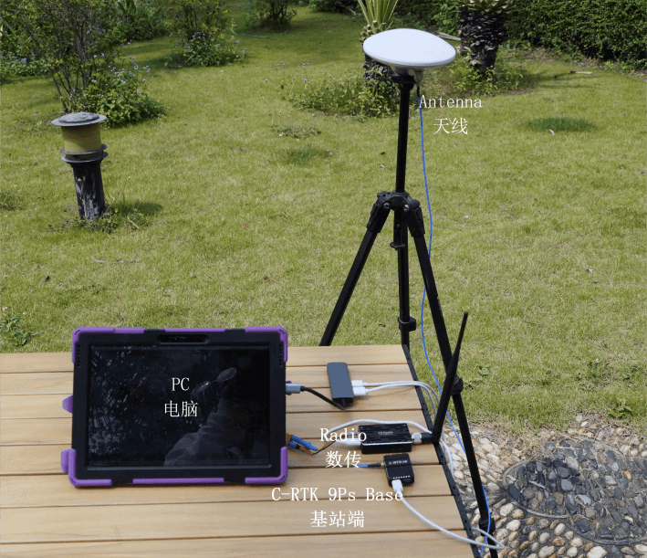
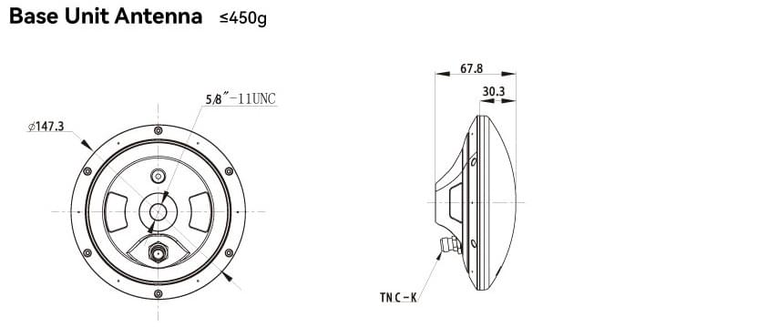
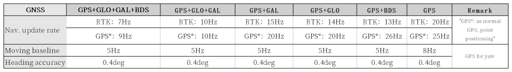

# CUAV C-RTK 9Ps

The CUAV [C-RTK 9Ps](https://www.cuav.net/en/c_rtk_9ps/) is a multi-satellite, multi-band, centimeter-level, RTK GNSS system.

Модуль одночасно приймає сигнали супутників GPS, ГЛОНАСС, Galileo та Beidou, що забезпечує швидке позиціонування та вищу точність.
It also supports [RTK GPS Heading](../gps_compass/u-blox_f9p_heading.md) using dual modules.

Використання C-RTK 9Ps надає PX4 точність позиціювання на рівні сантиметрів.
Це ідеальний варіант для дронів для зйомки, сільськогосподарських дронів та інших сценаріїв застосування.

## Де купити

[cuav Store](https://store.cuav.net/shop/c-rtk-9ps/)

## Специфікація

## Підключення та з'єднання

**C-RTK 9Ps (Base)**

- Використовуйте штатив, щоб закріпити антену базової станції зверху, і підключіть антену до базової станції
- Підключіть базову станцію та телеметрію до комп'ютера за допомогою USB-кабелю.

**C-RTK 9Ps (Rover)**

- Встановіть антену C-RTK 9Ps (Rover) вертикально.
- Підключіть антену до C-RTK 9Ps (Rover).
- Підключіть C-RTK 9Ps (Rover) до контролера польоту.
- Connect telemetry to the flight controller `TELEM1`/`TELEM2` interface

:::info
C-RTK 9Ps come with 6-pin and 10-pin connectors compatible with Pixhawk-standard flight controllers.
Connect to `GPS1` or `GPS2`.
Виберіть відповідний кабель для контролера польоту.
:::

## Налаштування

RTK setup and use on PX4 via _QGroundControl_ is largely plug and play (see [RTK GPS](../gps_compass/rtk_gps.md) for more information).

## Схема розташування виводів

## Фізичні розміри

## Частота оновлення навігації

## Докладніше

[CUAV docs](https://doc.cuav.net/gps/c-rtk-series/en/c-rtk-9ps/)
