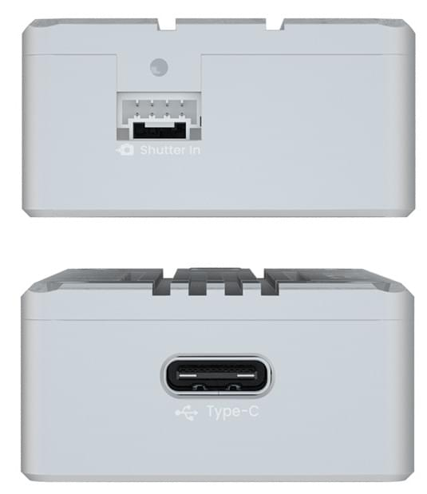

# CUAV C-RTK2 GNSS Module (RTK/PPK)

The [CUAV C-RTK2 receiver](https://www.cuav.net/en/c_rtk_9ps/) is a high-performance PPK/RTK positioning module created by CUAV for professional applications such as drone aerial surveying and mapping.
It has a high-precision IMU and positioning module, and can reduce the number of required [control points](https://www.youtube.com/watch?v=3k7v5aXyuKQ) by more than to 80%.
На додаток до зйомки/картографування, він підходить для багатьох інших випадків використання, включаючи: захист сільськогосподарських рослин та рої дронів.

## Інші характеристики

- Потужний процесор H7
- Високоточний IMU промислового класу
- Підтримка RTK та одночасне збереження необроблених даних RAW (PPK)
- Багатосупутникові та багаточастотні приймачі
- Протокол UAVCAN/Dronecan
- Підтримка гарячого взуття та спуску спусковик
- Режими HS_USB та U диск

## Де купити

- [CUAV Store](https://store.cuav.net/shop/c-rtk-2/)
- [CUAV aliexpress](https://pt.aliexpress.com/item/1005003754165772.html?spm=a2g0o.store_pc_groupList.8148356.13.2f893550i0NE4o)

# Короткий опис

- Приймач RTK
  - ZED-F9P
- Канал прийому
  - 184
- Головний FMU процесор
  - STM32H743VIH6(2M flash、1M RAM）
- Бортові сенсори:
  - Акселерометр/Гіроскоп: ICM20689
- Магнітометр: RM3100
  - Барометр: ICP10111
- Розширення TF-карти
  - 32G(MAX)
- PPK(пост оброблений кінематологік)
  - підтримка
- RTK(Реальний кінематичний час)
  - підтримка
- Діапазони GNSS
  - GPS:L1C/A,L2C
  - GLONASS:L1OF,L2OF
  - GALILEO: E1B/C E5b
  - Beidou:B1I B2I
- Покращена система
  - QZSS:L1C/A,L2C,L1S
  - SBAS:L1C/A
- Кількість одночасних GNSS
  - 4(GPS、GLONASS、GALILEO、Beidou）
- Частота оновлення навігації
  - RTK До 20 Гц
  - RAW До 25 Гц
  - default：5hz
- Час конвергенції
  - RTK < 10 sec
- Точність позиціонування (середньоквадратичне значення)
  - RTK:0.01m+1ppm(рівень);0.02m+1ppm(вертикаль)
  - GPS:1.5м(рівень)
- Отримання даних
  - Холодний запуск 24с
  - Допоміжний запуск 2с
  - Повторне отримання 2с
- Чутливість
  - Tracking & Nav –167 dBm
  - Холодний старт –148 dBm
  - Гарячий старт –157 dBm
  - Повторне отримання –160с
- Анти-пуфінг
  - Вдосконалені алгоритми захисту від підробок
- Протоколи
  - NMEA
  - UBX binary
  - RTCM версія 3.x
- Часовий імпульс
  - 0.25 Гц ~ 10 Гц (налаштовується)
- Захист від глушіння
  - Активне виявлення та усунення радіозавад Вбудований фільтр смугового пропускання
- Підтримка типу керування польотом
  - Сумісність з польотними контролерами з прошивкою PX4
- інтерфейс
  - 1 Гарячий роз'єм
  - 1 затвор в
  - 1 sutter out
  - 1 Тип (HS_USB)
  - 1 F9P USB
  - 1 F9P UART
  - 1 Антена(mmcx)
- Напруга живлення
  - 4.5~6v
- Робоча температура
  - -20~85℃
- Розмір
  - 56x33x16.5mm
- Вага
  - 39g

## Налаштування

[CUAV Docs](https://doc.cuav.net/gps/c-rtk2/en/quick-start-c-rtk2.html)

## Схема розташування виводів

## Докладніше

[CUAV Docs](https://doc.cuav.net/gps/c-rtk-series/en/c-rtk-9ps/)
