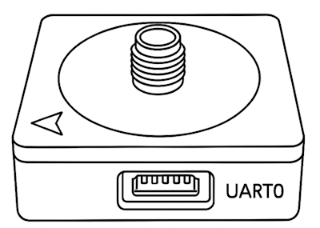
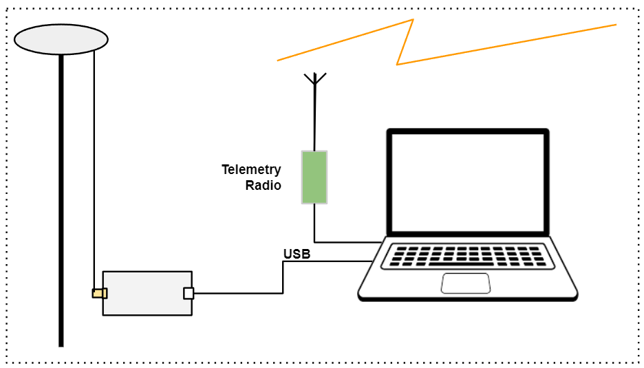
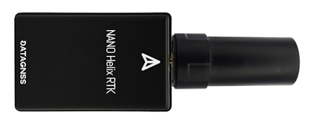

# DATAGNSS NANO HRTK receiver

NANO HRTK receiver is a RTK receiver designed and manufactured by [DATAGNSS](https://www.datagnss.com/).

It is a high performance dual-band RTK receiver with compass, which is based on CYNOSURE series chipset.
It supports global civil navigation systems, including GPS, BDS, GLONASS, Galileo, QZSS, and SBAS.

NANO HRTK receiver support compass.
It is designed for UAV, RTK, and other applications.

:::info
The NANO HRTK Receiver supports both base and rover options.
It does not yet support _moving base_ mode.
:::

## Де купити

- [NANO HRTK receiver](https://www.datagnss.com/collections/gnss-for-drone/products/nano-helix-rtk-receiver) (www.datagnss.com)

## Основні характеристики

- Full constellation, multi-frequency GNSS satellite receiver
- Support RTK with up to 10hz output rate
- Standard UART serial interface
- Lightweight and compact size

## Frequencies

- GPS/QZSS: L1 C/A, L5C
- GLONASS: L1OF
- BEIDOU: B1I, B2a
- GALILEO: E1, E5a
- IRNSS: L5

## GNSS

- 128 hardware channels
- 3D accuracy: **1.5m** CEP
- RTK accuracy: **2cm** +1PPM(H), 3cm+1PPM(V)

## Інтерфейс

- UART \*2 : 230400bps default
- SMA connector for antenna
- Output rate 5Hz default, up to 10Hz
- Main power supply: 4.7~5.2V

## Протокол

- NMEA-0183 output
- RTCM3.x input/output

## Environment

- Operating temp. -20~85°C

## Dimension and Weight

- 35x30mm
- 25g

## Схема розташування виводів

The board is connected to the autopilot via UART interface.

The 1.25mm pitch 6P connector supports UART for GNSS and I2C for compass.

## Налаштування програмного забезпечення

RTK requires a base RTK module attached to the ground station, and a rover RTK module on the vehicle.
The data from the base needs to be transmitted to the drone via telemetry radio and sent to the RTK receiver on the rover.

The setup/connections for base and rover modules are shown below.

### Base Setup (GCS)

The base station connections are shown in the diagram below, along with the connection to a telemetry radio.

Note that for the base we recommend the [NANO RTK Receiver](https://www.datagnss.com/collections/gnss-for-drone/products/multi-band-rtk-receiver-package) because it is easier to setup.

See to [How to setup Base station](https://wiki.datagnss.com/index.php/GEM1305-autopilot#Base_station_setup) for information on how to configure the module for use as a base station (not including step 6 and later, for which you would QGroundControl instead of Mission Planner).

### Rover Setup (PX4)

The rover setup showing connections to a GPS port and the (required) connection to a telemetry radio are shown in the diagram below.

The diagram below shows the wiring from the `GPS2` port on the Pixhawk 6c flight controller.
Note that an appropriate cable is supplied for this purpose.

GPS and RTK configuration on PX4 via _QGroundControl_ is plug and play (see [RTK GPS](../gps_compass/rtk_gps.md) for more information).

## Package List

- NANO HRTK Receiver
- DG-6P-Cxx, GH-1.25mm-GH 6P cable
- Helix antenna L1/L2/L5 (optional)

## Resources

- [NANO RTK Receiver 2D drawing file](https://wiki.datagnss.com/images/3/31/EVK-DG-1206_V.2.0.pdf)
- [NANO HRTK Receiver Wiki](https://docs.datagnss.com/gnss/rtk_receiver/NANO/nano-helix-rtk/) (DATAGNSS WiKi)
- [HED-10L Heading RTK Receiver](https://docs.datagnss.com/gnss/rtk_receiver/HED-10L/)

## Докладніше

- [NANO RTK Receiver](https://docs.datagnss.com/gnss/rtk_receiver/NANO/nano-rtk-receiver)
- [HELIX Antenna for RTK](https://www.datagnss.com/collections/rtk-antenna/products/smart-helix-antenna)
- [RTK Antenna AGR6302G](https://www.datagnss.com/collections/rtk-antenna/products/antenna-agr6302g)
- [AT400 RTK Antenna](https://www.datagnss.com/collections/rtk-antenna/products/at400-multi-band-antenna-for-rtk)
