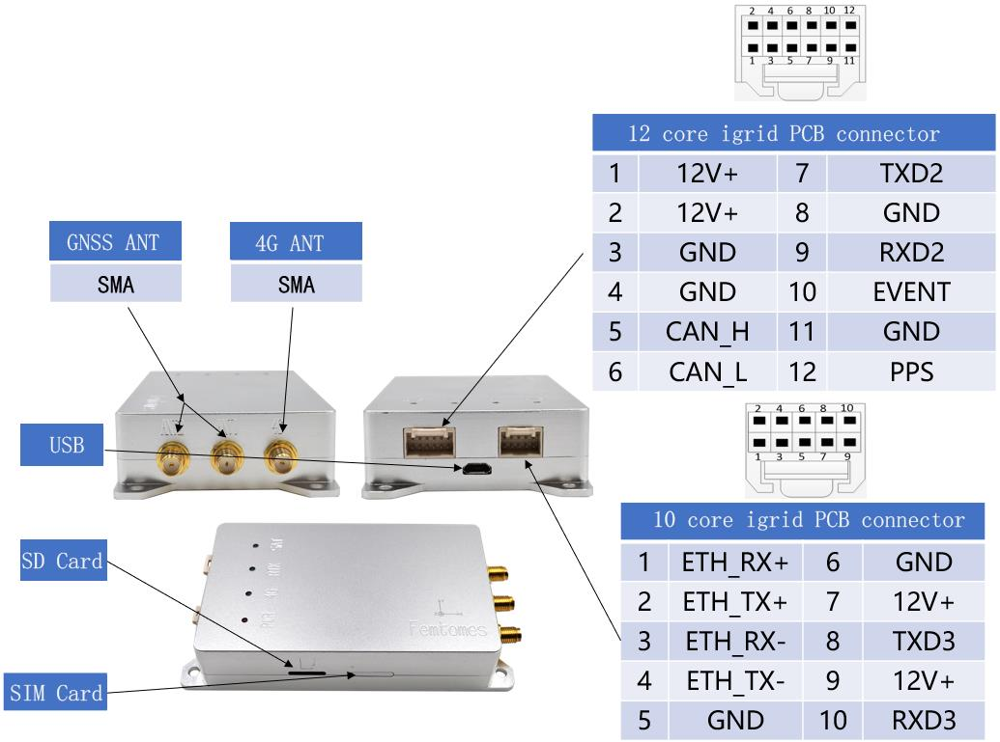

# Femtones MINI2 Receiver

[MINI2 Receiver](http://www.femtomes.com/#/MiniII?type=0) is an RTK GPS receiver that delivers high-rate and reliable RTK initialization for centimeter level positioning.
Він призначений для застосувань, які вимагають високоточного позиціонування (наприклад, навігація та картографування тощо).

Приймач підключений до PX4 через послідовний порт (UART) і може бути налаштований через Ethernet за допомогою стандартного веб-браузера.

:::info
PX4 drivers for Ethernet, CAN and USB are under development.
:::

## Необхідні параметри прошивки

При купівлі пристрою необхідно вибрати наступні параметри вбудованого програмного забезпечення:

- 5Гц, 10Гц, 20Гц
- INS
- ЗАГОЛОВОК
- OBS
- RTK
- BASE

## Де купити

Contact [Femtones](http://www.femtomes.com/) directly for sales quote:

- **Email:** [sales@femtomes.com](mailto:sales@femtomes.com)
- **Telephone:** +86-10-53779838

## Функціональні Порти

## Підключення та з'єднання

The [MINI2 Receiver](http://www.femtomes.com) is connected to a UART on the flight controller (GPS port) for data.
Для живлення модуля вам знадобиться окреме джерело живлення 12В.
Контакти на 12-контактному роз'ємі позначені, як показано нижче.

## Налаштування

Для оцінювання заголовку потрібно, щоб дві антени були на одному рівні і були відстані щонайменше 30 см одна від одної.
The direction that they are facing does not matter as it can be configured with the [GPS_YAW_OFFSET](../advanced_config/parameter_reference.md#GPS_YAW_OFFSET) parameter.

Configure the serial port on which the [MINI2 Receiver](http://www.femtomes.com/#/MiniII?type=0) will run using [GPS_1_CONFIG](../advanced_config/parameter_reference.md#GPS_1_CONFIG), and set the baud rate to 115200 using [SER_GPS1_BAUD](../advanced_config/parameter_reference.md#SER_GPS1_BAUD).

Once configured the receiver is used in the same way as any other [RTK GPS](../gps_compass/rtk_gps.md) (i.e. with respect to the Survey-in process).

## Додаткова інформація

MINI2 включає наступні компоненти:

- [FB672](http://www.femtomes.com/#/FB672): Compact, dual antenna, dual frequency GNSS OEM board (delivers centimeter accurate position and precise heading).

  

- [FB6A0](http://www.femtomes.com/#/FB6A0): Compact, quadruple frequency GNSS OEM board (delivers centimeter-accurate positioning)

  

Докладні інструкції щодо продукту можна отримати на офіційному веб-сайті або зв'язавшись з нами.
