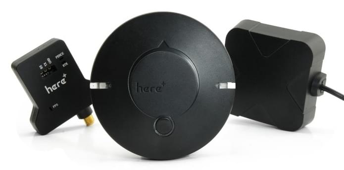

# HEX/ProfiCNC Here+ RTK GPS (Припинено)

<Badge type="info" text="Discontinued" />

:::info
This GPS is no longer available for purchase but is still compatible with PX4.

Usage documentation can be found in [PX4v1.11 docs](https://docs.px4.io/v1.11/en/gps_compass/rtk_gps_hex_hereplus.html)
:::

The **Here+ RTK GPS receiver** is a small, light and energy efficient [RTK GPS module](../gps_compass/rtk_gps.md), based on the u-blox M8P. Використовуючи RTK, PX4 може визначати своє місцезнаходження з точністю до сантиметра, що набагато точніше, ніж може забезпечити звичайний GPS.

