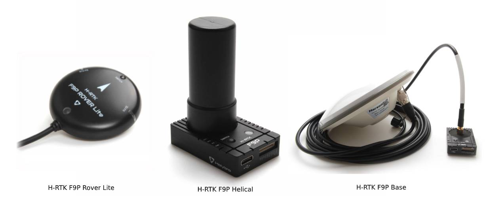
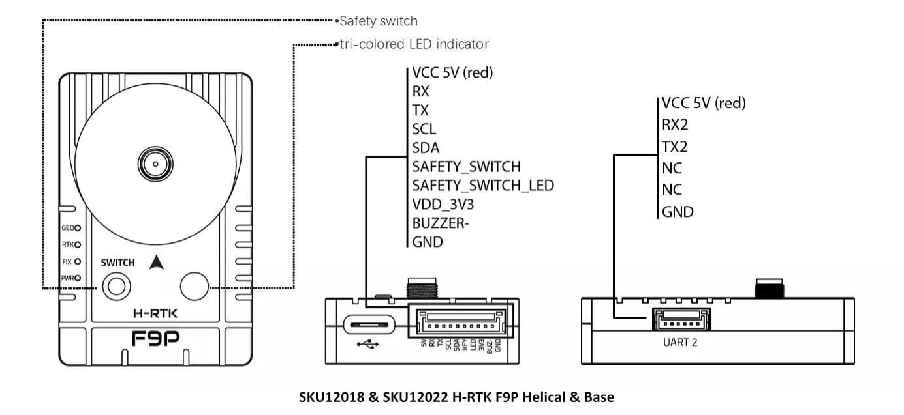
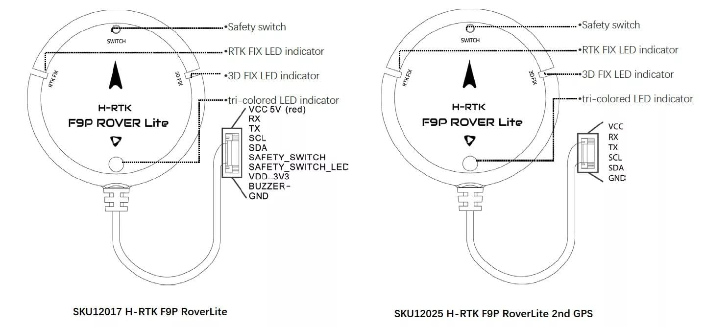
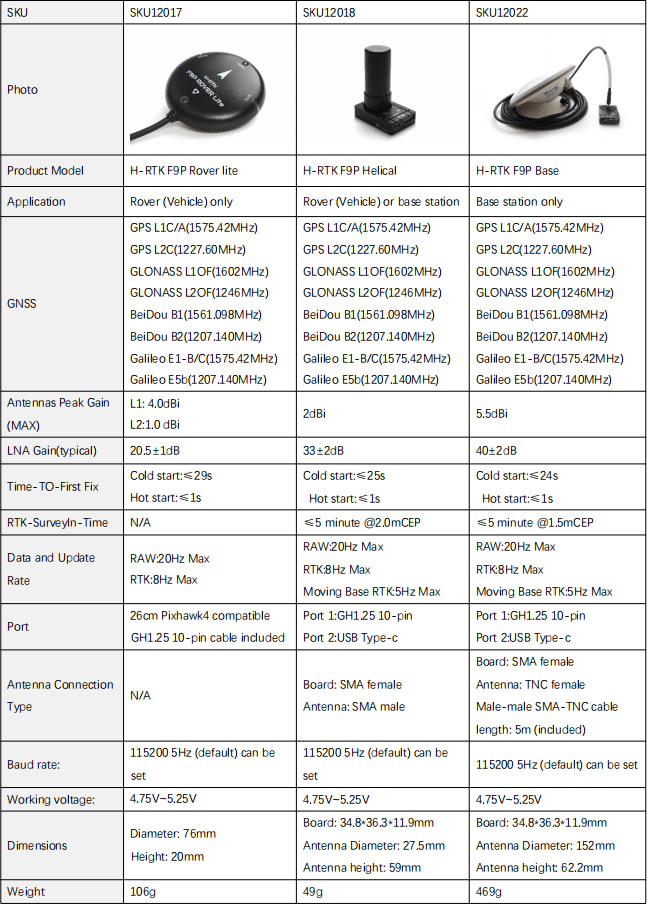
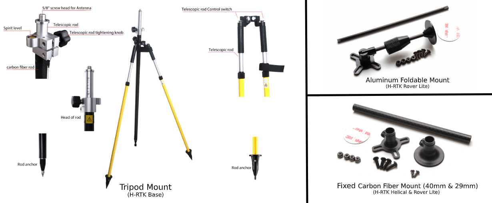

# Holybro H-RTK-F9P GNSS

:::tip
[Holybro H-RTK ZED-F9P Rover](../dronecan/holybro_h_rtk_zed_f9p_gps.md) is an upgraded version of this module.
:::

The [Holybro H-RTK F9P GNSS](https://holybro.com/products/h-rtk-f9p-gnss-series) is an multi-band high-precision [RTK GNSS System](../gps_compass/rtk_gps.md) series launched by Holybro.
This family is similar to the [H-RTK M8P](../gps_compass/rtk_gps_holybro_h-rtk-m8p.md) series, but uses multi-band RTK with faster convergence times and reliable performance, concurrent reception of GPS, GLONASS, Galileo and BeiDou, and faster update rate for highly dynamic and high volume applications with centimeter-accuracy.
Він використовує модуль u-blox F9P, компас IST8310 та індикатор з триколірним світлодіодом.
Також в ньому є інтегрований вимикач безпеки для простої та зручної роботи.

Є три моделі Holybro H-RTK F9P на вибір, кожна з різним дизайном антени, щоб задовольнити різні потреби.
Refer to [Specification and Model Comparison section](#specification-and-model-comparison) for more details.

Using RTK allows PX4 to get its position with centimetre-level accuracy, which is much more accurate than can be provided by a normal GPS.

## Де купити

- [H-RTK F9P (Holybro Website)](https://holybro.com/products/h-rtk-f9p-gnss-series)
- [H-RTK Accessories (Holybro Website)](https://holybro.com/collections/h-rtk-gps)

## Налаштування

RTK setup and use on PX4 via _QGroundControl_ is largely plug and play \(see [RTK GPS](../gps_compass/rtk_gps.md) for more information\).

## Підключення та з'єднання

H-RTK Helical models come with both GH 10-pin & 6-pin cables that are compatible with the GPS1 & GPS2 ports on flight controllers that use the Pixhawk Connector Standard, such as [Pixhawk 4](../flight_controller/pixhawk4.md) and [Pixhawk 5x](../flight_controller/pixhawk5x.md).

H-RTK Rover Lite доступний у двох версіях.
The standard version comes with 10 pin connector for the `GPS1` port.
The "2nd GPS" version comes with 6 pin connector for the `GPS2` port.
This is used as a secondary GPS for [Dual GPS Systems](../gps_compass/index.md#dual_gps).

:::info
The cables/connectors may need to be modified in order to connect to other flight controller boards (see [Pin Map](#pin-map) below).
:::

## Карта виводів

## Специфікація та порівняння моделей

## Аксесуари до GPS

[H-RTK Mount (Holybro Website)](https://holybro.com/products/vertical-mount-for-h-rtk-helical)

