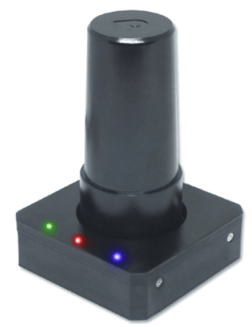

# Геодезичний компас LOCOSYS Hawk R2 RTK-GPS

<Badge type="tip" text="PX4 v1.13" />

The [LOCOSYS Hawk R2](https://www.locosystech.com/en/product/hawk-r2.html) is a dual-frequency [RTK GPS module](../gps_compass/rtk_gps.md) receiver designed for compatibility with Pixhawk. The only difference between this module and the [LOCOSYS Hawk R1](rtk_gps_locosys_r1.md) is the presence of a magnetometer on Hawk R2.

Модуль може діяти як RTK GPS ровер при встановленні на літак.

Приймач здатний одночасно відстежувати всі глобальні цивільні навігаційні системи, включаючи GPS, ГЛОНАСС, GALILEO, BEIDOU і QZSS.
Він приймає сигнали L1 і L5 одночасно, забезпечуючи сантиметрову точність позиціонування RTK.

Вбудована легка спіральна антена підвищує стабільність позиціонування RTK. Додатково, він обладнаний компасом.
Швидкий час до першої перевірки, сумісність з RTK, чудова чутливість, низьке енергоспоживання роблять його кращим вибором для платформних БПЛА на базі Pixhawk.

## Основні характеристики

- Висока точність позиціонування на рівні сантиметра RTK + інтегрований магнітометр з 3 осями
- Одночасний прийом сигналів смуг L1 і L5
- Підтримка GPS, ГЛОНАСС, BEIDOU, GALILEO, QZSS
- Підтримка SBAS (WAAS, EGNOS, MSAS, GAGAN)
- Підтримка GNSS з 135 каналами
- Швидкий TTFF на низькому рівні сигналу
- Безкоштовне прогнозування гібридних ефемерид для швидшого холодного старту
- Стандартна частота оновлення 5 Гц, до 10 Гц (підтримка SBAS лише 5 Гц)
- Вбудований суперконденсатор для резервування системних даних для швидкого отримання супутникових даних
- Вбудована функція компасу 3-х вимірів
- Три світлодіодного індикатора для живлення, PPS та передачі даних

## Де купити

- [LOCOSYS Hawk R2](https://www.locosystech.com/en/product/hawk-r2.html)

## Вміст набору

Набір RTK GPS включає в себе:

- 1x Модуль GPS
- 1x Спіральна антена
- 1x 6-пінний кабель готовий до JST

## Підключення та з'єднання

Hawk R2 RTK GPS поставляється з роз'ємом JST на 6 контактів, який можна підключити до порту GPS2 на автопілотах стандарту Pixhawk.

Це також може бути використано на інших портах UART, але вам доведеться підключити й налаштувати використаний порт.
Нижче наведено роз'єм для надання вам можливості створити власний кабель.

### Схема розташування виводів

Нижче наведена розводка LOCOSYS GPS.

| Pin | Hawk R2 GPS                   |
| --- | ----------------------------- |
| 1   | VCC_5V   |
| 2   | GPS_RX   |
| 3   | GPS_TX   |
| 4   | GNSS_PPS |
| 5   | Null                          |
| 6   | Null                          |
| 7   | I2C_CLK  |
| 8   | I2C_DAT  |
| 9   | GND                           |

## Конфігурація PX4

After connecting your Hawk R2 to the `GPS2` port on compatible Pixhawk boards, RTK setup and use on PX4 via _QGroundControl_ is largely plug and play.
For more information see: [RTK GPS](../gps_compass/rtk_gps.md#positioning-setup-configuration).

Ви також повинні налаштувати послідовний порт, який ви використовуєте на правильну швидкість передачі даних.
If you're using GPS2, set the parameter [SER_GPS2_BAUD](../advanced_config/parameter_reference.md#SER_GPS2_BAUD) to 230400 8N1.

The compass only requires the usual [Compass Calibration](../config/compass.md).

## Індикатори статусу LEDs

| Колір   | Назва              | Опис                                  |
| ------- | ------------------ | ------------------------------------- |
| Зелений | Індикатор TX       | Передача даних GNSS                   |
| Red     | Індикатор живлення | Power                                 |
| Синій   | PPS                | Активна служба точного позиціонування |

## Специфікація

- Частоти
  - GPS/QZSS: L1 C/A, L5C
  - GLONASS: L1OF
  - BEIDOU: B1I, B2a
  - GALILEO: E1, E5a
- Підтримка 135 каналів
- Частота оновлення до 10 Гц (за замовчуванням 5 Гц)
- Час отримання
  - Гарячий старт (Open Sky) за 2 секунди
  - Холодний старт (Open Sky) за 28 секунд без AGPS
- PPS з тривалістю імпульсу 100 мс, 1,8 В постійного струму
- Зовнішня, активна антена Helix
  - SMA конектор
- Підтримка протоколу UBlox
  - U5Hz:UBX-NAV-PVT,UBX-NAV-DOP
  - 1Hz: UBX-NAV-TIMEGPS
- Підключення:
  - 6-контактний JST-GH UART/I2C (сумісний з Pixhawk)
- Живлення:
  - Напруга живлення постійного струму 3,3 В ~ 5,0 В на вході
  - Power consumption <1W

## Докладніше

More information can be found on [LOCOSYS Hawk R2](https://www.locosystech.com/en/product/hawk-r2.html)
