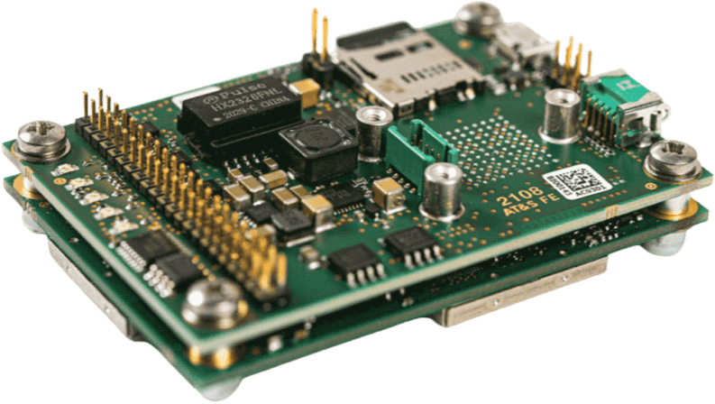
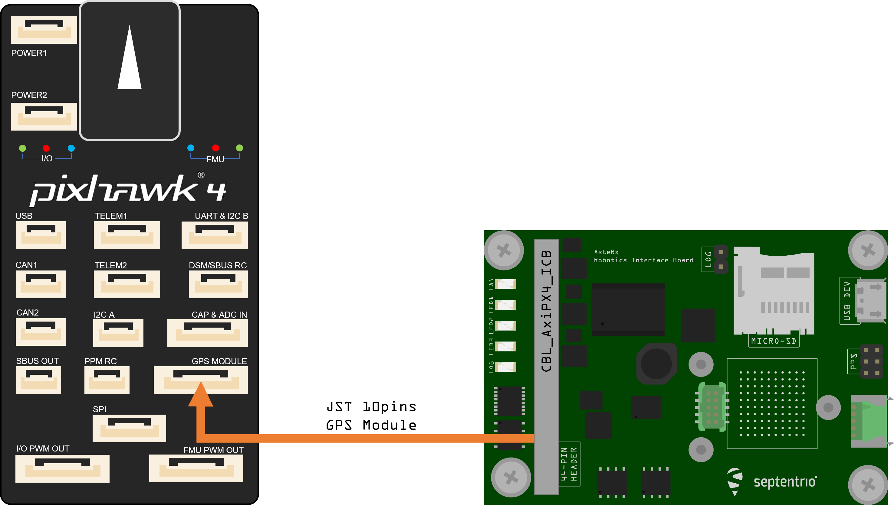

# Septentrio AsteRx-m3 Pro With RIB Board

Septentrio is the leading worldwide supplier of OEM GPS/GNSS receivers.
Пристрої Septentrio OEM надають точні і надійні позиції для вимогливих промислових застосувань у невеликому, легкому форм-факторі.
There are several dual-antenna receiver options that allows for GPS information to be fused into the heading (other attitude information can also be determined, but is not fused by PX4).

Inertial sensor integration of the AsteRx-m3 Pro family offers a full attitude solution (heading, pitch and roll) synchronized with accurate positioning.

The Robotics Interface Board coupled with Septentrio GNSS receiver boards provides common interfaces like USB, ethernet, on-board logging and other functionalities designed for rapid prototyping, product evaluation or efficient integration.
The features include the following:

- Ultra-low-power credit-card size boards
- Easy integration into any system
- Найкраща продуктивність RTK з справжньою технологією багаточастотного ГНСС на основі кількох констелляцій
- Технологія Advanced Interference Mitigation (AIM+) проти глушіння та спуфінгу
- Resilient to vibration and shocks
- 44-піновий роз'єм вводу/виводу для автопілотів, таких як Pixhawk
- Логування на борту
- USB Micro-B connector
- Розмір: 71.53 x 47.5 x 18.15 mm
- Weight: 50g

## Купівля

Усі приймачі AsteRx та Роботизовані Інтерфейсні Плати можна придбати в інтернет-магазині Septentrio:

- [AsteRx-m3 Pro](https://web.septentrio.com/l/858493/2022-04-19/xgrrz)
- [AsteRx-m3 Pro+](https://web.septentrio.com/l/858493/2022-04-19/xgrs3)

Інші PX4 підтримувані пристрої серфінгу:

- [mosaic-go evaluation kit](../gps_compass/septentrio_mosaic-go.md)

## Інтерфейси

### USB

_Connector type: micro-USB type B._

Роз'єм micro USB типу B може бути підключений до ПК для живлення приймача та спілкування з ним через його USB-порт.

### 44-контактний роз'єм

_Connector type: SAMTEC TMM-122-03-S-D, 2-mm pitch._

44-контактний заголовок можна використовувати для підключення кількох пристроїв GPIO.
Refer to the [hardware manual](https://web.septentrio.com/l/858493/2022-04-19/xgrsw) for the pinout.

### Світлодіоди

Піни світлодіоду можуть бути використані для моніторингу статусу отримувача.
Вони можуть бути використані для керування зовнішніми світлодіодами (максимальний струм управління 10 мА).
Припускається, що світлодіод загориться, коли електричний рівень відповідного контакту буде високий.
Загального призначення світлодіод (пін GPLED) конфігурується командою setLEDMode.

### Заголовок кнопки журнала

Putting a jumper on the LOG Button header (.100" vertical header) is equivalent to pressing a "log button".
Плата інтерфейсу відповідає за детектування дребізгу.

### Заголовок PPS/Подій

_Connector type: SAMTEC TMM-103-03-G-D, 2-mm pitch._

6-контактний голівка 2 мм поряд з роз'ємом micro USB виносить перший сигнал PPS.

### Варіанти джерел живлення

When a USB cable is connected to the USB Micro-B connector, the interface board is powered from the computer through the USB connector.
Alternatively, the power can be applied from the `PWR_IN` pins of the 44-pin connector.
The voltage range when powering from the `PWR_IN` pins is 4.5V to 30V.
Електроживлення можна подавати одночасно з обох джерел.
На борту діоди запобігають коротким замиканням.
The interface board provides the 3V3 supply to the AsteRx-m3 OEM receiver and a 5V DC voltage to the `VANT` pin of the AsteRx-m3 OEM.

## Конфігурація PX4

PX4 configuration is covered in [Septentrio GNSS Receivers](../gps_compass/septentrio.md).

## Налаштування обладнання

1. Переконайтеся, що приймач живиться щонайменше 3,3 В. You can use the micro USB connector or the open ended supply (labeled "PWR & GND") on the 44 pin cable for this.
2. Connect one or two GNSS antennas to the external antenna ports on the AsteRx-m3 Pro board.
3. Connect the 44-pin cable to the AsteRx-m3 Pro board on RIB and connect the 10-pin JST connector to the _GPS MODULE_ port on the Pixhawk 4 as shown in the diagram above.

:::info
PX4 will ensure that the GNSS module is automatically configured. However, if you have a dual
antenna setup, you will need to set the layout as accurately as possible in the web app.
:::

### Dual-Antenna

Ставлення (клін/тангаж) може бути обчислене з орієнтації базової лінії між основною та допоміжною антенами GNSS aux1.

Для забезпечення визначення багатоантенного стану слід дотримуватися наступної процедури:

1. Приєднайте дві антени до вашого автомобіля, використовуючи кабелі приблизно однакової довжини.
   Конфігурація за замовчуванням антени відповідає зображеному на малюнку.
   It consists in placing the antennas aligned with the longitudinal axis of the vehicle, main antenna behind `AUX1`.
   Для найкращої точності спробуйте максимізувати відстань між антенами та уникайте значних висотних відмінностей між ЛАР антенами.
2. На практиці дві антени ARPs можуть не бути розташовані на однаковій висоті в рамі транспортного засобу, або базова лінія головна-допоміжна1 може не бути абсолютно паралельною або перпендикулярною до поздовжньої вісі транспортного засобу.
   Це призводить до зміщень у обчислених кутах нахилу.
   These can be compensated for with the heading parameters provided by the Septentrio driver in PX4.

:::info
For optimal heading results, the two antennas should be separated by at least 30cm / 11.8 in (ideally 50cm / 19.7in or more).

For additional configuration of the dual antenna setup, please refer to our [Knowledge Base](https://support.septentrio.com/l/858493/2022-04-19/xgrsh) or the [hardware manual](https://web.septentrio.com/l/858493/2022-04-19/xgrsl).
:::

### Web App

модуль приймача GPS/GNSS з компасом mosaic-H поставляється з повністю задокументованими інтерфейсами, командами та даними повідомленнями.
The included GNSS receiver control and analysis software [RxTools](https://web.septentrio.com/l/858493/2022-04-19/xgrss) allows receiver configuration,
monitoring as well as data logging and analysis.

Отримувач містить інтуїтивний веб-інтерфейс користувача для легкої роботи та контролю, що дозволяє вам керувати отримувачем з будь-якого мобільного пристрою або комп'ютера.
Веб-інтерфейс також використовує легко читані показники якості, ідеальні для контролю операції приймача під час виконання завдання.

:::tip
If you want more detailed information about the AsteRx and the Robotics Interface Board, please refer to the [hardware manual](https://web.septentrio.com/l/858493/2022-04-19/xgrsw) or the [Septentrio Support](https://support.septentrio.com/l/858493/2022-04-19/xgrsz) page.
:::
