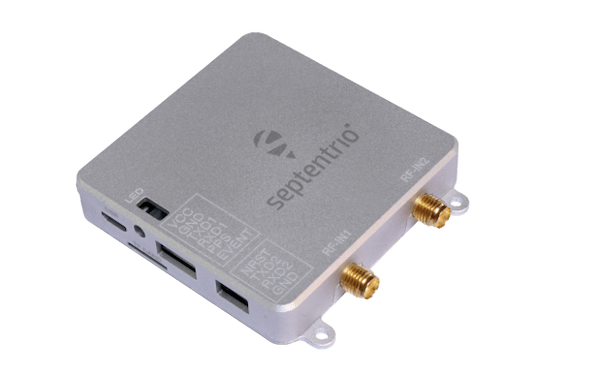

# Septentrio mosaic-go

The Septentrio mosaic-go receivers are evaluation kits for their mosaic-X5 and mosaic-H receiver modules.
Because of their small size and low weight, they are ideal for autopilot applications.
The available variants are the [mosaic-go](https://www.septentrio.com/en/products/gps/gnss-receiver-modules/mosaic-go-evaluation-kit)
and [mosaic-go heading](https://www.septentrio.com/en/products/gps/gnss-receiver-modules/mosaic-h-evaluation-kit).

Their features include the following:

- High update rate (>100 Hz) and low latency, both crucial for control systems of autonomous applications
- Надійне позиціонування на рівні декількох сантиметрів
- Повна підтримка L2 через код P(Y)
- Розмір: 71 x 59 x 12 мм ± 1 мм
- Вага: 58г ± 1г

## Купівля

The mosaic-go kit is available on Septentrio's [official store](https://web.septentrio.com/l/858493/2022-04-19/xgrnz):

- [mosaic-go heading GNSS module evaluation kit](https://web.septentrio.com/l/858493/2022-04-19/xgrp9)
- [mosaic-go GNSS module receiver evaluation kit](https://web.septentrio.com/l/858493/2022-04-19/xgrpd)

Інші PX4 підтримувані пристрої серфінгу:

- [AsteRx OEM with Robotics Interface Board](../gps_compass/septentrio_asterx-rib.md)

## mosaic-go Evaluation Kit Contents

- 1 модуль mosaic-H або mosaic-X5, зварений на інтерфейсну плату всередині металевого корпусу.
- 1 USB кабель
- Кабель COM1 з відкритими контактами на 6 контактів
- Кабель з відкритим кінцем COM2 на 4 контактній роз'єм
- Довідник користувача карта

## Physical Interfaces

| Тип             | Позначка       | Use                                                         |
| --------------- | -------------- | ----------------------------------------------------------- |
| USB Micro-B     | USB            | USB communication and power                                 |
| RSV USB Micro-B | RSV            | Reserved and should not be used                             |
| SMA             | RF-IN\{1,2\} | Main (and auxiliary) antenna connections |
| 6-pin JST       | Серія          | Serial communication and power                              |
| 4-pin JST       | Серія          | Serial communication                                        |
| microSD         | TF CARD        | Serial communication                                        |

> Dual-antenna is only available on mosaic-H-based receivers.

### 6-pin Connector

_Connector type: GH connector, 1.25mm pitch, 6 way. Mating connector housing: GHR-06V-S._

| Назва виводу | Напрямок | Рівень                                     | Опис                      | Коментар                                                         |
| ------------ | -------- | ------------------------------------------ | ------------------------- | ---------------------------------------------------------------- |
| VCC          | PWR      | 4.75V-5.5V | Головне джерело живлення  |                                                                  |
| GND          |          | 0                                          | Ground                    |                                                                  |
| TXD1         | Out      | 3V3_LVTTL             | Serial COM1 transmit line | Підключається безпосередньо до TXD1 внутрішньої mosaic           |
| RXD1         | In       | 3V3_LVTTL             | Serial COM1 receive line  | Підключається безпосередньо до RXD1 внутрішньої mosaic           |
| PPS          | Out      | 3V3_LVTTL             | PPSoutput                 | PPSO з mosaic перетворений на 3,3 В                              |
| EVENT        | In       | 3V3_LVTTL             | Вхідний таймер події      | Підключається до EVENTA mosaic через транслятор рівня 3V3 на 1V8 |

### 4-pin Connector

_Connector type: GH connector, 1.25mm pitch, 4way. Mating connector housing: GHR-04V-S._

| Назва виводу | Напрямок | Рівень                         | Опис                      | Коментар                                                                       |
| ------------ | -------- | ------------------------------ | ------------------------- | ------------------------------------------------------------------------------ |
| NRST         | In       | 3V3_LVTTL | Reset input               | Підключається безпосередньо до nRST_IN внутрішньої mosaic |
| TXD2         | Out      | 3V3_LVTTL | Serial COM2 transmit line | Підключається безпосередньо до TXD2 внутрішньої mosaic                         |
| RXD2         | In       | 3V3_LVTTL | Serial COM2 receive line  | Підключається безпосередньо до RXD2 внутрішньої mosaic                         |
| GND          |          | 0                              | Ground                    |                                                                                |

## Конфігурація PX4

PX4 configuration is covered in [Septentrio GNSS Receivers](../gps_compass/septentrio.md).

## Hardware Connection Example Pixhawk 4

1. Переконайтеся, що приймач живиться щонайменше 3,3 В. You can use the USB Micro-B connector or the 6-pin JST connector.
2. Підключіть одну або дві антени GNSS до портів RF-IN на пристрої mosaic-go.
3. Connect the 6-pin connector (COM1) to the Pixhawk's _GPS MODULE_ port.
   This will provide power to the mosaic-go and with this single connection it will be able to send single and dual-antenna
   information to the Pixhawk 4.

:::warning
Make sure the JST cable is wired correctly since this is not a standard cable:

:::

### Dual-Antenna

Ставлення (клін/тангаж) може бути обчислене з орієнтації базової лінії між основною та допоміжною антенами GNSS aux1.

Для забезпечення визначення багатоантенного стану слід дотримуватися наступної процедури:

1. Приєднайте дві антени до вашого автомобіля, використовуючи кабелі приблизно однакової довжини.
   Конфігурація за замовчуванням антени відповідає зображеному на малюнку.
   Це полягає у розташуванні антен, вирівняних з віссю транспортного засобу, основна антена за AUX1.
   Для найкращої точності спробуйте максимізувати відстань між антенами та уникайте значних висотних відмінностей між ЛАР антенами.
2. На практиці дві антени ARPs можуть не бути розташовані на однаковій висоті в рамі транспортного засобу, або базова лінія головна-допоміжна1 може не бути абсолютно паралельною або перпендикулярною до поздовжньої вісі транспортного засобу.
   Це призводить до зміщень у обчислених кутах нахилу.
   These can be compensated for with the heading parameters provided by the Septentrio driver in PX4.

:::info
For optimal heading results, the two antennas should be seperated by at least 30cm / 11.8 in (ideally 50cm / 19.7in or more).

For additional configuration of the dual antenna setup, please refer to our [Knowledge Base](https://support.septentrio.com/l/858493/2022-04-19/xgrqd) or the [hardware manual](https://web.septentrio.com/l/858493/2022-04-19/xgrql).
:::

### Web App

модуль приймача GPS/GNSS з компасом mosaic-H поставляється з повністю задокументованими інтерфейсами, командами та даними повідомленнями.
The included GNSS receiver control and analysis software [RxTools](https://web.septentrio.com/l/858493/2022-04-19/xgrqp) allows receiver configuration, monitoring as well as data logging and analysis.

Отримувач містить інтуїтивний веб-інтерфейс користувача для легкої роботи та контролю, що дозволяє вам керувати отримувачем з будь-якого мобільного пристрою або комп'ютера.
Веб-інтерфейс також використовує легко читані показники якості, ідеальні для контролю операції приймача під час виконання завдання.

## Статус LED

| Колір світлодіоду | Живлення | SD карта змонтована | PVT Solution | Logging enabled |
| ----------------- | :------: | :-----------------: | :----------: | :-------------: |
| Red               |     ✓    |                     |              |                 |
| Зелений           |     ✓    |          ✓          |              |                 |
| Синій             |     ✓    |          ✓          |       ✓      |                 |
| Purple            |     ✓    |                     |       ✓      |                 |
| Purple + Blue     |     ✓    |          ✓          |       ✓      |        ✓        |
| Red + Green       |     ✓    |          ✓          |              |        ✓        |

:::tip
For more detailed information about the mosaic-go and its module, please refer to the [hardware manual](https://web.septentrio.com/l/858493/2022-04-19/xgrrd) or the [Septentrio Support](https://support.septentrio.com/l/858493/2022-04-19/xgrrl) page.
:::
