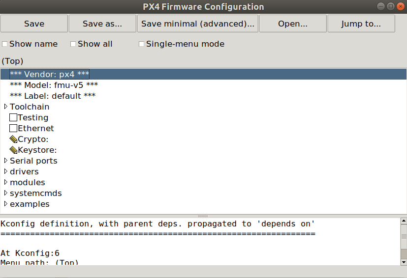
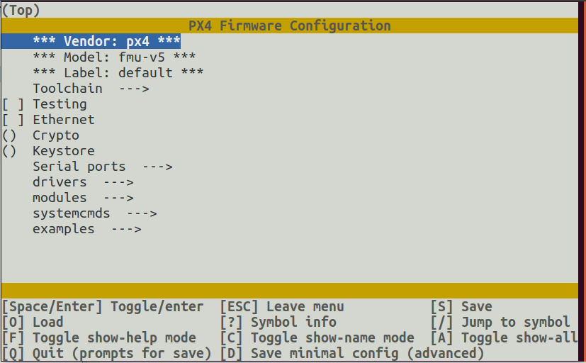

# PX4 Конфігурація плати (kconfig)

The PX4 Autopilot firmware can be configured at build time to adapt it for specialized applications (fixed-wing, multicopter, rover or more), to enable new and experimental features (such as Cyphal) or to save flash & RAM usage by disabling some drivers and subsystems.
This configuration is handled through _Kconfig_, which is the same [configuration system used by NuttX](../hardware/porting_guide_nuttx.md#nuttx-menuconfig-setup).

The configuration options (often referred as "symbols" by the _kconfig_ language) are defined in `Kconfig` files under the **/src** directory.

## Конвенція найменування символів PX4 Kconfig

За умовчанням символи для модулів/драйверів називаються на основі шляху папки модуля.
For example, the symbol for the ADC driver at `src/drivers/adc/board_adc` must be named `DRIVERS_ADC_BOARD_ADC`.

Для додавання символів для параметрів, специфічних для драйвера/модуля, конвенція найменування полягає в тому, що за ім'ям модуля слідує назва параметра.
For example `UAVCAN_V1_GNSS_PUBLISHER` which is an option `GNSS_PUBLISHER` for the `UAVCAN_V1` module.
The options have to be guarded behind an `if` statement to ensure that the options are only visible when the module itself is enabled.

Наприклад:

```
menuconfig DRIVERS_UAVCAN_V1
    bool "UAVCANv1"
    default n
    ---help---
        Enable support for UAVCANv1

if DRIVERS_UAVCAN_V1
    config UAVCAN_V1_GNSS_PUBLISHER
        bool "GNSS Publisher"
        default n
endif #DRIVERS_UAVCAN_V1
```

:::info
Builds will silently ignore any missing or miss-spelled modules in the `*.px4board` configuration file.
:::

## Успадкування мітки PX4 Kconfig

Each PX4 board must have a `default.px4board` configuration and can have an optional `bootloader.px4board configuration`.
However you can add also separate configurations under a different label e.g. `cyphal.px4board`.
Note that by default the configuration of `cyphal.px4board` inherits all settings set in `default.px4board`.
When changing the `cyphal.px4board` it only stores the delta of the Kconfig keys that are different compared to `default.px4board`, this is useful to simplify configurations management

:::info
When modifying a Kconfig key in `default.px4board` it will be modified in all derivative configurations of the same board that had the same config as well.
:::

## Налаштування меню PX4 Menuconfig

The [menuconfig](https://pypi.org/project/kconfiglib/#menuconfig-interfaces) tool is used to modify the PX4 board configuration, adding/removing modules, drivers, and other features.

Існують варіанти командного рядка та графічного інтерфейсу, які можна запустити за допомогою скорочень збірки PX4:

```
make px4_fmu-v5_default boardconfig
make px4_fmu-v5_default boardguiconfig
```

:::info
_Kconfiglib_ and _menuconfig_ come with the _kconfiglib_ python package, which is installed by the normal [ubuntu.sh](https://github.com/PX4/PX4-Autopilot/blob/main/Tools/setup/ubuntu.sh) installation script.
If _kconfiglib_ is not installed, you can do so using the command: `pip3 install kconfiglib`
:::

Інтерфейс командного рядка та графічного інтерфейсу показані нижче.

### Інтерфейс користувача menuconfig GUI



### Інтерфейс командного рядка menuconfig


