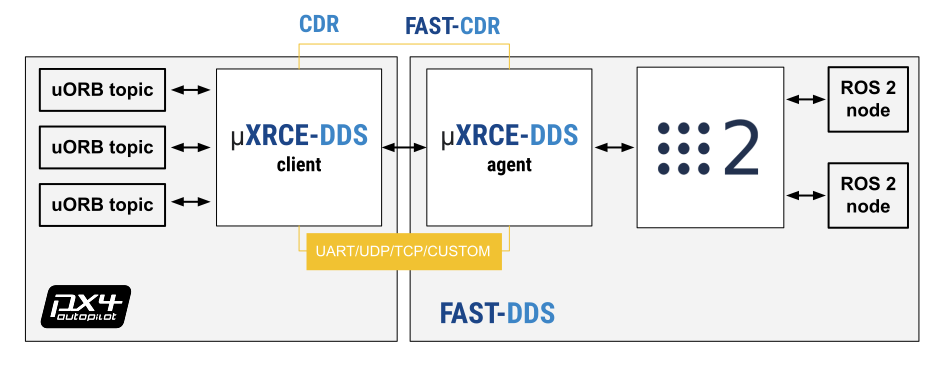

# uXRCE-DDS (PX4-ROS 2/DDS Bridge)

<Badge type="tip" text="PX4 v1.14" />

:::info
uXRCE-DDS replaces the [Fast-RTPS Bridge](https://docs.px4.io/v1.13/en/middleware/micrortps.html#rtps-dds-interface-px4-fast-rtps-dds-bridge) used in PX4 v1.13.
If you were using the Fast-RTPS Bridge, please follow the [migration guidelines](#fast-rtps-to-uxrce-dds-migration-guidelines).
:::

PX4 uses uXRCE-DDS middleware to allow [uORB messages](../middleware/uorb.md) to be published and subscribed on a companion computer as though they were [ROS 2](../ros2/user_guide.md) topics.
Це забезпечує швидку та надійну інтеграцію між PX4 та ROS 2, а також значно спрощує для додатків ROS 2 отримання інформації про транспортний засіб та надсилання команд.

PX4 uses an XRCE-DDS implementation that leverages [eProsima Micro XRCE-DDS](https://micro-xrce-dds.docs.eprosima.com/en/stable/introduction.html).

У цьому посібнику описано архітектуру та різні варіанти налаштування клієнта та агента.
Зокрема, він охоплює опції, які є найбільш важливими для користувачів PX4.

## Архітектура

Проміжне програмне забезпечення uXRCE-DDS складається з клієнта, що працює на PX4, і агента, що працює на комп'ютері-компаньйоні, з двостороннім обміном даними між ними по послідовному або UDP каналу.
Агент діє як проксі-сервер для клієнта, дозволяючи йому публікувати та підписуватися на теми в глобальному просторі даних DDS.



In order for PX4 uORB topics to be shared on the DDS network you will need _uXRCE-DDS client_ running on PX4, connected to the _micro XRCE-DDS agent_ running on the companion.

The PX4 [uxrce_dds_client](../modules/modules_system.md#uxrce-dds-client) publishes to/from a defined set of uORB topics to the global DDS data space.

The [eProsima micro XRCE-DDS _agent_](https://github.com/eProsima/Micro-XRCE-DDS-Agent) runs on the companion computer and acts as a proxy for the client in the DDS/ROS 2 network.

Сам агент не залежить від коду на стороні клієнта і може бути побудований та/або встановлений незалежно від PX4 або ROS.

Код, який хоче підписатися/публікувати до PX4, залежить від коду на стороні клієнта; йому потрібні визначення повідомлень uORB, які збігаються з тими, що були використані для створення клієнта PX4 uXRCE-DDS, щоб він міг інтерпретувати повідомлення.

## Генерація коду

The PX4 [uxrce_dds_client](../modules/modules_system.md#uxrce-dds-client) is generated at build time and included in PX4 firmare by default.
Агент не залежить від клієнтського коду.
Він може бути побудований окремо або в робочому просторі ROS 2, або встановлений як snap пакет в Ubuntu.

When PX4 is built, a code generator uses the uORB message definitions in the source tree ([PX4-Autopilot/msg](https://github.com/PX4/PX4-Autopilot/tree/main/msg)) to compile support for the subset of uORB topics in [/src/modules/uxrce_dds_client/dds_topics.yaml](../middleware/dds_topics.md) into [uxrce_dds_client](../modules/modules_system.md#uxrce-dds-client).

PX4 main or release builds automatically export the set of uORB messages definitions in the build to an associated branch in [PX4/px4_msgs](https://github.com/PX4/px4_msgs).

ROS 2 applications need to be built in a workspace that includes the _same_ message definitions that were used to create the uXRCE-DDS client module in the PX4 Firmware.
These can be included into a workspace by cloning the interface package [PX4/px4_msgs](https://github.com/PX4/px4_msgs) into your ROS 2 workspace and switching to the appropriate branch.
Зауважте, що вся генерація коду, пов'язана з повідомленнями, обробляється ROS 2.

## Встановлення Micro XRCE-DDS Agent

Micro XRCE-DDS Agent може бути встановлений на комп'ютер за допомогою бінарного пакета, зібраний і встановлений з вихідного коду, або зібраний і запущений з робочого простору ROS 2.
All of these methods fetch _all_ the dependencies needed to communicate with the client (such as FastCDR).

:::info
The official (and more complete) installation guide is the Eprosima: [micro XRCE-DDS Installation Guide](https://micro-xrce-dds.docs.eprosima.com/en/latest/installation.html).
У цьому розділі узагальнено варіанти, які були протестовані за допомогою PX4 під час створення цієї документації.
:::

:::warning
PX4 Micro XRCE-DDS Client is based on version `v2.x` which is not compatible with the latest `v3.x` Agent version.
:::

### Окреме встановлення з вихідного коду

В Ubuntu ви можете зібрати з вихідного коду і встановити Агент окремо за допомогою наступних команд:

```sh
git clone -b v2.4.3 https://github.com/eProsima/Micro-XRCE-DDS-Agent.git
cd Micro-XRCE-DDS-Agent
mkdir build
cd build
cmake ..
make
sudo make install
sudo ldconfig /usr/local/lib/
```

:::info
There are various build configuration options linked from the corresponding topic in the [official guide](https://micro-xrce-dds.docs.eprosima.com/en/latest/installation.html#installing-the-agent-standalone), but these have not been tested.
:::

Запустити агент з налаштуваннями для підключення до клієнта uXRCE-DDS, запущеного у симуляторі:

```sh
MicroXRCEAgent udp4 -p 8888
```

### Встановлення з Snap пакунку

Встановіть з пакунка snap на Ubuntu за допомогою наступної команди:

```sh
sudo snap install micro-xrce-dds-agent --edge
```

Запустити агента з налаштуваннями для підключення до клієнта uXRCE-DDS, запущеного у симуляторі (зверніть увагу, що назва команди відрізняється від назви, яку ви збираєте локально):

```sh
micro-xrce-dds-agent udp4 -p 8888
```

:::info
At time of writing the stable of version installed from snap connects to PX4 but reports errors creating topics.
The development version, fetched using `--edge` above, does work.
:::

### Збірка/Запуск у межах робочого простору ROS 2

The agent can be built and launched within a ROS 2 workspace (or build standalone and launched from a workspace).
You must already have installed ROS 2 following the instructions in: [ROS 2 User Guide > Install ROS 2](../ros2/user_guide.md#install-ros-2).

:::warning
This approach will use the existing ROS 2 versions of the Agent dependencies, such as `fastcdr` and `fastdds`.
This considerably speeds up the build process but requires that the Agent dependency versions match the ROS 2 ones:

| ROS 2 version | Micro-XRCE-DDS-Agent version           |
| ------------- | -------------------------------------- |
| Foxy          | v2.4.2 |
| Humble        | v2.4.2 |
| Jazzy         | v2.4.3 |

:::

Створити агента в межах ROS:

1. Створіть директорію робочого простору для агента:

   ```sh
   mkdir -p ~/px4_ros_uxrce_dds_ws/src
   ```

2. Clone the source code for the eProsima [Micro-XRCE-DDS-Agent](https://github.com/eProsima/Micro-XRCE-DDS-Agent) to the `/src` directory (the `main` branch is cloned by default):

   ::::tabs

   ::: tab jazzy

   ```sh
   cd ~/px4_ros_uxrce_dds_ws/src
   git clone -b v2.4.3 https://github.com/eProsima/Micro-XRCE-DDS-Agent.git
   ```


:::

   ::: tab humble

   ```sh
   cd ~/px4_ros_uxrce_dds_ws/src
   git clone -b v2.4.2 https://github.com/eProsima/Micro-XRCE-DDS-Agent.git
   ```


:::

   ::: tab foxy

   ```sh
   cd ~/px4_ros_uxrce_dds_ws/src
   git clone -b v2.4.2 https://github.com/eProsima/Micro-XRCE-DDS-Agent.git
   ```


:::

   ::::

3. Source the ROS 2 development environment, and compile the workspace using `colcon`:

   :::: tabs

   ::: tab jazzy

   ```sh
   source /opt/ros/jazzy/setup.bash
   colcon build
   ```


:::

   ::: tab humble

   ```sh
   source /opt/ros/humble/setup.bash
   colcon build
   ```


:::

   ::: tab foxy

   ```sh
   source /opt/ros/foxy/setup.bash
   colcon build
   ```


:::

   ::::

   This builds all the folders under `/src` using the sourced toolchain.

Для запуску агента micro XRCE-DDS в робочому просторі:

1. Source the `local_setup.bash` to make the executables available in the terminal (also `setup.bash` if using a new terminal).

   :::: tabs

   ::: tab jazzy

   ```sh
   source /opt/ros/jazzy/setup.bash
   source install/local_setup.bash
   ```


:::

   ::: tab humble

   ```sh
   source /opt/ros/humble/setup.bash
   source install/local_setup.bash
   ```


:::

   ::: tab foxy

   ```sh
   source /opt/ros/foxy/setup.bash
   source install/local_setup.bash
   ```


:::

   ::::

1) Запустіть агента з налаштуваннями для підключення до клієнта uXRCE-DDS, який працює на симуляторі:

   ```sh
   MicroXRCEAgent udp4 -p 8888
   ```

## Запуск агента та клієнта

### Запуск агента

Агент використовується для підключення до клієнта через конкретний канал, такий як UDP або послідовне з'єднання.
The channel settings are specified when the agent is started, using command line options.
These are documented in the eProsima user guide: [Micro XRCE-DDS Agent > Agent CLI](https://micro-xrce-dds.docs.eprosima.com/en/latest/agent.html#agent-cli).
Зверніть увагу, що агент підтримує багато варіантів каналів, але PX4 підтримує тільки UDP і послідовні з'єднання.

:::info
You should create a single instance of the agent for each channel over which you need to connect.
:::

Наприклад, симулятор PX4 запускає клієнт uXRCE-DDS через UDP на порт 8888, тому для підключення до симулятора потрібно запустити агент за допомогою команди:

```sh
MicroXRCEAgent udp4 -p 8888
```

При роботі з реальним обладнанням налаштування залежить від апаратного забезпечення, операційної системи та каналу.
For example, if you're using the RPi `UART0` serial port, you might connect using this command (based on the information in [Raspberry Pi Documentation > Configuring UARTS](https://www.raspberrypi.com/documentation/computers/configuration.html#configuring-uarts)):

```sh
sudo MicroXRCEAgent serial --dev /dev/AMA0 -b 921600
```

:::info
For more information about setting up communications channels see [Pixhawk + Companion Setup > Serial Port setup](../companion_computer/pixhawk_companion.md#serial-port-setup), and sub-documents.
:::

### Запуск клієнта

The uXRCE-DDS client module ([uxrce_dds_client](../modules/modules_system.md#uxrce-dds-client)) is included by default in all firmware and the simulator.
This must be started with appropriate settings for the communication channel that you wish to use to communicate with the agent.

:::info
The simulator automatically starts the client on localhost UDP port `8888` using the default uxrce-dds namespace.
:::

The configuration can be done using the [UXRCE-DDS parameters](../advanced_config/parameter_reference.md#uxrce-dds-client):

- [UXRCE_DDS_CFG](../advanced_config/parameter_reference.md#UXRCE_DDS_CFG): Set the port to connect on, such as `TELEM2`, `Ethernet`, or `Wifi`.

- Якщо використовується Ethernet-підключення:
  - [UXRCE_DDS_PRT](../advanced_config/parameter_reference.md#UXRCE_DDS_PRT):
    Use this to specify the agent UDP listening port.
    The default value is `8888`.
  - [UXRCE_DDS_AG_IP](../advanced_config/parameter_reference.md#UXRCE_DDS_AG_IP):
    Use this to specify the IP address of the agent.
    The IP address must be provided in `int32` format as PX4 does not support string parameters.
    The default value is `2130706433` which corresponds to the _localhost_ `127.0.0.1`.

    You can use [Tools/convert_ip.py](https://github.com/PX4/PX4-Autopilot/blob/main/Tools/convert_ip.py) to convert between the formats:

    - To obtain the `int32` version of an IP in decimal dot notation the command is:

      ```sh
      python3 ./PX4-Autopilot/Tools/convert_ip.py <the IP address in decimal dot notation>
      ```

    - To get the IP address in decimal dot notation from the `int32` version:

      ```sh
      python3 ./PX4-Autopilot/Tools/convert_ip.py -r <the IP address in int32 notation>
      ```

- Якщо використовується послідовне підключення:
  - [SER_TEL2_BAUD](../advanced_config/parameter_reference.md#SER_TEL2_BAUD), [SER_URT6_BAUD](../advanced_config/parameter_reference.md#SER_URT6_BAUD) (and so on):
    Use the `_BAUD` parameter associated with the serial port to set the baud rate.
    For example, you'd set a value for `SER_TEL2_BAUD` if you are connecting to the companion using `TELEM2`.
    For more information see [Serial port configuration](../peripherals/serial_configuration.md#serial-port-configuration).

- Деякі налаштування можуть також потребувати встановлення цих параметрів:
  - [UXRCE_DDS_KEY](../advanced_config/parameter_reference.md#UXRCE_DDS_KEY): The uXRCE-DDS key.
    Якщо ви працюєте в мультиклієнтській конфігурації з одним агентом, кожен клієнт повинен мати унікальний ненульовий ключ.
    Це насамперед важливо для симуляцій з кількома транспортними засобами, де всі клієнти під'єднані до UDP одного агента.
    (See the [official eprosima documentation](https://micro-xrce-dds.docs.eprosima.com/en/stable/client_api.html#session) , `uxr_init_session`.)
  - [UXRCE_DDS_DOM_ID](../advanced_config/parameter_reference.md#UXRCE_DDS_DOM_ID): The DDS domain ID.
    Це забезпечує логічне розділення мереж DDS і може бути використано для розділення клієнтів на різні мережі.
    За замовчуванням, ROS 2 працює з ID 0.
  - [UXRCE_DDS_PTCFG](../advanced_config/parameter_reference.md#UXRCE_DDS_PTCFG): uXRCE-DDS participant configuration.
    It allows to restrict the visibility of the DDS topics to the _localhost_ only and to use user-customized participant configuration files stored on the agent side.
  - [UXRCE_DDS_SYNCT](../advanced_config/parameter_reference.md#UXRCE_DDS_SYNCT): Bridge time synchronization enable.
    Клієнтський модуль uXRCE-DDS може синхронізувати мітку часу повідомлень, якими обмінюються через міст.
    Це стандартна конфігурація. In certain situations, for example during [simulations](../ros2/user_guide.md#ros-gazebo-and-px4-time-synchronization), this feature may be disabled.
  - [`UXRCE_DDS_NS_IDX`](../advanced_config/parameter_reference.md#UXRCE_DDS_NS_IDX): Index-based namespace definition
    Setting this parameter to any value other than `-1` creates a namespace with the prefix `uav_` and the specified value, e.g. `uav_0`, `uav_1`, etc.
    See [namespace](#customizing-the-namespace) for methods to define richer or arbitrary namespaces.

:::info
Many ports are already have a default configuration.
Щоб використовувати ці порти, спочатку вимкніть існуючу конфігурацію:

- `TELEM1` and `TELEM2` are set up by default to connect via MAVLink to a GCS and a companion computer (respectively).
  Disable by setting [MAV_0_CONFIG=0](../advanced_config/parameter_reference.md#MAV_0_CONFIG) or [MAV_1_CONFIG=0](../advanced_config/parameter_reference.md#MAV_1_CONFIG) to zero.
  See [MAVLink Peripherals](../peripherals/mavlink_peripherals.md) for more information.
- Інші порти можуть бути налаштовані аналогічним чином.
  See [Serial port configuration](../peripherals/serial_configuration.md#serial-port-configuration).

:::

Після встановлення можливо знадобиться перезавантаження PX4, щоб параметри набрали чинності.
Після цього вони зберігатимуться під час наступних перезавантажень.

You can also start the [uxrce_dds_client](../modules/modules_system.md#uxrce-dds-client) using a command line.
This can be called as part of [System Startup](../concept/system_startup.md) or through the [MAVLink Shell](../debug/mavlink_shell.md) (or a system console).
Цей метод корисний, коли вам потрібно встановити власний простір імен клієнта, оскільки для цього не передбачено жодного параметра.
For example, the following command can be used to connect via Ethernet to a remote host at `192.168.0.100:8888` and to set the client namespace to `/drone/`.

```sh
uxrce_dds_client start -t udp -p 8888 -h 192.168.0.100 -n drone
```

Options `-p` or `-h` are used to bypass `UXRCE_DDS_PRT` and `UXRCE_DDS_AG_IP`.

#### Запуск клієнта в симуляції

The simulator [startup logic](../concept/system_startup.md) ([init.d-posix/rcS](https://github.com/PX4/PX4-Autopilot/blob/main/ROMFS/px4fmu_common/init.d-posix/rcS)) uses the client startup commands for single and [multi vehicle simulations](../ros2/multi_vehicle.md), enabling the setting of appropriate instance ids and DDS namespaces.
By default the client is started on localhost UDP port `8888` with no additional namespace.

Environment variables are provided that override some [UXRCE-DDS parameters](../advanced_config/parameter_reference.md#uxrce-dds-client).
Це дозволяє користувачам створювати власні файли запуску для своїх симуляцій:

- `PX4_UXRCE_DDS_NS`: Use this to specify the topic [namespace](#customizing-the-namespace)).
- `ROS_DOMAIN_ID`: Use this to replace [UXRCE_DDS_DOM_ID](../advanced_config/parameter_reference.md#UXRCE_DDS_DOM_ID).
- `PX4_UXRCE_DDS_PORT`: Use this to replace [UXRCE_DDS_PRT](../advanced_config/parameter_reference.md#UXRCE_DDS_PRT).

For example, the following command can be used to start a Gazebo simulation with che client operating on the DDS domain `3`, port `9999` and topic namespace `drone`.

```sh
ROS_DOMAIN_ID=3 PX4_UXRCE_DDS_PORT=9999 PX4_UXRCE_DDS_NS=drone make px4_sitl gz_x500
```

## Підтримувані повідомлення uORB

The set of [PX4 uORB topics](../msg_docs/index.md) that are exposed through the client are set in [dds_topics.yaml](../middleware/dds_topics.md).

The topics are release specific (support is compiled into [uxrce_dds_client](../modules/modules_system.md#uxrce-dds-client) at build time).
Хоча більшість випусків мають підтримувати дуже схожий набір повідомлень, щоб бути впевненими, вам слід перевірити файл yaml для вашого конкретного релізу.

Note that ROS 2/DDS needs to have the _same_ message definitions that were used to create the uXRCE-DDS client module in the PX4 Firmware in order to interpret the messages.
The message definitions are stored in the ROS 2 interface package [PX4/px4_msgs](https://github.com/PX4/px4_msgs), and they are automatically synchronized by CI on the `main` and release branches.
Note that all the messages from PX4 source code are present in the repository, but only those listed in `dds_topics.yaml` will be available as ROS 2 topics.
Тому,

- If you're using a main or release version of PX4 you can get the message definitions by cloning the interface package [PX4/px4_msgs](https://github.com/PX4/px4_msgs) into your workspace.
- Якщо ви створюєте або змінюєте повідомлення uORB, вам потрібно вручну оновити повідомлення у вашому робочому просторі з вихідного дерева PX4.
  Generally this means that you would update [dds_topics.yaml](https://github.com/PX4/PX4-Autopilot/blob/main/src/modules/uxrce_dds_client/dds_topics.yaml), clone the interface package, and then manually synchronize it by copying the new/modified message definitions from [PX4-Autopilot/msg](https://github.com/PX4/PX4-Autopilot/tree/main/msg) to its `msg` folders.
  Assuming that PX4-Autopilot is in your home directory `~`, while `px4_msgs` is in `~/px4_ros_com/src/`, then the command might be:

  ```sh
  rm ~/px4_ros_com/src/px4_msgs/msg/*.msg
  cp ~/PX4-Autopilot/msg/*.msg ~/px4_ros_com/src/px4_msgs/msg/
  ```

  ::: info
  Technically, [dds_topics.yaml](../middleware/dds_topics.md) completely defines the relationship between PX4 uORB topics and ROS 2 messages.
  For more information see [DDS Topics YAML](#dds-topics-yaml) below.

:::

## Customizing the Namespace

Custom topic and service namespaces can be applied at build time (changing [dds_topics.yaml](../middleware/dds_topics.md)), at runtime, or through a parameter (which is useful for multi vehicle operations):

- One possibility is to use the `-n` option when starting the [uxrce_dds_client](../modules/modules_system.md#uxrce-dds-client) from command line.
  Ця техніка може бути використана як у симуляторах, так і на реальних транспортних засобах.
- A custom namespace can be provided for simulations (only) by setting the environment variable `PX4_UXRCE_DDS_NS` before starting the simulation.

:::info
Changing the namespace at runtime will append the desired namespace as a prefix to all `topic` fields in [dds_topics.yaml](../middleware/dds_topics.md) and all [service servers](#dds-ros-2-services).
Отже, команди, подібні до:

```sh
uxrce_dds_client start -n uav_1
```

або

```sh
PX4_UXRCE_DDS_NS=uav_1 make px4_sitl gz_x500
```

згенерує теми під просторами імен:

```sh
/uav_1/fmu/in/  # for subscribers
/uav_1/fmu/out/ # for publishers
```

:::

- A simple index-based namespace can be applied by setting the parameter [`UXRCE_DDS_NS_IDX`](../advanced_config/parameter_reference.md#UXRCE_DDS_NS_IDX) to a value between 0 and 9999.
  This will generate a namespace such as `/uav_0`, `/uav_1`, and so on.
  This technique is ideal if vehicles must be persistently associated with namespaces because their clients are automatically started through PX4.

:::info
PX4 parameters cannot carry rich text strings.
Therefore, you cannot use [`UXRCE_DDS_NS_IDX`](../advanced_config/parameter_reference.md#UXRCE_DDS_NS_IDX) to automatically start a client with an arbitrary message namespace through PX4.
You can however specify a namespace when starting the client, using the `-n` argument:

```sh
# In etc/extras.txt on the MicroSD card
uxrce_dds_client start -n fancy_uav
```

This can be included in `etc/extras.txt` as part of a custom [System Startup](../concept/system_startup.md).
:::

## PX4 ROS 2 QoS Settings

PX4 QoS settings for publishers are incompatible with the default QoS settings for ROS 2 subscribers.
So if ROS 2 code needs to subscribe to a uORB topic, it will need to use compatible QoS settings.
One example of which is shown in [ROS 2 User Guide > ROS 2 Subscriber QoS Settings](../ros2/user_guide.md#ros-2-subscriber-qos-settings).

PX4 uses the following QoS settings for publishers:

```cpp
uxrQoS_t qos = {
  .durability = UXR_DURABILITY_TRANSIENT_LOCAL,
  .reliability = UXR_RELIABILITY_BEST_EFFORT,
  .history = UXR_HISTORY_KEEP_LAST,
  .depth = 0,
};
```

PX4 uses the following QoS settings for subscribers:

```cpp
uxrQoS_t qos = {
  .durability = UXR_DURABILITY_VOLATILE,
  .reliability = UXR_RELIABILITY_BEST_EFFORT,
  .history = UXR_HISTORY_KEEP_LAST,
  .depth = queue_depth,
};
```

ROS 2 uses the following QoS settings (by default) for publishers and subscriptions: "keep last" for history with a queue size of 10, "reliable" for reliability, "volatile" for durability, and "system default" for liveliness.
Deadline, lifespan, and lease durations are also all set to "default".

<!-- From https://github.com/PX4/PX4-user_guide/pull/2259#discussion_r1099788316 -->

## DDS Topics YAML

The PX4 [dds_topics.yaml](../middleware/dds_topics.md) file defines the set of PX4 uORB topics that are built into firmware and published.
More precisely, it completely defines the relationship/pairing between PX4 uORB and ROS 2 messages.

The file is structured as follows:

```yaml
publications:

  - topic: /fmu/out/collision_constraints
    type: px4_msgs::msg::CollisionConstraints
    rate_limit: 50.  # Limit max publication rate to 50 Hz

  ...

  - topic: /fmu/out/vehicle_odometry
    type: px4_msgs::msg::VehicleOdometry
    # Use default publication rate limit of 100 Hz

  - topic: /fmu/out/vehicle_status
    type: px4_msgs::msg::VehicleStatus
    rate_limit: 5.

  - topic: /fmu/out/vehicle_trajectory_waypoint_desired
    type: px4_msgs::msg::VehicleTrajectoryWaypoint

subscriptions:

  - topic: /fmu/in/offboard_control_mode
    type: px4_msgs::msg::OffboardControlMode

  ...

  - topic: /fmu/in/vehicle_trajectory_waypoint
    type: px4_msgs::msg::VehicleTrajectoryWaypoint

subscriptions_multi:

  - topic: /fmu/in/vehicle_optical_flow_vel
    type: px4_msgs::msg::VehicleOpticalFlowVel

  ...

```

Each (`topic`,`type`) pairs defines:

1. A new `publication`, `subscription`, or `subscriptions_multi`, depending on the list to which it is added.
2. The topic _base name_, which **must** coincide with the desired uORB topic name that you want to publish/subscribe.
   It is identified by the last token in `topic:` that starts with `/` and does not contains any `/` in it.
   `vehicle_odometry`, `vehicle_status` and `offboard_control_mode` are examples of base names.
3. The topic [namespace](https://design.ros2.org/articles/topic_and_service_names.html#namespaces).
   By default it is set to:
   - `/fmu/out/` for topics that are _published_ by PX4.
   - `/fmu/in/` for topics that are _subscribed_ by PX4.
4. The message type (`VehicleOdometry`, `VehicleStatus`, `OffboardControlMode`, etc.) and the ROS 2 package (`px4_msgs`) that is expected to provide the message definition.
5. **(Optional)**: An additional `rate_limit` field (only for publication entries), which specifies the maximum rate (Hz) at which messages will be published on this topic by PX4 to ROS 2.
   If left unspecified, the maximum publication rate limit is set to 100 Hz.

`subscriptions` and `subscriptions_multi` allow us to choose the uORB topic instance that ROS 2 topics are routed to: either a shared instance that may also be getting updates from internal PX4 uORB publishers, or a separate instance that is reserved for ROS2 publications, respectively.
Without this mechanism all ROS 2 messages would be routed to the _same_ uORB topic instance (because ROS 2 does not have the concept of [multiple topic instances](../middleware/uorb.md#multi-instance)), and it would not be possible for PX4 subscribers to differentiate between streams from ROS 2 or PX4 publishers.

Add a topic to the `subscriptions` section to:

- Create a unidirectional route going from the ROS2 topic to the _default_ instance (instance 0) of the associated uORB topic.
  For example, it creates a ROS2 subscriber of `/fmu/in/vehicle_odometry` and a uORB publisher of `vehicle_odometry`.
- If other (internal) PX4 modules are already publishing on the same uORB topic instance as the ROS2 publisher, the instance's subscribers will receive all streams of messages.
  The uORB subscriber will not be able to determine if an incoming message was published by PX4 or by ROS2.
- This is the desired behavior when the ROS2 publisher is expected to be the sole publisher on the topic instance (for example, replacing an internal publisher to the topic during offboard control), or when the source of multiple publishing streams does not matter.

Add a topic to the `subscriptions_multi` section to:

- Create a unidirectional route going from the ROS2 topic to a _new_ instance of the associated uORB topic.
  For example, if `vehicle_odometry` has already `2` instances, it creates a ROS2 subscriber of `/fmu/in/vehicle_odometry` and a uORB publisher on instance `3` of `vehicle_odometry`.
- This ensures that no other internal PX4 module will publish on the same instance used by uXRCE-DDS.
  The subscribers will be able to subscribe to the desired instance and distinguish between publishers.
- Note, however, that this guarantees separation between PX4 and ROS2 publishers, not among multiple ROS2 publishers.
  In that scenario, their messages will still be routed to the same instance.
- This is the desired behavior, for example, when you want PX4 to log the readings of two equal sensors; they will both publish on the same topic, but one will use instance 0 and the other will use instance 1.

You can arbitrarily change the configuration.
For example, you could use different default namespaces or use a custom package to store the message definitions.

## DDS (ROS 2) Services

PX4 uXRCE-DDS middleware supports [ROS 2 services](https://docs.ros.org/en/jazzy/Concepts/Basic/About-Services.html).
These are remote procedure calls, from one node to another, which return a result.
They simplify communication between ROS 2 nodes and PX4 by grouping the request and response behaviour, and ensuring that replies are only returned to the specific requesting user.

A service server is the entity that will accept a remote procedure request, perform some computation on it, and return the result.
For example, the `/fmu/vehicle_command` service server defined in [`px4_msgs::srv::VehicleCommand`](https://github.com/PX4/px4_msgs/blob/main/srv/VehicleCommand.srv) can be called by ROS 2 applications to send PX4 [VehicleCommand](../msg_docs/VehicleCommand.md) uORB messages and receive PX4 [VehicleCommandAck](../msg_docs/VehicleCommandAck.md) uORB messages in response.

For a list of services, details and examples see the [service documentation](../ros2/user_guide.md#px4-ros-2-service-servers) in the ROS 2 User Guide.

## Fast-RTPS to uXRCE-DDS Migration Guidelines

These guidelines explain how to migrate from using PX4 v1.13 [Fast-RTPS](../middleware/micrortps.md) middleware to PX4 v1.14 `uXRCE-DDS` middleware.
These are useful if you have [ROS 2 applications written for PX4 v1.13](https://docs.px4.io/v1.13/en/ros/ros2_comm.html), or you have used Fast-RTPS to interface your applications to PX4 [directly](https://docs.px4.io/v1.13/en/middleware/micrortps.html#agent-in-an-offboard-fast-dds-interface-ros-independent).

:::info
This section contains migration-specific information.
You should also read the rest of this page to properly understand uXRCE-DDS.
:::

#### Dependencies do not need to be removed

uXRCE-DDS does not need the dependencies that were required for Fast-RTPS, such as those installed by following the topic [Fast DDS Installation](https://docs.px4.io/v1.13/en/dev_setup/fast-dds-installation.html).
You can keep them if you want, without affecting your uXRCE-DDS applications.

If you do choose to remove the dependencies, take care not to remove anything that is used by applications (for example, Java).

#### `_rtps` targets have been removed

Anywhere you previously used a build target with extension `_rtps`, such as `px4_fmu-v5_rtps` or `px4_sitl_rtps`, you can now use the equivalent default target (for these cases `px4_fmu-v5_default` and `px4_sitl_default`).

The make targets with extension `_rtps` were used to build firmware that included client side RTPS code.
The uXRCE-DDS middleware is included by default in builds for most boards, so you no longer need a special firmware to work with ROS 2.

To check if your board has the middleware, look for `CONFIG_MODULES_UXRCE_DDS_CLIENT=y` in the `.px4board` file of your board.
Those files are nested in [PX4-Autopilot/boards](https://github.com/PX4/PX4-Autopilot/tree/main/boards).

If it is not present, or if it is set to `n`, then you have to clone the PX4 repo, modify the board configuration and manually [compile](../dev_setup/building_px4.md) the firmware.

#### New client module and new start parameters

As the client is implemented by a new PX4 module, you now have new parameters to start it.
Take a look at the [client startup section](#starting-the-client) to learn how this is done.

#### New file for setting which topics are published

The list of topics that are published and subscribed for a particular firmware is now managed by the [dds_topics.yaml](../middleware/dds_topics.md) configuration file, which replaces [urtps_bridge_topics.yaml](https://github.com/PX4/PX4-Autopilot/blob/release/1.13/msg/tools/urtps_bridge_topics.yaml)

See [Supported uORB Messages](#supported-uorb-messages) and [DDS Topics YAML](#dds-topics-yaml) sections for more information.

#### Topics no longer need to be synced between client and agent.

The list of bridged topics between agent and client no longer needs to be synced for ROS 2, so the `update_px4_ros2_bridge.sh` script is no longer needed.

#### Default topic naming convention has changed

The topic naming format changed:

- Published topics: `/fmu/topic-name/out` (Fast-RTPS) to `/fmu/out/topic-name` (XRCE-DDS).
- Subscribed topics: `/fmu/topic-name/in`(Fast-RTPS) to `/fmu/in/topic-name` (XRCE-DDS).

You should update your application to the new convention.

:::info
You might also edit [dds_topic.yaml](https://github.com/PX4/PX4-Autopilot/blob/main/src/modules/uxrce_dds_client/dds_topics.yaml) to revert to the old convention.
This is not recommended because it means that you would have to always use custom firmware.
:::

#### XRCE-DDS-Agent

The XRCE-DDS agent is "generic" and independent of PX4: [micro-xrce-dds-agent](https://micro-xrce-dds.docs.eprosima.com/en/latest/agent.html).
There are many ways to install it on your PC / companion computer - for more information see the [dedicated section](#micro-xrce-dds-agent-installation).

#### Application-Specific Changes

If you where not using ROS 2 alongside the agent ([Fast DDS Interface ROS-Independent](https://docs.px4.io/v1.13/en/middleware/micrortps.html#agent-in-an-offboard-fast-dds-interface-ros-independent)), then you need to migrate to [eProsima Fast DDS](https://fast-dds.docs.eprosima.com/en/latest/index.html).

ROS 2 applications still need to compile alongside the PX4 messages, which you do by adding the [px4_msgs](https://github.com/PX4/px4_msgs) package to your workspace.
You can remove the [px4_ros_com](https://github.com/PX4/px4_ros_com) package as it is no longer needed, other than for example code.

In your ROS 2 nodes, you will need to:

- Update the [QoS](#px4-ros-2-qos-settings) of your publishers and subscribers as PX4 does not use the ROS 2 default settings.
- Change the names of your topics, unless you edited [dds_topic.yaml](https://github.com/PX4/PX4-Autopilot/blob/main/src/modules/uxrce_dds_client/dds_topics.yaml).
- Remove everything related to time synchronization, as XRCE-DDS automatically takes care of agent/client time synchronization.

  In C++ applications you can set the `timestamp` field of your messages like this:

  ```cpp
  msg.timestamp = this->get_clock()->now().nanoseconds() / 1000;
  ```

  In Python applications you can set the `timestamp` field of your messages like this:

  ```python
  msg.timestamp = int(self.get_clock().now().nanoseconds / 1000)
  ```

## Helpful Resources

- [ROS 2 in PX4: Technical Details of a Seamless Transition to XRCE-DDS](https://www.youtube.com/watch?v=F5oelooT67E) - Pablo Garrido & Nuno Marques (youtube)
- [PX4 ROS 2 offboard tutorial](https://gist.github.com/julianoes/adbf76408663829cd9aed8d14c88fa29) (Github gist - JulianOes)
- [ROS 2 PX4 Offboard Tutorial](https://github.com/Jaeyoung-Lim/px4-offboard/blob/2d784532fd323505ac8a6e53bb70145600d367c4/doc/ROS2_PX4_Offboard_Tutorial.md) (Jaeyoung-Lim).

<!---
Some of this might be useful.
I'd like to see a real example first.

## Setting up the bridge with real hardware

This section is work-in-progress.

## Troubleshooting

### Client reports that selected UART port is busy

If the selected UART port is busy, it's possible that the MAVLink application is already being used.
If both MAVLink and RTPS connections are required you will have to either move the connection to use another port or using the available protocol splitter for PX4 and companion computers.

:::tip
A quick/temporary fix to allow bridge testing during development is to stop MAVLink from *NuttShell*:
```sh
mavlink stop-all
```
:::

### Enable UART on a companion computer

For UART transport on a Raspberry Pi or any other companion computer you will have to enable the serial port:

1. Make sure the `userid` (default is pi on a Raspberry Pi) is a member of the `dialout` group:

   ```sh
   groups pi
   sudo usermod -a -G dialout pi
   ```
1. For the Raspberry Pi in particular, you need to stop the GPIO serial console that is using the port:

   ```sh
   sudo raspi-config
   ```

   In the menu showed go to **Interfacing options > Serial**.
   Select **NO** for *Would you like a login shell to be accessible over serial?*. Valid and reboot.
1. Check UART in kernel:

   ```sh
   sudo vi /boot/config.txt
   ```

   And make sure that the `enable_uart` value is set to 1:
   ```
    enable_uart=1
   ```
-->
