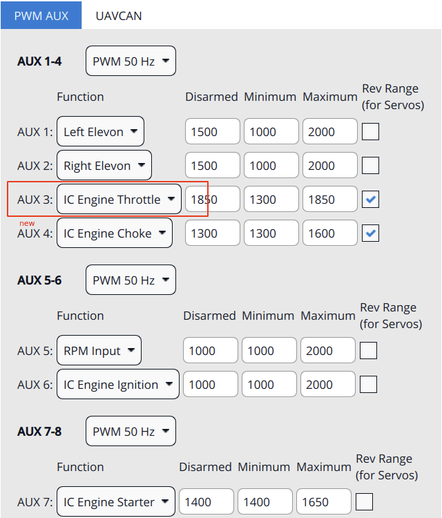
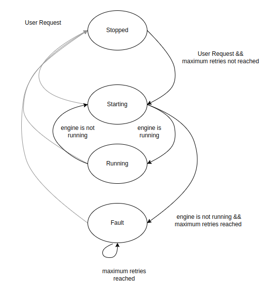
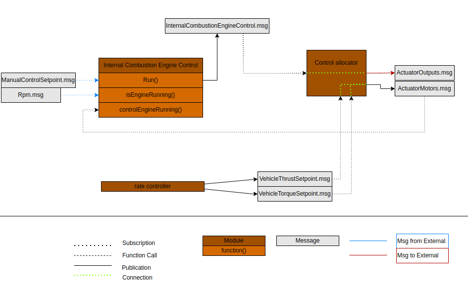

# Modules Reference: System

## battery_simulator

Source: [modules/simulation/battery_simulator](https://github.com/PX4/PX4-Autopilot/tree/main/src/modules/simulation/battery_simulator)

### Опис

<a id="battery_simulator_usage"></a>

### Використання

```
battery_simulator <command> [arguments...]
 Commands:
   start

   stop

   status        print status info
```

## battery_status

Source: [modules/battery_status](https://github.com/PX4/PX4-Autopilot/tree/main/src/modules/battery_status)

### Опис

Надана функціональність включає в себе:

- Read the output from the ADC driver (via ioctl interface) and publish `battery_status`.

### Імплементація

Він запускається у власній темі і проводить опитування на поточну обрану тему гіроскопа.

<a id="battery_status_usage"></a>

### Використання

```
battery_status <command> [arguments...]
 Commands:
   start

   stop

   status        print status info
```

## camera_feedback

Source: [modules/camera_feedback](https://github.com/PX4/PX4-Autopilot/tree/main/src/modules/camera_feedback)

### Опис

The camera_feedback module publishes `CameraCapture` UORB topics when image capture has been triggered.

If camera capture is enabled, then trigger information from the camera capture pin is published;
otherwise trigger information at the point the camera was commanded to trigger is published
(from the `camera_trigger` module).

The `CAMERA_IMAGE_CAPTURED` message is then emitted (by streaming code) following `CameraCapture` updates.
`CameraCapture` topics are also logged and can be used for geotagging.

### Імплементація

`CameraTrigger` topics are published by the `camera_trigger` module (`feedback` field set `false`)
when image capture is triggered, and may also be published by the  `camera_capture` driver
(with `feedback` field set `true`) if the camera capture pin is activated.

The `camera_feedback` module subscribes to `CameraTrigger`.
It discards topics from the `camera_trigger` module if camera capture is enabled.
For the topics that are not discarded it creates a `CameraCapture` topic with the timestamp information
from the `CameraTrigger` and position information from the vehicle.

<a id="camera_feedback_usage"></a>

### Використання

```
camera_feedback <command> [arguments...]
 Commands:
   start

   stop

   status        print status info
```

## cdcacm_autostart

Source: [drivers/cdcacm_autostart](https://github.com/PX4/PX4-Autopilot/tree/main/src/drivers/cdcacm_autostart)

### Опис

Цей модуль прослуховує USB і автоматично налаштовує протокол в залежності від отриманих байтів.
Підтримувані протоколи: MAVLink, nsh та ublox послідовний прохід. Якщо параметр SYS_USB_AUTO=2
модуль буде намагатися запустити mavlink лише тоді, коли буде виявлено USB VBUS. В іншому випадку він буде обертатися
і продовжувати перевіряти VBUS та запускати mavlink, як тільки він виявиться.

<a id="cdcacm_autostart_usage"></a>

### Використання

```
cdcacm_autostart <command> [arguments...]
 Commands:
   start

   stop

   status        print status info
```

## commander

Source: [modules/commander](https://github.com/PX4/PX4-Autopilot/tree/main/src/modules/commander)

### Опис

Модуль командира містить машину станів для перемикання режимів та аварійної поведінки.

<a id="commander_usage"></a>

### Використання

```
commander <command> [arguments...]
 Commands:
   start
     [-h]        Enable HIL mode

   calibrate     Run sensor calibration
     mag|baro|accel|gyro|level|esc|airspeed Calibration type
     quick       Quick calibration [mag, accel (not recommended)]

   check         Run preflight checks

   arm
     [-f]        Force arming (do not run preflight checks)

   disarm
     [-f]        Force disarming (disarm in air)

   takeoff

   land

   transition    VTOL transition

   mode          Change flight mode
     manual|acro|offboard|stabilized|altctl|posctl|position:slow|auto:mission|au
                 to:loiter|auto:rtl|auto:takeoff|auto:land|auto:precland|ext1
                 Flight mode

   pair

   lockdown
     on|off      Turn lockdown on or off

   set_ekf_origin
     lat, lon, alt Origin Latitude, Longitude, Altitude

   lat|lon|alt   Origin latitude longitude altitude

   poweroff      Power off board (if supported)

   stop

   status        print status info
```

## dataman

Source: [modules/dataman](https://github.com/PX4/PX4-Autopilot/tree/main/src/modules/dataman)

### Опис

Модуль для забезпечення постійного сховища для решти системи у вигляді простої бази даних через C API.
Multiple backends are supported depending on the board:

- файл (наприклад, на SD-карті)
- Оперативна пам'ять (очевидно, що вона не є постійною)

Використовується для зберігання структурованих даних різних типів: маршрутні точки місії, стан місії та полігони геозони.
Кожен тип має певний тип і фіксовану максимальну кількість елементів зберігання, щоб забезпечити швидкий випадковий доступ.

### Імплементація

Читання і запис одного елемента завжди атомарні.

<a id="dataman_usage"></a>

### Використання

```
dataman <command> [arguments...]
 Commands:
   start
     [-f <val>]  Storage file
                 values: <file>
     [-r]        Use RAM backend (NOT persistent)

 The options -f and -r are mutually exclusive. If nothing is specified, a file
 'dataman' is used

   stop

   status        print status info
```

## dmesg

Source: [systemcmds/dmesg](https://github.com/PX4/PX4-Autopilot/tree/main/src/systemcmds/dmesg)

### Опис

Інструмент командного рядка для показу повідомлень консолі завантаження.
Зауважте, що вивід з робочих черг NuttX та syslog не перехоплюється.

### Приклади

Продовжує друкувати всі повідомлення у фоновому режимі:

```
dmesg -f &
```

<a id="dmesg_usage"></a>

### Використання

```
dmesg <command> [arguments...]
 Commands:
     [-f]        Follow: wait for new messages
```

## esc_battery

Source: [modules/esc_battery](https://github.com/PX4/PX4-Autopilot/tree/main/src/modules/esc_battery)

### Опис

Це реалізує використання інформації зі статусу ESC і публікує її як стан батареї.

<a id="esc_battery_usage"></a>

### Використання

```
esc_battery <command> [arguments...]
 Commands:
   start

   stop

   status        print status info
```

## gyro_calibration

Source: [modules/gyro_calibration](https://github.com/PX4/PX4-Autopilot/tree/main/src/modules/gyro_calibration)

### Опис

Просте онлайн-калібрування гіроскопа.

<a id="gyro_calibration_usage"></a>

### Використання

```
gyro_calibration <command> [arguments...]
 Commands:
   start

   stop

   status        print status info
```

## gyro_fft

Source: [modules/gyro_fft](https://github.com/PX4/PX4-Autopilot/tree/main/src/modules/gyro_fft)

### Опис

<a id="gyro_fft_usage"></a>

### Використання

```
gyro_fft <command> [arguments...]
 Commands:
   start

   stop

   status        print status info
```

## heater

Source: [drivers/heater](https://github.com/PX4/PX4-Autopilot/tree/main/src/drivers/heater)

### Опис

Фоновий процес, що періодично запускається в робочій черзі LP для регулювання температури IMU на заданому рівні.

Це завдання можна запустити під час завантаження зі скриптів запуску, встановивши SENS_EN_THERMAL, або через CLI.

<a id="heater_usage"></a>

### Використання

```
heater <command> [arguments...]
 Commands:
   start

   stop

   status        print status info
```

## i2c_launcher

Source: [systemcmds/i2c_launcher](https://github.com/PX4/PX4-Autopilot/tree/main/src/systemcmds/i2c_launcher)

### Опис

Демон, який запускає драйвери на основі виявлених пристроїв I2C.

<a id="i2c_launcher_usage"></a>

### Використання

```
i2c_launcher <command> [arguments...]
 Commands:
   start
     -b <val>    Bus number

   stop

   status        print status info
```

## internal_combustion_engine_control

Source: [modules/internal_combustion_engine_control](https://github.com/PX4/PX4-Autopilot/tree/main/src/modules/internal_combustion_engine_control)

### Опис

The module controls internal combustion engine (ICE) features including:
ignition (on/off), throttle and choke level, starter engine delay, and user request.

### Enabling

This feature is not enabled by default needs to be configured in the
build target for your board together with the rpm capture driver:

```
CONFIG_MODULES_INTERNAL_COMBUSTION_ENGINE_CONTROL=y
CONFIG_DRIVERS_RPM_CAPTURE=y
```

Additionally, to enable the module:

- Set [ICE_EN](../advanced_config/parameter_reference.md#ICE_EN)
 to true and adjust the other `ICE_` module parameters according to your needs.
- Set [RPM_CAP_ENABLE](../advanced_config/parameter_reference.md#RPM_CAP_ENABLE) to true.

The module outputs control signals for ignition, throttle, and choke,
and takes inputs from an RPM sensor.
These must be mapped to AUX outputs/inputs in the [Actuator configuration](../config/actuators.md),
similar to the setup shown below.



### Імплементація

The ICE is implemented with a (4) state machine:



The state machine:

- Checks if [Rpm.msg](../msg_docs/Rpm.md) is updated to know if the engine is running
- Allows for user inputs from:
 - AUX{N}
 - Arming state in [VehicleStatus.msg](../msg_docs/VehicleStatus.md)

The module publishes [InternalCombustionEngineControl.msg](../msg_docs/InternalCombustionEngineControl.md).

The architecture is as shown below:



<a id="internal_combustion_engine_control_usage"></a>

<a id="internal_combustion_engine_control_usage"></a>

### Використання

```
internal_combustion_engine_control <command> [arguments...]
 Commands:
   start

   stop

   status        print status info
```

## land_detector

Source: [modules/land_detector](https://github.com/PX4/PX4-Autopilot/tree/main/src/modules/land_detector)

### Опис

Module to detect the freefall and landed state of the vehicle, and publishing the `vehicle_land_detected` topic.
Each vehicle type (multirotor, fixedwing, vtol, ...) provides its own algorithm, taking into account various
states, such as commanded thrust, arming state and vehicle motion.

### Імплементація

Кожен тип реалізовано у власному класі зі спільним базовим класом. Базовий клас підтримує стан (landed,
maybe_landed, ground_contact). Кожен можливий стан реалізується в похідних класах. Гістерезис та фіксований
пріоритет кожного внутрішнього стану визначає фактичний стан land_detector.

#### Мультикоптер Land Detector

**ground_contact**: thrust setpoint and velocity in z-direction must be below a defined threshold for time
GROUND_CONTACT_TRIGGER_TIME_US. При виявленні контакту з землею регулятор положення вимикає задане значення тяги
у тілі x та y.

**maybe_landed**: it requires ground_contact together with a tighter thrust setpoint threshold and no velocity in the
horizontal direction. Час спрацьовування визначається параметром MAYBE_LAND_TRIGGER_TIME. Коли виявляється maybe_landed, контролер положення встановлює задане значення тяги на нуль.

**landed**: it requires maybe_landed to be true for time LAND_DETECTOR_TRIGGER_TIME_US.

Модуль періодично запускається у черзі робіт HP.

<a id="land_detector_usage"></a>

### Використання

```
land_detector <command> [arguments...]
 Commands:
   start         Start the background task
     fixedwing|multicopter|vtol|rover|airship Select vehicle type

   stop

   status        print status info
```

## load_mon

Source: [modules/load_mon](https://github.com/PX4/PX4-Autopilot/tree/main/src/modules/load_mon)

### Опис

Background process running periodically on the low priority work queue to calculate the CPU load and RAM
usage and publish the `cpuload` topic.

У NuttX він також перевіряє використання стеку кожним процесом, і якщо воно падає нижче 300 байт, виводиться попередження,
яке також буде показано у файлі логу.

<a id="load_mon_usage"></a>

### Використання

```
load_mon <command> [arguments...]
 Commands:
   start         Start the background task

   stop

   status        print status info
```

## logger

Source: [modules/logger](https://github.com/PX4/PX4-Autopilot/tree/main/src/modules/logger)

### Опис

System logger which logs a configurable set of uORB topics and system printf messages
(`PX4_WARN` and `PX4_ERR`) to ULog files. Вони можуть бути використані для оцінки продуктивності системи та польоту,
налаштування, відтворення та аналізу збоїв.

Він підтримує 2 бекенди:

- Файли: запис файлів ULog до файлової системи (SD-карта)
- MAVLink: передача даних ULog через MAVLink клієнту (клієнт повинен це підтримувати)

Обидва бекенди можуть бути активовані та використовуватися одночасно.

Файловий бекенд підтримує 2 типи логів: повний (звичайний лог) і журнал місій. Журнал місії - це скорочений файл ulog, який можна використовувати, наприклад, для географічних міток або управління транспортним засобом. Його можна увімкнути та налаштувати за допомогою параметра SDLOG_MISSION.
Звичайний журнал завжди є підмножиною журналу місій.

### Імплементація

Реалізація використовує два потоки:

- The main thread, running at a fixed rate (or polling on a topic if started with -p) and checking for
 data updates
- Потік запису, що записує дані у файл

Між ними знаходиться буфер запису з конфігурованим розміром (і ще один буфер фіксованого розміру для журналу місій). Він повинен бути великим, щоб уникнути втрати даних.

### Приклади

Типове використання для початку ведення журналу негайно:

```
logger start -e -t
```

Або якщо вже працює:

```
logger on
```

<a id="logger_usage"></a>

### Використання

```
logger <command> [arguments...]
 Commands:
   start
     [-m <val>]  Backend mode
                 values: file|mavlink|all, default: all
     [-x]        Enable/disable logging via Aux1 RC channel
     [-a]        Log 1st armed until shutdown
     [-e]        Enable logging right after start until disarm (otherwise only
                 when armed)
     [-f]        Log until shutdown (implies -e)
     [-t]        Use date/time for naming log directories and files
     [-r <val>]  Log rate in Hz, 0 means unlimited rate
                 default: 280
     [-b <val>]  Log buffer size in KiB
                 default: 12
     [-p <val>]  Poll on a topic instead of running with fixed rate (Log rate
                 and topic intervals are ignored if this is set)
                 values: <topic_name>
     [-c <val>]  Log rate factor (higher is faster)
                 default: 1.0

   on            start logging now, override arming (logger must be running)

   off           stop logging now, override arming (logger must be running)

   trigger_watchdog manually trigger the watchdog now

   stop

   status        print status info
```

## mag_bias_estimator

Source: [modules/mag_bias_estimator](https://github.com/PX4/PX4-Autopilot/tree/main/src/modules/mag_bias_estimator)

### Опис

Онлайн-оцінювач похибки магнітометра.

<a id="mag_bias_estimator_usage"></a>

### Використання

```
mag_bias_estimator <command> [arguments...]
 Commands:
   start         Start the background task

   stop

   status        print status info
```

## manual_control

Source: [modules/manual_control](https://github.com/PX4/PX4-Autopilot/tree/main/src/modules/manual_control)

### Опис

Модуль споживає вхідні дані вручним керуванням, публікуючи одну установку керування вручну.

<a id="manual_control_usage"></a>

### Використання

```
manual_control <command> [arguments...]
 Commands:
   start

   stop

   status        print status info
```

## netman

Source: [systemcmds/netman](https://github.com/PX4/PX4-Autopilot/tree/main/src/systemcmds/netman)

### Опис

Network configuration manager saves the network settings in non-volatile
memory. On boot the `update` option will be run. Якщо конфігурація мережі
не існує. Значення за замовчуванням буде збережено в неплавучій пам'яті та
система перезавантажена.

#### update

`netman update` is run automatically by [a startup script](../concept/system_startup.md#system-startup).
When run, the `update` option will check for the existence of `net.cfg` in the root of the SD Card.
It then saves the network settings from `net.cfg` in non-volatile memory,
deletes the file and reboots the system.

#### save

The `save` option will save settings from non-volatile memory to a file named
`net.cfg` on the SD Card filesystem for editing. Використовуйте це, щоб відредагувати налаштування.
Збереження не негайно застосовує мережеві налаштування; користувач повинен перезавантажити стек польоту.
By contrast, the `update` command is run by the start-up script, commits the settings to non-volatile memory,
and reboots the flight controller (which will then use the new settings).

#### show

The `show` option will display the network settings in `net.cfg` to the console.

### Приклади

$ netman save           # Save the parameters to the SD card.
$ netman show           # відображення поточних налаштувань.
$ netman update -i eth0 # зробити оновлення

<a id="netman_usage"></a>

### Використання

```
netman <command> [arguments...]
 Commands:
   show          Display the current persistent network settings to the console.

   update        Check SD card for net.cfg and update network persistent network
                 settings.

   save          Save the current network parameters to the SD card.
     [-i <val>]  Set the interface name
                 default: eth0
```

## pwm_input

Source: [drivers/pwm_input](https://github.com/PX4/PX4-Autopilot/tree/main/src/drivers/pwm_input)

### Опис

Вимірює вхід PWM на AUX5 (або MAIN5) через таймер захоплення ISR та публікує через повідомлення uORB 'pwm_input'.

<a id="pwm_input_usage"></a>

### Використання

```
pwm_input <command> [arguments...]
 Commands:
   start

   stop

   status        print status info
```

## rc_update

Source: [modules/rc_update](https://github.com/PX4/PX4-Autopilot/tree/main/src/modules/rc_update)

### Опис

The rc_update module handles RC channel mapping: read the raw input channels (`input_rc`),
then apply the calibration, map the RC channels to the configured channels & mode switches
and then publish as `rc_channels` and `manual_control_input`.

### Імплементація

Щоб зменшити затримку управління, модуль запланований на опублікування введення_управління.

<a id="rc_update_usage"></a>

### Використання

```
rc_update <command> [arguments...]
 Commands:
   start

   stop

   status        print status info
```

## replay

Source: [modules/replay](https://github.com/PX4/PX4-Autopilot/tree/main/src/modules/replay)

### Опис

Цей модуль використовується для відтворення файлів ULog.

There are 2 environment variables used for configuration: `replay`, which must be set to an ULog file name - it's
the log file to be replayed. The second is the mode, specified via `replay_mode`:

- `replay_mode=ekf2`: specific EKF2 replay mode. It can only be used with the ekf2 module, but allows the replay
 to run as fast as possible.
- Generic otherwise: this can be used to replay any module(s), but the replay will be done with the same speed as the
 log was recorded.

Модуль зазвичай використовується разом з правилами видавця uORB, щоб вказати, які повідомлення потрібно відтворити.
Модуль відтворення просто опублікує всі повідомлення, які знаходяться в журналі. Це також застосовує параметри з
журналу.

The replay procedure is documented on the [System-wide Replay](https://docs.px4.io/main/en/debug/system_wide_replay.html)
page.

<a id="replay_usage"></a>

### Використання

```
replay <command> [arguments...]
 Commands:
   start         Start replay, using log file from ENV variable 'replay'

   trystart      Same as 'start', but silently exit if no log file given

   tryapplyparams Try to apply the parameters from the log file

   stop

   status        print status info
```

## send_event

Source: [modules/events](https://github.com/PX4/PX4-Autopilot/tree/main/src/modules/events)

### Опис

Фоновий процес, що періодично виконується в черзі завдань LP для виконання рутинних завдань.
Зараз він відповідає лише за сигнал тривоги на втрату RC.

Завдання можна почати через CLI або теми uORB (vehicle_command з MAVLink тощо).

<a id="send_event_usage"></a>

### Використання

```
send_event <command> [arguments...]
 Commands:
   start         Start the background task

   stop

   status        print status info
```

## sensor_agp_sim

Source: [modules/simulation/sensor_agp_sim](https://github.com/PX4/PX4-Autopilot/tree/main/src/modules/simulation/sensor_agp_sim)

### Опис

Module to simulate auxiliary global position measurements with optional failure modes for SIH simulation.

<a id="sensor_agp_sim_usage"></a>

### Використання

```
sensor_agp_sim <command> [arguments...]
 Commands:
   start

   stop

   status        print status info
```

## sensor_arispeed_sim

Source: [modules/simulation/sensor_airspeed_sim](https://github.com/PX4/PX4-Autopilot/tree/main/src/modules/simulation/sensor_airspeed_sim)

### Опис

<a id="sensor_arispeed_sim_usage"></a>

### Використання

```
sensor_arispeed_sim <command> [arguments...]
 Commands:
   start

   stop

   status        print status info
```

## sensor_baro_sim

Source: [modules/simulation/sensor_baro_sim](https://github.com/PX4/PX4-Autopilot/tree/main/src/modules/simulation/sensor_baro_sim)

### Опис

<a id="sensor_baro_sim_usage"></a>

### Використання

```
sensor_baro_sim <command> [arguments...]
 Commands:
   start

   stop

   status        print status info
```

## sensor_gps_sim

Source: [modules/simulation/sensor_gps_sim](https://github.com/PX4/PX4-Autopilot/tree/main/src/modules/simulation/sensor_gps_sim)

### Опис

<a id="sensor_gps_sim_usage"></a>

### Використання

```
sensor_gps_sim <command> [arguments...]
 Commands:
   start

   stop

   status        print status info
```

## sensor_mag_sim

Source: [modules/simulation/sensor_mag_sim](https://github.com/PX4/PX4-Autopilot/tree/main/src/modules/simulation/sensor_mag_sim)

### Опис

<a id="sensor_mag_sim_usage"></a>

### Використання

```
sensor_mag_sim <command> [arguments...]
 Commands:
   start

   stop

   status        print status info
```

## sensors

Source: [modules/sensors](https://github.com/PX4/PX4-Autopilot/tree/main/src/modules/sensors)

### Опис

Модуль сенсорів є центральним у всій системі. Він отримує вихід низького рівня від драйверів, перетворює його в більш придатну форму і публікує його для решти системи.

Надана функціональність включає в себе:

- Read the output from the sensor drivers (`SensorGyro`, etc.).
 Якщо існують кілька екземплярів того самого типу, виконуйте голосування та обробку аварійної ситуації.
 Потім застосуйте обертання дошки та калібрування температури (якщо ввімкнено). And finally publish the data; one of the
 topics is `SensorCombined`, used by many parts of the system.
- Make sure the sensor drivers get the updated calibration parameters (scale & offset) when the parameters change or
 on startup. Драйвери сенсора використовують інтерфейс ioctl для оновлення параметрів. For this to work properly, the
 sensor drivers must already be running when `sensors` is started.
- Do sensor consistency checks and publish the `SensorsStatusImu` topic.

### Імплементація

Він запускається у власній темі і проводить опитування на поточну обрану тему гіроскопа.

<a id="sensors_usage"></a>

### Використання

```
sensors <command> [arguments...]
 Commands:
   start
     [-h]        Start in HIL mode

   stop

   status        print status info
```

## system_power_simulation

Source: [modules/simulation/system_power_simulator](https://github.com/PX4/PX4-Autopilot/tree/main/src/modules/simulation/system_power_simulator)

### Опис

<a id="system_power_simulation_usage"></a>

### Використання

```
system_power_simulation <command> [arguments...]
 Commands:
   start

   stop

   status        print status info
```

## tattu_can

Source: [drivers/tattu_can](https://github.com/PX4/PX4-Autopilot/tree/main/src/drivers/tattu_can)

### Опис

Драйвер для зчитування даних з розумної батареї Tattu 12S 16000mAh.

<a id="tattu_can_usage"></a>

### Використання

```
tattu_can <command> [arguments...]
 Commands:
   start

   stop

   status        print status info
```

## temperature_compensation

Source: [modules/temperature_compensation](https://github.com/PX4/PX4-Autopilot/tree/main/src/modules/temperature_compensation)

### Опис

Модуль компенсації температури дозволяє всім гіроскопам, акселерометрам та барометрам у системі бути температурно компенсованими. Модуль відстежує дані, які надходять від датчиків та оновлює пов'язану тему sensor_correction
кожного разу, коли виявляється зміна температури. Модуль також може бути налаштований для виконання обчислення коефіцієнта
наступного завантаження, що дозволяє обчислити калібрувальні коефіцієнти теплової калібрації під час
циклу температури автомобіля.

<a id="temperature_compensation_usage"></a>

### Використання

```
temperature_compensation <command> [arguments...]
 Commands:
   start         Start the module, which monitors the sensors and updates the
                 sensor_correction topic

   calibrate     Run temperature calibration process
     [-a]        calibrate the accel
     [-g]        calibrate the gyro
     [-m]        calibrate the mag
     [-b]        calibrate the baro (if none of these is given, all will be
                 calibrated)

   stop

   status        print status info
```

## time_persistor

Source: [modules/time_persistor](https://github.com/PX4/PX4-Autopilot/tree/main/src/modules/time_persistor)

### Опис

Writes the RTC time cyclically to a file and reloads this value on startup.
This allows monotonic time on systems that only have a software RTC (that is not battery powered).
Explicitly setting the time backwards (e.g. via system_time) is still possible.

<a id="time_persistor_usage"></a>

### Використання

```
time_persistor <command> [arguments...]
 Commands:
   start

   stop

   status        print status info
```

## tune_control

Source: [systemcmds/tune_control](https://github.com/PX4/PX4-Autopilot/tree/main/src/systemcmds/tune_control)

### Опис

Command-line tool to control & test the (external) tunes.

Мелодії використовуються для надання слухових сповіщень та попереджень (наприклад, коли система озброєна, отримує позицію блокування тощо).
Інструмент вимагає, щоб був запущений драйвер, який може керувати темою управління tune_control uorb.

Інформацію про формат мелодії та попередньо визначені системні мелодії можна знайти тут:
https://github.com/PX4/PX4-Autopilot/blob/main/src/lib/tunes/tune_definition.desc

### Приклади

Грайте системний мелодію #2:

```
tune_control play -t 2
```

<a id="tune_control_usage"></a>

### Використання

```
tune_control <command> [arguments...]
 Commands:
   play          Play system tune or single note.
     error       Play error tune
     [-t <val>]  Play predefined system tune
                 default: 1
     [-f <val>]  Frequency of note in Hz (0-22kHz)
     [-d <val>]  Duration of note in us
     [-s <val>]  Volume level (loudness) of the note (0-100)
                 default: 40
     [-m <val>]  Melody in string form
                 values: <string> - e.g. "MFT200e8a8a"

   libtest       Test library

   stop          Stop playback (use for repeated tunes)
```

## uxrce_dds_client

Source: [modules/uxrce_dds_client](https://github.com/PX4/PX4-Autopilot/tree/main/src/modules/uxrce_dds_client)

### Опис

Клієнт UXRCE-DDS використовується для спілкування з агентом за допомогою тем uORB через послідовний або UDP.

### Приклади

```
uxrce_dds_client start -t serial -d /dev/ttyS3 -b 921600
uxrce_dds_client start -t udp -h 127.0.0.1 -p 15555
```

<a id="uxrce_dds_client_usage"></a>

### Використання

```
uxrce_dds_client <command> [arguments...]
 Commands:
   start
     [-t <val>]  Transport protocol
                 values: serial|udp, default: udp
     [-d <val>]  serial device
                 values: <file:dev>
     [-b <val>]  Baudrate (can also be p:<param_name>)
                 default: 0
     [-h <val>]  Agent IP. If not provided, defaults to UXRCE_DDS_AG_IP
                 values: <IP>
     [-p <val>]  Agent listening port. If not provided, defaults to
                 UXRCE_DDS_PRT
     [-n <val>]  Client DDS namespace

   stop

   status        print status info
```

## work_queue

Source: [systemcmds/work_queue](https://github.com/PX4/PX4-Autopilot/tree/main/src/systemcmds/work_queue)

### Опис

Інструмент командного рядка для відображення статусу черги роботи.

<a id="work_queue_usage"></a>

### Використання

```
work_queue <command> [arguments...]
 Commands:
   start

   stop

   status        print status info
```
