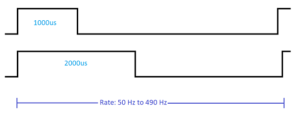

# ESCs & Motors

Багато дронів PX4 використовують безшовні двигуни, які керуються контролером польотів через електронний контролер швидкості (ESC).
ESC бере сигнал від контролера польоту і використовує його для встановлення рівня потужності, яка постачається до двигуна.

PX4 supports a number of common protocols for sending the signals to ESCs: [PWM ESCs](../peripherals/pwm_escs_and_servo.md), [OneShot ESCs](../peripherals/oneshot.md), [DShot ESCs](../peripherals/dshot.md), [DroneCAN ESCs](../dronecan/escs.md), PCA9685 ESC (via I2C), and some UART ESCs (from Yuneec).

Для додаткової інформації дивіться:

- [PWM ESCs and Servos](../peripherals/pwm_escs_and_servo.md)
- [OneShot ESCs and Servos](../peripherals/oneshot.md)
- [DShot](../peripherals/dshot.md)
- [DroneCAN ESCs](../dronecan/escs.md)
- [ESC Calibration](../advanced_config/esc_calibration.md)
- [ESC Firmware and Protocols Overview](https://oscarliang.com/esc-firmware-protocols/) (oscarliang.com)

Огляд високого рівня основних протоколів ESC/Servo, які підтримуються PX4, наведено нижче.

## Протоколи ESC

### PWM

[PWM ESCs](../peripherals/pwm_escs_and_servo.md) are commonly used for fixed-wing vehicles and ground vehicles (vehicles that require a lower latency like multicopters typically use oneshot or dshot ESCs).

PWM ESCs communicate using a periodic pulse, where the _width_ of the pulse indicates the desired power level.
Ширина імпульсу зазвичай коливається між 1000 мкс для нульової потужності та 2000 мкс для повної потужності.
Періодична частота кадру сигналу залежить від можливості ESC і зазвичай коливається від 50 Гц до 490 Гц (теоретичний максимум становить 500 Гц для дуже малого циклу "вимкнено").
Вища швидкість є кращою для ЕСК, особливо коли потрібна швидка реакція на зміни встановленої точки.
Для серводвигунів з ШІМ зазвичай достатньо 50 Гц, і багато з них не підтримують вищі частоти.

In addition to being a relatively slow protocol PWM ESCs require [calibration](../advanced_config/esc_calibration.md) because the range values representing low and high values can vary significantly.
Unlike [dshot](#dshot) and [DroneCAN ESC](#dronecan) they do not have the ability to provide telemetry and feedback on ESC (or servo) state.

Установка:

- [ESC Wiring](../peripherals/pwm_escs_and_servo.md)
- [PX4 Configuration](../peripherals/pwm_escs_and_servo.md#px4-configuration)
- [ESC Calibration](../advanced_config/esc_calibration.md)

### Oneshot 125

[OneShot 125 ESCs](../peripherals/oneshot.md) are usually much faster than PWM ESCs, and hence more responsive and easier to tune.
They are preferred over PWM for multicopters (but not as much as [DShot ESCs](#dshot), which do not require calibration, and may provide telemetry feedback).
Існує кілька варіантів протоколу OneShot, які підтримують різні швидкості.
PX4 підтримує лише OneShot 125.

OneShot 125 - це те саме, що і PWM, але використовує ширину імпульсів, яка в 8 разів коротша (від 125 мкс до 250 мкс для нуля до повної потужності).
Це дозволяє ESC OneShot 125 мати набагато коротший цикл роботи / вищу швидкість.
Для PWM теоретичний максимум становить близько 500 Гц, тоді як для OneShot він наближається до 4 кГц.
Фактична підтримувана швидкість залежить від використаного ESC.

Установка:

- [ESC Wiring](../peripherals/pwm_escs_and_servo.md) (same as for PWM ESCs)
- [PX4 Configuration](../peripherals/oneshot.md#px4-configuration)
- [ESC Calibration](../advanced_config/esc_calibration.md)

### DShot

[DShot](../peripherals/dshot.md) is a digital ESC protocol that is highly recommended for vehicles that can benefit from reduce latency, in particular racing multicopters, VTOL vehicles, and so on.

It has reduced latency and is more robust than both [PWM](#pwm) and [OneShot](#oneshot-125).
Крім того, для його роботи не потрібна калібрування ESC, телеметрія доступна з деяких ESCs, і ви можете змінити напрямок обертання двигуна

PX4 configuration is done in the [Actuator Configuration](../config/actuators.md).
Вибір ESC DShot з вищою швидкістю в інтерфейсі призводить до зниження затримки, але нижчі швидкості є більш надійними (і, отже, більш підходять для великих літаків з довшими проводами); деякі ESC підтримують лише нижчі швидкості (див. технічні характеристики для отримання інформації).

Установка:

- [ESC Wiring](../peripherals/pwm_escs_and_servo.md) (same as for PWM ESCs)
- [DShot](../peripherals/dshot.md) also contains information about how to send commands etc.

### DroneCAN

[DroneCAN ESCs](../dronecan/escs.md) are recommended when DroneCAN is the primary bus used for your vehicle.
Реалізація PX4 наразі обмежена частотами оновлення 200 Гц.

DroneCAN shares many similar benefits to [Dshot](#dshot) including high data rates, robust connection over long leads, telemetry feedback, no need for calibration of the ESC itself.

[DroneCAN ESCs](../dronecan/escs.md) are connected via the DroneCAN bus (setup and configuration are covered at that link).
