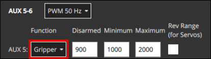

# Захоплювачі

Захвати - це механічні пристрої, які можуть бути інтегровані з безпілотним транспортним засобом для захоплення (утримання) та відпускання вантажів.

PX4 allows grippers to be triggered automatically in [Payload Delivery Missions](../flying/package_delivery_mission.md) or manually [using a Joystick](#qgc-joystick-configuration).


:::info
A gripper can instead be configured as a [generic RC or MAVLink actuator](../payloads/generic_actuator_control.md#generic-actuator-control-with-rc).
Загальний привід не може бути використаний з джойстиком або в місіях з вантажем, але його можна використовувати з пультом дистанційного керування.
:::

## Підтримувані захвати

Існує багато різних механізмів захоплення ("щелепи", "пальці", "електромагніти") та інтерфейсів (PWM, CAN, MAVLink тощо).

PX4 підтримує захвати, які мають прості важелі для утримання та відпускання, та використовують наступні інтерфейси (див. зв'язані документи для деталей):

- [PWM Servo Gripper](gripper_servo.md) - Grippers connected to autopilot PWM outputs
- **MAVLink Gripper** (Untested) - Grippers that support the [MAV_CMD_DO_GRIPPER](https://mavlink.io/en/messages/common.html#MAV_CMD_DO_GRIPPER) MAVLink command.

## Використання захоплювача

For information on using a gripper in missions see [Payload Delivery Missions](../flying/package_delivery_mission.md).

You can manually trigger a gripper manually from a Joystick button if you've mapped `gripper open` and `gripper close` buttons in the [QGC Joystick Configuration](#qgc-joystick-configuration).
Note that if you press the **Grab** button while the gripper is opening, it will automatically abort releasing behavior and go to the closed position, effectively cancelling the release command.
If you do this in a mission while the release is actually happening, then the [delivery will be cancelled](../flying/package_delivery_mission.md#manual-control-of-gripper-in-missions).

Manually triggering a gripper from an [RC Control](../getting_started/rc_transmitter_receiver.md) switch is not supported.

MAVLink applications, such as ground stations, can also control the gripper using the [MAV_CMD_DO_GRIPPER](https://mavlink.io/en/messages/common.html#MAV_CMD_DO_GRIPPER) MAVLink command.

## Конфігурація PX4

### Налаштування доставки посилок

Підтримка захоплювача PX4 пов'язана з функцією доставки пакетів, яка повинна бути увімкнена та налаштована для можливості використання захоплювача.

1. Set [PD_GRIPPER_EN](../advanced_config/parameter_reference.md#PD_GRIPPER_EN) parameter to 1 (reboot required after change).
2. Set [PD_GRIPPER_TYPE](../advanced_config/parameter_reference.md#PD_GRIPPER_TYPE) to match your gripper.
   For example, set to `Servo` for a [Servo Gripper](gripper_servo.md).

### Відображення активатора захоплювача

Grippers that are connected directly to a flight controller, such as PWM servo grippers, must be mapped to specific outputs during [Actuator Configuration](../config/actuators.md#actuator-outputs).

This is done by assigning the `Gripper` function to the to the output port where the gripper is connected.
For example, the image below assigns `Gripper` to the PWM AUX5 output.



Додаткову інформацію про відображення приводу надається в документації, специфічній для захоплювача.
For example, see [Gripper Servo > Actuator Mapping](../peripherals/gripper_servo.md#actuator-mapping).

### Увімкнути режим попередньої підготовки ARM

Typically you will want to enable the [pre-arming mode](../advanced_config/prearm_arm_disarm.md).
Цей режим утримує двигуни вимкненими, але дозволяє затискати та відкривати захоплювач для кріплення вантажу (уникнення потенційної небезпеки від обертання пропелерів).

1. Set [COM_PREARM_MODE](../advanced_config/parameter_reference.md#COM_PREARM_MODE) to `Always`.

### Тайм-аут активації захоплювача

Важливо, щоб для доставки посилки захоплювач мав час відпустити перед переходом до наступних точок маршруту.
For grippers that do not provide sensor-based feedback of their state, which is most of them, a configurable timeout is used to signal when the gripper _should_ have opened or closed.

Щоб встановити таймаут активації:

1. Виміряйте час, який займає відкриття та закриття захвату, та зафіксуйте більший з цих двох часів.

   Є два простих способи відкрити та закрити захоплювач.
   Поки дрон знаходиться на лавці і гвинти видалені:

   - Run the `payload_deliverer` test in the QGC [MAVLink Shell](../debug/mavlink_shell.md):

      ```sh
      > payload_deliverer gripper_test
      ```

      ::: info
      If you get an error message like "[payload_deliverer] not running", repeat the setup procedures above.
      You might also run the `payload_deliverer start` command in the Nuttx shell.

:::

   - Use the [Joystick](#qgc-joystick-configuration) to trigger gripper open and close actions.

2. Set [PD_GRIPPER_TO](../advanced_config/parameter_reference.md#PD_GRIPPER_TO) to whichever of the gripper open and close time is larger.

### Mission Command Timeout

When running a [Payload Delivery Mission](../flying/package_delivery_mission.md) it is important that the mission is not halted in the case where the gripper does not report that it has opened (or closed).
This might happen if a gripper does not have a feedback sensor, if the feedback sensor was damaged, or if UORB dropped the gripper actuator timeout message.

:::info
Gripper state feedback from a sensor is not actually supported yet, but it may be in future.
:::

The mission command timeout provides an additional safeguard, continuing the mission if the gripper's successful actuation acknowledgement is not received.
This timeout is also used to provide a sufficient delay for other commands to complete in the case where sensor feedback is not provided or received, such as for winch deployment/retraction, and gimbal movement to a mission-commanded orientation.

Щоб встановити таймаут:

1. Set [MIS_COMMAND_TOUT](../advanced_config/parameter_reference.md#MIS_COMMAND_TOUT) to a value greater than the [gripper actuation timeout](#gripper-actuation-timeout).

## Налаштування джойстика QGC

QGroundControl [Joystick](../config/joystick.md) configuration allows you to map gripper actions to Joystick buttons, after which you will be open and close the gripper manually.

Для відображення кнопок джойстика в QGroundControl:

1. Open the menu: **QGC Logo (upper-left) > Vehicle Setup > Joystick > Button Assignment** tab.

   

2. Select `Gripper Open` and `Gripper Close` actions for your desired joystick buttons, as shown above.

Ви можете протестувати дії, натиснувши на кнопки зіставлено і перевіривши спосіб пересування.
Якщо захоплювач не рухається, як очікувалося, перевірте налаштування доставки пакета та відображення приводу.
