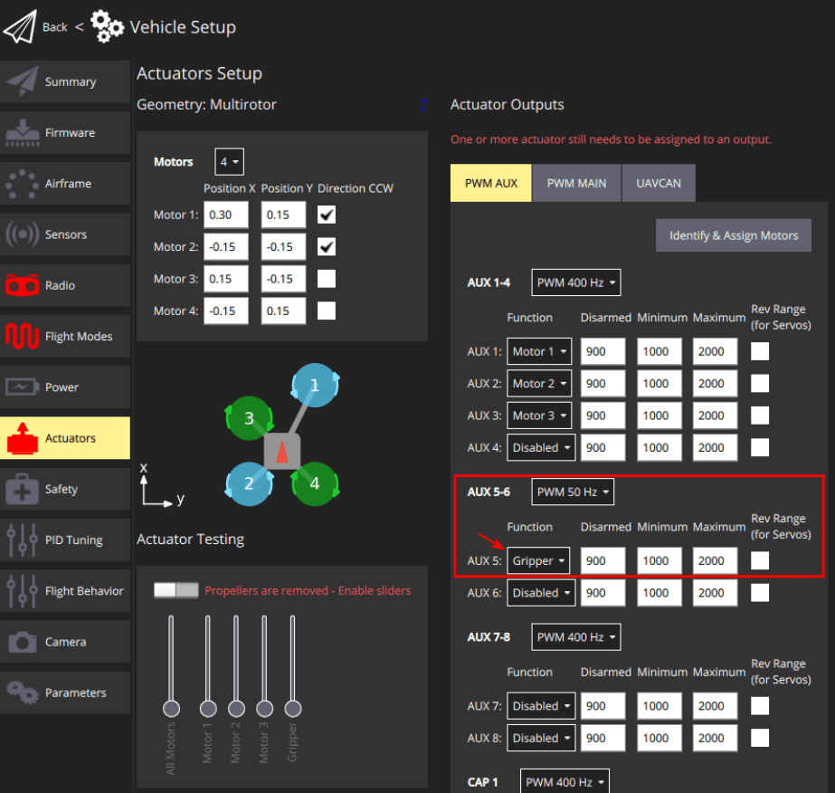

# PWM Сервопривод

This section explains how to connect and configure a [gripper](../peripherals/gripper.md) that is controlled using a flight controller PWM output (a servo actuator).

## Підтримувані захвати

Наступні сервоприводи, підключені за допомогою ШІМ, були протестовані з PX4:

- [R4-EM-R22-161 : push-to-close latch electronic lock](https://southco.com/en_any_int/r4-em-r22-161).

## Підключення маніпулятора з керуванням ШІМ

Кабель ШІМ складається з трьох ліній: живлення, земля та сигнал.
Типовий роз'єм показаний на зображенні нижче:

На зображенні вище кольори проводів мають наступні значення:

| Колір проводу | Ціль       |
| ------------- | ---------- |
| Brown         | Ground     |
| Red           | Power      |
| Yellow        | Сигнал PWM |

Вам потрібно буде підключити їх до відповідного входу PWM контролера польоту.

### Перевірка сумісності

Перед підключенням кабелю перевірте наступні вимоги:

- **Signal line voltage level**: Check the data-sheet of your gripper mechanism to find the voltage level of the signal line. І переконайтеся, що це сумісно з рівнем напруги контактів вашого контролера польоту.
- **Power requirements of gripper**: Check the mechanism's data-sheet to find out the power line voltage level requirements. Depending on that, the gripper can be either connected directly to the [power module](../power_module/index.md) or connected to a 5V line.
  Також можна використовувати спеціалізований регулятор напруги для виведення будь-якої іншої необхідної напруги.

## Конфігурація PX4

Configuration instructions can be found in: [Gripper > PX4 Configuration](../peripherals/gripper.md#px4-configuration) documentation.

Зокрема, зверніть увагу, що серводатчик повинен бути відображений на вивід, як показано нижче.

### Відображення активатора

PWM servo grippers, and other peripherals connected directly to PWM outputs, must be mapped to specific outputs during [Actuator Configuration](../config/actuators.md#actuator-outputs).

This is done by assigning the `Gripper` function to the to the output port where the gripper is connected.
For example, the image below assigns `Gripper` to the PWM AUX5 output.

Вам також потрібно встановити правильну частоту ШІМ для вихідного порту захоплювача (для комерційних сервоприводів / захоплювачів це зазвичай 50 Гц).

:::info
Mis-configuring the frequency may damaging the gripper.
:::

The sliders in the [Actuator Testing](../config/actuators.md#actuator-testing) section of the configuration screen can be used to verify that the correct output moves when you move the slider.
Мінімальні та максимальні значення ШІМ повинні бути встановлені так, щоб сервопривід був повністю закритий у відключеному положенні і повністю відкритий в максимальному положенні слайдера.
