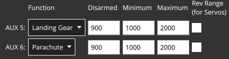

# Парашут

PX4 can be configured to trigger a parachute during [flight termination](../advanced_config/flight_termination.md).

Парашут може бути підключений до вільного виходу ШІМ або за допомогою MAVLink.

:::info
During flight termination PX4 turns off all controllers and sets all PWM outputs to their failsafe values (including those connected to PWM outputs) and triggers any connected MAVLink parachutes.

Отже, ви можете використовувати цю функцію для активації кількох додаткових пристроїв безпеки, підключених до різних виходів.
For more information see [Flight Termination Configuration](../advanced_config/flight_termination.md).
:::

## Використання Парашутів

Нижче наведено кілька важливих моментів при використанні парашутів:

- Парашут не гарантує, що транспортний засіб не буде знищений або не завдасть шкоди!
  Ви завжди повинні літати з урахуванням безпеки.
- Парашути потребують обережного використання для ефективності.
  Наприклад, їх треба правильно складати.
- Парашути мають мінімальну ефективну висоту.
- Парашут може спрацювати, коли транспортний засіб перевернутий.
  Це збільшить час, необхідний для сповільнення, і може призвести до того, що дрон зламає парашут.
- Парашут розгортатиметься лише у випадку, якщо контролер польоту живлений та PX4 працює належним чином (якщо він не спрацьовує незалежно від PX4).
  Воно не буде розгортатися, якщо щось спричинить аварію стеку польоту.

## Налаштування парашута

Припинення польоту (і відповідно розгортання парашута) може бути спровоковане перевірками безпеки, такими як Втрата RC, порушення геозахисту та іншими, від тригерів ставлення та інших перевірок виявлення відмов або командою з земної станції.
Під час припинення польоту PX4 встановлює вихідні сигнали ШІМ на їх "значення аварійної ситуації" (значення аварійної ситуації вимикають двигуни, але можуть бути використані для увімкнення/спрацювання парашуту).
Якщо підключено та працює парашут MAVLink, буде відправлено команду на його активацію.

Підготовка парашута передбачає наступне:

- Configuring [flight termination](../advanced_config/flight_termination.md) as the appropriate action for those safety and failure cases where the parachute should be deployed.
- Налаштуйте PX4 для розгортання парашуту під час завершення польоту (встановіть відповідні рівні виводу ШШШ або надішліть команду розгортання парашуту через MAVLink).
- Налаштуйте рівні виводу PX4, щоб вимкнути двигуни у випадку аварії.
  Це типове значення, тому, як правило, нічого не потрібно (для сервоприводів це значення центру).

### Увімкнути припинення польоту

Для включення припинення польоту:

- Set [Safety](../config/safety.md) action to _Flight termination_ for checks where you want the parachute to trigger.
- Set [Failure Detector](../config/safety.md#failure-detector) pitch angles, roll angles and time triggers for crash/flip detection, and disable the failure/IMU timeout circuit breaker (i.e. set [CBRK_FLIGHTTERM=0](../advanced_config/parameter_reference.md#CBRK_FLIGHTTERM)).

:::info
You can also configure an [external Automatic Trigger System (ATS)](../config/safety.md#external-automatic-trigger-system-ats) for failure detection.
:::

### Налаштування виводів на шині

Якщо парашут спрацьовує через вихід PWM або CAN, то спочатку його слід підключити до не використаного виходу.
Можливо, вам також доведеться окремо живити сервопривід парашута.
Це може бути зроблено, підключивши 5V BEC до рейки сервоприводу керування польотом та живлячи парашут від нього.

Потім вам потрібно переконатися, що пін парашута буде встановлений на значення, яке спрацює, коли відбудеться аварійне відключення:

- Open [Actuators](../config/actuators.md) in QGroundControl

- Assign the _Parachute_ function to any unused output (below we set the `AUX6` output):

  

- Встановіть відповідні значення ШІМ для вашого парашута.
  Вихідна інформація автоматично встановлюється на максимальне значення ШШІ, коли відбувається аварійне відключення.

  ::: info
  For the spring-loaded launcher from [Fruity Chutes](https://fruitychutes.com/buyachute/drone-and-uav-parachute-recovery-c-21/harrier-drone-parachute-launcher-c-21_33/) the minimum PWM value should be between 700 and 1000ms, and the maximum value between 1800 and 2200ms.

:::

### Налаштування парашута MAVLink

PX4 will trigger a connected and healthy parachute on failsafe by sending the command [MAV_CMD_DO_PARACHUTE](https://mavlink.io/en/messages/common.html#MAV_CMD_DO_PARACHUTE) with the [PARACHUTE_RELEASE](https://mavlink.io/en/messages/common.html#PARACHUTE_ACTION) action.

MAVLink parachute support is enabled by setting the parameter [COM_PARACHUTE=1](../advanced_config/parameter_reference.md#COM_PARACHUTE).
PX4 will then indicate parachute status using the [MAV_SYS_STATUS_RECOVERY_SYSTEM](https://mavlink.io/en/messages/common.html#MAV_SYS_STATUS_RECOVERY_SYSTEM) bit in the [SYS_STATUS](https://mavlink.io/en/messages/common.html#SYS_STATUS) extended onboard control sensors fields:

- `SYS_STATUS.onboard_control_sensors_present_extended`: MAVLink parachute present (based on heartbeat detection).
- `SYS_STATUS.onboard_control_sensors_enabled_extended`: ?
- `SYS_STATUS.onboard_control_sensors_health_extended`: MAVLink parachute healthy (based on heartbeat detection).

A MAVLink parachute is required to emit a [HEARTBEAT](https://mavlink.io/en/messages/common.html#HEARTBEAT) with `HEARTBEAT.type` of [MAV_TYPE_PARACHUTE](https://mavlink.io/en/messages/common.html#MAV_TYPE_PARACHUTE).

<!-- PX4 v1.13 support added here: https://github.com/PX4/PX4-Autopilot/pull/18589 -->

## Тестування парашута

:::warning
For the first test, try on the bench, without the props and with an unloaded parachute device!
:::

:::info
There is no way to recover from a Termination state!
Перед тим, як знову використовувати транспортний засіб для наступних тестів.
:::

The parachute will trigger during [flight termination](../advanced_config/flight_termination.md).

The easiest way to test a (real) parachute is to enable the [failure detector attitude trigger](../config/safety.md#attitude-trigger) and tip the vehicle over.

You can also simulate a parachute/flight termination: [Gazebo Classic > Simulated Parachute/Flight Termination](../sim_gazebo_classic/index.md#simulated-parachute-flight-termination).
