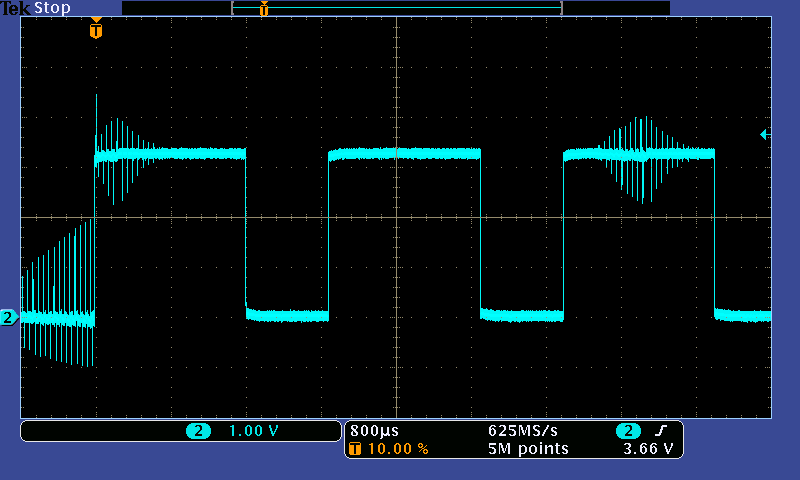

# PWM Сервоприводи та Регулятори Швидкості (Контролери Двигуна)

У цьому розділі описано, як підключати та живити контролери безщіткових моторів та сервоприводи на основі ШІМ.

## Огляд підключення ESC

Кожен електронний контролер швидкості (ESC) з широтно-імпульсною модуляцією (PWM) має як мінімум наступні проводи:

- Живлення VBAT (зазвичай товстий і червоний)
- Живлення GND (зазвичай товстий і чорний)

І на штекері серводвигуна:

- Сигнал ШІМ (зазвичай білий або жовтий)
- GND (зазвичай чорний або коричневий)

The servo plug _may_ also have a +5V wire (usually red or orange).
Мета цього дроту та його з'єднання залежить від конкретного ESC та типу транспортного засобу.

:::tip
In some cases (see below)the +5V line is not needed.
Замість того, щоб відрізати лінію +5V, ви можете обережно підняти фіксуючу вкладку пластикового корпусу роз'єму серводвигуна для цього контакту (наприклад, використовуючи лезо кабельного ножа або маленький викрутку) і витягнути контакт.
Відокремте його за допомогою ізоляційної електричної стрічки та заклейте його до кабелю сервоприводу.
This allows you to easily undo the wire later if needed
:::

## Підключення живлення

Завжди підключайте живлення VBAT та GND до батареї, а сигнал PWM та GND від роз'єму сервоприводу до двигуна.

:::tip
There is **no setup** that does not require signal ground to be connected!
:::

Підключення до проводу +5V (якщо він є) залежить від ESC/Транспортного засобу.

### Фікосовані крила (літаки) / VTOL

На фіксованому крилі (або VTOL) ESC, лінія +5V зазвичай надає вихід Батарейної Елімінаційної Схеми (BEC).

- Це може бути підключено до шини сервоприводу Pixhawk та використовуватися для живлення сервоприводів для закрилок, елеронів тощо.

  ::: info
  It is unsafe to power servos or ESCs from the autopilot's avionics power supply.
  This is why **Pixhawk series** flight controllers do not provide power for the servo rail (the AUX servo rail is unpowered and is limited to 1A).

:::

- As a rule of thumb you should only connect the _output of only one BEC_ to the Pixhawk servo rail.
  (хоча можливо підключити кілька виходів +5V до рейки, це залежить від моделі ESC).

### Мультикоптер

На багатороторному вертольоті, лінія +5V може бути відсутня або (якщо присутня) може бути не підключена.

- Багатороторні літальні апарати часто не потребують сервоприводів, тому не потрібно живити рейку сервоприводу Pixhawk (двигуни зазвичай окремо живляться від розподільної плати живлення).
- Немає шкоди (або користі) в підключенні дроту до рейки сервопривода.
- Регулятори швидкості DJI зазвичай включають цей дріт, але він не підключений.

### Оптоізольований ESC

On an opto-isolated ESC **without** BEC, the +5V line might need to be connected and powered (in order to provide power to the ESC microcontroller).
У цьому випадку дріт зазвичай буде підключений до рейки серводвигуна контролера польоту, а рейку серводвигуна слід живити від додаткового BEC.

## Конфігурація PX4

PWM motors and servos are configured using the [Actuator Configuration](../config/actuators.md) screen in QGroundControl.

After assigning outputs and basic calibration, you may then wish to peform an [ESC Calibration](../advanced_config/esc_calibration.md).

Additional PX4 PWM configuration parameters can be found here: [PWM Outputs](../advanced_config/parameter_reference.md#pwm-outputs).

## Усунення проблем

Pixhawk is compatible with all _PWM ESCs_ on the market.
Якщо певний ESC не працює, це означає, що він неправильно підключений або налаштований.

### Контакт із землею

Перевірте, що земля (чорний дріт) роз'єму ESC сервоприводу підключена до Pixhawk (не існує дійсної схеми підключення, яка не має посилання на землю).

:::warning
It is unsafe to fly without ground connected.
Це тому, що для кожного позитивного імпульсу (сигнал ESC) повинен бути сусідній шлях повернення на землю для чистої форми сигналу.

На зображенні нижче показано, наскільки шумним стає сигнал, якщо не підключено GND.

:::

### Підключення живлення / Оптозагороджені ESC

Якщо використовується оптоізольований ESC, який не надає BEC / вихідне напруга, будь ласка, переконайтеся, що ESC не потребує живлення для свого +5V лінії для оптоізолятора.

Дивіться перший розділ цієї сторінки пояснює інші важливі моменти щодо підключення живлення.

### Недійсне Мінімальне Значення

Деякі ESC потребують побачити спеціальний низький імпульс перед увімкненням (щоб захистити користувачів, які мають палицю газу в середньому положенні при ввімкненні живлення).

PX4 відсилає імпульс, коли транспортний засіб роззброєний, що приглушує ЕСК при їх роззброєнні та забезпечує правильну ініціалізацію ЕСК.
Appropriate values are determined and set as part of the [actuator configuration/testing](../config/actuators.md#actuator-testing) process (internally these set the per-output parameters [PWM_MAIN_DISn](../advanced_config/parameter_reference.md#PWM_MAIN_DIS1) and [PWM_AUX_DISn](../advanced_config/parameter_reference.md#PWM_AUX_DIS1)).

### Час очікування

Деякі ШСП можуть вийти з ладу (запобігаючи активацію двигуна), якщо вони не отримали дійсний низький імпульс протягом кількох секунд після ввімкнення живлення.

PX4 відправляє пульс на холостому ході/роззброєному стані одразу після увімкнення живлення, щоб зупинити вийшовший з ладу таймери ESC.
Appropriate values are determined and set as part of the [actuator configuration/testing](../config/actuators.md#actuator-testing) process (internally these set the per-output parameters [PWM_MAIN_DISn](../advanced_config/parameter_reference.md#PWM_MAIN_DIS1) and [PWM_AUX_DISn](../advanced_config/parameter_reference.md#PWM_AUX_DIS1)).

### Дійсна форма імпульсу, напруга та швидкість оновлення

:::info
This should not be a problem, but is included for completeness
:::

Pixhawk використовує активні високі імпульси, які використовуються всіма провідними брендами (Futaba, Spektrum, FrSky).

Інтерфейси ШІМ не мають формальних стандартів, однак звичайні мікроконтролери використовують напругові рівні TTL або CMOS.
TTL is defined as low < 0.8V and high > 2.0V with some manufacturers using > 2.4V for additional noise margin.
Логіка CMOS визначається з подібними рівнями напруги.
5V levels are **never** required to successfully switch to an _on_ state.

:::tip
Futaba, FrSky and Spektrum receivers output 3.3V or 3.0V voltage levels, as they are well above 2.4V.
Pixhawk прийняв цей загальний шаблон промисловості та виводить рівні 3.3V на останніх платах.
:::
