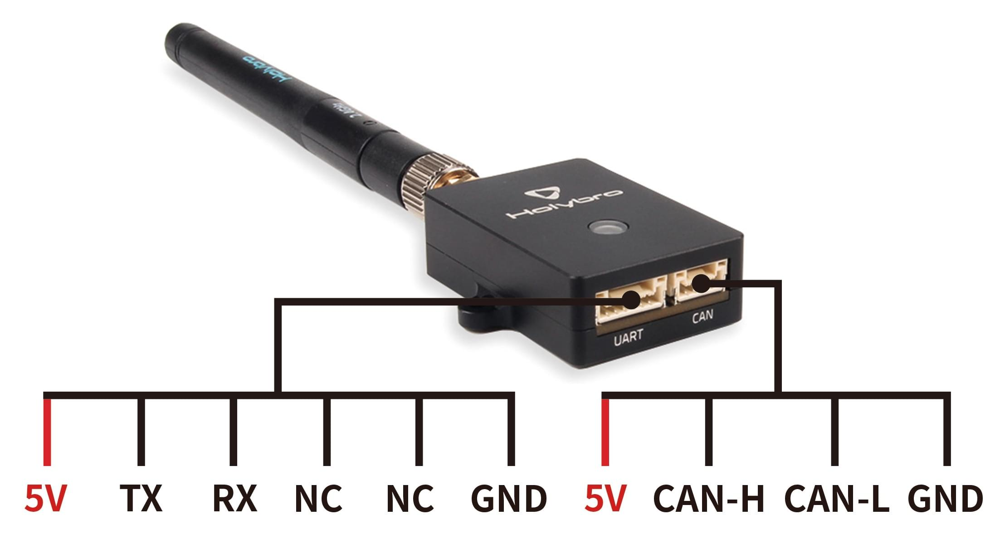

# Віддалений ідентифікатор (відкритий ідентифікатор дрона)

<Badge type="tip" text="PX4 v1.14" /><Badge type="warning" text="Experimental" />

:::warning
Експериментальні налаштування
Remote ID support is experimental.
:::

Віддалений ідентифікатор - це технологія, що регулюється урядом для БПЛА в Японії, Сполучених Штатах Америки та Європейському Союзі, розроблена для забезпечення безпечного спільного використання повітряного простору між БПЛА та іншими повітряними суднами.
Специфікація вимагає, щоб БПЛА передавали дані, такі як: реальний час розташування/висота, серійний номер, ідентифікатор оператора/розташування, статус та інше.

PX4 works with Remote ID modules that target the FAA [standard Remote ID rules](https://www.faa.gov/uas/getting_started/remote_id).
These are designed to be integrated into the vehicle, and broadcast Open Drone ID messages (Open Drone ID is an open source implementation of Remote ID) using id, position, and other information that is supplied by an autopilot.
Модулі "стандартних правил" дозволяють менш обмежену роботу, ніж модулі "правил трансляції", які є автономними модулями з інтегрованим GPS, які не мають жодного зв'язку з автопілотом.

## Підтримуване обладнання

:::warning
Remote ID hardware can only be connected via DroneCAN on `main` branch builds (builds _after_ PX4 v1.15).
:::

PX4 integrates with Remote ID hardware that supports:

- [Open Drone ID](https://mavlink.io/en/services/opendroneid.html) MAVLink protocol<Badge type="tip" text="PX4 v1.14" />
- Remote ID over CAN<Badge type="tip" text="PX4 main (v1.16)" />

Було протестовано з наступними пристроями:

- [Cube ID](https://docs.cubepilot.org/user-guides/cube-id/cube-id) (CubePilot)
- [Db201](https://dronescout.co/dronebeacon-mavlink-remote-id-transponder/) (BlueMark) - Tested via serial port. Not tested via CAN port.
- [Db202mav](https://dronescout.co/dronebeacon-mavlink-remote-id-transponder/) (BlueMark) - Less expensive variant without CAN port.
- [Holybro RemoteID Module](https://holybro.com/products/remote-id) (Holybro)

Other devices that support the Open Drone ID protocol and DroneCAN should also work (but have not been tested).

## Налаштування програмного забезпечення

Remote ID devices can be connected to any free/unused serial port on the flight controller, or CAN.
Most commonly they are connected directly to the `TELEM2` port (if it is not being use for some other purpose) as this is already configured for MAVLink "by default".

### Cube ID

[Cube ID](https://docs.cubepilot.org/user-guides/cube-id/cube-id) can be connected using a serial or CAN port.

It comes with 6-pin and 4-pin JST-GH 1.25mm cables that can be connected directly to the `TELEM` serial port and `CAN` ports, respectively, on most recent Pixhawk flight controllers.

#### Cube ID Serial Port

Якщо використовуєте інший порт або контролер польоту з іншим роз'ємом, можливо, вам доведеться змінити кабель.
Схема пінів послідовного порту показана нижче.
TX та RX на контролері польоту повинні бути підключені до RX та TX на Remote ID, відповідно.


| Pin                        | Сигнал                      | Вольтаж |
| -------------------------- | --------------------------- | ------- |
| 1 (red) | VCC_5V | 5V      |
| 2 (blk) | TX (OUT) |         |
| 3 (blk) | RX (IN)  |         |
| 4 (blk) | GND                         | 0       |

#### Cube ID CAN Port


| Pin                        | Сигнал                      | Вольтаж |
| -------------------------- | --------------------------- | ------- |
| 1 (red) | VCC_5V | 5V      |
| 2 (red) | CAN_H  |         |
| 3 (blk) | CAN_L  |         |
| 4 (blk) | GND                         | 0       |

#### Cube ID Firmware

The Cube ID uses proprietary firmware (not [ArduRemoteID](https://github.com/ArduPilot/ArduRemoteID) like some other remote id beacons).

For firmware update instructions see [Cube ID > Updating](https://docs.cubepilot.org/user-guides/cube-id/cube-id#updating).

### BlueMark Db201/Db202mav

[Db201](https://dronescout.co/dronebeacon-mavlink-remote-id-transponder/) or [Db202mav](https://dronescout.co/dronebeacon-mavlink-remote-id-transponder/) can be connected using their serial port.

:::info
The `Db201` also has a CAN port that should work on PX4 `main` builds.
However this has not yet been tested.
:::

They come with a 6-pin JST-GH 1.25mm cable that can be connected directly to the `TELEM` ports on most recent Pixhawk flight controllers.

Якщо використовуєте інший послідовний порт (тобто з меншою кількістю контактів), або контролер польоту з іншим роз'ємом, можливо, вам доведеться змінити кабель.
Information on the port pinout can be found in the [User Guide](https://download.bluemark.io/db200.pdf).

The beacons come preinstalled with recent [ArduRemoteID](https://github.com/ArduPilot/ArduRemoteID) firmware.
The [User Guide](https://download.bluemark.io/db200.pdf) explains how you can update firmware via the web interface, if needed.

More general setup, including how to mount the beacon, is also covered in the [User Guide](https://download.bluemark.io/db200.pdf).

### Holybro Віддалений ID модуль

The [Holybro Remote ID Module](https://holybro.com/products/remote-id) can be connected using a serial or CAN port.

It comes with a 6-pin JST-GH 1.25mm cable that can be connected directly to the `TELEM` ports on most recent Pixhawk flight controllers such as the Pixhawk 6C/6X or Cube Orange.

The module comes preinstalled with recent [ArduRemoteID](https://github.com/ArduPilot/ArduRemoteID) firmware.

The [User Guide](https://docs.holybro.com/radio/remote-id) explains how you can config and update firmware via the web interface, if needed.

#### Holybro Pinouts



## Конфігурація PX4

### MAVLink Port Configuration

Remote ID hardware connected to a serial port is configured in the same way as any other [MAVLink Peripheral](../peripherals/mavlink_peripherals.md).

Assuming you have connected the device to the `TELEM2` port, [set the parameters](../advanced_config/parameters.md) as shown:

- [MAV_1_CONFIG](../advanced_config/parameter_reference.md#MAV_1_CONFIG) = `TELEM 2`
- [MAV_1_MODE](../advanced_config/parameter_reference.md#MAV_1_MODE) = Normal
- [MAV_1_RATE](../advanced_config/parameter_reference.md#MAV_1_RATE) = 0 (default sending rate for port).
- [MAV_1_FORWARD](../advanced_config/parameter_reference.md#MAV_1_FORWARD) = Enabled

Перезавантажте пристрій.

You will now find a new parameter called [SER_TEL2_BAUD](../advanced_config/parameter_reference.md#SER_TEL2_BAUD).
Необхідна швидкість передачі даних залежить від використаного віддаленого ідентифікатора (для Cube ID вона повинна бути встановлена на 57600).

<!-- In theory, a Remote ID (or other MAVLink peripheral) that supports WiFi or wired Ethernet network could also be connected over those links. -->

### Конфігурація DroneCAN

Remote ID hardware connected to a CAN is configured in the same way as any other [DroneCAN Hardware](../dronecan/index.md#px4-configuration).

Specifically, you will have to [enable DroneCAN](../dronecan/index.md#enabling-dronecan) by setting the value of [`UAVCAN_ENABLE`](../advanced_config/parameter_reference.md#UAVCAN_ENABLE) to a non-zero value.

:::tip
The [CAN Remote ID Not Working](../peripherals/remote_id.md#can-remote-id-not-working) explains how you can test the setup, and adjust Remote ID settings if necessary.
:::

### Увімкнути віддалений ID

Немає потреби явно увімкнювати Віддалений ідентифікатор (підтримувані повідомлення про Віддалений ідентифікатор транслюються за замовчуванням або повинні бути запитані в поточній реалізації, навіть якщо жоден віддалений ідентифікатор не підключений).

### Запобігання Зброєнню на підставі Віддаленого Ідентифікатора

To only allow arming when a Remote ID is ready, [set](../advanced_config/parameters.md#conditional-parameters) the parameter [COM_ARM_ODID](#COM_ARM_ODID) to `2` (it is disabled by default).

| Параметр                                                                                                                                  | Опис                                                                                                                                                                                                                                                                                                        |
| ----------------------------------------------------------------------------------------------------------------------------------------- | ----------------------------------------------------------------------------------------------------------------------------------------------------------------------------------------------------------------------------------------------------------------------------------------------------------- |
| <a id="COM_ARM_ODID"></a>[COM_ARM_ODID](../advanced_config/parameter_reference.md#COM_ARM_ODID) | Увімкніть систему виявлення та перевірки стану ідентифікатора дрона. `0`: Disable (default), `1`: Warn if Remote ID not detected but still allow arming, `2`: Only allow arming if Remote ID is present. |

## Тестування мовлення модуля

Інтегратори повинні перевірити, що модуль віддаленого ідентифікатора транслює правильну інформацію, таку як місцезнаходження БПЛА, ідентифікатор, ідентифікатор оператора та інше.
Це найлегше зробити за допомогою стороннього додатку на вашому мобільному пристрої:

- [Drone Scanner](https://github.com/dronetag/drone-scanner) (Google Play or Apple App store)
- OpenDroneID OSM (Google Play)

## Імплементація

PX4 v1.14 передає ці повідомлення за замовчуванням (у режимах потокової передачі: звичайний, на борту, через USB, на борту з низькою пропускною здатністю):

- [OPEN_DRONE_ID_LOCATION](https://mavlink.io/en/messages/common.html#OPEN_DRONE_ID_LOCATION) (1 Hz) - UAV location, altitude, direction, and speed.
- [OPEN_DRONE_ID_SYSTEM](https://mavlink.io/en/messages/common.html#OPEN_DRONE_ID_SYSTEM) (1 Hz) Operator location/altitude, multiple aircraft information (group/swarm, if applicable), full timestamp and possible category/class information.

  - Реалізація передбачає, що оператор знаходиться в домашньому положенні транспортного засобу (ще не підтримує отримання позиції оператора з ПЗУ).
    Вважається, що це відповідає вимогам лише для віддалених ідентифікаторів трансляції.

The following message can be streamed on request (using [MAV_CMD_SET_MESSAGE_INTERVAL](https://mavlink.io/en/messages/common.html#MAV_CMD_SET_MESSAGE_INTERVAL)):

- [OPEN_DRONE_ID_BASIC_ID](https://mavlink.io/en/messages/common.html#OPEN_DRONE_ID_BASIC_ID) - UAV identity information (essentially a serial number)
  - PX4 v1.14 specifies a serial number ([MAV_ODID_ID_TYPE_SERIAL_NUMBER](https://mavlink.io/en/messages/common.html#MAV_ODID_ID_TYPE_SERIAL_NUMBER)) but does not use the required format (ANSI/CTA-2063 format).

PX4 prevents arming based on Remote ID health if parameter [COM_ARM_ODID](../advanced_config/parameter_reference.md#COM_ARM_ODID) is set to `2`.
The UAV will then require `HEARTBEAT` messages from the Remote ID as a precondition for arming the UAV.
You can also set the parameter to `1` to warn but still allow arming when Remote ID `HEARTBEAT` messages are not detected.

The following Open Drone ID MAVLink messages are not supported in PX4 v1.14 (to be added by [PX4#21647](https://github.com/PX4/PX4-Autopilot/pull/21647)):

- [OPEN_DRONE_ID_AUTHENTICATION](https://mavlink.io/en/messages/common.html#OPEN_DRONE_ID_AUTHENTICATION) - Provides authentication data for the UAV.
- [OPEN_DRONE_ID_SELF_ID](https://mavlink.io/en/messages/common.html#OPEN_DRONE_ID_SELF_ID) - Operator identity (plain text).
- [OPEN_DRONE_ID_OPERATOR_ID](https://mavlink.io/en/messages/common.html#OPEN_DRONE_ID_OPERATOR_ID) - Operator identity.
- [OPEN_DRONE_ID_ARM_STATUS](https://mavlink.io/en/messages/common.html#OPEN_DRONE_ID_ARM_STATUS) - Status of Remote ID hardware.
  Використовуйте як умову для озброєння транспортного засобу, а також для перевірки стану здоров'я віддаленого ідентифікатора.
- [OPEN_DRONE_ID_SYSTEM_UPDATE](https://mavlink.io/en/messages/common.html#OPEN_DRONE_ID_SYSTEM_UPDATE) - Subset of `OPEN_DRONE_ID_SYSTEM` that can be sent with information at higher rate.

## Відповідність

PX4 може не відповідати відповідним специфікаціям у версії 1.14 (тому ця функція наразі експериментальна).
Була створена робоча група для оцінки прогалин.

Деякі відомі проблеми:

- Vehicles must arm conditional on receiving the Remote ID [OPEN_DRONE_ID_ARM_STATUS](https://mavlink.io/en/messages/common.html#OPEN_DRONE_ID_ARM_STATUS) message, with a status that indicates the Remote ID hardware is ready to broadcast.
  - PX4 v1.14 does not process `OPEN_DRONE_ID_ARM_STATUS`, and arming is only conditional on the Remote ID device `HEARTBEAT`.
- Health of the Remote ID depends on both receiving a `HEARTBEAT` and the `OPEN_DRONE_ID_ARM_STATUS`.
  When flying, a non-armed status for the Remote ID must be published in [OPEN_DRONE_ID_LOCATION.status](https://mavlink.io/en/messages/common.html#OPEN_DRONE_ID_LOCATION) as a Remote ID malfunction.
  - PX4 v1.14 does not yet receive `OPEN_DRONE_ID_ARM_STATUS`.
- `OPEN_DRONE_ID_ARM_STATUS` must be forwarded to the GCS, if present for additional error reporting.
- [OPEN_DRONE_ID_BASIC_ID](https://mavlink.io/en/messages/common.html#OPEN_DRONE_ID_BASIC_ID) specifies a serial number in an invalid format (not ANSI/CTA-2063 format).
- The vehicle ID is expected to be tamper resistant.

[PX4-Autopilot/21647](https://github.com/PX4/PX4-Autopilot/pull/21647) is intended to address the known issues.

## Усунення проблем

### CAN Remote ID Not Working

:::info
This information was tested with the CAN Cube ID from CubePilot.
It _should_ also apply to CAN Remote ID modules from other vendors.
:::

To confirm that the Remote ID is working:

- Check that the `OPEN_DRONE_ID_BASIC_ID` and `OPEN_DRONE_ID_LOCATION` messages appear in the QGroundControl [MAVLink Inspector](https://docs.qgroundcontrol.com/master/en/qgc-user-guide/analyze_view/mavlink_inspector.html) (QGC **Analyze Tools > MAVLink Inspector**).

- If those messages are not present, check that the Remote_ID node appears on the UAVCAN list.

  Run the following command in the [QGroundControl MAVLink Console](../debug/mavlink_shell.md#qgroundcontrol-mavlink-console):

  ```sh
  uavcan status
  ```

  The connected CAN nodes should appear in the list.
  If you only have one CAN component on your system (the remote ID) the list might look like this:

  ```plain
  Online nodes (Node ID, Health, Mode):
     125 OK         OPERAT
  ```

  The nodes aren't "named" so if you have more than one CAN node you can compare the number of nodes shown with the number expected on your system to see if they match.
  Alternatively you can run the `uavcan status` with the Remote ID connected and disconnected and difference the result (which has the benefit that you will then known the Remote ID module's node ID).

If the Remote ID CAN node is present and the messages are not being received, then the Remote ID itself may need to be configured:

1. Open QGroundControl

2. Navigate to the [Application settings](https://docs.qgroundcontrol.com/master/en/qgc-user-guide/settings_view/general.html): **Application Settings > General > Miscellaneous**.

3. Select `Enable Remote ID`.
  The Remote ID tab should appear.

  ::: info
  If this option is not present you may be in a very recent version of QGC.
  In that case, open the view at: **Application Settings > Remote ID**.

:::

4. Enter the information for Basic, Operator, and Self ID.

Once configured, check the MAVLink Inspector again and check that the `OPEN_DRONE_ID_BASIC_ID` and `OPEN_DRONE_ID_LOCATION` messages are now present.

## Дивіться також

- [Remote Identification of Drones](https://www.faa.gov/uas/getting_started/remote_id) (FAA)
