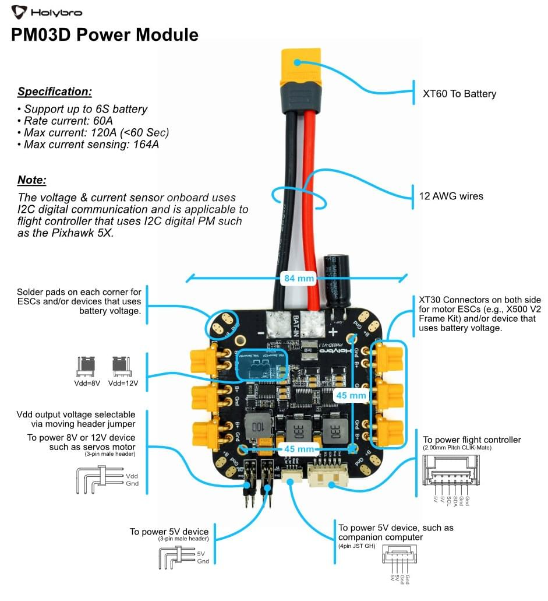
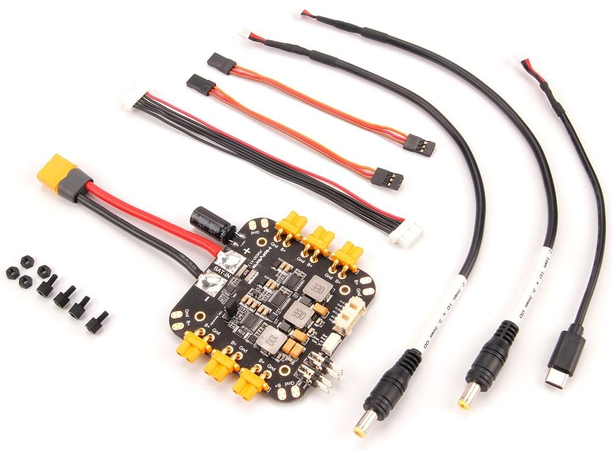

# Модуль живлення Holybro PM03D

Плата живлення PM03D виступає як блок живлення (PM) та розподільча плата живлення (PDB).
Крім надання регульованого живлення Pixhawk v5X та ESC, вона надсилає інформацію автопілоту про напругу батареї та поточний струм, який подається на керуючий пристрій польоту та двигуни.

Плата живлення підключається за допомогою протоколу I2C.
It is designed for flight controllers based on the Pixhawk FMUv5X and FMUv6X open standard, including the [Pixhawk 5X](../flight_controller/pixhawk5x.md).

:::info
The PM is **NOT** compatible with flight controllers that require an analog power module, including: [Pixhawk 4](../flight_controller/pixhawk4.md), [Durandal](../flight_controller/durandal.md), [Pix32 v5](../flight_controller/holybro_pix32_v5.md), etc.
:::

## Функції

- Plug & play, no additional setup required for QGroundcontrol & Mission Planner
- Роз'єми XT-30 та паяльні площини для простого підключення моторів та ESC
- Onboard voltage regulators: two 5.2V & one selectable 8V/12V
- Порти 5V/A для живлення супутнього комп'ютера або периферійного пристрою
- На вибір 8V або 12V трирядний рядок контактів для живлення периферійного пристрою

## Характеристики

- **Maximum input voltage**: 6S battery
- **Rated current**: 60A
- **Max current**: 120A (<60 Sec)
- **Max current sensing**: 164A
- **Communication protocol**: I2C
- **Dimension**: 84 x 78 x 12mm (excluding wires)
- **Mounting**: 45 x 45mm
- **Weight**: 59g
- **Connections**:
- ХТ-60 для акумулятора
- XT-30 for motor & peripheral device (battery voltage)
- Паяльні вклади в кожному кутку (напруга акумулятора)
- CLIK-Mate 2.0мм для контролю за польотами (5.2V/3A standalone BEC)
- JST GH 4pin (5.2V/3A, BEC shared with 5.2V потрійний рядок шпильковий заголовок)
- 2x Трьохрядний шплинтовий рядок (5.2V/3A, BEC спільний з JST GH 4pin)
- 2x Трьохрядний шплинтовий заголовок (8V або 12V вибирається переміщенням стрижня заголовка, 3A)

## Вміст набору

- 1x Плата PM06
- 1x 80 мм кабель з роз'ємом XT60 (попередньо припаяний)
- 1x Електролітична ємність: 220uF 63V (передпаяна)
- 1x 2.0мм інтервал CLIK-Mate 6pin кабель (Для живлення контролера польоту)
- 4pin JST GH в USB тип C
- 4pin JST GH до бочкового штекера (2.1\*5.5мм)
- 4pin JST GH до бочкового штекера (2.5\*5.5мм)
- Кабель Дюпон 4-шпильковий (2шт)
- Nylon standoffs & nuts

## Де купити

[Order from Holybro Store](https://holybro.com/products/pm03d-power-module)

## Проведення/Підключення

Additional wiring and connection information can be found in: [Holybro Pixhawk 5x Wiring Quick Start](../assembly/quick_start_pixhawk5x.md).
