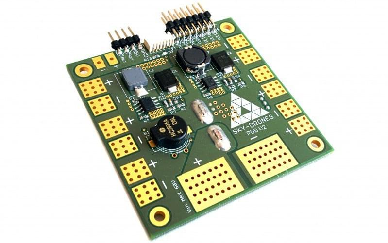
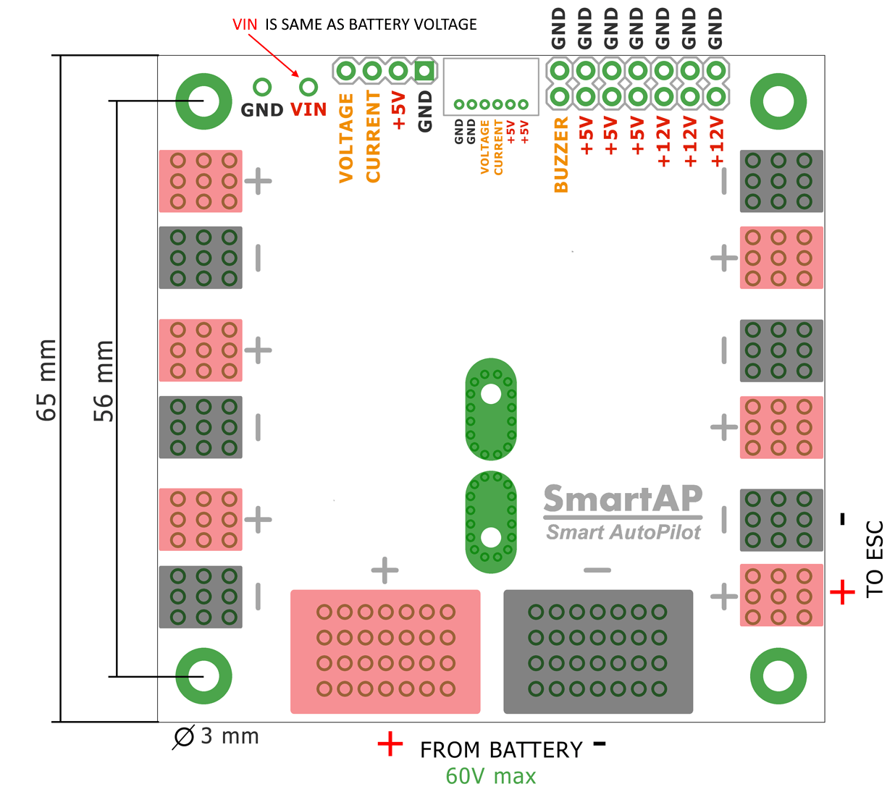
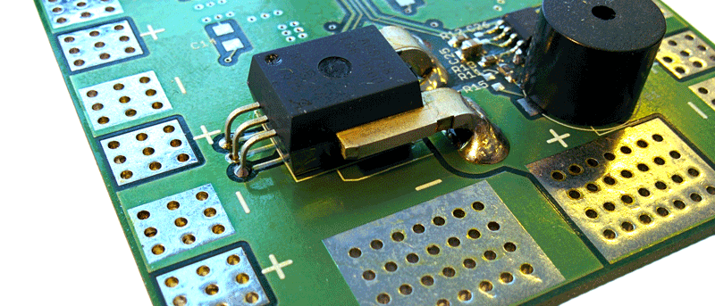

# Sky-Drones SmartAP GPS

[SmartAP PDB](https://sky-drones.com/power/smartap-pdb.html) (Power Distribution Board) is used to simplify the distribution of power from one or more batteries to ESCs (motors), flight controller, and other peripherals.
It also acts as a [power module](../power_module/index.md), enabling battery voltage and current measurements.
SmartAP PDB спрощує підключення високовольтних ліній, роблячи їх надійнішими та зручнішими.

## Характеристики

- Розмір: 65\*65 мм, 4х М3 кріплення отворів
- Напруга введення до 60 Вольт (14S)
- Можливість керування екстремально високими струмами (максимальний струм до 400A)
- Живлення від основного акумулятора, можливість підключення до 2 незалежних акумуляторів
- 12 пар клем (6 зверху, 6 знизу) для живлення до 12 двигунів
- Інтегровані датчики напруги та струму з фільтрами L/C
- Точні виміри струму на основі ефекту Холла
- Інтегрований DC-DC перетворювач від входу 10-60 В (до 14S акумулятора) до виходу 5 В / 5A для живлення периферійних пристроїв
- Інтегрований DC-DC перетворювач від входу 10-60 В (до 14S акумулятора) до виходу 12 В / 5A для живлення периферійних пристроїв
- Вихідні клеми живлення 5 В і 12 В (стандартні коннектори 2.54 мм / 0,1 дюйма)
- Інтегрований електромагнітний сигналізатор (сигналізація)
- Вихід живлення для керуючого пристрою польоту (як 5 В регульоване, так і вихід на рівні напруги акумулятора)

## Розмір і вага

- Довжина: 65мм
- Ширина: 65мм
- Висота: 14мм
- Вага: 8g

## Конфігурація PX4

[Battery Estimation Tuning](../config/battery.md) describes how to configure the battery setting for a power module.

Етапи конфігурації ключових налаштувань:

- Подільник напруги: 15.51
- Ампери на вольт: 36.00

## Де купити

[SmartAP PDB](https://sky-drones.com/parts/smartap-pdb.html)

## Проводка / Схема роз'ємів

На відповідній схемі роз'ємів плати розподілу потужності SmartAP показано нижче.

Два великих контактних пункти призначені для підключення основного акумулятора.
Для здатності витримувати великі струми та вищу загальну ємність можна підключити до двох незалежних акумуляторів за допомогою товстих проводів (наприклад, 8-10 AWG).
До 12 ESC можна підключити за допомогою 6 менших контактних пунктів у верхній, нижній, лівій та правій частині.

## Датчики напруги та струму

У SmartAP PDB вбудовані датчики напруги та струму.
Датчик струму розташований на нижній стороні плати розподілу потужності.

## Подальша інформація

- [Buy SmartAP PDB](https://sky-drones.com/power/smartap-pdb.html)
- [Documentation](https://docs.sky-drones.com/avionics/smartap-pdb)
