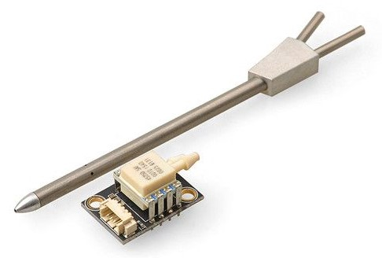

# Датчики швидкості польоту

Airspeed sensors are _highly recommended_ for fixed-wing and VTOL frames.
Це важливо, туму що автопілот не має інших засобів для виявлення звалювання.
Так як швидкість польоту літака відносно повітря гарантує підіймальну силу, а не швидкість відносно землі!

## Варіанти устаткування

Рекомендовані цифрові сенсори швидкості в повітрі включають:

- Based on [Pitot tube](https://en.wikipedia.org/wiki/Pitot_tube)
  - MEAS Spec series (e.g. [MS4525DO](https://www.te.com/usa-en/product-CAT-BLPS0002.html), [MS5525](https://www.te.com/usa-en/product-CAT-BLPS0003.html))
    - [mRo I2C Airspeed Sensor JST-GH MS4525DO](https://store.mrobotics.io/mRo-I2C-Airspeed-Sensor-JST-GH-p/m10030a.htm) (mRo store)
    - [Digital Differential Airspeed Sensor Kit](https://store-drotek.com/793-digital-differential-airspeed-sensor-kit-.html) (Drotek).
  - [Holybro Digital Air Speed Sensor - MS4525DO](https://holybro.com/collections/sensors/products/digital-air-speed-sensor-ms4525do)
  - [Holybro Digital Air Speed Sensor - MS5525DSO](https://holybro.com/collections/sensors/products/digital-air-speed-sensor-ms5525dso)
  - [Holybro High Precision DroneCAN Airspeed Sensor - DLVR](https://holybro.com/collections/sensors/products/high-precision-dronecan-airspeed-sensor-dlvr)
  - [RaccoonLab Cyphal/CAN and DroneCAN Airspeed Sensor](https://raccoonlab.co/tproduct/360882105-652259850171-cyphal-and-dronecan-airspeed-v2)
  - [Sensirion SDP3x Airspeed Sensor Kit](https://store-drotek.com/793-digital-differential-airspeed-sensor-kit-.html)
- Based on [Venturi effect](https://en.wikipedia.org/wiki/Venturi_effect)
  - [TFSLOT](airspeed_tfslot.md) Venturi effect airspeed sensor.

Усі зазначені вище сенсори підключені через I2C bus/port.

::: info

Additionally, the [Avionics Anonymous Air Data Computer](https://www.tindie.com/products/avionicsanonymous/uavcan-air-data-computer-airspeed-sensor/) can be connected to the CAN bus to determine not only high-accuracy airspeed, but also true static pressure and air temperature via onboard barometer and an OAT probe.

:::

## Налаштування

### Увімкнення датчиків швидкості у повітрі

Драйвери датчика швидкості в польоті не запускаються автоматично.
Enable each type using its [corresponding parameter](../advanced_config/parameters.md):

- **Sensirion SDP3X:** [SENS_EN_SDP3X](../advanced_config/parameter_reference.md#SENS_EN_SDP3X)
- **TE MS4525:** [SENS_EN_MS4525DO](../advanced_config/parameter_reference.md#SENS_EN_MS4525DO)
- **TE MS5525:** [SENS_EN_MS5525DS](../advanced_config/parameter_reference.md#SENS_EN_MS5525DS)
- **Eagle Tree airspeed sensor:** [SENS_EN_ETSASPD](../advanced_config/parameter_reference.md#SENS_EN_ETSASPD)

You should also check [ASPD_PRIMARY](../advanced_config/parameter_reference.md#ASPD_PRIMARY) is `1` (see next section - this is the default).

### Множинні датчики швидкості польоту

:::warning
Експериментальні налаштування
Using multiple airspeed sensors is experimental.
:::

If you have multiple airspeed sensors then you can select which sensor is _preferred_ as the primary source using [ASPD_PRIMARY](../advanced_config/parameter_reference.md#ASPD_PRIMARY), where `1`, `2` and `3` reflect the order in which the airspeed sensors were started:

- `0`: Synthetic airspeed estimation (groundspeed minus windspeed)
- `1`: First airspeed sensor started (default)
- `2`: Second airspeed sensor started
- `3`: Third airspeed sensor started

The airspeed selector validates the indicated sensor _first_ and only falls back to other sensors if the indicated sensor fails airspeed checks ([ASPD_DO_CHECKS](../advanced_config/parameter_reference.md#ASPD_DO_CHECKS) is used to configure the checks).

The selected sensor is then used to [supply data to the estimator (EKF2)](../advanced_config/tuning_the_ecl_ekf.md#airspeed) and the controllers.

### Налаштування датчика

Крім активації датчика, часто не потрібна конфігурація, специфічна для датчика.
If it is needed, it should be covered in the appropriate sensor page (for example [TFSLOT > Configuration](airspeed_tfslot.md#configuration)).

Конкретна конфігурація для датчиків, які не мають окремої сторінки, перерахована нижче:

- **Sensirion SDP3X:** [CAL_AIR_CMODEL](../advanced_config/parameter_reference.md#CAL_AIR_CMODEL) (provides overview of required settings), [CAL_AIR_TUBED_MM](../advanced_config/parameter_reference.md#CAL_AIR_TUBED_MM), [CAL_AIR_TUBELEN](../advanced_config/parameter_reference.md#CAL_AIR_TUBELEN).

## Калібрування

Airspeed sensors should be calibrated by following the instructions: [Basic Configuration > Airspeed](../config/airspeed.md).

## Дивіться також

- [Using PX4's Navigation Filter (EKF2) > Airspeed](../advanced_config/tuning_the_ecl_ekf.md#airspeed)
- [Airspeed drivers](https://github.com/PX4/PX4-Autopilot/tree/main/src/drivers/differential_pressure) (source code)
- [VTOL Without an Airspeed Sensor](../config_vtol/vtol_without_airspeed_sensor.md)
